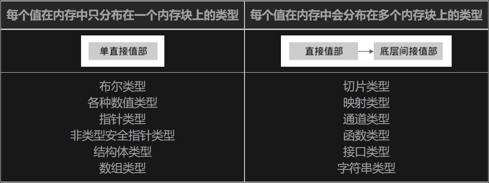
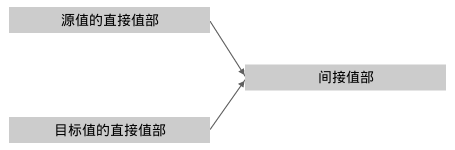

## WHY LEARN?

想尝试一下MIT6.824的Lab，所以得学学golang。


## 一些简单的tips

1. 短变量，在[常量和变量](https://gfw.go101.org/article/constants-and-variables.html)里边提到：

   > 我们也可以用短变量声明形式来声明一些**局部变量**

   这种短变量形式只能申明局部变量？应该是的。

   这篇文章中提到的变量申明，我总结一下：==*变量类型（`string`）、初始值（“ GO ”）**至少**存在一个*==，over。

   ```go
   var lang = "GO" //省略变量类型
   var lang string //省略初始值
   lang:="GO" //只能在局部变脸中使用
   ```

2. 感觉结构体就像一个json一样呢。不，我感觉go语言就是C++，js的大杂烩，高情商：鸡尾酒。

3. 关于结构体的赋值：

   > 当一个（源）结构体值被赋值给另外一个（目标）结构体值时，其效果和逐个将源结构体值的各个字段赋值给目标结构体值的各个对应字段的效果是一样的。

   其实不用那么多废话，还是值拷贝，而且**结构体是没有 *间接值部*  **的，一个结构体占用的空间是连续的。关于值部看下面的“*关于赋值* ”这个phase。

4. 容器类型只有三个：数组、切片、映射

5. go也学习了python创建对象的简洁，比如声明了一个Book：

   ```go
   type Book struct{
       title, author string
       pages int
   }
   //有好几种创建它的方式，都是等价的
   var book1 Book
   book2 := Book{}
   var book3 = Book{}
   //注意下面返回的是指针类型
   var book4 *Book = new(Book)
   ```

   相当于声明了一个变量就得到了它的对象，或者用`{}`，代表空构造器。其实我这种思维不是很好，还在用Java的思路理解这种类似c的语言。其实go并没有类、对象的概念，结构体本身就只是一个变量而已，只不过是自定义的。


##### 对GOPATH和Go Modules的理解：

[golang中GOPATH的简单理解](https://www.cnblogs.com/lurenq/p/10524647.html)

[一起弄明白go的依赖管理 Go Modues/ GOPATH](https://juejin.cn/post/6844904136056504327)

这篇文章比较详细：[拜拜了，GOPATH君！新版本Golang的包管理入门教程](https://zhuanlan.zhihu.com/p/60703832)

> 从Go官方工具链1.16版本开始，我们可以运行`go install example.com/program@latest`来安装一个第三方Go程序的最新版本（至`GOBIIN`目录）。 在Go官方工具链1.16版本之前，**对应**的命令是`go get -u example.com/program`（现在已经被**废弃**而不再推荐被使用了）。

> `GOPATH`文件夹中的`pkg`子文件夹用来缓存被本地项目所依赖的Go模块（一个Go模块为若干Go库包的集合）的版本。

`go mod tidy`这个命令挺好用，代码中直接写`import …`，然后运行这个命令便会自动找依赖并添加到`go.mod`中。

[golang包管理解决之道——go modules初探](https://www.cnblogs.com/apocelipes/p/9534885.html)这篇文章才是yyds！所以说，go modules时代是不需要GOPATH，或者说GOPATH现在只有一个作用，就是依赖的下载目录。在go modules时代下，只要有`go.mod`文件，就是一个module，不论在什么位置，更不需要在GOPATH下。

## 三种一等公民容器类型

数组、切片与映射，我现在发现切片和数组都是映射的特例，本质上都是键值对。数组是一个特殊的映射，它的key是整数，且定长，切片与数组的区别就只有：不定长。看看三者的申明就明白了：

```go
[N]T; //数组，也是定容量的map[int]T，省略了map关键字
[]T;//就是map[int]T，不定容量，省略了map关键字
map[K]T;
```


## make和new？

看api就知道了，make返回的是Type，而new返回的是*Type，前者返回直接值部，后者返回直接值部的指针。但注意new(…)中的参数类型是可寻址的，比如`m:=new(map[String]int)`应该就不行，映射无法寻址，但是`m:=*new(map[string]int)`应该可以。

### 为什么map无法寻址？

don’t know yet


## *Pointers vs. Values*🎈🎈🎈

好好阅读一下官方文档：*[Pointers vs. Values](https://golang.org/doc/effective_go#pointers_vs_values)*讲得特别好！请也把例子看完。本文核心传达的观点是：

> The rule about pointers vs. values for **receivers** is that value methods can be invoked on pointers and values, but pointer methods can only be invoked on pointers.

注意这个receiver，我看了半天才明白，比如：

```go
func (slice *ByteSlice) Append(data []byte) []byte {
    // Body exactly the same as the Append function defined above.
}
```

那么这个`slice *ByteSlice`指针就是`Append`方法的receiver！所以pointer method就是receiver是指针的方法。

#### pointer methods can only be invoked on pointers

首先解释一下为什么“but pointer methods can only be invoked on pointers.”？文中也给了解释：

> This rule arises because pointer methods can modify the receiver; invoking them on a value would cause the method to receive a copy of the value, so any modifications would be discarded. The language therefore disallows this mistake. ……
>
> 这个规则出现的原因是，pointer method可以修改receiver，通过一个值，而不是指针来调用一个pointer method会使得这个method接收这个值的拷贝（a的拷贝，并非a），所以任何（对a）的修改和操作都会被丢弃（毕竟操作的是a的拷贝而非a本身）。所以，go语言不允许这样的错误发生。

说到这里，其实还没有接近本质，当我看了[方法—Go语言101](https://gfw.go101.org/article/method.html)才知道了原因。文中有两个方法，分别是Book类型的pointer和value的方法：

```go
func (b Book) Pages() int {
	return b.pages
}

func (b *Book) SetPages(pages int) {
	b.pages = pages
}
```

❗关键的来了：

> 对每个方法声明，编译器将自动隐式声明一个相对应的函数。 比如对于上一节的例子中为类型`Book`和`*Book`声明的两个方法，编译器将自动声明下面的两个函数：
>
> ```go
> func Book.Pages(b Book) int {
> 	return b.pages // 此函数体和Book类型的Pages方法体一样
> }
> 
> func (*Book).SetPages(b *Book, pages int) {
> 	b.pages = pages // 此函数体和*Book类型的SetPages方法体一样
> }
> ```

这和python有点相似了呀！！！

#### value methods can be invoked on pointers and values

回过头来解释一下“value methods can be invoked on pointers and values”。还是在[方法—Go语言101](https://gfw.go101.org/article/method.html)中给了解释：

> 对每一个为值类型属主`T`声明的方法，一个相应的同名方法将**自动隐式**地为其对应的指针类型属主`*T`而声明。 以上面的为类型`Book`声明的`Pages`方法为例，一个同名方法将自动为类型`*Book`而声明：

真TM不说人话，我看了半天，翻译一下：一个T类型，声明了一个value method，那么这个时候与这个value method同名的pointer method将会被自动且隐式地申明。比如前面的Pages方法，编译器会隐式再声明一个：

```go
func (*Book).Pages(b *Book) int {//对应上边的Book.Page方法
    return b.pages
}
```

**总结起来，对于一个value method，将会自动声明一个对应的pointer method。**

总的来说，Go里边似乎和Java一样，只有值传递，没有应用传递

#### 一个语法糖

> 等一下，上例中的`(&book).SetPages(123)`一行为什么可以被简化为`book.SetPages(123)`呢？ 毕竟，类型`Book`并不拥有一个`SetPages`方法。 啊哈，这可以看作是Go中为了让代码看上去更简洁而特别设计的**语法糖**。此语法糖只对==可寻址的值类型==的属主有效。 **编译器会隐式地将`book.SetPages(123)`改写为`(&book).SetPages(123)`**。 但另一方面，我们应该总是认为`aBookExpression.SetPages`是一个合法的选择器（从语法层面讲），即使表达式`aBookExpression`被估值为一个不可寻址的`Book`值（在这种情况下，`aBookExpression.SetPages`是一个无效但合法的选择器）。

也就是说，一个value想要调用一个pointer method也不是不可以，只不过这个value是可以寻址的，这样才能用到Go提供的**语法糖**。这也只是语法糖而已。


## 关于赋值

> Go可以被看作是一门C语言血统的语言，这可以通过此前的[指针](https://gfw.go101.org/article/pointer.html)和[结构体](https://gfw.go101.org/article/struct.html)两篇文章得以验证。……另一方面，Go也可以被看作是C语言的一个扩展框架。

下面的内容主要参考[值部](https://gfw.go101.org/article/value-part.html)这篇文章。

Go中的赋值是比较特殊的，应该是不同于C/C++，更不同于Java直接的引用。因为它有值部这个概念。所以，首先得搞明白这个概念：

> 我们称一个Go值分布在**不同内存块上的部分**为此值的各个值部（value part）。

再对比一下C语言：

> 在C中，每个值在内存中只占据一个[内存块](https://gfw.go101.org/article/memory-block.html)（**一段连续内存**）。但是，一些Go类型的值可能占据多个内存块。

这便是Go中赋值方式特别的根本原因：**每个值的内存占用不连续！**

再仔细说说值部，哪些类型(type)包含间接值部呢？



可以看到，正如我所料，大部分基本类型都是只有单直接值部的，也就是没有间接值部，但是string类型比较特殊。而大部分组合类型都会有间接值部的，单指针类型等比较特殊。这里只是做一个粗浅的观察而已。

另一个事实是，Go语言中的赋值符号`=`一定表示拷贝。但是又基于上一个事实：值部，所以会有以下结论：

> 在一个赋值中，源值被复制给了目标值。精确地说，==源值的[直接部分](https://gfw.go101.org/article/value-part.html)被复制给了目标值==。

> 一些函数调用的参数是通过引用来传递的。 （对不起，在Go中，所有的函数调用的参数都是通过值复制**直接值部**的方式来传递的。）

下面这段话非常准确权威地阐述了Go语言的赋值操作的真实情况。请注意里边的”浅赋值“，不要和深拷贝、浅拷贝搞混，这里应该是Go独有的名词。

> 在Go中，每个赋值操作（包括函数调用传参等）都是一个值的**浅复制**过程（假设源值和目标值的类型相同）。 换句话说，在一个赋值操作中，==**只有源值的直接部分被复制给了目标值**==。 如果源值含有间接部分，则在此赋值操作完成之后，**目标值和源值的直接部分将引用着相同的间接部分**。 换句话说，两个值将共享底层的间接值部，如下图所示：




##### 方法method（非函数 function）

有点意思，我觉得golang是吧对象的属性和方法分开定义了，如Java这样的，一个类的属性和方法都是写在类里边的，但是golang就将它们两个分开了，引入了receiver。这时候就没有类这个概念了，自定义了类就只有`type XXX struct{...}`，然后什么地方都可以申明它的方法。

得注意一下，go的赋值语句默认是拷贝而非引用，这点回归了C/C++。

##### ❓在Go中返回一个局部变量的地址是安全的

> 和C不一样，Go是支持垃圾回收的，所以一个函数返回其内声明的局部变量的地址是绝对安全的。比如：
>
> ```go
> func newInt() *int {
> 	a := 3
> 	return &a
> }
> ```

有疑问！这真的和垃圾回收有关系？垃圾回收的区域是堆空间吧，但是函数中的局部变量的空间应该是在栈空间中，函数调用完毕后这个空间会被回收吧。


##### 关于引用与解引用：

> **译注：** 作者这里说的比较绕，其实有两点：
>
> 1.不管你的method的receiver是指针类型还是非指针类型，都是可以通过指针/非指针类型进行调用的，编译器会帮你做类型转换。
>
> 2.在声明一个method的receiver该是指针还是非指针类型时，你需要考虑两方面的因素，第一方面是这个对象本身是不是特别大，如果声明为非指针变量时，调用会产生一次拷贝；第二方面是如果你用指针类型作为receiver，那么你一定要注意，这种指针类型指向的始终是一块内存地址，就算你对其进行了拷贝。熟悉C或者C++的人这里应该很快能明白。

关于第二点，我目前是这么理解的：

```go
func (p Point) Scale(args int) int{...}//方法申明
//调用
p Point{1,2}
//下面两者是等价的
p.Scale(1)
Scale(p,1)//这种方式比较本质
```

我觉得第二种方式比较本质，因为go默认是值传递的，那么Point参数会像args参数一样值传递，也就是第一种方式的`p.Scale(1)`调用时的p的“内容”和刚开始申明p时（`p Point{1,2}`）的虽然相同，但不是同一个地址了，发生了拷贝。

如果仔细一想，其实第一种方式本质上也是值传递，只不过传递的是p的地址而已。

这一点很像python的方法调用呀，几乎是一样的，想想每个方法的第一个参数是self就知道了。


##### 引用变量和指针变量

同时这里我注意到了引用变量和指针变量，和出现的“解引用”概念。参考这篇文章：[C++引用的本质](https://blog.csdn.net/K346K346/article/details/46805159)，下面是一些重要的点。

> 一句话 引用变量就是用**常量指针**实现的, 知道这个就没啥不能理解的了.

> 观察以上代码可以看出：
>
> 1. 只要将pi换成ri，所得汇编代码与第一段所对应的汇编代码完全一样。所以，**引用变量在功能上等于一个指针常量**，即一旦指向某一个单元就不能在指向别处（这是容易忽视的点）。
>
> 2. 在底层，**引用变量由指针按照指针常量的方式实现**。

我之前还不知道C++有引用变量这么一说，不知道如何申明一个引用变量，或者说其实有用过，但是没有深究过。其实申明一个引用变量很简单，比如`int i=5; int& p=i;`这样就表明`p`引用了`i`。这种方式确实比直接用指针变量方便些，比较直观。`int i=5; int* const q = &i`，这是指针变量的方式。

但是两者是有区别的，文中说到引用类型并就是百分百的常量指针，并列举了3点，我认为最关键的是，引用变量的寻址，引用变量`&p`返回的并不是自身的地址，而是被引用对象的地址，也就是`i`的地址。

上面全是在说C++的，回到golang，我发现其实只是将引用类型和指针类型合并了，变为一种类型：引用。这是一种不同于C++中的引用类型和指针类型的一种golang独有的类型，兼顾了两者的优点。

这里需要特别区别的是，`int* p=&i;`和`int j=*p`中`*`的含义是不一样的。**总结起来，`*`用在类型上和用在变量上是不一样的，用在类型上（`int*`）表明`p`是一个指针类型，用在变量上`*p`表示解引用**。

同理，`&`用在类型上和变量上也是不一样的，`int& p=i`表明p是引用变量，`&q`表示取地址。

总结过于精辟，优秀。


## goroutine 协程

无语，不就是Java里边的线程吗，感觉Google很刻意为了与众不同啊。哦，但是好像协程和线程（指内核线程）还是有些区别的，主要体现在开销上。但是Java的线程和系统线程也是一对一的啊。[Java 线程和操作系统的线程有啥区别？](https://www.cnblogs.com/cswiki/p/14676264.html)这篇文章非常好！

> 事实上，**在 JDK 1.2 之前**，Java 线程是基于称为 "**绿色线程**"（Green Threads）的**用户级线程**实现的，也就是说程序员大佬们为 JVM 开发了自己的一套线程库或者说线程管理机制。
>
> 而**在 JDK 1.2 及以后**，JVM 选择了更加稳定且方便使用的操作系统原生的**内核级线程**，通过系统调用，将线程的调度交给了操作系统内核。而对于不同的操作系统来说，它们本身的设计思路基本上是完全不一样的，因此它们各自对于线程的设计也存在种种差异，所以 JVM 中明确声明了：**虚拟机中的线程状态，不反应任何操作系统中的线程状态**。

注意这里的绿色线程，它就是协程！！！说白了，协程就是用户级线程。这么说。。。岂不是golang中的协程还是Java玩剩下的？不能这么说哈，只是不同的选择而已。

哦，还有，golang中经常提到”计算“这个概念，我觉得和”协程”，Java中的”操作“、”线程“是一个意思。

> 一个协程调用的所有返回值（如果存在的话）必须被全部舍弃。

这句话不是很懂，我觉得意思应该和Java创建线程并调用一个意思，确实没有返回值，因为传入`Thread`中的只有`Runnable`，没有`Callbale`。要想拥有返回值，就得用Future之类的。


一个疑问：

```go
func main(){
    var c Counter
    for i:=0;i<10;i++ {
        go func(){
            for k:=0;k<10;k++ {
                c.Increase(1)
            }  
        }()
    }
}
```

里面的每一个协程能够访问主协程中声明的变量吗？？？


[Java 线程和操作系统的线程有啥区别？](https://www.cnblogs.com/cswiki/p/14676264.html)这篇文章写得十分好，清楚地解释了内核级线程和用户级线程的区别。我在这里简单写一下我的体会，两类线程其实就是权责问题，内核级线程是由内核空间管理，向外提供接口；用户级线程交由用户空间管理，而操作系统只提供进程的接口。这里的用户空间具体点来说就是应用程序，比如golang编写的程序。也就是说，内核级线程，操作系统出钱也得出力，而用户级线程，操作系统出钱但不出力，出力的事情外包了。

> 从我们开发者的角度来理解内核级线程就是说：我们可以直接使用操作系统中已经内置好的线程，线程的创建、销毁、调度和维护等，都是直接由操作系统的内核来实现，我们只需要使用**系统调用**就好了，不需要像用户级线程那样自己设计线程调度等。


## Type assertions

经典的用法：

```go
//
// load the application Map and Reduce functions
// from a plugin file, e.g. ../mrapps/wc.so
//
func loadPlugin(filename string) (func(string, string) []mr.KeyValue, func(string, []string) string) {
	p, err := plugin.Open(filename)
	if err != nil {
		log.Fatalf("cannot load plugin %v", filename)
	}
	xmapf, err := p.Lookup("Map")
	if err != nil {
		log.Fatalf("cannot find Map in %v", filename)
	}
	// 原来这是Go内置的反射机制（并不是reflect标准包哦）：类型断言（type assertion）
	mapf := xmapf.(func(string, string) []mr.KeyValue)
	xreducef, err := p.Lookup("Reduce")
	if err != nil {
		log.Fatalf("cannot find Reduce in %v", filename)
	}
	reducef := xreducef.(func(string, []string) string)//type assertion

	return mapf, reducef
}
```

其实`xmapf`和`xreducef`都是`plugin.Symbol`类型的，然而Symbol的定义仅仅是这样：

```go
type Symbol interface{}
```

没有方法，也没有属性。说这些，是为了提醒一下，一种type别看它的名字有多高大上，关注怎么定义的即可，关注本质即可。

类型断言我觉得和Java的**多态**很像，区别是语法的不同。上面的类型断言代码用Java写就是：

```java
mapf = (func(string, string) []mr.KeyValue) xmapf;
```

即xmapf是接口，mapf implements xmapf。

但有一个重大区别：

> 事实上，对于一个动态类型为`T`的接口值`i`，**方法调用`i.m(...)`等价于`i.(T).m(...)`**。[来源](https://gfw.go101.org/article/interface.html)

在Java中可没有这种好事，调用父类只能调用父类的方法。

参考：

https://gfw.go101.org/article/interface.html、https://golang.org/ref/spec#Type_assertions、https://stackoverflow.com/a/63169753/17094981


## Type embedding

[类型内嵌的意义是什么？](https://gfw.go101.org/article/type-embedding.html)回答得比较好

> 类型内嵌的主要目的是为了将被内嵌类型的功能扩展到内嵌它的结构体类型中，从而我们不必再为此结构体类型重复实现被内嵌类型的功能。
>
> 很多其它流行面向对象的编程语言都是用继承来实现上述目的。两种实现方式有[它们各自的利弊](https://en.wikipedia.org/wiki/Composition_over_inheritance)。


注意：我们也可以使用选择器`gaga.SetAge`，但是只有在`gaga`是一个可寻址的类型为`Singer`的值的情况下。 它只不过是`(&gaga).SetAge`的一个[语法糖](https://gfw.go101.org/article/method.html#call)。

SetAge是这样定义的：

```go
func (p *Person) SetAge(age int){
    p.age=age
}
```


## 并发同步技术

我觉得用事务中的概念来理解容易些，也就是并发控制，或者说如何保证隔离性。golang目前看到三种：通道、互斥锁、原子操作。

> 注意，一个处于睡眠中的（通过调用`time.Sleep`）或者在等待系统调用返回的协程被认为是处于运行状态，而不是阻塞状态。

注意这个状态的界定！很重要！

## recover & panic

> 来自：https://gfw.go101.org/article/control-flows-more.html，里面的话和代码示例：
>
> 一个`recover`函数的返回值为其【所恢复的恐慌在产生时被一个`panic`函数调用所消费的】参数。
>
> 翻译翻译：一个recover函数的返回值为一个参数，这个recover函数会恢复一个panic，而这个panic调用的时候会消费一个参数，如`panic("拜拜！")`中的 *拜拜！* 就是被消费的参数，recover调用就会返回这个参数。

请在延迟函数中调用recover()

> 一旦一个函数调用产生一个恐慌，**此函数调用将立即进入它的退出阶段**，在此函数调用中被推入堆栈的延迟调用将按照它们被推入的顺序逆序执行。
>
> 在一个处于恐慌状况的协程退出之前，其中的恐慌不会蔓延到其它协程。 如果一个协程在恐慌状况下退出，它将使整个程序崩溃。

也就是一个协程的恐慌得自己处理，应该是在`defer`中处理，也就是退出阶段处理，否则带着恐慌退出的话，整个程序都会崩溃。


## 以下是尚未总结的内容

##### 函数是一种类型

参数名称和结果（返回值）名称并不重要，甚至可以省略。

函数也是一种类型，和`int`等一样。比如：

```go
func Double(x int, y char) (_ int, z string)
Double(9,'a')
```

Double为这个函数类型的变量，也可以等价的写为：

```go
var Double func(int,char) (int,string)
f :=Double
f(9,'a')
```

也就是说，这个Double为函数类型的变量，变量的类型为`func(int, char) (int, string);`。

#### 退出阶段与延迟函数

> 在Go中，当一个函数调用返回后（比如执行了一个`return`语句或者函数中的最后一条语句执行完毕）， 此调用可能并未立即退出。一个函数调用从返回开始到最终退出的阶段称为此函数调用的退出阶段（exiting phase）。 函数调用的退出阶段的意义将在讲解[延迟函数](https://gfw.go101.org/article/control-flows-more.html#defer)的时候体现出来。

说白了，退出阶段中会执行延迟函数（如在执行return即正常返回之后便进入退出阶段）。应该会有一个类似栈的数据结构，里面的元素是`defer`修饰过的**函数调用**，在这个退出阶段会一直pop并执行这些函数调用，直到栈空。

这也不是啥神奇的东西，我甚至可以用Java来实现这个`defer`，原理就是aop，后置代理。也有点像`finally`

现在的问题是，有几种方式进入退出阶段？上面提到的return只是其中一种方式。在[详解恐慌和回复原理](https://gfw.go101.org/article/panic-and-recover-more.html#exiting-phase)中提到了三种，这里就不列举了。这三种进入退出阶段的方式没啥本质区别，无非是不是正常退出而已。

> 和协程调用类似，被延迟的函数调用（`defer`）的所有返回值必须全部被舍弃。

好吧，get了。感觉没打啥大用的知识点。但是这里有一个坑：[大多数内置函数（除了`copy`和`recover`）的调用的返回结果都不可以舍弃](https://gfw.go101.org/article/exceptions.html#discard-return-results)（至少对于标准编译器1.17来说是如此）。简直是霸王条款啊。

我得去看看这里的“舍弃”指的啥意思，目前猜测是函数的返回值不用变量接受。


我发现了`defer`为编程上带来的优雅，比如下面[这段代码](https://gfw.go101.org/article/concurrent-synchronization-more.html)：

```go
func (c *Counter) Value() uint64{
    c.m.lock()
    defer c.m.unlock()
    return c.n
}
```

这种写法好处在于，开始我调用`lock()`，同时之后一定会`unlock()`的，所以我就可以通过defer，直接在`lock()`后，调用`unlock()`，表明我最终一定会执行unlock。有点高类聚的感觉，剩去了像Java中写`finally`的繁琐。


#### Concurrency Is Not Parallelism

这是[翻译版](https://www.cyningsun.com/12-09-2019/concurrency-is-not-parallelism.html#Concurrency-vs-Parallelism)，虽然有点拉跨，但是凑合着看吧。

```go
func Compose(f, g func(x float) float) func(x float) float{
    return func(x float){
        return f(g(x))
    }
}

fmt.Println(Compose(sin,cos)(0.5))
```

这里的`Compose(sin,cos)`返回的是一个func，类型为`func(x float) float`，这个方法明显需要传入一个`float`类型的实参，返回一个`float`类型的值。

太天才的设计了！将方法参数化，这应该也不是啥新东西，其实就是函数式编程。

> channel 的概念就在那里，它是语言中 `first-class` 的东西，使得可以到处传递 channel。它在某种意义上类似于**文件描述符**，持有 channel 的对象就可以和其他对象通信，但没有 channel 的对象是做不到的。

这里的文件描述符是不是也可以理解为句柄？


##### 25个关键字

golang中有[25个关键字](https://studygolang.com/articles/513)，好无语，太多了。	


##### 一些博客可以阅读

这个名叫godis的GitHub项目值得一读：https://github.com/HDT3213/godis，对应的博客也看看：https://www.cnblogs.com/Finley/category/1598973.html，里面对每一个环节进行了拆分。


##### 一个大胆的猜想

golang中的每一个`.go`文件就是一个类，因为我想到每一个`.go`文件都可以有init方法，相当于构造器了。但感觉有一个漏洞，其实结构体应该才是类，或者每一种类型才是类，因为它们可以定义方法。或者说，一个`.go`文件可以定义很多个类，然后init作为这些类的通用的构造器。


## Go的设计模式

一些资料：https://lailin.xyz/post/singleton.html