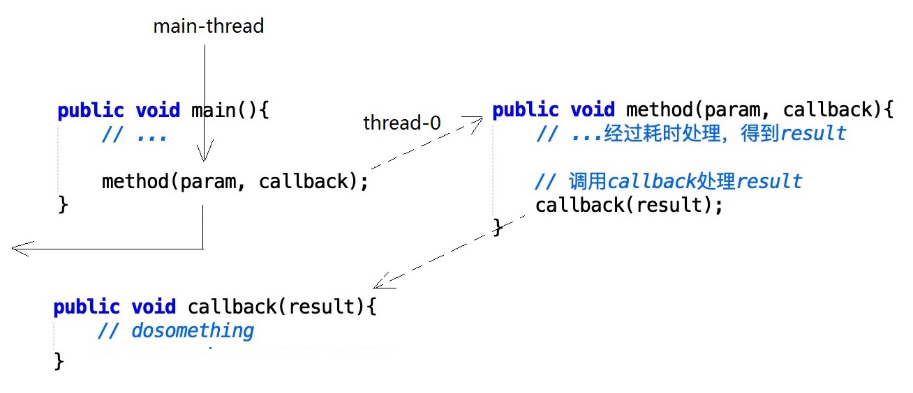
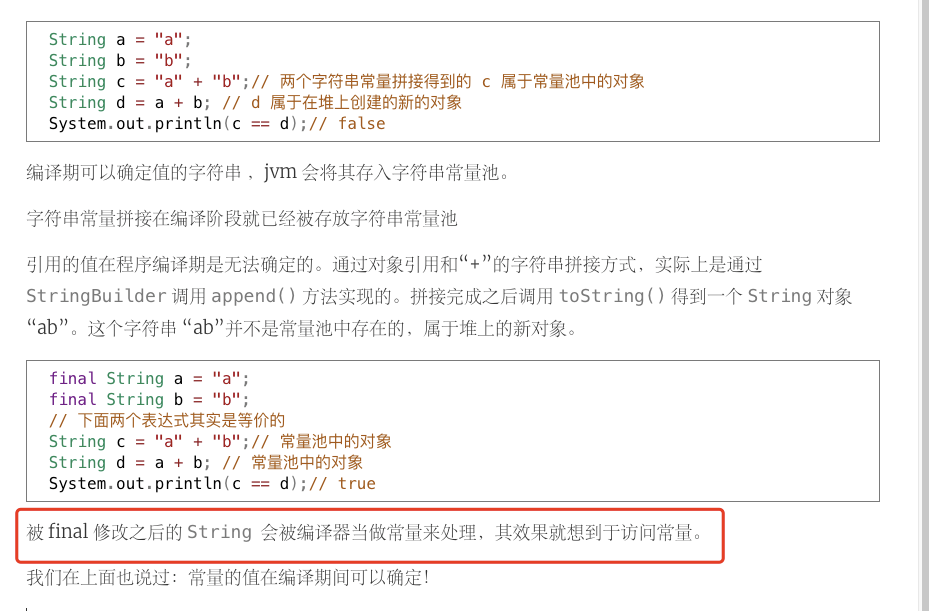
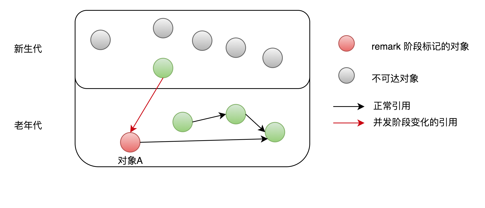

## 零碎知识：

##### [Java 到底是值传递还是引用传递？](https://www.zhihu.com/question/31203609/answer/50992895)

本质上都是值传递，包括引用类型。只不过引用类型传递的是地址。

要想真正修改引用类型，表象上看就得调用方法，而不是赋值。赋值会改变该引用类型变量的值，也即指向的地址空间（heap）。

如经典的例子：

```java
String sb = "iphone";
func(sb);
void func(String builder){
    builder = "ipad";
}
```

用文中的图来理解，调用`func()`时两个`str`（注意这是两个不同的`str`变量哦）值相同，也就是指向了同一段heap。


然后执行`builder="ipad"`将会成这样：


想要真正改变外层`str`变量（全局的`str`），就得而且只能通过**调用方法**来改变，比如`builder.replace('1','0');`。

这和c语言的指针是相通的，要改变指针的**指向**的值就得通过`*ptr="123";`。


##### Java时间格式

[这篇文章](https://www.cnblogs.com/zhengwanmeixiansen/p/7391411.html)

这里有个较为标准的例子，是在我写代码的时候尝试出来的：

```java
try{
    String str="2020-8-2";
    //yyyy-MM-dd记住这个格式！注意大小写，或者 yyyy-MM-dd HH:mm:ss
	SimpleDateFormat sdf = new SimpleDateFormat("yyyy-MM-dd");
	str=sdf.format(sdf.parse(str))
} catch(ParseException e){
    return "日期格式不合法";
}

```

使用这种方式可以对前端的日期格式的字符串输入进行校验，如果格式不合法则会被捕获。。

但是SQL中的时间格式是`%Y-%m-%d`，这和Java中的区别很大啊，一定要注意！

```sql
select * from pictures where DATE_FORMAT(acquisition_time,'%Y-%m-%d') between ? and ? 
```

[这篇文章给出了SQL的可用格式](https://www.w3school.com.cn/sql/func_date_format.asp),发现SQL日期同一个字母的大小写意思区分非常大，这一点和倒是和Java很像

##### `StringBuffer`、`StringBuider`，动态SQL解决方案

[这篇文章](https://blog.csdn.net/itchuxuezhe_yang/article/details/89966303)

可以在**动态SQL**中使用`StringBuffer`，下次写SQL时可以尝试学一下。同时mybatis也有自己的语句来写动态SQL，这可能就是mybatis现在还很常用的原因之一吧。

除此之外`StringBuilder`还有一个妙用，比如`str1=str2+str3;`，这段代码会被自动改写为`StringBuilder`的调用。

##### 使用mybaties的时候踩的坑

1. dao层如果有多个输入的参数，如

```java
public List<Pictures> findByStartTimeAndEndTimeAndLabel(String startTime, String endTime, String label){...}
```

那这种写法就是错的，**必须**加上`@Param`参数，如`@Param("startTime") String startTime`来指定，这样mapper层才能正确接受参数。

2. 关于mapper层，我他妈真的醉了，注意创建这个xml文件的时候要加上`.xml`这个后缀，虽然IDEA在你取好文件名的时候会让你选择文件类型，但**那只是方便IDEA自己识别文件类型而已**，不代表它在**运行**的时候被识别为`.xml`类型的文件。IDEA真的很“自私啊”:joy:给我的启发是，还是自己手动添加后缀吧，别偷这个懒。

##### 放弃lombok

在遥感项目中发现Lombok有自己的局限性，比如我想稍微重写下getter/setter的时候，还有一个很大的问题，就是当Date类型的属性用String类型输出的时候会被转换成时间戳，这是很不方便的！

##### 数组转换为List

```java
Arrays.asList(T[] array);
```

##### Java构造器的继承问题

> 父类 仅仅声明了有参构造函数，没有自己声明无参构造函数，则子类必须通过`super()`来调用父类的构造器

> 当我们不写有参构造函数的时候，系统会自动生成一个无参构造函数

原因还是很显而易见的，子类之所以要继承父类是因为子类要调用父类的一些方法或者属性等，那么这一定就得初始化父类否则调用无从谈起

##### 换行符\n还是\r\n？

这个甚至和操作系统都无关了，变换太大，最直接的方式就是充分利用正则表达式：

```java
String message="good\n,hello,\r\n";
message.split("\n|\r\n");//符号 | 便是匹配上一个即可
```

# ✨✨✨✨✨✨✨✨✨✨✨✨✨✨✨✨✨✨

## Java集合框架

参考：[Java集合框架基础知识&面试题总结](https://javaguide.cn/java/collection/java%E9%9B%86%E5%90%88%E6%A1%86%E6%9E%B6%E5%9F%BA%E7%A1%80%E7%9F%A5%E8%AF%86&%E9%9D%A2%E8%AF%95%E9%A2%98%E6%80%BB%E7%BB%93/#)。

记住下边这张图， 对于`Collection`接口，我觉得容易忽视的点是它还实现了`Iterable`接口，这说明`List`、`Queue`、`Set`这些其实是可以迭代的（联系迭代器模式），这也是和`Map`比较重大的区别。


## HashMap

### 实现

参考的[这篇文章](https://cloud.tencent.com/developer/article/1167574)

1. 如何取hash？三部走

一个非常关键的函数，`hashCode()`，这是Object的native方法。

要学会表述下边的过程，有**三个步骤**

```java
static final int hash(Object key) {
    int h;
    // key.hashCode()：返回散列值也就是hashcode
    // ^ ：按位异或
    // >>>:无符号右移，忽略符号位，空位都以0补齐
    return (key == null) ? 0 : (h = key.hashCode()) ^ (h >>> 16);//hash的高16位和低16位异或
    //补充一下>>>表示无符号右移，比如-5>>>2：1111 1011 >>> 0011 1110，高位全部填充0。
    //而带符号左移高位用其标志位填充，比如这里的-5>>2：1111 1011>>1111 1110。
    //左移没有无符号带符号的区别。
}
```

（无符号/带符号右移参考[MDN](https://developer.mozilla.org/en-US/docs/Web/JavaScript/Reference/Operators/Unsigned_right_shift)，A-B相当于A+**B的补码**）

画图是这样的：


让我最惊叹的是这里的二进制取AND，也就是(n-1)&hash，这样得到的hash永远也不会超过n，稍微有点类似取MOD的效果。

比如n=16，则n-1=15=0b1111，hash为10101**1011**，不管他多少位，只有低四位有效。秀！

但这带来了一个问题，那就是如果capacity，也就是n，比hash小很多就会造成很多的碰撞，比如这里hash不管多大，只取低4位。

怎么解决？

> 因此，设计者想了一个顾全大局的方法(综合考虑了速度、作用、质量)，**就是把高16bit和低16bit异或了一下**。

2. load factor

   load factor一般等于0.75，这个的作用是，bucket中的元素个数大于load factor * capacity时，就需要扩容。这么做的原因是，保证bucket不会装太满，装太满了，每个index中的链表或者红黑树的长度会很大，影响性能。也就是说，bucket中会空出0.25 * capacity的空间。

3. resize

   同时，bucket的capacity增长是按照2的倍数来扩容的，也就是说，如果当前capacity是16，最大下标是15（0b1111），扩容直接多加一位1，也就是0b11111。


### 线程安全问题—死循环和元素丢失

参考：[疫苗：JAVA HASHMAP的死循环](https://coolshell.cn/articles/9606.html)

首先学习一下resize源码，过程非常震撼，采用的是**头插法**。我觉得关键代码是`newTable[i] = e;`，也就是把当前的节点存放在bucket上，然后下一个节点插入的时候直接将bucket上的那个节点给变成自己的next，然后自己进入这个bucket，让下一个要插入的节点按照上边的操作。

```java
do {
    Entry<K,V> next = e.next; // <--假设线程一执行到这里就被调度挂起了
    int i = indexFor(e.hash, newCapacity);//新bucket中的位置i
    e.next = newTable[i];
    newTable[i] = e;
    e = next;
} while (e != null);
```


### 常见面试问题

**Q1：你知道hash的实现吗？为什么要这样实现？**

文中有很完备的解释，要理解。

**Q2：一个bucket中什么时候把链表变换为红黑树？**

> 在Java 8中，如果一个bucket（准确说在一个index搜索时）中碰撞冲突的元素超过**某个限制(默认是8)**，则使用红黑树来替换链表，从而提高速度。

**Q3：链表转红黑树的原因？为什么阈值为8？来自：[链接](https://www.cnblogs.com/liaowenhui/p/15055596.html)**

关键：保底策略，用户可以自己实现hashCode函数，可能效果不好，造成大量的哈希碰撞。

比如`hashCode()`函数算法很糟糕，比如像这样极端的：

```java
@Override
public int hashCode() {
    return 1;
}
```

HashMap的文章中有这么一句话：

> Ideally, under random hashCodes, the frequency of nodes in bins follows a Poisson distribution with a parameter of about 0.5 on average for the default resizing threshold of 0.75, although with a large variance because of resizing granularity. Ignoring variance, the expected occurrences of list size k are `(exp(-0.5) * pow(0.5, k) / factorial(k))`. 
>
> 理想地，在**随机**的hashCode函数下，bin中节点的频率（也就是长度）符合泊松分布，参数有：0.5，在loadfactor为0.75下，数组桶的capacity扩容的频率约为0.5（泊松分布中的$$\lambda$$，也就是服从期望为0.5的泊松分布）

忽略掉变化，链表长度为k的概率为$$\frac{\frac{1}{2}^{k}*e^{-\frac{1}{2}}}{k!}$$

泊松分布公式：$$X \sim P(\lambda): P\{X=k\}=\frac{\lambda^{k}}{k !} \mathrm{e}^{-\lambda}$$

可以看到链表长度k为8的概率为0.00000006（亿分之6），所以，在理想的hashCode下，链表长度几乎不可能达到8，而且正常情况下服务器的内存也装不下那么多数据。


## HashSet

底层使用的HashMap，特殊点是用一个final修饰的Object对象做所有key的value，变量名为`PRESENT`。这样做的原因是HashMap的`remove()`在删除失败的时候返回的是null，删除成功返回value值，如果value为null，那么久无法判断到底删除成功没。
详细可以参考：[八股十问之Java集合Set](https://www.nowcoder.com/discuss/834884?type=0&order=0&pos=18&page=0&ncTraceId=&channel=-1&source_id=discuss_tag_nctrack)、[Java八股文系列二：集合之HashSet](https://zhuanlan.zhihu.com/p/377560750)

```java
//HashSet存储的是HashMap的key，所以这个final的对象用来做HashMap的值
private static final Object PRESENT = new Object();
```

```java
/**
 * @return <tt>true</tt> if the set contained the specified element
 */
public boolean remove(Object o) {
    return map.remove(o)==PRESENT;//返回的就是被删除的key对于的value，但反正都是PRESENT
}
```

或者说`add()`方法，返回的是之前的值。当然如果之前没有这个key说明没有插入过。

```java
public boolean add(E e) {
    return map.put(e, PRESENT)==null;
}
```

## ConcurrentHashMap

参考：https://zhuanlan.zhihu.com/p/350099474

### JDK 1.7—Segment+ReentrantLock

核心是一个数据结构：**`Segment`**，即采用**分段锁**。一种粗粒度的锁。

==所以每次访问`HashEntry`节点都要做**两次hash**==，第一次是定位到所在的segment，第二次是定位到链表或红黑树的头部。

只对Segment加锁。而一个Segment可能包含多个链表或红黑树的头节点。

Segment的实现是ReentrantLock，即可重入锁。

这种方式的一个优点是，只需要对Segment对象进行加锁，也就是只用Segment对象继承ReentrantLock，其他节点保持和HashMap的一样。


### JDK 1.8—CAS+synchronized

采用的是更加细粒度的锁，**直接锁住数组桶中链表或红黑树的头节点**。而且，相比于1.7，没有新引入别的数据结构只用到了`synchronized`关键字。我觉得之前没有考虑用这个关键字实现锁，是因为那个时候`synchronized`性能不佳的原因吧，只是用到了重量级锁。现在时代变了，`synchronized`支持了锁升级，性能不错了~

> 将锁的级别控制在了更细粒度的哈希桶**数组==元素==**级别，也就是说只需要锁住这个链表头节点（红黑树的根节点），就不会影响其他的哈希桶数组元素的读写，大大提高了并发度。

锁的实现不再是`ReentrantLock`，而是内置锁`synchronized`，原因见下边的问题的回答。

只对数组桶的元素，也就是链表或者红黑树的**根节点Node**加锁，所以采用synchronized关键字很合适。由于根节点的数据结构和他们的子节点的都一样（**`Node`**），所以不适合用ReentrantLock。如果用ReentrantLock，那么就需要让所有的Node继承ReentrantLock，这样很浪费空间。况且，JDK 1.6之后对synchronized有了优化，即锁升级，性能不亚于重入锁ReentrantLock了。

CAS操作是为了解决一个特殊情况，当根节点，也就是数组桶的头节点为`null`的时候，是没有办法用`synchronized`关键字的（这应该好理解），所以采用CAS操作添加头节点。

这里可以看看文中的源码，可以发现`synchronized`采用的是代码段，`synchronized(f){...}`，为头节点加锁。如果没有头节点那只有通过CAS创建一个头节点实例：`casTabAt(...);`

### 常见问题

**Q：JDK1.8 中为什么使用内置锁 synchronized替换 可重入锁 ReentrantLock？**

[答案](https://zhuanlan.zhihu.com/p/350099474#:~:text=JDK1.8%20%E4%B8%AD%E4%B8%BA%E4%BB%80%E4%B9%88%E4%BD%BF%E7%94%A8%E5%86%85%E7%BD%AE%E9%94%81%20synchronized%E6%9B%BF%E6%8D%A2%20%E5%8F%AF%E9%87%8D%E5%85%A5%E9%94%81%20ReentrantLock%EF%BC%9F%E2%98%85%E2%98%85%E2%98%85%E2%98%85%E2%98%85)

两点原因都很重要，让我印象深刻的是第二点，是我没想到的。


## ArrayList扩容机制

1️⃣重要参数：

`MAX_ARRAY_SIZE`和`Integer.MAX_VALUE`：扩容以后的容量大于这个值，则直接将容量扩大至`Integer.MAX_VALUE`。
（BTW：`MAX_ARRAY_SIZE=Integer.MAX_VALUE-8`。）
`DEFAULT_CAPACITY`：无参构造时，不会分配容量，只是一个空数组`{}`。等到添加第一个元素时（`add()`）扩容为==**DEFAULT_CAPACITY=10**==。

这里强调一点，既然无参初始化的时候不分配容量，那么什么时候扩展为`DEFAULT_CAPACITY`？是第一次调用`add()`时，这和`HashMap`一样：第一次调用`put()`时。

2️⃣扩容机制：

重点是`grow()`，扩展成原容量的1.5倍。如果扩容后还是小于`DEFAULT_CAPACITY`，那么仍然是`DEFAULT_CAPACITY`。

```java
int newCapacity = oldCapacity + (oldCapacity >> 1);
```

如果扩容之后的值大于了`MAX_ARRAY_SIZE`，那么直接将容量更新为`Integer.MAX_VALUE`：

```java
if (newCapacity - MAX_ARRAY_SIZE > 0)	newCapacity = hugeCapacity(minCapacity);
```

3️⃣扩容方法：

`System.arraycopy(...)`：这是一个**native**方法，所有的数组扩容最终都会调用这个。将原数组的数据拷贝到扩容的新数组，返回新数组。

`Arrays.copyOf(...)`：内部调用`System.arraycopy(...)`。

🎯🎯🎯总结：

扩容公式（1.5倍），以及最大值、最小值的扩容策略，以及那个native方法是本质，以及无参构造器什么时候初始化。


## `hashCode()`和`equals()`

参考：[hashCode和equals的区别](https://www.justdojava.com/2019/06/14/java-hashCode/)

`hashCode()`基本只会用在散列表中：（`HashMap`、`HashSet`、`HashTable`）。

如果一个类不用在散列表中，那么`hashCode()`和`equals()`没有半毛钱关系！

如果要写这样的代码：`HashSet<Student> set = new HashSet<>();`，也就是说key现在是`Student`了，即需要比较Student对象是否相同，并且要改写`equals()`来改变比较规则那么就有故事了：

`hashCode()`用来**加速**对象的比较，如果两个对象的`hashCode()`不相等，那么这两个对象一定不同。上边的三个散列表对key的比较都是遵循以下操作：先比较`hashCode()`，注意是比较key的`hashCode()`，也就是一个对象`obj1`的`hashCode`。这样就会筛掉很大部分对象，然后剩余一些对象的`hashCode`与`obj1`的相同，于是通过`equals()`最终确定这两个对象是否相同。

可以这么理解，`hashCode()`是进行==预比较==，减少`equals()`比较次数，毕竟重写的`equals()`涉及对象里边的属性，比如`Student`的姓名年龄等，里边的比较逻辑会很复杂耗时。

当然大部分情况下我们都不会重写`hashCode()`和`equals()`，相当于用的都是默认的，也就是只是比较对象在内存中的地址是否相同。但有些情况下要根据对象当中的字段来确定两个key是否相同，于是要重写`equals()`，但这时就必须重写`hashCode()`了！

比较常见的重写场景就是HashSet的泛型中是自定义的类，比如上边的`Student`。这种场景下几乎必须override这两个方法，否则会有内存溢出的情况：不管你两个Student对象属性是否相同，在`hashCode()`比较的时候就已经判定是两个不同的对象了，所以这个HashSet对象会无休止的put进新对象，造成memory leak。

另外可以看看`String`的源码，里边就完全重写了`hashCode()`和`equals()`。


## 静态常量池和运行时常量池

可以先复习一个我之前在学习C++的时候的概念：符号和链接，以及一个段：`.symtab`（符号表）。见[符号——链接的粘合剂](http://c.biancheng.net/view/vip_2114.html)

阅读了这篇重要的文章：[字面量,符号引用,直接引用究竟是什么？](https://vitzhou.top/20200821/)

最最最关键的，是看这篇文章当中的反编译文件，里边的Constant Pool，**其中最关键的是`CONSTANT_Utf8_info`类型的字面量和符号引用**，也是变量、方法等的字符串形式，在类加载之后变会被替换成**直接引用**，也就是实际的地址。

区分一下`CONSTANT_Utf8_info`中的字面量和符号引用，`Integer a=1`，字面量是1，符号引用是`a`。在创建对象的链接阶段会将其中的符号引用**转换**为直接引用。结合我之前学习的C++相关，这里的转换其实就是替换的意思吧。

## 字符串常量池

参考：[4.1 字符串常量池常见问题](https://javaguide.cn/java/jvm/memory-area.html#_4-1-%E5%AD%97%E7%AC%A6%E4%B8%B2%E5%B8%B8%E9%87%8F%E6%B1%A0%E5%B8%B8%E8%A7%81%E9%97%AE%E9%A2%98)


## 多态的底层原理

参考：[从JVM的角度来看Java多态的底层原理](https://blog.csdn.net/zmh458/article/details/101075633)

涉及到的JVM方法调用指令是`invokevirtual`。核心点是，**子类继承至父类的方法，在==方法表==上的offset是相同的**。调用的时候具体对象，得到它的方法表，然后通过offset得到具体方法的直接引用。

方法表本质上是Constant Pool中`CONSTANT_Methodref_info`类型的记录。


## 1️⃣如何加载一个类？

参考：[java new一个对象的过程中发生了什么](https://www.cnblogs.com/JackPn/p/9386182.html)


**加载**

将`.class`文件加载到方法区中，关键是双亲委派模型。底层实现是：`loaderClass()`实现了双亲委派模型，而`getClass()`是每一个类加载器自己实现的加载`Class`对象的逻辑。双亲委派模型的核心，我认为应该是两个类是否相同，不仅要看他们是否有相同的*binary name*，**还要看是否被同一个类加载器加载**。

**链接**

细分为：验证➡准备➡**解析**。这个几个步骤稍微复杂些，但是非常精髓。

解析阶段我觉得最为重要，和C/C++的链接过程很相似，它也是将符号改为直接的地址。要理解这个解析阶段，首先要知道静态常量池里边有些啥：用于存放编译期生成的各种**字面量**和==**符号引用**==。都是`CONSTANT_Utf8_info`类型。

那么，解析部分做的工作就是，==**将常量池中的符号引用转为直接引用**==。这也是为啥解析过程包含在链接中了，解析部分做的工作就是链接！

> **直接引用**就是直接指向目标的指针、相对偏移量或一个间接定位到目标的句柄

再来说说准备阶段，这个阶段总的来说就是**初始化Class对象**。

> 为类中的所有静态变量**分配内存空间**，并为其设置一个初始值（由于还没有产生对象，实例变量不在此操作范围内）
> 被final修饰的变量（即常量），会直接赋值；

**初始化**

准确说是初始化Class对象，与前边链接阶段中准备阶段做区分。

首先jvm会为对象开辟空间，然后对象执行构造器，最后让栈中的变量引用这个对象。需要注意的是，二、三步骤有可能因为重排序交换，在多线程情况下导致得到的对象是“半成品”。


## 2️⃣如何创建一个对象？

参考：[三 HotSpot 虚拟机对象探秘](https://javaguide.cn/java/jvm/memory-area.html#%E4%B8%89-hotspot-%E8%99%9A%E6%8B%9F%E6%9C%BA%E5%AF%B9%E8%B1%A1%E6%8E%A2%E7%A7%98)、[8.JVM内存分配机制超详细解析 ](https://www.cnblogs.com/ITPower/p/15401004.html)（里边的图很好）

注意内存分配的两种方式：指针碰撞和空闲列表。区别是GC算法的不同，前者是标记-整理算法，后者是标记-清除算法。

以及[对象的内存布局](https://javaguide.cn/java/jvm/memory-area.html#%E5%AF%B9%E8%B1%A1%E7%9A%84%E5%86%85%E5%AD%98%E5%B8%83%E5%B1%80)：**对象头**（对象元数据）、**实例数据**和**对齐填充**（8字节的倍数）。为什么会有对齐填充？

扩展一点，如何解决并发问题？两种方式：CAS和TLAB(Thread Local Allocation Buffer)


## 异常体系

参考：JavaGuide的[异常](https://javaguide.cn/java/basis/java-basic-questions-03/#%E5%BC%82%E5%B8%B8)

最爱问的问题是：受检查异常和非受检查异常，运行时异常和非运行时异常。

所有的重点都在这幅图上了：


容易忽视的是（非）受检查异常的位置，其实运行时异常也就是非受检查异常，这不是我瞎说的：

> ==`RuntimeException` 及其子类都统称为非受检查异常==，例如：`NullPointerException`、`NumberFormatException`（字符串转换为数字）、`ArrayIndexOutOfBoundsException`（数组越界）、`ClassCastException`（类型转换错误）、`ArithmeticException`（算术错误）等。

如何完整的回答运行时异常和非运行时异常？

看到了这篇文章：[Java运行时异常和非运行时异常](https://blog.csdn.net/huhui_cs/article/details/38817791)。读完这篇文章差不多都懂了。

首先可查异常表示的是编译器**强制**要求进行处理，比如`IOException`下的`FileNotFoundException`等，这些都是容易出现的、可以预计的，所以JVM要求程序员必须给一个“说法”。在IDE上抛出这类异常的类下边会有红色波浪线，要求进行throw或者try catch。

`RuntimeException`及其字类都是非受检查异常，可以一直throw，直到单线程的`main()`，多线程的`Thread#run()`，然后线程直接终止退出，如果是主线程得话整个线程也结束了。

### 如何自定义异常？

本质上自定义的异常要么继承`RuntimeException`，称为非受检异常，要么继承`Exception`，称为受检异常。自定义的异常通常也就只有这两种。


## 序列化—Serializable[^10]

我自己的总结是：序列化=持久化Java**对象**。
一般Java对象都是在内存中的，而且这也符合尝试，但是如果要将Java对象持久化，也就是写入硬盘中，那就得用序列化了。

参考文章中总结下来应该就三个重点：

- Serializable接口有何用？

  > 原来`Serializable`接口也仅仅只是做一个标记用！！！

  这也是为什么该接口中没有任何方法，是个空接口的原因。

  

- `serialVersionUID`号有何用？

  >  如果在定义一个可序列化的类时，没有人为显式地给它定义一个`serialVersionUID`的话，则Java运行时环境会根据该类的各方面信息自动地为它生成一个默认的`serialVersionUID`，**一旦像上面一样更改了类的结构或者信息，则类的`serialVersionUID`也会跟着变化！**

  加粗部分是我很关心的，这是怎么实现的？也就是可以通过类的元数据（元信息）就可以生成一个唯一的ID？

- 序列化的受控和加强

  


## [泛型](https://segmentfault.com/a/1190000014120746)—Generics🎈

#### [泛型类](https://www.cnblogs.com/coprince/p/8603492.html)

> 定义的泛型类，就一定要传入泛型类型实参么？在使用泛型的时候如果传入泛型实参，**则会根据传入的泛型实参做相应的限制**，*此时泛型才会起到本应起到的限制作用*。如果不传入泛型类型实参的-话，在泛型类中使用泛型的方法或成员变量定义的类型可以为**任何的类型**。

#### [泛型方法](https://blog.csdn.net/weixin_43819113/article/details/91042598)

这是主要的难点！泛型方法上对泛型的声明让拓宽了思路，我发现方法上的参数申明其实包含两个方面：泛型参数声明和一般参数申明。

> 与类，接口中泛型参数不同的是，方法中的泛型参数**无须显式**传入实际类型参数。如上面程序所示，当程序调用 fromArrayToCollection() 方法时，无须在调用该方法前传入String、Object 等类型，但系统依然可以知道类型参数的数据类型，因为**编译器根据实参推断类型实参的值**，它通常推断出最直接的类型参数。

:stars:上面引用加粗部分应该指的是**类型推导**

```java
//这是一个泛型方法，<T>就是声明一个方法持有一个类型T   这句话非常重要！！！
//这里的?是T的子类，如果要把?也给显示化，那么：<T,K> test(Collection<K extends T> from, ...){...}
public <T> T test(Collection<? extends T> from, Collection<T> to){
    for(T element:from){
        to.add(element);
    }
}
//下面是调用test，类型推导出as的类型参数是String，ao的是Object
...
List<String> as=new ArrayList<>();
List<object> ao=new ArrayList<>();
test(as,ao);
```

**2020/11/2思考**：“类型推导”这个词反而不利于理解，应该说**String类型被作为参数（类型参数化），和实参as和ao一起被赋值**了，这个String类型的参数对应的形参就是**T**！（同时as和ao对应的形参是from和to）

真的不是啥很难很神奇的点，不就是类型参数化了吗，很难吗？？？一点也不难好吧！

#### [泛型擦除](https://segmentfault.com/a/1190000014120746)---整点底层的知识


> 泛型是提供给**javac编译器**使用的，它用于限定集合的输入类型，让编译器在源代码级别上，即挡住向集合中插入非法数据。但编译器编译完带有泛形的java程序后，**生成的class文件中将不再带有泛形信息**（这句话最重要），以此使程序运行效率不受到影响，这个过程称之为“擦除”。

刚开始不是很理解什么叫 ”提供给 javac 编译器使用的“这句话，其实是因为我忽视了**javac**这个词。javac就是用来编译Java源码的，也就是刚开始学Java时遇见的`javac test.java`这个命令，会进行一些语法句法等的解析然后编译成 .class 文件。

我到现在才发现泛型更像一个**语法糖**，也可以比喻成一个拦截器，因为语法糖只作用在编译时期。在生成`class`文件过后就不会有泛型的信息了，只保留该类型的**类型上限**，一般是`Object`类。

#### **为什么泛型不支持基本数据类型？**

看了一篇文章说得比较清楚了，归根结底是因为没有这样的语法：

```java
Object obj = 333;
```

这种语法连编译都不肯通过，因为333并不是引用类型，而很明显Object对象只可能接受引用类型。同时由于泛型擦除的存在，将源码编译成字节码文件(.class)后泛型的类型都会变成Object类型，Object类型的变量不可能接受基本类型。但是改成下面这样是没问题的：

```java
Object obj = Integer.valueOf(333);
```


**TIPS:**

1. [以及**泛型通配符**`?`和`T`的区别：](https://www.cnblogs.com/minikobe/p/11547220.html)

   ```java
   // 通过 T 来 确保 泛型参数的一致性
   public <T extends Number> void
   test(List<T> dest, List<T> src)
   
   //通配符是 不确定的，**所以这个方法不能保证两个 List 具有相同的元素类型**		这句话非常重要！！！
   public void
   test(List<? extends Number> dest, List<? extends Number> src)
   ```

2. 对泛型的理解有些“肤浅”，不能仅仅将泛型理解为`List<T> list` 中的T，表示这个列表每个元素的类型而已，如果是这样的化`Class<T> clazz`就无法解释了。用`Class<T>`来理解泛型更好，因为T就仅仅是将类型参数化。

3. 思考来自于Gson的用法之一[fromJson()](https://www.jianshu.com/p/bca8117ad49e)：

   ```java
   Person person = new Gson().fromJson(str, Person.class);
   ```

   ```json
   json字符串为：[{“name”:”name0”,”age”:0}]
   ```

   看看该方法的源码就知道了，的确如上面所说，不需要显式传入实际类型的参数，而且关键在于，调用该方法时根本不需要关注泛型符号，因为泛型的涉及本质就是为了让接口的调用者不用关注于类型，而**直接传入实参即可而不会因为考虑参数类型而犹豫不决。**

   ```java
   public <T> T fromJson(String json, Class<T> classOfT) throws JsonSyntaxException
   ```

4. [Class的泛型处理](https://segmentfault.com/a/1190000011743906)

   > 现在，Class有一个类型参数T, 你很可能会问，T 代表什么？它代表Class对象代表的类型。比如说，String.class类型代表 Class<String>，Serializable.class代表 Class<Serializable>。这可以被用来提高你的反射代码的类型安全。


我怎么感觉泛型是Java为了像python的字典一样能够传入各种类型的参数，但是不想局限于自己的强类型语言，而搞出的幺蛾子？这不是讽刺，我个人特别喜欢Java，对python dislike，比如下面的代码：

```java
List list = new ArrayList<>();
list.add(11);
list.add("dw");
list.add(0.154);
Map map=new HashMap();
map.put(12,12);//相当于python中的字典dict
list.add(map);
System.out.println(list);//输出[11, dw, 0.154, {12=12}]
```

这原来也是可以的！也就是其实泛型类是可以不指定类型的`List<String> list=...`，指定类型其实某种程度上是给自己看的，让自己写代码的时候不至于不小心传错了参数。


## 设计模式🎈

我认为设计模式的三大类型还是需要搞清楚分类依据的。我大概思考了一下，感觉很有意思：

1. **创建型：**关注如何创建对象，核心：对象的创建和使用相分离；:arrow_right: 如何对象创建
2. **结构型：**如何组合对象​；:arrow_right: 对象之间的关系
3. **行为型：**算法（业务逻辑更具体点）和对象间的职责分配；:arrow_right:业务代码和对象间的关系

箭头后面是我自己的话提炼了一下。发现没有，其实这三大类是一个递进关系：首先要创建对象，如何创建？于是有了创建型设计模式；然后创建好了的对象之间的关系，如何组合更优？于是有了结构型；最后将这些对象如何更好地融入业务逻辑中，于是有了行为型。

### 工厂方法/抽象工厂

我甚至懒得区分二者之间的差别了，感觉都差不多，区别都不是本质。

我看了好些文章，发现有一个总结比较到位：[抽象工厂模式和工厂模式的区别？ - 黑暗中的灯光的回答 - 知乎]( https://www.zhihu.com/question/20367734/answer/266328444)

> 简单的说，抽象工厂是对简单工厂（工厂方法模式、工厂模式）中的**工厂类进一步抽象成接口**，解决了工厂方法中的硬编码问题，因为以后如有新增新的对象，只要再实现一个对应的工厂类，就完成了扩展。无需修改以前的代码。

简单工厂只抽象了产品，而抽象工厂连工厂也抽象出来了。:star::star::star:这个总结简直很难更好！！！


### 动态代理

#### 实现方式一：JDK的Proxy类

**基于接口代理**。这种方式要求target类要有实现接口。

1. 区别于静态代理，动态代理的这两个方式都是代理（拦截）的方法，是一种粗粒度的

2. 有点意思，所有对象（实例）的父类都是Object，而Class类是用来描述类的元信息的。[来源](https://www.zhihu.com/question/20794107)

   > 所谓的Class对象，是Class类的实例，而Class类是描述所有类的，比如Person类，Student类

   > 代理类和目标类理应实现同一组接口

3. ```java
   Method method = new ...;
   method.invoke(Object target, Object... args);
   /**
       Params:
       target – the object the underlying method is invoked from(用我自己的话说：哪个实例要调用该方法？这里就填写这个示例)
       args – the arguments(实参) used for the method call
   */
   ```

4. 对`InvocationHandler`的理解

   > 实现接口是一个类认干爹的过程。**接口无法创建对象，但实现该接口的类可以**。

5. [对`InvocationHandler`类的理解](https://www.zhihu.com/question/20794107/answer/658139129)

   个人理解：从字面意思理解，Invocation+Handler，即调用（Invocation）的处理（Handler）类。调用谁？调用这个被代理的类中的方法

   > 所有对动态代理对象的方法调用都会转发到 `InvocationHandler` 中的 invoke() 方法中实现

   > `InvocationHandler`对象成了代理对象和目标对象的**桥梁**，不像静态代理这么直接

   相当于所有对目标对象的调用都会先进入到`invoke()`方法中，从而实现代理（代理=代理逻辑+目标对象）：

   

6. ```java
   public static Object newProxyInstance(ClassLoader loader,
                                             Class<?>[] interfaces,
                                             InvocationHandler h)
           throws IllegalArgumentException
   ```

   这个方法需要好好分析，尤其是第二个参数。

   第一个参数loader应该随便哪个类的ClassLoader都没问题；
   
   为啥我说，JDK原生的动态代理是基于接口的，就体现在第二个参数上。这个参数填写所有需要被代理的接口！可以有多个。可以对被代理对象反射，调用`Class#getInterfaces()`来获取需要被`Interface`。
   
   说到这里，我看到了一个更有意思的东西：这种代理方式好像…直接会无视类的属性？？？是的！我觉得这就是这种代理方式的一大特点，甚至可以说是缺陷！我觉得这也就是cglib出现的原因之一吧，考虑到了类的属性。
   
   
   
7. > 代理对象的本质就是：和目标对象实现相同接口的实例。代理Class可以交任何名字，whatever，只要他实现某个接口，就能成为该接口类型。

8. 动态代理的作用是什么？

   > 1. 相较于静态代理，动态代理的代理类的**代码量被固定下来**，不会因为业务的逐渐庞大而庞大；（个人感觉这才是最关键的因素，静态代理代码量实在太多）
   > 2. 可以实现AOP编程，实际上静态代理也可以实现，总的来说，AOP可以算作是代理模式的一个典型应用；
   > 3. 解耦，通过参数就可以判断真实类，不需要事先实例化，更加灵活多变。

9. [这篇文章也是写得好啊](https://www.zhihu.com/question/20794107/answer/151028753)！提到了**通用代理类**这个概念：

   > 只要我们在调用代码处使用这个通用代理类去包装任意想要需要包装的被代理类即可 （拓展思考-优点）

10. 其实我感觉静态代理虽然麻烦但是更加灵活，因为它其实是对类的方法进行代理。而动态代理更是对对象本身进行代理，虽然也可以代理其中的方法，但是显得很麻烦。

11. [和AOP相结合](https://blog.csdn.net/rock154/article/details/80059344)

    > 放到 InvocationHandler 实现类invoke 方法里面的 这些出代码片段就是一个**切面**，本文Demo 中真实业务add() 就是**切入点**。

#### 实现方式二：cglib代理

**基于子类代理**。这种方式相较于第一种实现方式，变得更加”智能“，不要求target（被代理类）要实现接口。因为这种方式引入了`Enhancer`类，将target类作为其**父类**。

这里有两种方式来调用目标方法（invoke）的方式，因为很容易弄混，所以我在这里强调一下：

```java
...(省略);
enhancer.setCallback((MethodInterceptor) (o, method, args, methodProxy) -> {
            System.out.println("before invoke");
    		//方式一，在cglib下推荐使用
            Object obj = methodProxy.invokeSuper(o,args);
    		//方式二，这种方式在cglib下稍微麻烦些，需要手动将target，也就是被代理对象！作为参数传入，供invoke()方法使用
    		Object obj = method.invoke(target,args);
            System.out.println("after invoke");
            return obj;
        });
```


参考了好几篇文章，也在我的GitHub上有实现。

参考：[Spring【AOP模块】就这么简单](https://mp.weixin.qq.com/s?__biz=MzI4Njg5MDA5NA==&mid=2247483954&idx=1&sn=b34e385ed716edf6f58998ec329f9867&chksm=ebd74333dca0ca257a77c02ab458300ef982adff3cf37eb6d8d2f985f11df5cc07ef17f659d4&scene=21#wechat_redirect)、[cglib动态代理](https://my.oschina.net/u/264914/blog/4455981)

#### 两者区别？

> - JDK代理只能对实现接口的类生成代理；CGLib是针对类实现代理，对指定的类生成一个子类，并覆盖其中的方法，这种通过继承类的实现方式，不能代理final修饰的类。
> - **JDK代理使用的是==反射机制==实现aop的动态代理，CGLib代理使用==字节码处理框架ASM==，通过修改字节码生成子类。所以jdk动态代理的方式创建代理对象效率较高，执行效率较低，CGLib创建效率较低，执行效率高。**
> - JDK动态代理机制是委托机制，具体说动态实现接口类，在动态生成的实现类里面委托hanlder去调用原始实现类方法，CGLib则使用的继承机制，具体说被代理类和代理类是继承关系，所以代理类是可以赋值给被代理类的，如果被代理类有接口，那么代理类也可以赋值给接口。

### 原型模式

`Cloneable`接口中有这么一段：

> Invoking Object's clone method on an instance that does not implement the Cloneable interface results in the exception CloneNotSupportedException being thrown.
>
> 在一个对象中调用`Object`类的`clone`方法但是没有implement `Cloneable`接口会导致抛出`CloneNotSupportedException`异常。

只提这一句话，好好读读`Cloneable`类的doc，很有意思


## ❓一个猜测：（待解决）

学习了一下反射机制，里面提及了`ClassLoader`，目前的看法是应该很多的class文件加载到内存都会共用一个`ClassLoader`，到底用哪个`ClassLoader`是由JVM决定的，但是注意，别用`Object.getClassLoader()`，

线索：

1. 其实`ClassLoader`类才是”老祖宗“，`Class.forName()`其实也是调用`ClassLoader`中的方法来创建（load）class对象的：

   > 在Java中`Class.forName()`和`ClassLoader`都可以对类进行加载。`ClassLoader`就是遵循**双亲委派模型**最终调用启动类加载器的类加载器，实现的功能是“通过一个类的全限定名来获取描述此类的二进制字节流”，获取到二进制流后放到JVM中。`Class.forName()`方法实际上也是调用的`CLassLoader`来实现的。

2. [这篇文章](https://www.jianshu.com/p/ebdf0eb76088)说得挺好，其中的例子：

   ```java
   class CustomClassLoader extends ClassLoader {
   
     Class findClass(String name) {
       // 寻找字节码
       byte[] code = findCodeFromSomewhere(name);
       // 组装Class对象
       return this.defineClass(code, name);
     }
   }
   ```

     非常好！`findCodeFromSomewhere()`这个方法是核心，也是实现`findClass()`的核心部分：自定义、手动寻找需要的字节码文件（.class），然后将其与name参数绑定（调用`defineClass()`）

3. 这是`loadClass()`的源码：

   ```java
   protected Class<?> loadClass(String name, boolean resolve)
           throws ClassNotFoundException
       {
           synchronized (getClassLoadingLock(name)) {
               // 查看是否已经加载过该类，加载过的类会有缓存，是使用native方法实现的
               Class<?> c = findLoadedClass(name);
               if (c == null) {
                   long t0 = System.nanoTime();
                   try {
                       //父类不为空则先让父类加载
                       if (parent != null) {
                           c = parent.loadClass(name, false);
                       } else {
                       //父类是null就是BootstrapClassLoader，使用启动类类加载器加载
                           c = findBootstrapClassOrNull(name);
                       }
                   } catch (ClassNotFoundException e) {
                       // 父类类加载器不能加载该类
                   }
   
                   //如果父类未加载该类
                   if (c == null) {
                       // If still not found, then invoke findClass in order
                       // to find the class.
                       long t1 = System.nanoTime();
                       //让当前类加载器加载
                       c = findClass(name);
                   }
               }
               return c;
           }
       }
   ```

   


## 注解—Annotation：

### 快速调研：

- @SupressWarnings("all") 算是一个黑科技，可以把一个类乃至一个变量的黄色警告等给镇压了，但是并不建议这么做，除非自太多 自己看着烦了:joy:

- 元注解（meta-annotation）：

  @Target({ElementType.TYPE, ElementType.METHOD})

  @Retention(RetentionPolicy.RUNTIME)

  @Inherited、@Documented

- `@Retention(Value=RetentionPolicy.RUNTIME)`  //Retention 保持

  表示我们的注解在什么地方有效

  runtime>class>source，分别指代运行期间、编译期间、编码期间。但一般都是RUNTIME，因为一般注解是用来实现反射的。

- `@Inherited`

  子类可以继承父类的注解

- 自定义注解中的参数如果设置`int age() default -1`，”如果为-1，则代表不存在“。好比以前的indexof，如果找不到就返回-1

- 有一个不是很友好的不成为的规定，那就是定义的一个注解如果只有一个参数，那么这个参数只能是String value()，命名为value就可以在使用的时候省略value这个参数名了，如果是String name()这种，就不能省略参数名

- > 我们可以通过反射机制编程实现对注解的访问


## FunctionalInterface（Java 8的新特性）🎈

> 写在前面：本质是**回调机制**，而且一个很有意思但我过了很久才发现的点是，那些能够采用lambda表达式，更本质说是实现回调的参数，无一列外都是`Interface`，这其实是显而易见的，但是很少有总结这个现象。

这个概念的定义是非常精辟的：**有且仅有一个抽象方法的的接口**(`Interface类型的类`)

我特么发现，这个所谓的函数式接口不也还是回调吗？？？只不过“有且仅有一个抽象方法”，所以可以用lambda表达式简化而已嘛。

其实可以复盘一下下面的foreach()的调用过程就清楚了：

首先是foreach()的源码：

```java
default void forEach(Consumer<? super T> action) {
    Objects.requireNonNull(action);
    for (T t : this) {
        action.accept(t);//这是函数式编程的核心部分，只给出调用方式，然后内容（业务逻辑）开发者自己写
    }
}
```

一目了然，本质上还是回调，回调的是action.accept()；

如何调用？实现这个accept方法：

```java
list.forEach(i->System.out.println(i));
```

上面的`action.accept(t)`其实最终是调用了这个$$lambda$$表达式。


#### 关于回调：

哎，我之前写了那么多，现在才发现并没有掌握到精髓。

还是这篇文章比较本质：[漫谈Callback](https://www.yuque.com/books/share/2b434c74-ed3a-470e-b148-b4c94ba14535/ceut1r#Ihq4p)，人家一幅图就说清楚了：



#### 函数引用和lambda表达式

感觉这两个都是语法糖，<u>并且都是为了配合函数式编程才创造的</u>。看两个例子就会了：

```java
List<Integer> list = new ArrayList();
list.add(1);list.add(2);
//lambda表达式的使用
list.forEach(i->System.out.println(i));

//函数引用
list.forEach(this::func1);//注意。如果func1是static的，那么就应该是Main::func1，Main是类名
void func1(int i){
    System.out.println(i);
}
```

lambda表达式目前发现只能用在函数式接口这种场景下，也就是是对**函数式接口的简化，而不是对某个普通方法的简化**。

参考[这篇文章](https://developer.51cto.com/art/202009/627588.htm?pc)

[在Java代码中写Lambda表达式是种怎样的体验？](https://www.zhihu.com/question/37872003/answer/1009015660)这篇文章的这句话真的很精辟：

> 我们使用Lambda表达式创建线程的时候，**并不关心接口名，方法名，参数名**。我们**只关注他的参数类型，参数个数，返回值**。

注意哦，下面图中的都是`Interface`，本质上是要实例化的，也就是`new`的。


[java基础---->java8中的函数式接口](https://blog.csdn.net/weixin_30260399/article/details/97747649)这篇文章对这几种类有详细的例子

[详解JAVA8函数式接口{全}](https://www.cnblogs.com/dgwblog/p/11739500.html)


lambda表达式里面其实还是有一个细节需要在此强调一下，看下面的代码和注释：

```java
//注意这里有个细节，用lambda表达式但是setCallback()的参数接受的是Callback类型，虽然MethodInterceptor是其子类但是这里还是要强转一下
enhancer.setCallback((MethodInterceptor) (o, method, objects, methodProxy) -> {
            System.out.println("before invoke");
    		//为什么是invokeSuper()而不是直接invoke？这是因为这个enhancer类是作为我的目标类的子类的回调
            Object obj =  methodProxy.invokeSuper(o,objects);
            System.out.println("after invoke");
        });
```

#### 重点阅读文章：[Lambda表达式](https://www.yuque.com/books/share/2b434c74-ed3a-470e-b148-b4c94ba14535/gilh34#ELAV7)

这篇文章收获巨大，关键还是思维的转变，也就是Java的面向对象的思维需要转变，编程函数式编程的思维。这样的话这个知识点就比较好理解了。

这篇文章有一句话挺关键：

> 不要关注当前lambda将会如何被调用，出现在代码的哪一块，而是关注如何编写lambda，要实现什么样的逻辑。

## 匿名内部类、Lambda与闭包✨

[Lambda表达式](https://www.yuque.com/books/share/2b434c74-ed3a-470e-b148-b4c94ba14535/gilh34#ELAV7)这篇文章首先回答了**为什么传递给匿名内部类的参数必须声明为final？**

那为什么下面的代码不会报错呢？明明在一个匿名内部类`Runnable`的实现类中引用了一个非`final`的局部变量`str`，为啥不报错？暂按下不表。

先讲讲匿名内部类。**内部类被编译的时候会生成一个单独的内部类的`.class`文件，这个文件并不与外部类在同一class文件中。**比如，

```java
public class LambdaTest {
    public void testInnnerClass() throws InterruptedException {
        // 在匿名内部类的外面定义一个非final的变量
        String str = "hello";
        // 构造一个匿名内部类对象
        new Thread(new Runnable() {
            @Override
            public void run() {
                System.out.println("str = " + str);//使用这个非final的外部变量，却不报错
                System.out.println("this = " + this);//这里的this不会是LambdaTest，而是LambdaTest$1
            }
        }).start();
        TimeUnit.SECONDS.sleep(1);
    }
}
```

里边有内部类，是一个`Runnable`接口的实现类（注意`Thread`不是匿名内部类哦，只是创建的普通对象），而这里的`Runnble`实现类不一样，通常一个类，不管它有没有实现一个接口，都会有一个`.java`文件，必定会有一个自己的名字，比如

```java
class MyRunnable implements Runnable{
    ...//实现run方法
}
```

但`LambdaTest`类中不是这样，虽然有`Runnable`的实现类，但是它没有名字，但！这不妨碍它正儿八经是一个类。虽然这么说，有一个问题出现了：一个`.java`文件会被JVM编译成一个`.class`文件，文件名为`类名.class`，比如上面的`LambdaTest`类会被编译成`LambdaTest.class`，那么这个匿名内部内怎么办，它没名字啊？！有办法的，这个匿名内部类会被编译成`LambdaTest$1.class`！表明这是`LambdaTest`类中的编号为1的匿名内部类。如果我们看看这个匿名类的反编译结果，你会大受震撼（下边是一个`.class`文件）：

```java
class LambdaTest$1 implements Runnable {
    final LambdaTest this$0;//这两行自己加的，反编译看不到，用反射看了一下确实有，而且还不没有private修饰
    final String val$str;
    
    LambdaTest$1(LambdaTest this$0, String var2) {
        this.this$0 = this$0;
        this.val$str = var2;
    }

    public void run() {
        System.out.println(this.val$str);
    }
}
```

太奇妙了！编译器为我们省下了很多事，其实在匿名内部类中并没有调用`str`局部变量，但为了使用这个外部的变量，**编译器自动生成了一个field：`val$str`，来接收它**（但要注意它是修饰final的）。非常朴实无华的方式！我们初级Javaer都能想到的方式，只不过设计者比较懂JVM而已😜。

阅读了《[JDK8之前，匿名内部类访问的局部变量为什么必须要用final修饰](https://blog.csdn.net/tianjindong0804/article/details/81710268?utm_medium=distribute.pc_relevant_t0.none-task-blog-BlogCommendFromMachineLearnPai2-1.control&depth_1-utm_source=distribute.pc_relevant_t0.none-task-blog-BlogCommendFromMachineLearnPai2-1.control)》这篇文章，发现在Java 8之前属性`val$str`是没有加final修饰的，这也是为什么Java 8之前外部变量需要自己添加final的原因了，Java 8通过编译底层帮我们加了final，这只是一个语法糖，本质上还是没变的。

#### 为什么必须是final？— 偷懒的Java😝

自己写了一大段，云里雾里，还是看看《[为什么必须是final的呢？ (cuipengfei.me)](https://cuipengfei.me/blog/2013/06/22/why-does-it-have-to-be-final/)》吧。

记录一下重点：java 8之前被匿名内部类使用的外部变量都得是`final`修饰的，但在java 8 及之后的版本有了effective final的概念。这个限制放松了：可以外部变量可以不被`final`修饰，**不过还是不允许在匿名内部内中对这个外部变量重新赋值**。这算是Java的一个弱点吧，就仅仅是为了避免数据不同步的问题。其实我觉得问题不大，只要不影响内部类外的变量本身就行吧，而且其他语言，比如Scala、go都允许重新赋值的（用到了包装类）。可以看看[go101—代码块和标识符作用域](https://gfw.go101.org/article/blocks-and-scopes.html)。

#### Lambda与闭包

先看一个例子：

```java
public void testLambda() throws InterruptedException {
    String str = "hello";
    new Thread(() -> {//重点，lambda表达式！
        System.out.println("str = " + str);
        System.out.println("this = " + this);//LambdaTest
    }).start();

    TimeUnit.SECONDS.sleep(1);
}
```

和前面的`testInnnerClass()`没啥区别是吧？区别大得一逼！这里采用的不是匿名内部类，而是lambda表达式。不仅如此，这里的`this`返回的不会是`LambdaTest$1`，而是`LambdaTest`。发现没有，lambda表达式是一个非常特殊的东西，**它既不像方法、也不是内部类！**而在Java这个面向对象的语言中，lambda能是什么呢？超自然力量？新物种？我想是的。我将它理解为一种**闭包**。

在Java中，对象（类）是一等公民，而在Golang或者js这样的语言中，函数才是一等公民，它们是面向函数编程的语言。对于Java这样对象比天大的语言，其实没有严格意义的闭包的，但由于引入了lambda表达式，一个类的方法中可以写lambda表达式，那暂且就把它看作是闭包吧。


这是文中的图片，由于我现在在学习Golang，我发现闭包的用处实在太多了，因为一个内部函数，访问它外部函数的变量是很常见的。由于Golang这样的语言对闭包的支持非常良好（应该说天生就支持），

## 静态内部类只是烟雾弹==（待总结）==

很多时候误以为被static修饰的类，只能有静态属性，只是把静态内部类想复杂了！其实把一个内部类理解成外部类的属性，和`private String str="hello;"`一样，即可。参考：[链接](https://www.cnblogs.com/Alex--Yang/p/3386863.html)


## Unsafe==（待总结）==

参考：[Java魔法类：Unsafe应用解析](https://tech.meituan.com/2019/02/14/talk-about-java-magic-class-unsafe.html)


## 线程池

> 线程池在内部实际上构建了一个生产者消费者模型，将线程和任务两者解耦，并不直接关联，从而良好的缓冲任务，复用线程。

是的，这是我之前没有认识到的点：解耦。也是哈，任务和线程确实两者没有那么强的关系。

### 线程的生命周期

参考JavaGuide：[说说线程的生命周期和状态?](https://javaguide.cn/java/concurrent/java-concurrent-questions-01/#%E8%AF%B4%E8%AF%B4%E7%BA%BF%E7%A8%8B%E7%9A%84%E7%94%9F%E5%91%BD%E5%91%A8%E6%9C%9F%E5%92%8C%E7%8A%B6%E6%80%81)。


1️⃣： new和terminated；

2️⃣： runnable。其中包含就绪（ready）和运行（running），这两个状态下的线程有一个重要特征：**参与到了线程调度中**，这也是为啥用的是runnable（可运行的）这个单词；

3️⃣： blocked。图上的锁可以理解为临界资源，没有得到临界资源当然应该阻塞在`lock.Lock()`或者`synchronized`下。

可以结合一下WAITING状态，这个状态的前提是获取了锁，然后自己**主动**进入WAITING状态。

4️⃣： waiting和timed_waiting。调用`wait()`进入。和runnable状态相比，区别是：==**这个线程暂时被踢出线程调度中**==。换句话说，不在就绪队列。这种状态在别的线程模型中好像被称为挂起（park），暂时不参与调度。
可以阅读一下`LockSupport#park()`的文档加深理解：

> **Disables the current thread for thread scheduling purposes** unless the permit is available.
> If the permit is available then it is consumed and the call returns immediately; otherwise the current thread becomes disabled for thread scheduling purposes and lies dormant until one of three things happens:
> ……

*TIMED_WAITING(超时等待)* 状态相当于在等待状态的基础上增加了超时限制。我们结合一下操作系统给出的进程状态转换，只有三种基本状态：就绪、阻塞、运行（初试和终止默认大家都知道）。也就是说，Java只在之上增加了WAITING和TIMED_WAITING状态。

这种状态我觉得也是一种阻塞状态，在这种状态下是获得了锁的，只是线程主动释放并等待，直到别的线程唤醒（`notify()`）。

如果在没有获取锁（monitor）的情况下调用`wait()`/`notify()`，会有**`java.lang.IllegalMonitorStateException`**报错，这是一个非常常见的错误，也说明了要进入WAITING状态，首先得获取monitor，其实上图已经说得很明白了：**WAITING状态是从RUNNABLE状态进入的**，而不是从BLOCKED状态进入的，而RUNNABLE状态显而易见，是获取了资源的monitor的。

可以看看这篇文章：[关于java.lang.IllegalMonitorStateException异常说明（四）](https://www.cnblogs.com/szrs/p/11867805.html)。


### yield | sleep | wait | park

**Thread#yield()**

> A hint to the scheduler that the current thread **is willing to yield its current use of a processor**. The scheduler is free to ignore this hint.
> Yield is a heuristic attempt to improve relative progression between threads that would otherwise over-utilise a CPU. Its use should be combined with detailed profiling and benchmarking to ensure that it actually has the desired effect.
>
> 给scheduler一个提示：当前的线程是**==愿意==放弃自己当前占用的处理器**。scheduler是可以忽视这个提示的。
> yield()是一个启发式的尝试，可以防止相关的线程过度占用CPU。使用它（`yield()`）之前应该结合详细的调查和一些基准，以确保能够达到想要的目的。

我感觉这只是一个比较**软性**的优化，意思是当前线程的任务不是那么急着完成，于是放弃处理器，进入就绪状态（而非阻塞状态），相当于同意主动放当前占用，主动降低自己的优先级。至于到底最后放弃与否，得看调度器的决策。

**Thread#sleep()**

> Causes the currently executing thread to sleep (temporarily cease execution) for the specified number of milliseconds, subject to the precision and accuracy of system timers and schedulers. **The thread does not lose ownership of any monitors**.
>
> 使得当前正在执行的线程睡眠（即暂时的停止执行）一段确定的毫秒，受制于系统时间和准确性和调度器的精确性。==线程不会失去任何monitor的占有权==。（关键）
> （这里的monitor可以理解为对象的锁。）

**Object#wait()**（通常`this.wait()`）

> Causes the current thread to wait until either another thread invokes the notify() method or the notifyAll() method for this object, or a specified amount of time has elapsed.
> The current thread must own this object's monitor.
>
> 调用对象的此方法，会使得当前线程等待，直到另外一个线程调用了**这个对象**的`notify()`或者`notifyAll()`，或者过了一段确切的时间。
> ==当前线程必须获得这个对象的monitor（锁）。==

❗❗❗标注的这句话非常重要！！PingCap的面试我就忘了加锁😅。可以这么理解，`wait()`或者`await()`(AQS中)要和lock联合使用。所以一般调用这个方法都是在`synchronized`关键字下。

其实这还是不是最容易出错的，用AQS的方式加锁才真的容易出错，我面PingCap的时候直接忘记调用`lock()`方法就调用`await();`

**Unsafe#park()（或LockSupport#park()）**

> Disables the current thread for thread scheduling purposes unless the permit is available.
> If the permit is available then it is consumed and the call returns immediately; otherwise the current thread becomes disabled for thread scheduling purposes and lies dormant until one of three things happens:
> ……
>
> ==禁止当前线程参与到线程调度中==，除非获得许可。
> 如果（当前线程）获得了许可，那么该方法将立即返回；否则，当前线程不能够进行线程调度，并且休眠，直到以下三件事发生：


### FutureTask

分析了一下Future的继承体系，我觉得有点怪怪的。看看`RunnableFuture`的源码，会发现其实它没干啥正经事。

额，就只是把Runnable中的run简单的重写了一下，而且还是等价重写的。原因：[接口中的方法需要加上 public abstract 修饰吗](https://blog.csdn.net/sunshinegirl168660/article/details/89136029)

> 接口内部声明方法时，通常不需要加修饰符，默认视为 `public abstract`。

所以，我觉得真的没必要搞这么个中间的`RunnableFuture`，直接让FutureTask实现Runnable和Future不香吗？可能是出于设计模式的考虑吧。

也确实是这样的，看看`RunnableFuture`的继承体系就知道了。`RunnableFuture`并不是`FutureTask`独享的，别的很多类都会用到它。

更关键的原因是，这个接口的“政治”意义大于实际意义，也就是实现这个接口的类在“政治光谱”上是异步。这一点在下边的线程池的继承体系中也有体现：`ExecutorService`，规定了一些方法，如`submit()`、`newTaskFor()`等。


### AbstractExecutorService

这是一个重要的抽象类，关键是实现了父类`ExecutorService`的`submit`方法。两个核心方法：

#### `newTaskFor()`

Adaptor Pattern。这个方法将Runnable和Callable封装成了同一个`RunnableFuture`。为什么要这么做，两层原因：

1. 历史遗留问题，Runnable在JDK 1.0就有了，而Callable在JDK 1.5之后才有。关键的是，顶级接口`Executor`的那个唯一方法只接受`Runnbale`类型的参数，且没有返回值。

   于是出现了秦始皇：`RunnableFuture`，大一统了（`FutureTask`只是实现类）。这里出现了一个设计模式：适配器模式。

2. 更加重要的原因，`RunnableFuture`的特性更加强大，提供了很多方法，同时支持阻塞和非阻塞。


#### `submit()`

`ExecutorService`接口中的方法。多说无益，直接看代码啥都懂了：

做一个比喻，`AbstractExecutorService`还是一个制定政策的部门，只是适配了一个`Runnable`和`Callable`，==然后将task交给`execute()`方法执行==。至于这个execute到底是个啥？怎么执行的？交给子类来搞定，它自己反正不管。

`void execute(Runnable command);`，这是`Executor`接口中的唯一方法，也是最复杂的地方。这也是为啥我讲`AbstractExecutorService`称为只是一个制定政策的部门，因为它没有实现`execute()`。

<center>
    
    
</center>
这里不仅有适配器模式，还有**模板方法模式**，就在这个`submit()`中！能发现吗？箭头指向的`execute()`方法便是对模板方法模式的实现，即把具体的实现交给了子类，比如即将出场的`ThreadPollExecutor`。

> 不可否认，`AbstractExecutorService`将线程池的设计向前推进了一大步：
>
> - 新增`newTaskFor()`，引入`FutureTask`，统一`Runnable`和`Callable`两种任务类型
> - 改进了父接口`ExecutorService`的`submit()`方法，返回`FutureTask`，把任务和结果合为一体
>
> - 通过模板方法模式，把最核心的`execute()`方法丢给子类实现


### 今日主角：ThreadPoolExecutor

该类的最大功劳是实现了`execute()`方法，是线程池集团的五虎猛将之一。

参考：[Java线程池实现原理及其在美团业务中的实践](https://tech.meituan.com/2020/04/02/java-pooling-pratice-in-meituan.html)。美团的技术还是文章很不错的啊

五种运行状态，tidying这个取名好幽默，是“洗地吗”🤣

想到一个很好记的方法：core pool➡阻塞队列➡非核心线程➡拒绝（包含四种策略）。懂了吧，三级缓冲

四种拒绝策略要知道：


下边是创建一个ThreadPoolExecutor的所有参数，BlockingQueue居然是个接口，传入不同的实现类效果是不一样的，比较明显的是ArrayBlockingQueue，是一个有界队列，而DelayQueue是无界的，造成了是否会触发reject策略。


线程池的参数并不好配置。

优化策略主要在两个参数上：核心线程的大小、阻塞队列的大小。核心线程size过小，容易频繁触发reject策略，降低了服务的可用性；

阻塞队列的size过大，任务堆积，导致超时。

比较好的解决方案：动态线程池。既然不好配置参数，那么就降低配置参数的成本—配置中心。


生命周期：

比较关键的是两个状态：SHUTDOWN和STOP，看看`shutdown()`和`shutdownNow()`这两个方法应该就知道区别了。


### 常见面试问题

**Q： thread直接调用run不行吗，为啥要调用start？**

这个问题非常经典，要把它回答好，就需要看Thread的源码。可以发现，真正实现多线程化的是其中的本地方法：

```java
private native void start0();
```

也就是说，谁调用了这个方法，谁才能多线程，这才是核心。很巧，`start()`就在内部效用了它。但是run方法就比较简单了，调用它只会在主线程下执行run方法内部的指令。

可以阅读[JavaGuide的回答](https://snailclimb.gitee.io/javaguide/#/docs/java/multi-thread/Java%E5%B9%B6%E5%8F%91%E5%9F%BA%E7%A1%80%E5%B8%B8%E8%A7%81%E9%9D%A2%E8%AF%95%E9%A2%98%E6%80%BB%E7%BB%93?id=_10-%e4%b8%ba%e4%bb%80%e4%b9%88%e6%88%91%e4%bb%ac%e8%b0%83%e7%94%a8-start-%e6%96%b9%e6%b3%95%e6%97%b6%e4%bc%9a%e6%89%a7%e8%a1%8c-run-%e6%96%b9%e6%b3%95%ef%bc%8c%e4%b8%ba%e4%bb%80%e4%b9%88%e6%88%91%e4%bb%ac%e4%b8%8d%e8%83%bd%e7%9b%b4%e6%8e%a5%e8%b0%83%e7%94%a8-run-%e6%96%b9%e6%b3%95%ef%bc%9f)

**Q：线程池的execute()和submit()有什么区别？**

参考答案：[答案](https://www.yuque.com/books/share/2b434c74-ed3a-470e-b148-b4c94ba14535/ryn3lf#:~:text=%E6%9C%89%E4%B8%80%E4%B8%AA%E9%97%AE%E9%A2%98%E7%BB%8F%E5%B8%B8%E4%BC%9A%E9%97%AE%E5%88%B0%EF%BC%9A%E7%BA%BF%E7%A8%8B%E6%B1%A0%E7%9A%84execute()%E5%92%8Csubmit()%E6%9C%89%E4%BB%80%E4%B9%88%E5%8C%BA%E5%88%AB%EF%BC%9F)

> 如果说线程池的顶级接口Executor是开放式的，允许子类**随便选择**同步实现还是异步实现，那么作为儿子，ExecutorService则已经**下定决心要走异步了**，也就是创建线程执行任务，而不是同步调用：

`submit()`其实就只做了一个套娃，在`AbstractExecutorService`中其实只是调用了`newTaskFor()`，一个适配器模式。真正困难的还是交给了`execute()`（策略模式）。


## Java内存模型

请区别 JMM与JVM内存模型。Java内存模型指的是Java线程与内存之间的交互模式，而JMM描述的是JVM在运行时用到的区域情况。


*图中的 “本地内存 “ 我觉得描述不是很好，用 “线程的工作内存 ” 更准确些。*

主存中的共享变量一般就指堆区（或元数据区）中的变量，而线程的工作内存因为有**线程共享变量副本**的存在，就会存在类似数据库并发事务中**丢失修改**等问题。于是不得不提到volatile关键字。

#### volatile

##### 并发编程的三个重要特性

可见性（Visible）、有序性（Order）、原子性（Atomic）。记为VOA把，和美国之声一个缩写。

阅读这篇文章《[并发编程的三个重要特性](https://snailclimb.gitee.io/javaguide/#/docs/java/multi-thread/2020%E6%9C%80%E6%96%B0Java%E5%B9%B6%E5%8F%91%E8%BF%9B%E9%98%B6%E5%B8%B8%E8%A7%81%E9%9D%A2%E8%AF%95%E9%A2%98%E6%80%BB%E7%BB%93?id=_23-%e5%b9%b6%e5%8f%91%e7%bc%96%e7%a8%8b%e7%9a%84%e4%b8%89%e4%b8%aa%e9%87%8d%e8%a6%81%e7%89%b9%e6%80%a7)》，总结得很不错，提到了`synchronized`和`volatile`分别解决的问题。


总结一下这篇文章读后感：[既然CPU有缓存一致性协议（MESI），为什么JMM还需要volatile关键字？ - 程序员cxuan的回答](https://www.zhihu.com/question/296949412/answer/2020805404) 

1. MESI协议，协议！！！也就是Interface，所以`volatile implements MESI`。或者说，MESI在 *cpu–缓存*  层面有实现，但是这并不适用于Java的内存模型，Java的内存模型和cpu-缓存模型思想是一样的，比如java内存模型中每个线程有工作空间，里边有从主存中拷贝的对象，但明显JMM和实现MESI协议的 *CPU—缓存* 模型不是一回事，而volatile便是MESI在Java内存模型中的实现。

2. 可见性的概念需要更加细致地描述：每个cpu==**读取**==的时候能够保证读取到的是最新值。更关键的在于，只是保证在读取的时候能够得到最新值！**读取之后值若有修改，是没法察觉的**！volatile是能够保证可见性的，但`synchronized`不是用于保证这一点的，它更多的是为了保证原子性。这也是为什么单例模式有双重检验的写法，两者结合才能保证下面的三大问题—可见性、原子性、有序性。

3. 原子性为什么不能保证，本质原因是2，也就是不能cpu读取了i之后（准确说是读取到了寄存器中），不管是从缓存还是内存，这都已经不重要了，重要的是它已经不再受MESI约束，数据已经在寄存器上了！不会因为内存中的数据改变了，自己手上的i就立马invalid了，因为自己操作的这个i不在缓存！！！不在堆区！！！在寄存器上了，因为ta（cpu）已经读取了！！！已经读取了！！！

将i++翻译成汇编大概是这样的，用来证明该操作不是原子性的（假设i初始化为3，即`int i=3;`）

```assembly
push 3 # 操作的是函数调用栈
mov %eax,[%esp+4] # 将3这个值赋予eax寄存器
push 1
mov %ebx,[%esp+4]
add %eax,%ebx # 好像汇编里边只有寄存器之间能进行add和mov，然后要进行运算的值都需要先push到栈，然后读取到寄存器，然后进行寄存器运算
```

现在开始讨论`volatile`，在讨论这个棘手的问题之前，我必须强调两个事实和引用一大段话：

事实一：`i++`虽然只有一行代码，但如上面所提到的，**它并不是原子性**的，因为它至少可以分为三个操作：1️⃣从主存中**拷贝**变量`i`的**值**到线程自己的工作内存；2️⃣将i的值加一；3️⃣将这个修改后的值写入主存。这涉及CPU Cache Line缓存同步。

事实二：直接给下面的引用，意思是接下来探讨的一切都与单线程无关。但是下面这句话也是容易引起误解的，这句话并不能得出结论 单线程下就没有指令重排序了。单线程下也有指令重排序**优化**，但是并不会影响指令之间的happens before关系。

> 在单线程环境下，所有的表达式，按照代码中的先后顺序，（天然）具有Happens Before关系。

引用《[Go 内存模型和Happens Before关系](https://studygolang.com/articles/14129)》的一大段话。虽然讲的是go的内存模型，但是里边对happens before和指令重排序的讲解非常好！

> 为什么需要定义Happens Before关系来保证内存操作的可见性呢？原因是没有限制的情况下，编译器和CPU使用的各种优化，会对此造成影响，具体的来说就是**指令重排序**和**CPU Cache Line缓存同步**：
>
> - 操作重排序。现代CPU通常是流水线架构，且具有多个核心，这样多条指令就可以同时执行。然而有时候出现一条指令需要等待之前指令的结果，或是其他造成指令执行需要延迟的情况。这个时候可以先执行下一条已经准备好的指令，以尽可能高效的利用CPU。操作重排序可以在两个阶段出现：
>   - 编译器指令重排序
>   - CPU乱序执行
> - CPU 多核心间独立Cache Line的同步问题。多核CPU通常有自己的一级缓存和二级缓存，访问缓存的数据很快。但是如果缓存没有同步到主存和其他核心的缓存，其他核心读取缓存就会读到过期的数据。

好了，总算可以开始了！volatile有两层语义：

1. **保证线程共享变量的任何改变对于所有线程而言都是==实时==可见的**——对应 *CPU Cache Line缓存同步*

   > 如果一个字段被声明为volatile，Java线程内存模型确保所有线程看到这个变量的值是一致的。

   我觉得可以被称作JMM层面的缓存一致性协议（类似MESI），或者说是在MESI协议的基础上作了更进一步的限制。

   具体来说，有两点：

   - 强制❗ ：线程T1要操作volatile修饰的变量的时候，不可以直接使用T1自己工作内存中该变量的副本，而必须**每次**都到主内存中读取。这里的“操作”包含读和写。“主内存”准确来说应该是线程共享的堆/方法区。

   - 强制❗ ：线程对变量进行修改之后，要**立刻**回写到主内存。

   🎈🎈但这里有一个很隐蔽的情况，导致volatile并不能保证线程安全。举个栗子，线程A要操作volatile变量`i`，并根据上面的规则老老实实从主存中读取，没有偷懒用自己的工作内存中的该变量。此时问题出现了！线程B也做了相同的操作，但抢先一步修改变量`i`，并根据规则写回主存，此时线程A还在慢悠悠地操作`i`。线程安全问题出现了！

   所以，这里保证的“实时可见”，只是在每次读取的时候能保证获取的是最新的值，但是读取后的情况就没法保证了。

   所以volatile的适用范围挺小的，连*Doug Lea*都说了：

   > 当只有一个线程可以修改字段的值，其它线程可以随时读取，那么把字段声明为volatile是合理的 …… 正如在3.4.2节所讨论，一个volatile字段很适合作为完成某些工作的**标志**。[^11]

   导致上面线程不安全的原因，我觉得可以从两个角度来理解，一是`i++`不是原子操作（原子性、有序性未保证），二是每个线程都有自己的工作内存（可见性未保证）。

2. **禁止进行指令重排序**——对应 *指令重排序*

   > 这个指令的作用是使该指令之后的所有操作不能重排序到该指令的前面,专业术语叫做内存屏障。

   感觉有点一刀切的意思呀，直接放弃重排序的优化，也许这种性能上的牺牲是值得的。

   这是对happens before的保证，文章中的例子比较好，我用happens before来描述一下。

   ```java
   //定义一个布尔型的变量表示是否读取配置文件，初始为未读取
   volatile boolean flag = false; //1
   
   //线程A执行 读取配置文件以后将flag改为true
   readConfig(); //2
   flag = true; //3   在使用flag变量的地方都会有内存屏障，这里我猜测是storestore屏障
   ```

   ```java
   //线程B执行循环检测主存中的flag，如果为false表示未读取配置文件，则休眠。
   //如果为true表示已读取配置文件，则执行doSomething();
   while(!flag){ //4
   	sleep(); //5
   }
   doSomething(); //6
   ```
   
   如果flag变量没有volatile修饰，同时因为**2和3操作本身没有依赖关系**，可能由于重排序优化，操作2、3在不同cpu上执行，导致有可能3先于2执行，“导致B线程在配置文件还未读取的情况下去执行相关操作，从而引起错误。”于是，这里volatile的作用就是保证操作2，以及在操作2之前的操作，happens before操作2。
   
   以上来自：[Java中volatile的几个问题？ - 夏昊的回答](https://www.zhihu.com/question/31990408/answer/830790165)
   
   我还想对指令重排序进行详细的描述，想到一个例子：
   
   ```java
   ...;
   int p=x+y+z;//中间过程1
   ...;//一堆很复杂的操作
   int i=...;//得到了i
   
   ...;
   int q=m+n+o;//中间过程2
   ...;//又是一推很幸苦而且很耗时地操作
   int j=...;//得到了j
   int ans = i+j;
   ```
   
   此时中间过程1和2的执行顺序是可以重排序的，甚至在多核CPU中可以并发执行。这里是单线程环境，这种指令重排序不会影响最终ans的结果，而且正因为指令重排序的优化，整个过程会比顺序执行耗时更短。

   


#### Happens Before

开一个坑，参考的是[Go 内存模型和Happens Before关系](https://studygolang.com/articles/14129)


#### 内存屏障

参考：http://ifeve.com/jmm-cookbook-mb/

正如文中所说，就是一个Fence，但只能保证fence两边的指令不能跨越fence，但两边内部的顺序应该是管不着的。


#### MESI

参考：https://www.cnblogs.com/z00377750/p/9180644.html

[既然CPU有缓存一致性协议（MESI），为什么JMM还需要volatile关键字？](https://www.zhihu.com/question/296949412/answer/747494794)


## JMM（JVM内存模型）[^2]🎈

在学习JVM锁[^3]时接触到了Java对象的内存结构，于是打算深入一下JMM体系。

[Java内存区域（运行时数据区域）和内存模型（JMM）](https://www.cnblogs.com/czwbig/p/11127124.html)这篇文章写得实在太好了，我以下的内容都会基于这篇文章写下我的理解。

之所以说这篇文章写得好，因为它不经意间说出了JVM锁，或说产生多线程问题的根本原因：方法区（或元空间）和堆都是**线程共享**的❗

目前觉得JMM模型比较难理解的部分是方法区的实现：

- JDK8前：永久代
- JDK8以后：元数据区（metaspace）

这是因为这个区域的变化，更准确说是优化挺大，以至于有点绕。

但是我觉得对这个区域进行优化的根本原因是为了解决OOM（OutOfMemoryError，注意哦这属于Error，而不是Exception，没法通过编码解决，因为这是JVM产生的问题）。那为什么方法区会有OOM的问题呢？于是可以先理解一下方法区。

### 线程共享区域

#### 方法区


- 方法区和永久代之间是啥关系呢❗❗❗：

  > 《Java 虚拟机规范》只是规定了有方法区这么个概念和它的作用，并没有规定如何去实现它。那么，在不同的 JVM 上方法区的实现肯定是不同的了。 ==方法区和永久代的关系很像 Java 中接口和类的关系，类实现了接口，而永久代就是 HotSpot 虚拟机对虚拟机规范中方法区的一种实现方式==。 也就是说，永久代是 HotSpot 的概念，方法区是 Java 虚拟机规范中的定义，是一种规范，而永久代是一种实现，一个是标准一个是实现，其他的虚拟机实现并没有永久代这一说法。[^9]

  所以，以后提到方法区，能够想到的实现方式就不止一种了，有永久代，也有metaspace。

- 永久代导致OOM的两点关键原因❗：

  1️⃣方法区和其他区域一样，都是由JVM统一分配空间；

  2️⃣同时，GC回收机制在这个部分的操作是比较消极的[^2]，这导致加载的类越堆越多，空间越来越少。

- 对于永久代的功能，[深入探究 JVM | 探秘 Metaspace](https://www.sczyh30.com/posts/Java/jvm-metaspace/)这篇文章说的很好：

  > 在 HotSpot JVM 中，永久代中用于存放**类和方法的元数据**以及**常量池**，比如`Class`和`Method`。每当一个类初次被加载的时候，它的元数据都会放到永久代中。

  为什么常量池能和类的元数据放在一起？我觉得是因为它们俩的相似之处，也就是相对于堆中的对象，都是”静态“的。


#### 元空间（metaspace）


- metaspace也叫堆外内存[^8]，和1.8之前将方法区称为non-heap异曲同工。这个名字叫得很透彻啊！！！

  > 在之前介绍的分代垃圾回收算法中，我们一直有一个永久代存在，叫 PermGen，**内存上它是挨着堆的**。为了垃圾回收方便，HotSpot 在永久代上一直是使用老年代的垃圾回收算法。

- 将永久代移除而采用metaspace其实核心就是为了解决OOM的问题，怎么解决的呢？说起来也很简单，不是说方法区是由JVM分配空间，从而会有OOM的风险吗，<u>那现在就不要JVM来管理这个区域的空间了</u>，而是**直接由本地内存分配**，这样类的元数据分配只受本地内存大小的限制。[^5]

  这里”直接由本地内存分配“我认为的意思是，堆的空间是由JVM统一向操作系统申请，但是分配权在自己手里，而metaspace下直接就将内存的分配权交给了操作系统，相当于直辖市了。


#### 比较JDK 8之前、之后的JMM

为啥方法区和堆的关系那么绕，原因是在JDK8之前，该死的HotSpot JVM对方法区的垃圾回收用的是人家堆的永久代！

到了JDK8，设计者们终于想通了：彻底消灭永久代这个概念！这样就可以彻底让堆区和方法区“决裂”！转而让不管啥JVM实现版本（HotSpot、taobao、JRocket、OpenJdk），统一用metaspace实现方法区！这样，能称为xx代的就只有新生代和老年代了。同时，metaspace的垃圾回收、内存管理机制完全是另一套体系了，比如，让matespace空间直接由本地内存分配。

- JDK 8之前。重点关注这里的方法区，它是JVM定义的一种**标准**，在不同的JVM的实现方式上方法区是不同的。HotSpot JVM是用永久代来实现方法区的，而JRockit JVM是用metaspace来实现方法区的。

  

- JDK 8及以后：

  


扩展阅读：

https://blog.csdn.net/u010325193/article/details/86746447、https://zhuanlan.zhihu.com/p/363224802

然而我还没有仔细阅读，等越读过后再写感悟。


#### 堆（heap）

这个部分的知识点挺多的，涉及到了GC、内存分代模型[^7]、四种引用类型等等。

> 此内存区域的**唯一目的**就是存放对象实例，几乎所有的对象实例都在这里分配内存。[^2]

这个区域就会涉及到JVM锁了。其实这句话很不准确，说得好像元空间就不会涉及到JVM锁了？元空间中有类的元数据，也就是Class类的对象。既然是对象，那就一定会有对象头，而对象头又分为两个部分：1️⃣ Mark Word   2️⃣元数据指针[^3]。这里的JVM锁就在Mark Word中实现。


#### 关于运行时常量池🚀

参考这个：[Java内存区域–运行时常量池](https://snailclimb.gitee.io/javaguide/#/docs/java/jvm/Java%E5%86%85%E5%AD%98%E5%8C%BA%E5%9F%9F?id=_26-%e8%bf%90%e8%a1%8c%e6%97%b6%e5%b8%b8%e9%87%8f%e6%b1%a0)说得很明白了。主要区别一下字符串常量池在JDK7前后的区别。

总结一下，JDK 1.7之前运行时常量池中包含了字符串常量池，且运行时常量池在永久代中，但在JDK 1.7之后，字符串常量池被单独摘出来放到了堆中。

##### 一道非常常考的题目：




### 线程私有区

我将这些概念一起说，具体的可以看这篇文章[^2]，以及下面这幅图，因为这幅图能够很好的体现**线程私有**的特点。

可以发现，除了方法区和堆以外，其他的区都是**线程私有**的，这也说明了线程是操作系统能够进行运算调度的最小单位。这同样也是为什么我把虚拟机栈、程序计数器、本地方法栈都归为线程私有区，因为他们都是线程独有的。下面是我觉得比较重要的几个概念：

**虚拟机栈**会有两个两种Error，其中一种是StackOverflowError，这是一种很经典的**Error**，一般在由递归的情况下容易发生，这时虚拟机栈中的栈帧太多，超过了虚拟机锁允许的深度。

**栈帧**这个概念是比较核心的，**它是方法运行的基本结构**。同时，一个虚拟机栈会压入很多个栈帧，处于**栈顶**的栈帧为当前活动栈帧。

**本地方法栈**


# 

## 垃圾回收——Garbage Collection🎈

上面提到过对象的**元数据指针**，但Class对象上该指针似乎没啥作用，但是有一个事实需要知道，**一个Class对象是属于一个类加载器的**，我认为可以这么理解，一个类的元数据相当于是它的类加载器了！

有了这个知识，在垃圾回收中，我们知道堆中的对象如果没有被引用就会被回收，但是metaspace中的Class对象呢？我觉得它们除了被自己的对象所引用，还被ClassLoader所引用！所以，对于metaspace的垃圾回收就有区别了，Class对象是不存在被单独回收的，而是和它的ClassLoader一起回收的（连坐）。

> 一个 Java 类在 Metaspace 中占用的空间，它是否释放，取决于这个类的类加载器是否被卸载。

#### 为什么要==分代==回收？

参考：[java的gc为什么要分代？ - RednaxelaFX的回答 - 知乎](https://www.zhihu.com/question/53613423/answer/135743258)，总结一下：

1. **整堆收集停顿时间较长**：会stop-the-world，不如只收集其中一部分（分代回收）；
2. **no die young, then live long**：基于一个假设：大部分对象*生命周期* 很短（die young），而没有die young的对象大概率存活很长时间（live long）。因此大部分对象都能在young gc中被回收掉，而较高的死亡率很适合采用copying算法（**标记-复制**）来收集。
3. 也是基于上边的假设，根据对象生命周期的不同而分代，每个代采用不同的收集算法（标记-整理、标记-清除、标记-复制）。

#### 新生代中的晋升机制，新老比例？

首先是这篇“朴实无华”的文章✨✨✨：[JVM老年代和新生代的比例](https://www.cnblogs.com/liuqing576598117/p/10277053.html)，里边有一句话非常适合用来面试，做一个总述性的回答：

> JVM 每次只会使用 Eden 和==其中的一块Survivor区域==来为对象服务，所以无论什么时候，总是有一块 Survivor 区域是空闲着的。

上边的图对每个代的比例画得很拉跨，我重新画了一个：

简单来说，分别是1:2和8:1:1的关系。


然后是美团技术团队这篇文章：[从实际案例聊聊Java应用的GC优化](https://tech.meituan.com/2017/12/29/jvm-optimize.html)，直接复制里边的一段话，就是新生代中对象的晋升机制。简单总结一下：**满时晋升，总是空闲一个S区**。

> 新生代内又分三个区：一个Eden区，两个Survivor区（一般而言），大部分对象在Eden区中生成。**当Eden区满时**，还存活的对象将被复制到两个Survivor区**中的一个**。**当这个Survivor区满时**，此区的存活且不满足“晋升”条件的对象将被复制到另外一个Survivor区。对象每经历一次Minor GC，年龄加1，达到“晋升年龄阈值”后，被放到老年代，这个过程也称为“晋升”。显然，“晋升年龄阈值”的大小直接影响着对象在新生代中的停留时间，在Serial和ParNew GC两种回收器中，“晋升年龄阈值”通过参数MaxTenuringThreshold设定，默认值为15。


#### 可达性分析算法与GC Roots

JavaGuide上的解释很容易误导，[java的gc为什么要分代？](https://www.zhihu.com/question/53613423/answer/135743258)这篇文章本质些。GC Roots实际上是**必须==活跃==的==引用==**，而不是存活对象的集合（live set）。JavaGuide上的解释很容易误导成后者。


#### 对象的内存分配

参考：[8.JVM内存分配机制超详细解析 ](https://www.cnblogs.com/ITPower/p/15401004.html)

主要注意两个问题：

1️⃣两种分配方式（碰撞指针、空闲列表），也对应不同的GC算法。

2️⃣并发问题。提供了两种解决方案：Thread Local Allocation Buffer、CAS


#### 4种引用类型[^6]

堆是GC的主要区域，这就涉及到了四种引用类型[^6]。我是在学习ThreadLocal的时候才接触到这四种应用类型的


获得一个有意思的知识点：原来对象并不一定会分配到堆中，居然还可以分配在栈帧上。也就是说一个对象只有一个线程访问，那么就没有必要给它分配堆中间，用完之后直接随着栈帧pop即可，这样省事省时。当然，这个时候Mark Word中用到的就是偏向锁了，这不难理解。

#### 分配担保机制

[JavaGuide的分配担保机制](https://snailclimb.gitee.io/javaguide/#/docs/java/jvm/JVM%E5%9E%83%E5%9C%BE%E5%9B%9E%E6%94%B6?id=_16-%e7%a9%ba%e9%97%b4%e5%88%86%e9%85%8d%e6%8b%85%e4%bf%9d)

要不就记住下边这一段话？

> JDK 6 Update 24之后的规则变为只要老年代的==连续空间==大于**新生代对象总大小**或者**历次晋升的平均大小**，就会进行 Minor GC，否则将进行 Full GC。


### 垃圾回收算法

#### CMS和G1—三色标记法

参考：[你对JVM三色标记的理解嘛？](https://www.modb.pro/db/128997)

就是在做可达性分析

#### ZGC—染色指针

参考：[新一代垃圾回收器ZGC的探索与实践](https://tech.meituan.com/2020/08/06/new-zgc-practice-in-meituan.html)

### 两个垃圾回收器：CMS和G1

#### Concurrent Mark Sweep及缺陷

先说一说缺陷，因为采用的是标记-清理算法，会有很多的内存碎片，碎片太小难以利用。只从这一点来看新生代的GC方式就优秀许多，采用的是标记-复制算法，使得所有空闲区域是成片的。

是一款用在**老年代**的收集器。面向用户应用的收集器，注重用户体验，“ **以获取最短回收停顿时间为目标的收集器** ”。

有了上边的思路，就很好理解CMS收集器了。

1️⃣初始标记（initial-mark）

> - **初始标记：** 暂停所有的其他线程，并记录下**直接**与 GC Roots 直接相连的对象，速度很快 ；

这里有个问题我是很久之后才注意到的：GC Roots是怎么确定的？！发现没有，CMS能够执行的前提，是拿到了GC Root Set（看上一个图），那么怎么得到这个GC Roots的呢？或者说是什么时候生成的GC Roots？可以肯定的是，一定有什么过程是在CMS之前执行过。

欲知详情，请往下读。

2️⃣并发标记（concurrent-mark）

既然得到了GC Root Set，那么标记所有和这些CG Roots相连的对象就不难了，可以不必 “stop the world”，并发标记也ok。 

3️⃣重新标记（remark）✨✨✨

核心解决的问题的**跨代引用**（如下图）。

这个阶段是以新生代中的对象为根（GC Roots）来判断老年代中的对象是否存活的。但是有一个问题是，堆分代模型意味着分代回收：**新生代GC和老年代的GC是各自分开独立进行的**。==只有Minor GC时才会使用**根搜索算法**==。Minor GC和Major GC之间的信息不共享，CMS是不知道哪些是跨代引用。那么，要么在Remark之前进行一次Minor GC，减少一些对象，要么自己在Remark之前进行一次整堆扫描：自己动手丰衣足食，也就是自己进行全堆扫描。

> 由此可见堆中对象的数目影响了Remark阶段耗时。

不管是Remark之前的Minor GC，还是**可中断并发预清理**，都只是为了在进入Remark之前尽可能减少堆中对象的数目，是为了做优化。进入了Remark阶段，还是得扫面整个堆，以解决跨代引用的问题。

> 我们的调优策略是，通过参数**强制**Remark前进行一次Minor GC，从而降低Remark阶段的时间。




4️⃣并发清除

> *GC 线程开始对未标记的区域做清扫* 。


#### Garbage First

这个部分直接看《深入理解Java虚拟机》。

有几个重点：

1. 回收集（Collection Set）

   在此之前，回收集要么是新生代（minor gc），要么是老年代（major gc），要么是整个堆（full gc），也就是固定的。G1最最最显著的特征可以**动态地**将多个region构成一个回收集。

2. 停顿时间模型

   也即**==可预测==的停顿**

   > 停顿时间模型的意思是能够支持指定在一个长度为M毫秒的时间片段内，消耗在垃圾收集上的时间==**大概率**==不超过N毫秒这样的目标。

   这个模型用在筛选回收阶段，根据停顿时间模型制定region的回收计划，确定回收集。

3. 基于**region**的堆内存布局

   “基于region的cosplay”，作为最小回收单元。应该和回收集结合起来回答。在此之前的垃圾回收器都是以新生代或老年代为单位进行的，也就是回收集为整个新生代或老年代。现在的回收集粒度更小，更加灵活（由停顿时间模型动态确定回收集的大小）。

   > G1不再坚持固定大小以及固定数量的分代区域划分，而是把连续的Java堆划分为多个大小相等的独立区域（Region），每一个Region都可以根据需要，**扮演**新生代的Eden空间、Survivor空间（from、to），或者老年代空间。

   在此之前的收集器，新生代（里边的Eden区、S1、S2）、老年代都是连续的整块空间，而这里引入了region。

   > G1收集器之所以能建立可预测的停顿时间模型，是因为它将Region作为单次回收的最小单元，即每次收集到的内存空间都是Region大小的整数倍，这样==可以有**计划地**避免在整个Java堆中进行全区域的垃圾收集==。

   上边标红的要直接背下来！！！！

   四个回收步骤：（和CMS一样，三标记一清除/回收。自己发明的一种记法）

   初始标记：和CMS无异；

   并发标记：和CMS无异；

   最终标记：（和CMS无异，同时我觉得也可以和CMS一样称呼为“重新标记”）暂停用户线程；

   筛选回收：根据停顿时间模型制定回收计划，指定多个region构成一个回收集。这个过程也是要暂停用户线程的，因为会有在回收集中复制存活对象的过程。

## JVM锁[^3]

#### 快速调研

- 文章中我觉得最深刻的一句话是

  > 怎么实现多线程之间的互斥呢？
  >
  > **引入“中间人”即可。**

  因为在JMM模型中，堆区、方法区是线程共享的，就会发生多个线程同时访问堆中的同一个对象的情况。于是有了Java对象的**Mark Word**这个区域。

- 加了`synchronized `关键字，线程获取了锁才能访问，没加的直接访问。就这么简单。

- 注意由于堆区和方法区中存放的对象的不同（分别是Object对象和Class对象），从而锁又分为**this锁**和**Class锁**，这两种锁是不一样的。

- 有一个细节需要注意，`synchronized `关键字加在方法（包括静态和非静态）上的锁是**对象粒度**的，而非方法粒度。也就是说，被加锁的永远都是对象而非方法。那么，同一个类中`synchronized method m1`中可以调用`synchronized method m2`[^3]，因为都是被加了同一把锁。

#### Mark Word

这是`synchronized`实现锁的关键。请记住这句话：

> 正因为每个Java对象都有Mark Word，而Mark Word能标记锁状态（**把自己当做锁**），==所以Java中任意对象都可以作为synchronized的锁==。

Mark Word是**对象**头中重要的“成分“：


#### 锁升级


注意❗❗❗，锁升级的前提是加了`synchronized`锁的对象才会有，没有加锁的对象是任意被多线程同时访问的。同时请注意一下，没有锁降级，锁升级之后就不会再降级了。

**无锁**：对象刚创建的时候，这个时候还没有线程访问该对象。

**偏向锁**：当该对象第一次被一个线程访问时，“线程ID“会被修改。这么做的原因大概有两个：1.此时此刻是没有锁竞争的，因为只有一个线程访问该对象；2.基于实际情况考量：大部分情景是单线程，不存在锁竞争的，都是一个线程访问一个对象，此时申请更高级别的锁显得有点高射炮打蚊子。

**轻量级锁**：此时发生了锁竞争，多线程环境！于是得升级为轻量级锁，可以理解为一种**自旋锁**，没有获取到锁的线程会在门口自旋，直到得到对象的锁。这很明显会带来一个问题：如果竞争统一对象锁的线程太多，会消耗太多的CPU资源。

**重量级锁**：上面的三种其实都是JVM提供的锁，当JVM提供的这些锁也不能解决问题时，便升级到重量级锁。为什么叫重量级呢？因为该锁是要向操作系统申请的，需要用户态向内核态切换，是很兴师动众的事情，所以很有重量喽🤣。该锁是一种用空间换取时间的方式：

> 此时就会再次升级，变成传统意义上的重量级锁，本质上操作系统会维护一个**队列**，用**空间换时间**，避免多个线程同时自旋等待耗费CPU性能，等到上一个线程结束时唤醒等待的线程参与新一轮的锁竞争即可。


## AQS—AbstractQueueSynchronizer

这是一个大坑，目前为止发现最大的坑。慢慢啃吧

### synchronized调研

- 生产者首先抢占到对象的锁（这是前提），当判断一个生产者线程无法插入数据时，就让它在阻塞队列里休眠（`this.wait()`），此时生产者线程会**释放CPU资源**，等到消费者抢到CPU执行权并取出数据后，再由消费者唤醒生产者继续生产。

  来自：[等待唤醒机制：wait/notify](https://www.yuque.com/books/share/2b434c74-ed3a-470e-b148-b4c94ba14535/gertlc#s6PlC)

- ❗在synchronized下会维护一个线程的**阻塞队列**，所有调用`this.wait()`后被阻塞的==当前==线程都会保存在这个队列里。当调用`this.notify()`后会将这个阻塞队列中的线程**随机**唤醒一个。更推荐采用`notifyAll()`，唤醒阻塞队列中所有线程，让他们竞争锁资源。

- 这个链接帮助我复习了一下线程状态基础知识。我觉得需要在细致学习一下三种阻塞状态：同步阻塞、等待阻塞、其他阻塞。有一点非常关键，容易忽视：三种细分的阻塞状态都会释放CPU，其他线程才有机会抢占，不然会造成死锁。

  来自：[Java线程状态有哪些](https://www.html.cn/qa/other/21700.html)

### AQS源码阅读

- 来源：https://javadoop.com/post/AbstractQueuedSynchronizer

- ReentrantLock是一把锁，但是其核心功能：lock()和unlock() 并不是自己实现的而是内部内Sync实现的。注意下面的继承体系：

  

#### 分析FairSync的源码：

**🎈如何实现抢占锁？——`acquire()`**

这里讨论的锁，其实是一个在堆中的实例化的对象，请注意这个点！多个线程可以访问这个锁对象的方法，来确定是否被占用，已经加锁等等。这些线程调用锁对象的方法，是将这些方法压入线程自己的虚拟机栈中，每个方法是一个栈帧。
比如，若锁对象被占用，可以调用线程自己的方法，将自己给阻塞了。

- 先尝试直接抢占：`tryAcquire()`。

  为什么先尝试？因为有可能出现以下两种情况中的一种：

  ​	1️⃣此时锁正好空闲（state=0），且**阻塞队列**中也**没有**其他线程正在排队；

  ​	2️⃣当前线程重入锁（state>1）。

  搏一搏 单车变摩托！万一满足上面的其中一个，就不用将当前线程放入到阻塞队列中了，直接占有锁！

  - `tryAcquire()`代码逻辑：

    拿到当前锁的状态(state)。（提一嘴，acquire具体指的是获取锁，tryAcquire()就是尝试获取锁的意思）

    state=0表明此时没有线程正在持有锁，锁空闲；state=1表示有线程获取了锁；state>1表示重入了，即线程重复获取它已经拥有的锁，数字代表了重入次数。
    
  - 当state=0时，锁空闲。但是！不一定当前线程就能获取到锁，因为这是公平锁，阻塞队列中可能有线程，则要优先满足队列中的线程获取锁（就很绅士）。
    
    如果刚好满足条件1️⃣： state=0，==**且**==阻塞队列无线程，那么调用`compareAndSetState(0, acquires)`就会返回true。
    
    ❗下面好好唠唠CAS操作：
    
    ```java
    //如果当前锁状态state=expect，那么就将state更新为update
    boolean compareAndSetState(int expect,int update);
    ```
    
    ❓为什么不直接更新state，而是要先比较再更新呢？是因为并发！当前线程正在占有锁的**几乎同时**，另一个线程抢先占有了这把锁，此时state会变成非0，和expect参数不同。可以把这种先比较再设置值的方法都统称为CAS操作，后面还会见到`compareAndSetTail(...)`、`compareAndSetHead(...)`等等。
    
    我觉得这会是一个面试考点，因为确实很考水平。
    
  - 当state>0时，不管是锁被占用（state=1），还是重入（state>1，条件2️⃣），其实都是一个意思，那就是这个锁正在被占用。那么是**谁占用的**呢？state不会反映这一点，但谁占用的这件事很重要，如果恰好是自己占用的，那就是重入，state自增一下返回true，干净又轻松。如果是被别人占用的，那这次`tryAcquire()`就失败了，返回false，得另寻路子。
    
    锁对象有两个重要的属性，**state**：表明锁状态；**exclusiveOwnerThread**：独占该锁的线程，This is exactly what I need！
    
    直接比较`currentThread==exclusiveOwnerThread`，如果正好相同，则是重入，这时需要更新state（`state++`），表明又重入了一次，返回true。既然是重入，就不会出现并发问题，直接调用`setState()`更新state，不必用CAS操作，不必担心并发问题。
    
  - 前面两种情况下都失败了，返回false。说明赌输了，不过没关系，接下来就将这个线程放到阻塞队列里吧。

- tryAcquire()失败，该怎么办？——**先`addWaiter(...)`，再`acquireQueued(...)`**

  这个方法是将当前线程**加入到阻塞队列**中后**挂起**（两步操作）。再具体一点，将**当前线程加入到阻塞队列的队尾然后挂起**。

  注意❗ 将线程加入到阻塞队列队尾的时候也会出现并发问题！若多个线程都要加入到阻塞队列中，必定会同时抢占队尾，和上面的`compareAndSetState`情况相似，但这个时候调用的是`compareAndSetTail`。我现在知道**CAS**这个缩写是怎么来的了：`compareAndSetXxx`，有并发问题时就会调用这类方法避免**脏写（丢失修改）**（用事务中的概念比喻一下），核心是先比较（compare），再set。

  一定会有抢占队尾失败的情况，怎么办？一直循环，一直抢，抢到为止！就是这么简单粗暴😂。用专业术语来说，是**采用自旋的方式入队**。

  - ✨**加入到阻塞队列中**：`addWaiter(Node.EXCLUSIVE), arg)`：

    自旋入队。我发现我上边说得很清楚了，暂时这里就不详细分析了。但是要注意，这个方法返回的还是封装了当前线程的node。

  - ✨**挂起**：`acquireQueued(addWaiter(Node.EXCLUSIVE), arg)`：

    也是类似自旋的方式，直到挂起为止。`acquireQueued`接受的参数特别注意，即**封装了当前线程的node**。为什么说重要？因为`acquireQueued`的作用是：==让**当前**线程要么直接获取到锁，要么挂起（park）==。

  具体是怎么做的呢？

  - `if (p == head && tryAcquire(...))`（贼心不死😂）：

    还是先搏一搏。如果封装了代表当前线程的node（以下简称当前node）的前驱(`p = node.predecessor()`)正好就是head，即**正在**占有锁的节点，那就很nice，我就是太子！接着调用tryAcquire()，刺探一下皇上挂没挂，挂了就直接继位。

    很不幸的是，要么当前node不是太子，要么没抢赢其他的node（`tryAcquire()`返回true，但`compareAndSetState()`时输了），那就尝试挂起吧，调用`shouldParkAfterFailedAcquire(...)`。

  - `shouldParkAfterFailedAcquire(...)`：

    就是方法字面意思：当acquire锁失败后，应该**挂起**当前线程吗？

    直到现在，当前线程都是活跃的，没有被挂起。但到了这个时候，就开始严肃地讨论当前线程是不是应该挂起了，毕竟折腾了那么久还没抢到锁，不如考虑一下先挂起，等别的线程来唤醒。
  
    什么时候需要挂起呢？这里采用的思路是看**前驱节点**，因为：**当前节点得由其前驱节点唤醒**（这一点应该要看唤醒的代码才能明白）。
  
    如果前驱节点的`waitStatus==-1`，表明前驱节点的后继，也就是当前节点需要被唤醒；如果`waitStatus>0`，表明前驱节点撂挑子不干了，俺不排队了！这个时候当前node就得换爹，**迭代地**找一个爹，直到找到一个还要排队的爹。
  
  - `parkAndCheckInterrupt()`：
  
    当`shouldParkAfterFailedAcquire`返回true后，表明这个线程已经找到了一个靠谱的爹，可以挂起该线程，而`parkAndCheckInterrupt`就是**真正实现挂起**的地方，该方法内部调用了`LockSupport.park(this);`，这时该线程**正式被挂起了**，等待被唤醒。一个细节要注意，线程是被**阻塞**在了`LockSupport.park(this);`处，下一行`return Thread.interrupted();`是没有被执行的。
  
    `LockSupport.park(this);`感觉有点像synchronized方式下的`this.wait()`。

上面分析完了AQS实现锁机制的源码，只能说一句：真TM的牛逼~。本质上还是维护了一个阻塞队列，和synchronized有些相似。

**🎈如何释放锁？——release()**

我觉得得提一嘴什么时候会调用`release()`

```java
ReentrantLock lock = new ReentrantLock();
void func(){
    try{
        lock.lock();//tryLock()更常用，可以指定获取锁的时间
    	//...执行业务逻辑;
    } finally{
        //unlock中会调用release()，因为unlock和lock一样是ReentrantLock中的方法，本质上是调用AQS中的acquire和release
    	lock.unlock();
    }    
}
```

也就是说，在调用`unlock()`之前，线程是获取了锁的，不然不可能执行业务逻辑。

调用unlock后，会执行`LockSupport.unpark(s.thread);`唤醒当前线程（head）的后继节点。唤醒了后继节点后，这个后继节点会接着被挂起的地方继续执行，也就是：

```java
// 又回到这个方法了：acquireQueued(final Node node, int arg)，这个时候，node的前驱是head了
private final boolean parkAndCheckInterrupt() {
    LockSupport.park(this); // 刚刚线程被挂起在这里了，unpark后接着这里继续执行！
    return Thread.interrupted();
}
```

🎈**文中的评论区中有整个逻辑流程（放大来看）：**


#### 对比NonfairSync和FairSync

参考：https://javadoop.com/post/AbstractQueuedSynchronizer-2

相比之下NonfairSync很流氓，在调用lock()的时候先**直接**CAS抢一波锁，不管有没有别的线程在排队。如果没抢到才会进入`tryAcquire()`。这个方法和FairSync中有区别，此时NonfairSync还是贼心不死，此时如果锁空闲照样会再CAS抢一波，而不会像FairSync一样要看看阻塞队列中是否有挂起的线程。如果**两次CAS都失败了**，才会像FairSync一样老老实实地加入阻塞队列。

总结起来，FairSync像一位绅士，来的时候就先看看锁空闲不，而且要看看有没有线程正在被挂起排队，都没有才获取锁。而NonfairSync更像一位野蛮人，上来就抢一波锁（CAS），没抢到就看看锁空闲不（`if(state==0)`），空闲的话再抢一波（CAS），两次都失败了才会老老实实排队、挂起。发现没有，这种非公平锁整个过程**完全无视阻塞队列**🤣！眼里只有锁！锁！锁！

### 自己对阻塞队列BlockingQueue的一些思考

[从线程间通信聊到阻塞队列](https://www.yuque.com/books/share/2b434c74-ed3a-470e-b148-b4c94ba14535/gertlc#nkt0X)这篇文章手动实现了BlockingQueue，发现BlockingQueue是线程安全的，支持多线程而不会引发线程安全问题。但是看了BlockingQueue相关的继承树：


发现并没有AQS，甚至ReentrantLock参与实现阻塞。其实这篇文章中的“手动实现的阻塞队列”已经给出了答案，会在take()和put()中调用lock()和unlock()。

那么BlockingQueue是如何保证线程安全的呢？答案是阻塞，也可以说是同步（synchronized）。和前面讲的AQS一样，抢占锁，抢占不到就在阻塞队列中挂起，体现在代码上就好像代码运行被卡住了，而事实是因为同步，要等待前面的线程释放占用资源后才能继续运行。


## 总结：对比synchronized和AQS

参考文章：[谈谈 synchronized 和 ReentrantLock 的区别](https://snailclimb.gitee.io/javaguide/#/docs/java/multi-thread/2020最新Java并发进阶常见面试题总结?id=_15-谈谈-synchronized-和-reentrantlock-的区别)。

其实两者性能上在synchronized引入锁升级以后便相差无几了，主要是AQS提供了更加丰富的API，主要有下边三个：

1. **加锁粒度**➡➡ 线程对象可以注册到指定的**Condition**中，用ReentrantLock对象结合某个Condition实例可以实现**选择性**通知。所以`synchronized`关键字相当于整个lock对象只有一个Condition实例。

2. **公平非公平**➡➡ `synchronized`只能是非公平锁，而ReentrantLock默认是非公平锁，但是可以设置参数来实现公平锁。（这是面试回答万精油）
3. **等待可中断**➡➡`lock.lockInterruptibly()`， 在AQS的阻塞队列中的线程可以选择放弃等待。（这好人性化🤣）


## 并发容器

**❗❗快速调研阶段**

参考文章：[并发容器总结](https://snailclimb.gitee.io/javaguide/#/docs/java/multi-thread/并发容器总结?id=一-jdk-提供的并发容器总结)

可以分为两大类：

1️⃣基于`synchronized`实现的，如`Collections.synchronizedMap()`。这种方式的缺点前面已经提到过，不能**选择性地**唤醒满足某个条件的线程。

2️⃣基于AQS实现的，如`ConcurrentHashMap`。

挖个坑，已经大致看了文章，找个时间总结一下。

- ConcurrentHashMap

  > 一种可行的方式是使用 `Collections.synchronizedMap()` 方法来包装我们的 HashMap。但这是通过使用一个**全局的锁**来同步不同线程间的并发访问，因此会带来不可忽视的性能问题。

- CopyOnWriteArrayList

  > 这和我们之前在多线程章节讲过 `ReentrantReadWriteLock` 读写锁的思想非常类似，也就是读读共享、写写互斥、读写互斥、写读互斥。**写入也不会阻塞读取操作**。
  >
  > `CopyOnWriteArrayList` 类的所有**可变操作**（add，set 等等）都是通过创建底层数组的**新副本**来实现的。
  >
  > …(略)
  >
  > 写完之后呢，就将指向原来内存指针**指向**新的内存，而原来的内存就可以被回收掉了。这样达到了替换的目的。

- ConcurrentLinkedQueue

  > **非阻塞队列**的典型例子是 ConcurrentLinkedQueue。
  >
  > 阻塞队列可以通过加锁来实现，非阻塞队列可以通过 **CAS 操作**实现

- BlockingQueue

  > 阻塞队列（BlockingQueue）被广泛使用在“**生产者-消费者**”问题中，其原因是 BlockingQueue 提供了可阻塞的插入和移除的方法。


## 反射🎈

会涉及到JVM和JMM（Java内存模型）。现在发现如果要学会Java并发，或者JVM锁，就得搞明白JMM。

### 快速调研

- > 加载完类之后，在**方法区**中就产生了一个Class类型的对象**（**一个类在内存中只有一个Class对象），这个对象包含了该类的完整信息。
  >
  > 这个对象（Class类型）就像一面镜子，透过这个镜子看到了类的一切结构。
  >
  > 一个类被加载（通过ClassLoader）后，类的整个结构都会被封装在class对象中。

  
  
- 获取Class类实例的四种方法：

  1. `Class clazz = Person.class;`：若已知某具体的**类**，通过类的class属性来获得
  2. `Class clazz = person.getClass();`：若已知某个类的**实例**，通过该实例的`getClass()`方法来获取
  3. `Class clazz = Class.forName("demo.Student");`：前提是知道该类的**全包名**，而非类的路径。如`Class.forName("com.mysql.cj.jdbc.Driver");`
  4. （了解）`Integer.TYPE`：基本**内置**数据类型的封装类有一个TYPE属性

  调用这四种方式的其中一种后，你要的那个类就会被加载到JVM的方法区中，成为Class类型的对象。

- 这里就可以补充以前学JDBC的时候`Class.forName("com.mysql.cj.jdbc.Driver");`这段代码的作用 了：[^1]

  >我都知道 `Class.forName()`是要加载一个类，不知道大家还记得不记得**类被加载时是会执行静态代码块的**，好像执行之一次
  >所以A和B看似没关系，其实它们俩有“不可告人的秘密”，我敢打保证`com.mysql.cj.jdbc.Driver`这个类绝对有个**static代码块**，其中肯定有与B相关的代码结构：

  

- [学习java应该如何理解反射？](https://www.zhihu.com/question/24304289/answer/694344906)这个回答信息量很大！

  - 先说说对`ClassLoader`的理解：将`*.class`字节码文件通过ClassLoader加载到内存中，并且返回Class对象。该类主要就做这一项工作。

  - Class类的理解：

    - 

      >可以发现，Class类的构造器是私有的,我们无法手动new一个Class对象,**只能由JVM创建**。JVM在构造Class对象时，需要传入一个类载器，然后才有我们上面分析的一连串加载、创建过程。

      ```java
       /*
           * Private constructor. Only the Java Virtual Machine creates Class objects.
           * This constructor is not used and prevents the default constructor being
           * generated.
           */
          private Class(ClassLoader loader) {
              // Initialize final field for classLoader.  The initialization value of non-null
              // prevents future JIT optimizations from assuming this final field is null.
              classLoader = loader;
          }
      ```

      翻译：私有构造器，**只有JVM能够创建Class类的对象**。这个构造器是不被使用的，它存在的目的只是为了**避免**默认的构造器（`public Class(...)`）被调用

      ```java
      以下是对Class类的表述：
      /*
      *Class has no public constructor. Instead Class objects are constructed automatically by the Java *Virtual Machine as classes are loaded and by calls to the defineClass method in the class loader.
      */
      Class对象没有public修饰的构造器。相反，Class类的对象是由JVM在类们被装载入内存后自动构造的，并由ClassLoader的`defineClass`方法调用来构造的。
      ```

      

  - 一个比较细节的点：`Constructor`和`Class`类都有`newInstance()`方法，但是`Class`对象的`newInstance()`：

    > 底层就是调用**无参**构造（Constructor）对象的`newInstance()`。

    >所以，本质上Class对象要想创建实例，其实都是通过**构造器对象**。<u>如果没有空参构造对象,就无法使用</u>`clazz.newInstance()`，必须要获取其他有参的构造对象然后调用构造对象的`newInstance()`。

    > 所以，要想调用`clazz.newInstance()`，必须保证编写类的时候有个**无参构造**。
    
    虽然Class对象的`newInstance()`没有那么友好，不接受参数，但是可以通过先获取该Class对象的`Constructor`对象，然后用该其`newInstance()`方法。
    
    

- 学到这里，我倒是渐渐能够理解`Class`对象的一种经典定义了：包含一个类（准确的说是A.class文件）的所有信息的对象，且**一个类在内存中有且只有一个`Class`对象**。

- 一个无意中捕获的线索：（[来源](https://www.zhihu.com/question/29996850/answer/47429324)）

  > 另一个是由于使用反射或动态语言而导致不断有新类加载，但之前被加载的类没有被卸载导致类元数据所使用的内存空间（具体指方法区）越来越多。

  我对这段话有两点理解：
  
  1. Java如果没有引入反射，就是静态语言，在程序编译过后产生的.class字节码文件会被加载到内存生成class对象，**并且在RUNTIME阶段 这些class对象就会一直在内存中，不会有任何改变或新增class对象，只能读取用来生成相应的对象**，这也是静态的原因。根据此思考，反射所带来的动态应该就是能够修改这些class对象（只是猜测，很有可能不可以，看了 `Class` 源码基本都只有get方法，没有set或add），或者**创建新的class对象**，比如动态代理。
  
  2. 正因为反射能够在**运行时**新加载一些类到方法区，会导致方法区（其通过永久代实现）会不断增大，导致万恶的OOM（*OutOfMemoryError*，内存溢出）。这应该是因为方法区的空间是由JVM分配，是极其有限的，加上方法区中甚至将字符串常量也存入，让原本拮据的方法区内存雪上加霜。
  
     于是在JDK8以后，将永久代移除，引入了metaspace（元数据区域），其空间分配直接由**本地内存**决定。我觉得主要就是为了解决上面的OOM问题，就不必进行虚拟机调优了（感觉很高大上）。

### 类加载器，双亲委派模型

#### 参考文章一：[好怕怕的类加载器](https://zhuanlan.zhihu.com/p/54693308)

- 这篇文章写得太全面了，我简直跪了：

  > **面试官插嘴：ExtClassLoader为什么没有设置parent？**
  >
  > 因为BootstrapClassLoader是由**C++**实现的，所以并不存在一个Java的类，因此会打印出null，所以在ClassLoader中，null就代表了BootstrapClassLoader（有些片面）。

- 但是目前看到的地方得注意一下，有一点讲的非常关键:star::star::star:

  > 会抛出ClassCastException，==因为一个类，就算包路径完全一致，但是加载他们的ClassLoader不一样，那么这两个类也会被认为是两个不同的类==。

  这一点是新的知识，很厉害！

- 翻译`ClassLoader`类中的`findLoadedClass()`方法注释：
  
  > Returns the class with the given binary name if this loader has been recorded by the Java virtual machine as an initiating loader of a class with that binary name. Otherwise null is returned.
  >
  > 将输入的binary name（即Java类的全限定名）对应的Class对象返回，前提是**当前加载器**已经被JVM记录为具有这个binary name的类的启动类，反之返回`null`。（前提是...后面的话很重要）

  注意上面加粗，只有被**当前**类加载器加载的才会返回哦，其他类加载器加载的是不会返回的。

#### 参考文章二：[Java 类加载器的实际使用场景有哪些？](https://www.zhihu.com/question/46719811/answer/1739289578)

- > 因为一个类的**全限定名**（binary name）以及**加载该类的加载器**两者共同形成了这个类在JVM中的惟一标识，这也是阿里pandora实现依赖隔离的基础。

  与上面参考文章的第三点表达的是同一个意思。这里有空的时候可以调研一下潘多拉。

- 总结一下双亲委派模型下各个加载器所加载的类：

  - `Bootstrap ClassLoader`：<JAVA_HOME>/lib 下，即以`java`开头的**基础**类，如`java.io.* `；
  - `Extention Classloader`：<JAVA_HOME>/lib/ext下，即以`javax`开头的JVM**扩展**类；
  - `Application Classloader`：自己编写的代码和第三方jar包，且pom.xml文件下依赖涉及的类都得用这个加载器加载；
  - `Custom Classloader`：自定义。


---

### SPI—service provider interface

> 一旦代码里涉及**具体的**实现类，就违反了可拔插的原则，如果需要替换一种实现，就需要修改代码。

用我的大白话讲，就是将一个接口的**实现**通过配置文件的形式装配，这一点至少思想上和IOC一致，只是实现的方式有所不同。

参考：[Java中的spi机制](https://blog.csdn.net/sigangjun/article/details/79071850)、[Java SPI思想梳理](https://zhuanlan.zhihu.com/p/28909673)


# 

# 🚀🚀🚀🚀🚀🚀🚀🚀🚀🚀🚀🚀🚀🚀


# ==Spring==

要能够[回答Spring常见问题总结](https://snailclimb.gitee.io/javaguide/#/docs/system-design/framework/spring/Spring%E5%B8%B8%E8%A7%81%E9%97%AE%E9%A2%98%E6%80%BB%E7%BB%93)中的所有问题


## 生命周期—Servlet和Spring bean

参考：[Servlet生命周期（图解）](http://c.biancheng.net/view/8037.html)、[如何记忆 Spring Bean 的生命周期](https://juejin.cn/post/6844904065457979405)

都是[IOC思想](https://www.zhihu.com/question/521822847/answer/2389614241)的实现：组件由开发人员自己编写，逻辑流转、**生命周期**统统交由容器管理（Servlet容器，bean容器）

Spring Bean的生命周期较为详细些，我看完这篇文章之后发现可以分为两个step：

1️⃣ Basic Step：这两个其实和框架关系不大，实例化（Instantiation）和属性赋值（Populate）。

> 实现依赖注入的是Populate吧？——是的，关于依赖注入，Populate阶段会进行**注解注入和属性注入**。除了populate，第一步Instantiation时会进行**构造器注入**，而第三步“初始化”会进行**aware接口相关属性的注入**。*——来自文中的评论*

提及这一段评论的原因，是提醒一下，依赖注入并非一蹴而就，在生命周期的1、2、3.1三个阶段都有涉及！

2️⃣ Spring Step：初始化和销毁。其中初始化最重要，相比于Servlet容器我觉得Spring屌的地方就在这个初始化过程，面试的时候把这里讲清楚就很加分。归纳起来就是三个扩展点：

1. **Aware依赖注入**：Aware接口：

   依赖注入并不是一蹴而就的，前边两个阶段也有进行依赖注入。

   > 通过让bean 实现 Aware 接口，则能在 bean 中获得相应的 **Spring 容器资源**。

   这一段话的理解直接看文中的源码即可，很简单的道理，用到了==访问者模式—Visitor Pattern==。面试一定要回答这一点，逼格！

2. **修改bean扩展点**：*BeanPostProcessor接口*

   AOP就是在这里实现的，实现方法增强，直接看源码吧，一目了然：

   ```java
   public interface BeanPostProcessor {
   	// 初始化前置处理
   	default Object postProcessBeforeInitialization(Object bean, String beanName) throws BeansException {
   		return bean;
   	}
   	// 初始化后置处理
   	default Object postProcessAfterInitialization(Object bean, String beanName) throws BeansException {
   		return bean;
   	}
   }
   ```

   

3. **初始化bean扩展点**：*InitializingBean接口和 init-method方法*

   直接看这个接口的源码就知道了：

   ```java
   public interface InitializingBean {
   	void afterPropertiesSet() throws Exception;//注意这个名字
   }
   ```

   


## 对AOP的理解

怎么实现的倒是能回答，但是对它较为正式的解释不是很会，缺乏话术。学习下边的：

> AOP(Aspect-Oriented Programming:面向切面编程)能够将那些==**与业务无关**==（关键！！！），却为业务模块所**共同调用**的逻辑或责任（例如**事务处理**、日志管理、**权限控制**等）封装起来，便于减少系统的重复代码，降低模块间的**耦合度**，并有利于未来的可拓展性和可维护性。


## 单例 bean 的线程安全问题了解吗？

这个问题我当然了解，而且能够回答。但是时隔多年，回答这个问题的话术有些忘了，看看这篇文章来回忆一下。

关键的关键，单例避免线程安全问题，核心是**无状态**！即类中不定义可变属性，或者，如文中说的， 用一下ThreadLocal。

## Spring MVC

面试腾讯的时候问到了！

首先需要回答一下MVC，可能还会问道对MVVM的理解

#### 工作原理

这个部分我是很熟悉的，我之前自己练习的一个项目mini-spring，就实现了这个部分, 但是很久没复习忘记了好多。

可以结合JavaGuide的这个部分来复习一下。JavaGuide中增加的是ModelAndView对象，封装返回值。

在我的项目中对MVC的实现是这样的，首先一个重要类，核心类:**DispacherServlet**，如同它的名字中的dispatcher，单纯地对请求(`ServletRequest`)进行分发，分发的依据是什么，就是这个`ServletRequest`中的URI。

这里涉及到了Servlet的[生命周期](http://c.biancheng.net/view/8037.html)：里边的`serve(...)`方法便是核心。

好。现在涉及第二个核心的类了：MappingHandler！它才是真正进行请求处理的类！

**MappingHandler**的属性非常关键：

```java
public MappingHandler(String uri, Class<?> controller, Method method, String[] args) {
    this.uri = uri;
    this.controller = controller;
    this.method = method;
    this.args = args;
}
```

一目了然，其实就是将一个uri和一个Controller中的一个具体方法进行绑定在一起!这非常合理,很好理解！

更加专业的回答如下：

`DispatcherServlet implements Servlet`, 这是中心的类，也是所有请求的入口，注册在`TomCat#addServlet`上。这里涉及了IOC思想。

其中`@override`的service方法遍历MappingHandler，调用其中元素的handle方法进行处理。


## 经典问题—循环依赖的问题是怎么解决的

在mini-spring 项目的log.md中有提到, 主要是不要为bean创建会造成循环依赖的构造器. 

[图解Spring解决循环依赖](http://dockone.io/article/2434563)好文好文！

其实思想非常简单，类似LC上第一题。将创建好的对象放在Map中，类似做一个缓存，


## @Transaction

还是我的mini-spring中的代码, 问怎么实现的就回答代码中的内容即可


## SpringBoot自动装配原理

[淘宝一面：“说一下 Spring Boot 自动装配原理呗？”](https://www.cnblogs.com/javaguide/p/springboot-auto-config.html)


---

[^1]:[老铁们想知道 Class.forName(“com.mysql.cj.jdbc.Driver“) 这个加载类是干啥用的吗](https://blog.csdn.net/m0_45067620/article/details/109169247)
[^2]: [Java内存区域（运行时数据区域）和内存模型（JMM） - czwbig - 博客园 (cnblogs.com)](https://www.cnblogs.com/czwbig/p/11127124.html)
[^3]: [漫画：从JVM锁扯到Redis分布式锁 (juejin.cn)](https://juejin.cn/post/6958250838103949343)
[^4]: Permanent Generation的缩写
[^5]:[深入探究 JVM | 探秘 Metaspace | 「浮生若梦」 - sczyh30's blog](https://www.sczyh30.com/posts/Java/jvm-metaspace/)
[^6]: https://www.yuque.com/books/share/2b434c74-ed3a-470e-b148-b4c94ba14535/izbsgk#49G4D
[^7]: [Java 程序员必会的「垃圾回收」算法](https://zhuanlan.zhihu.com/p/363224802)
[^8]:[深入理解堆外内存 Metaspace](https://www.javadoop.com/post/metaspace)
[^9]:[方法区和永久代的关系](https://snailclimb.gitee.io/javaguide/#/docs/java/jvm/Java内存区域?id=_251-方法区和永久代的关系)
[^10]:[Java序列化有什么作用？序列化与不序列化有什么区别？ - CodeSheep程序羊的回答 - 知乎](https://www.zhihu.com/question/26475281/answer/1257699781) 
[^11]:[同步和Java内存模型（五）Volatile](http://ifeve.com/syn-jmm-volatile/)