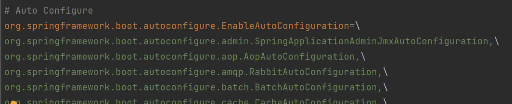
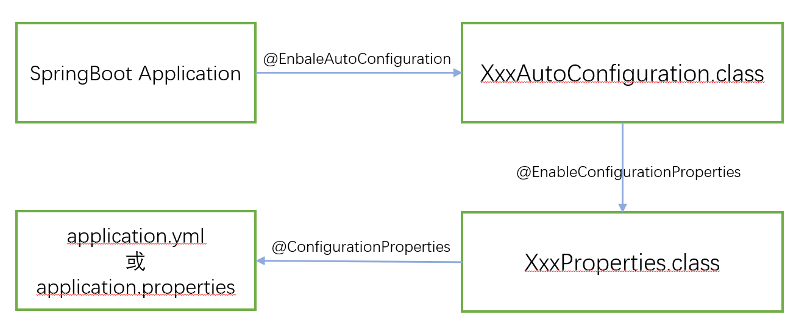
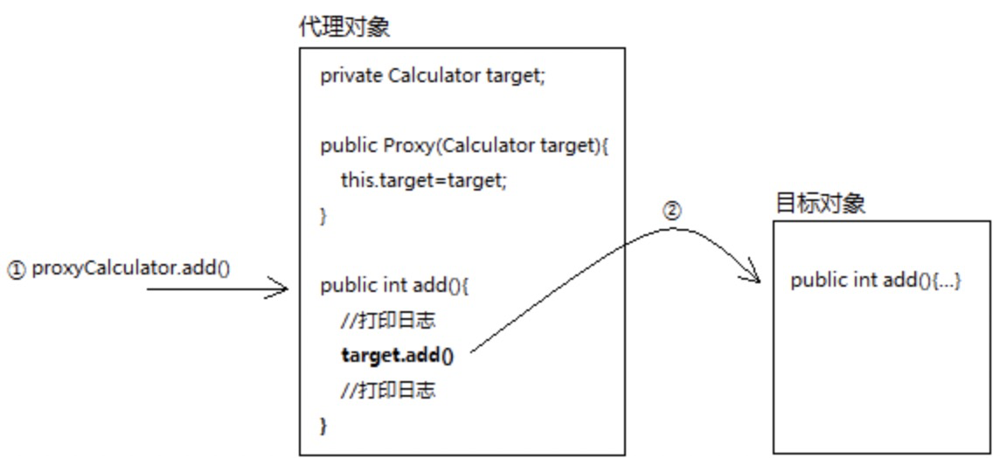

## Spring Boot自动配置原理

参考了这篇文章，写得是非常详细了：[Spring Boot面试杀手锏——自动配置原理](https://blog.csdn.net/u014745069/article/details/83820511)，以及这篇文章：[SpringBoot自动配置原理！](https://mp.weixin.qq.com/s?__biz=MzI4Njg5MDA5NA==&mid=2247484637&idx=1&sn=956c14daacc3e09367d9c27458b09f7f&chksm=ebd745dcdca0ccca6c173d32b6f8299f61d950990ee7c6eb2ec676f5ce0ad9b0ba306306a952###rd)

我在这里在用自己的理解描述一遍这个原理。

首先注意一下注解`@SpringBootApplication`，是由三个注解组合而成：

```java
@SpringBootConfiguration----即表明支持JavaConfig的方式进行配置
@EnableAutoConfiguration----开启**自动配置**功能。这是重点！！！
@ComponentScan----装载@Service,@Repository,@Componet等自定义!的类到IOC容器。“将主配置类（@SpringBootApplication注解的类）所在包及其子包里面的组件扫面到Spring容器中”
```

**区别：**其实需要区分的是后两个注解，我感觉区别是，:star:`@EnableAutoConfiguration`是自动载入Spring Boot框架为我们提供的一些**默认**的对象到IOC容器中，比如`jdbcTemplate`、`amqpTemplate`等，框架觉得我们可能会用到于是就帮我们先安排了。而`@ComponentScan`是载入我们自定义的类，比如一些service层的类，dao层的类。

**重点：**`@EnableAutoConfiguration`，它是如何实现自动配置的？

会扫描`META_INF/spring.factory`文件下的配置，导入key为 **`org.springframework.boot.autoconfigure.EnableAutoConfiguration`** 的value列表，一共有113个类，都是`xxxAutoConfiguration`格式。听名字已经很明确这是干啥的了吧：



（注意那些 "\\" 只是换行符而已，这个value列表的值是以逗号分隔的。）

接下来可以看这些类的源码，发现他们里面大部分都有一个:star:**​`xxxProperties`**私有变量，它和`xxxAutoCongifuration`类紧密联系：

```java
@Configuration //这个注解也很关键
@EnableConfigurationProperties(RabbitProperties.class)//自动配置类，给IOC容器中添加组件
...(其他注解)
public class RabbitAutoConfiguration {
    private final RabbitProperties properties;
    ...
}
```

```java
@ConfigurationProperties(prefix = "spring.rabbitmq")//默认配置信息
public class RabbitProperties {
	/**
	 * RabbitMQ host.
	 */
	private String host = "localhost";
	/**
	 * RabbitMQ port.
	 */
	private int port = 5672;
    ...
}
```

```yaml
//修改默认配置
spring:
	rabbitmq:
		host:127.0.0.1
		port:5677
```

看到没有！其实精髓就是把配置信息和配置类（JavaConfig）分类开来。我画了一个图表述他们之间的联系：




下面的回答过于精辟，是面试时的标准回答：[^3]

> Spring Boot启动的时候会通过@EnableAutoConfiguration注解找到META-INF/spring.factories配置文件中的所有自动配置类，并对其进行加载，而这些自动配置类都是以AutoConfiguration结尾来命名的，它实际上就是一个JavaConfig形式的Spring容器配置类，它能通过以Properties结尾命名的类中取得在全局配置文件中配置的属性如：server.port，而XxxxProperties类是通过@ConfigurationProperties注解与全局配置文件中对应的属性进行绑定的。

翻译一下`@EnableConfigurationProperties`的官方注释：

> Enable support for ConfigurationProperties annotated beans. ConfigurationProperties beans can be registered in the standard way (for example using @Bean methods) or, for convenience, can be specified directly on this annotation.
>
> 使被`@ConfigurationProperties` 注解的配置类生效。配置类（被`@ConfigurationProperties` 注解的类）有两种方式被注入到spring的context中：一种是标准的方式，比如采用@Bean注解；另一种则是采用`@EnableConfigurationProperties`注解具体指明需要被注入的配置类，这种方式比较方便。（我觉得我的这个翻译很棒😎）


## Spring事务 @Transactional[^2]

### @Transcational失效的原因：

> 1️⃣非事务方法中调用updateUser()本质上就是**this**.updateUser()，而this并不是代理对象，而是普通对象（后面再解释），所以无法触发事务。

我的理解是：

- 代理对象有和目标对象**同名**的方法（这最为关键！直接用静态代理来理解更明了），要用代理对象来调用它**自己**的add方法才能触发事务（而不是目标对象this的add方法，虽然两个方法的方法名相同）。

- 看起来是代理对象调用了目标对象的add()方法，但实际上代理对象**内部**是采用了目标对象的**实例**来调用add()方法的，如下图。

  

文中也提到了一个很细节的点，也是该注解失效的另一种情况：

> 2️⃣方法不为public时，@Transactional失效

给我翻译翻译🤣：

> Methods annotated with `@Transactional` must be overridable 
>
> 被`@Transactional`注解的方法必须是可以被重写的，也就是不可能是static

### 两个重要参数

#### rollbackfor

表明什么时候触发异常，一般写Exception.class最好，这样任何类型的异常都可以触发回滚，最稳妥。但是实际上可以不用设定这个参数，用默认的RuntimeException和Error，因为我们通常都只会关注到运行时异常，而且我们在控制台上看到的抛出的异常一般都是RuntimeExceprion，因为非运行时异常，也就是编译期间产生的异常，IDE会帮你检测出来然后你修改，而且你不完全修改好连编译都不可能通过，别说运行了。

#### propagation

呃...直接看参考文章吧😂


## Spring AOP

[Spring AOP的实现原理 ?](https://www.zhihu.com/question/23641679/answer/704897152) 

其中一个例子很恰当：

>目标方法的return是整个递归责任链的精华所在，就像一个弹簧,被压到最大限度,开始return了。所以，原路返回，执行每个拦截器`invoke()`方法中两个语句的下一句。

弹簧很形象，开始压弹簧的时候是在执行before链，压到最低点之后便执行目标方法（文中的`target.add()`），最后释放弹簧执行after链。


[^1]:[关与 @EnableConfigurationProperties 注解 - 简书 (jianshu.com)](https://www.jianshu.com/p/7f54da1cb2eb)
[^2]:[@Transactional失效问题 · 语雀 (yuque.com)](https://www.yuque.com/books/share/2b434c74-ed3a-470e-b148-b4c94ba14535/smxsf8#Pjdou)
[^3]:[Spring Boot面试杀手锏————自动配置原理](https://blog.csdn.net/u014745069/article/details/83820511)

