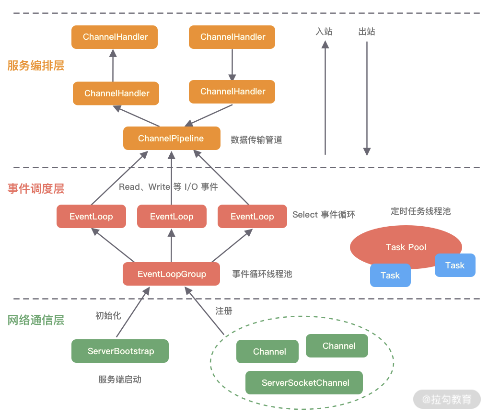

1. 弹幕中捕获到一个很形象的解释，对channel和buffer的：channel是轨道（京广线、包兰线），buffer是货车，也就是buffer会一批一批的将数据送往selector的意思吗？（提醒一下这是双向的）

2. 应用程序client只会和buffer交互，不会和channel交互，除非它想卧轨。

   实现非阻塞，很重要的一点就是这个buffer，想想是不是。因为client只需要将货物装上buffer就不用管了。以前的数据直接在连接上进行处理的

3. selectionKey和channel关联

   在AbstractSelector类中的方法register()：

   >Registers the given channel with this selector.
   >This method is invoked by a channel's register method in order to perform the actual work of registering the channel with this selector.
   >Params:
   >ch – The channel to be registered
   >ops – The initial interest set, which must be valid
   >att – The initial attachment for the resulting key
   >Returns:
   >A new key representing the registration of the given channel with this selector.
   >
   >将给定的channel注册到当前selector实例中。
   >
   >该方法由一个channel的register方法调用，目的是执行将channel注册到当前selector这样一个实际的工作
   >
   >参数：ch - 需要被注册的channel实例；:star:ops - 设置初始**关心的**事件（操作）（看SelectionKey 的源码 里面有4种事件）；att - ；
   >
   >返回值：
   >
   >一个代表这个注册进当前selector的channel的键（key），通过这个SelectionKey就可以拿到相应的channel。
   >
   >```java
   >protected abstract SelectionKey register(AbstractSelectableChannel ch,
   >                                             int ops, Object att);
   >```

   

4. SelectionKey对象

   > A token representing the registration of a `SelectableChannel` with a Selector.
   >
   > 一个token，这个token能代表一个`SelectableChannel`，而这个给定的channel是注册进一个`selector`中的
   >
   > SelectionKey这个对象有五个属性，一看就知道它的作用：
   >
   > ```java
   > final SelChImpl channel;
   > public final SelectorImpl selector;
   > private int index;
   > private volatile int interestOps;
   > private int readyOps;
   > ```
   >
   > 似乎一个SelectionKey对象只能设置一个事件（1/4）？

5. Selector#select()

   >Selects a set of keys whose corresponding channels are ready for I/O operations.
   >
   >This method performs a blocking selection operation. It returns only after at least one channel is selected, this selector's wakeup method is invoked, or the current thread is interrupted, whichever comes first.
   >Returns:
   >The number of keys, possibly zero, whose ready-operation sets were updated
   >Throws:
   >IOException – If an I/O error occurs
   >ClosedSelectorException – If this selector is closed
   >
   >```java
   >public abstract int select() throws IOException;
   >```
   >
   >采集一组key（严格说是SelectionKey对象），这些key对应的channel已准备好了I/O操作。
   >
   >该方法执行阻塞的select操作，以下三种条件满足其一，这个方法就会*return*：（1）至少一个channel被select之后；（2）该selector对象的wakeup方法被调用；（3）当前线程被中断。
   >
   >返回值：key的数量，可能为0，这种情况下的ready-operation set被更新了

6. :star:区别ServerSocketChannel和SocketChannel （或说ServerChannel和Channel）

   这个地方我弄混了很久，其实两者是有分工的，前者一般是监听且只监听accept事件，然后将该channel绑定read事件后注册到selector上，表示我接受、同意了你的连接。也就是说，一般一个服务器就一个或者几个ServerSocketChannel，然后调用accept方法得到每一个客户端的channel（SocketChanel的子类）并注册到selector中，每一个socketchannel代表一个客户端的连接。	

7. >Netty is *an asynchronous event-driven network application framework*
   >for rapid development of maintainable high performance protocol servers & clients.
   >
   >Netty是一个异步、事件驱动的网络应用框架，致力于快速开发可维护的高性能基于网络协议（http，ssl等）的客户端和服务器

8. Reactor模式

   > read全部读完了才会通知serviceHandler 

   评论区还是有高手的:joy:。目前感觉这一点就是Reactor模式的精髓，**将耗时操作（比如读取数据`read()`）与业务进程（handler）相剥离，这样handler内部就不会有等待了。**

9. Netty模型:star:

   - Netty模型其实就是对NIO的封装发，有一个bossGourp和一个workerGroup，bossGroup中的ServerSocketChannel的interest operation只有ACCEPT_OP，[这篇文章](https://zhuanlan.zhihu.com/p/181239748)写得很不错。

     > - bossGroup 用于监听客户端连接，专门负责与客户端创建连接，并把连接注册到**workerGroup**的Selector中。
     > - workerGroup用于处理每一个连接发生的读写事件。

   - 和第6点很像。一个BossGroup中的selector只关心accept方法，接收到该事件后将相应的channel封装成NIOSocketChannel后注册到WorkerGroup（和BossGroup一样都是线程）中，监听到如read事件后调用handler。注意handler已经加入到channel中。

   - 个人的一个理解：和网络协议的分层结构思想很相似，bossGroup只接受accept事件，然后将连接注册到workergroup上面，它会监听read或者write等事件。如果有这类事件发生就调用handler进行业务处理。就是netty或者说Reactor模型就像这么个流程，没有部门的跨级交流。

     这样分析起来有点像公司的结构：老板负责谈项目，workergroup有点像一个个项目负责人，不同的业务（事件）交由不同的员工（handler）进行具体处理。
     
   - 我感觉对一种技术的抽象模型的理解特别重要。

     

 

- [学习Reactor模式](https://mp.weixin.qq.com/s/vWbbn1qXRFVva8Y9yET18Q)

  - 里面提到了三个角色，其中的acceptor觉得显得比较特殊，因为专门负责处理ACCEPT（连接）事件。也就是说所有事件中只有ACCEPT事件比较特殊，需要**专门**的角色进行处理，也就是这里的acceptor。别的事件都交给handler这个角色处理。

  - reactor这个角色就只是一个响应器而已了啦，算是reactor模式的**基本单位**，区分单reactor还是多reactor就是看reactor这个角色的数量。而区别单线程还是多线程主要是看handler的个数。

  - Netty采用的应该是多Reactor多线程这种模型，引用里面的话结合图片就很清楚了：:star::star::star:

    > BossGroup相当于mainReactor，负责建立连接并且把**连接（accept事件）**注册到WorkGroup中。WorkGroup负责处理连接对应的**读写**事件。

    > BossGroup和WorkGroup是两个**线程池**，里面有多个NioEventGroup(**实际上是线程)**，默认BossGroup和WorkGroup里的线程数是cpu核数的两倍（源码中有体现）。

    >:star:每一个NioEventGroup都是一个无限循环，负责监听相对应的事件。4、Pipeline(通道)里添加了多个ChannelHandler(业务处理)，按顺序执行。


---

> Channel 的字面意思是“通道”，它是网络通信的载体

我觉得Channel就是代表一个TCP或者UDP连接，面向对象嘛，把每一个连接抽象为了一个Channel对象


> 1. 一个 EventLoopGroup 往往包含一个或者多个 EventLoop。EventLoop 用于**处理** Channel 生命周期内的所有 I/O 事件，如 accept、connect、read、write 等 I/O 事件。
> 2. EventLoop 同一时间会与一个线程绑定，每个 EventLoop 负责处理多个 Channel。
> 3. 每新建一个 Channel，EventLoopGroup 会选择一个 EventLoop 与其绑定。该 Channel 在生命周期内都可以对 EventLoop 进行多次绑定和解绑。

一个Channel绑定一个EventLoop，一个EventLoop可绑定多个Channel。形象一点理解EventLoop就是餐厅服务员，Channel就是食客。

> - 服务端启动初始化时有 Boss EventLoopGroup 和 Worker EventLoopGroup 两个组件，**其中 Boss 负责监听网络连接事件**。当有新的网络连接事件到达时，则将 Channel 注册到 Worker EventLoopGroup。

懂了，Boss和Worker虽然都是EventLoop，且它们都是监听并处理事件的，但是Boss只处理Accept事件，其他的事件都是交由Worker处理。

主从Reactor

这种方式下，Boss和Worder的EventLoopGroup是分开的。

> BossEventLoopGroup 负责监听客户端的 Accept 事件，当事件触发时，将事件注册至 WorkerEventLoopGroup 中的一个 NioEventLoop 上。


> 每新建一个 Channel， 只选择一个 NioEventLoop 与其绑定。所以说 Channel 生命周期的所有事件处理都是**线程独立**的，不同的 NioEventLoop 线程之间不会发生任何交集。


> NioEventLoop 完成数据读取后，会调用绑定的 ChannelPipeline 进行事件传播

还是那句话，web服务器是I/O密集型的，当I/O数据准备完毕后再进行处理，即交由ChannelPipeline进行处理。





