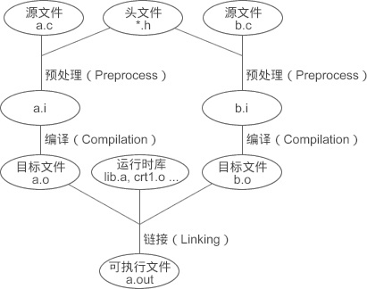
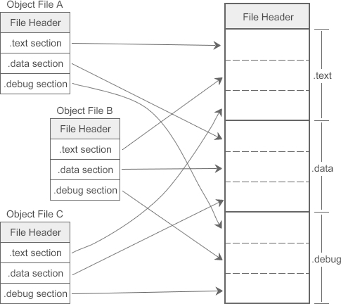
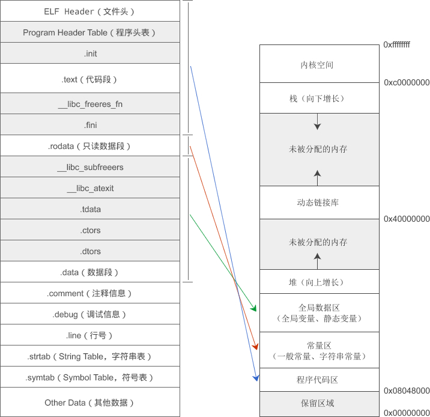

## 了解一些并行计算的基础

[想了解并行计算框架但无从下手开始学习？](https://blog.csdn.net/weixin_46091928/article/details/112967227)，里面提到了几种并行计算框架。

似乎，mapreduce、spark这些都算是并行计算框架？感觉上面提到的openMP相比于mapreduce，是比较底层的并行计算框架。

找到了MPI的教程：https://mpitutorial.com/tutorials/

> 尽管 MPI 比大多数并行框架要更底层（比如 Hadoop），但是学习 MPI 会为你的并行编程打下良好的基础。
>
> 来自：https://mpitutorial.com/tutorials/mpi-introduction/zh_cn/


## MPI—message passing interface

MPI只是一个接口，MPICH和openMPI是两种比较出名的实现


区别openMP和MPI：

> openmp虽然简单却只能用于**单机**多CPU/多核并行，MPI才是用于多主机超级计算机**集群**的强悍工具，当然复杂。

> openmp适合对原有的**串行代码进行并行化改造**，新项目还是用mpi好一些，一个是适应的硬件条件广泛，速度也比较快，openmp当线程数超过一定数量，比同样进程数的mpi慢。


## openMP—Open Multi-Processing

这应该才是我要学习的。

[openMP入门教程](https://www.cnblogs.com/lfri/p/10111315.html)

[OpenMP并行开发（C++）](https://zhuanlan.zhihu.com/p/51173703)这是应用相关教程。	

[OpenMP编程指南](https://blog.csdn.net/drzhouweiming/article/details/4093624?spm=1001.2014.3001.5501)


```c++
#pragma omp 指令 [子句]
```


> 目前各个主流操作系统的线程*API*互不兼容，缺乏事实上的统一规范，要满足可移植性得自己写一些代码，将各种不同操作系统的*api*封装成一套统一的接口。*OpenMP*是标准规范，所有支持它的编译器都是执行同一套标准，不存在可移植性问题。

### fork/join并行执行模式

> OpenMP并行执行的程序要全部结束后才能执行后面的非并行部分的代码。
>
> 标准并行模式执行代码的基本思想是，程序开始时只有一个主线程，程序中的串行部分都由主线程执行，并行的部分是通过派生其他线程来执行，但是如果并行部分没有结束时是不会执行串行部分的，如上一篇文章中的以下代码：

这么说，没有重排序的优化吗？也可以将此理解为一种并行模式，个人觉得这种方式还是有它的独到之处的。


### 一些指令

#### for指令

需要理解一下下面并行执行的for循环：不是特别明白，有两个猜测：

1. 将这个for循环交到多个cpu中，每个cpu都循环10次？
2. i有四个值：0,1,2,3，将它们分别交给不同的cpu来执行？

我倾向于第二种，不然`parallel`指令和`parallel for`指令就没区别了。刚跑完了一个demo，发现推测是正确的。

```c++
int main(int argc, char* argv[])
{
#pragma omp parallel for
     for (int i = 0; i < 4; i++ )
     {
         printf( " i = %d, ThreadId = %d\n " , i, omp_get_thread_num());
     }
     return 0;
}
结果：
i = 2, ThreadId = 2
i = 1, ThreadId = 1
i = 3, ThreadId = 3
i = 0, ThreadId = 0
```

> 用for语句来分摊是由系统自动进行，只要每次循环间没有时间上的差距，那么分摊是很均匀的，使用section来划分线程是一种**手工**划分线程的方式，最终并行性的好坏得依赖于程序员。


### 一些子句

#### private

> 用private子句声明的私有变量的初始值在并行区域的入口处是未定义的，它并不会继承同名共享变量的值。


## c++的一些基础

无语啊，最终还是得学c++😭

### 预处理命令

> 这就是预处理阶段的工作，**它把代码当成普通文本**，根据设定的条件进行一些简单的文本替换，将替换以后的结果再交给编译器处理。
>
> 来自：http://c.biancheng.net/view/1878.html

根据上面这段话，再来理解`#include`：

> \#include 的处理过程很简单，就是将头文件的内容插入到该命令所在的位置，从而把头文件和当前源文件连接成一个源文件，这与**复制粘贴**的效果相同。

这也就是为什么头文件中只有函数和变量的声明，没有定义的原因。头文件的作用相当于把其中的声明粘贴到当前源文件（`.c`）中。

> 「在头文件中定义定义函数和全局变量」这种认知是原则性的错误！不管是标准头文件，还是自定义头文件，**都只能包含变量和函数的声明，不能包含定义**，否则在多次引入时会引起**重复定义**错误。

注意这两种形式是有区别的，具体见[文章](http://c.biancheng.net/view/1975.html)

```c++
#include <stdHeader.h>
#include "myHeader.h"
```

有了上面的理解，即“文本替换”，就能够理解其他的预处理命令了，比如宏。也是文本替换嘛！甚至这种写法都是可以的：

```c
//直接定义一段代码，甚至函数，反正是文本替换。你只需要关注替换后是否合法即可
#define M if(flag) {return true};
#define int func(int a,int b) {return a+b;}
```


### C语言多文件编程

学c/c++、go的时候，应该把思维从Java转变过来，在Java的世界里，类是一等公民，在c系语言的世界里，函数才是一等公民。Java的每个源文件是为了实现一个类，c系语言的每个源文件是为了实现一个一个的方法。

#### extern

[这篇文章](http://c.biancheng.net/view/vip_2110.html)进行了讨论，得出的结论是：用于**声明**：**变量**或函数，不论是外部（其他源文件）变量还是当前`.c`文件中的。由于编译器能够分辨函数的声明和定义，所以加不加`extern`都可以，但是变量的申明就得加上`extern`了。

```c
//这是函数定义
int func(char a){
    //...
    return 66; 
}
//这是函数声明，能够一眼就看出来，所以加不加extern都无所谓
int func(char);
//这到底是变量声明还是定义？？？
int a;
//所以加上extern表明这是声明，与变量的定义区分开
extern int a;
```


#### ✨目标文件和可执行文件

简单来说，高级语言➡汇编语言（这个过程最复杂）➡机器语言（简单的句句翻译）



预处理形成的`.i`文件就没有了预处理代码，比如源代码中的`#include<...>`、`#if ...`都没有了。编译形成的是汇编代码，注意还是代码（`push eax;`），也可以通过文本编辑器查看。汇编后才最终形成机器语言，过程相对简单，就是做一些翻译工作，每句汇编代码对应一些机器语言，就这样一行一行翻译完毕就over了。

还有，将`.o`文件译为目标文件，感觉很拉跨，到底是什么的目标？你受谁指使？云里雾里。其实人家就是object文件，别翻译了好吗。

> 站在文件结构的角度，可执行文件包含了众多的段（Section），每个段都有不同的作用；站在加载和执行的角度，所有的段都是数据，操作系统只关心数据的**权限**，==只要把相同权限的数据加载到同一个内存区域，程序就能正确执行==。
>
> 常见的数据权限无外乎三种：只读（例如 .rodata 只读数据段）、读写（例如 .data 数据段）、读取和执行（例如 .text 代码段），我们将一块连续的、具有相同权限的数据称为一个 Segment，**一个 Segment 由多个权限相同的 Section 构成**。

> 在 Linux 下，相信很多读者都遇到过一种叫做`Segment fault（段错误）`的错误，这种错误发生在程序执行期间，在编译和链接时无法检测，**一般都是代码的权限不足导致的**。

[这篇文章](http://c.biancheng.net/view/vip_2112.html)是真的好，虽然没完全看懂。


尝试总结一下：

首先，一个多 源文件的项目经过编译、汇编，会得到多个目标文件，即一个源文件会被汇编成一个目标文件（最为关键）。这个目标文件有多个section，每个section的具体含义看文章。可执行文件的内部的组织形式本质都是一样的，只不过将相同权限的section汇到同一个segment上。现在出现两个问题，都是映射问题：

1. 开始就说到，目标文件有多个，但是可执行文件只有一个，那这是如何映射的？
2. 还是映射问题，可执行文件中的section➡C语言内存模型？

第一个问题很好回答，同样的section合并成一个即可。这也是*链接* 阶段的作用**之一**。途中左边的就是各个目标文件，右边就是可执行文件。



回答第二个问题需要引入两个概念：权限和segment。**操作系统并不会为每个section都分配一个区域，而是将多个具有相同权限，且空间连续的section合并在一起，成为一个segment，将这个segment加载到同一个内存区域**。



纵观一下发现很有意思。多个目标文件通过链接形成一个可执行文件，这个可执行文件和目标文件一样由多个section组成，这是站在文件结构的角度。多个空间连续的且权限相同的section又被合并成一个segment，加载到一个内存区域，这又是站在操作系统的角度，毕竟操作系统不会关心文件的结构，只会关心文件各个部分的权限。

所以section和segment的区别还是很好理解的，segment是针对加载和执行的过程，是面向操作系统的。

#### 链接

参考[符号——链接的粘合剂](http://c.biancheng.net/view/vip_2114.html)、[一切皆地址](http://c.biancheng.net/view/vip_2113.html)。这个过程我觉得是很关键的。

> **符号（Symbol）**这个概念随着汇编语言的普及被广泛接受，它用来表示一个地址，这个地址可能是一段子程序（后来发展为函数）的起始地址，也可以是一个变量的地址。

很有深意的一段话。用符号表示的主要就两种：函数名和变量名。所以，从此刻开始，可以用另一个视角理解它们俩了：地址。

上面那一小节讲到了链接过程的一个作用，合并相同的section到一个大的section，但这个阶段的真正威力并不在此。两个目标文件会涉及函数调用，比如`A.o`中调用`B.o`的`int func1();`函数。但是，通过编译A和B源文件，各自得到了一个目标文件，但到目前为止这两个目标文件没有任何关联！！！它们的预处理、编译都是各玩各的，都互相不认识对方。只有`func1`这个符号，暂无法确定它的地址。

来详细看看`A`中是如何调用`B`中的函数的：

```c
//A.c
extern int func1();//声明
//#include "B.h"  //也可以引入B的头文件，里边有对func1的声明
//...
//假设这里有很多行别的代码
int ans = func1();//调用
```

发现没有，这个`func1`的声明和PPT造车没啥区别，我甚至不知道这个函数到底定义在了哪里，有可能在`B.c`中，也有可能在月球上。

于是可以得出一个大胆的结论：**声明**一个**方法时其实并不care这个方法是否存在！！！**我们只需要定义这个符号，至于它具体地址（磁盘中而非内存）在哪里，链接阶段表示这我擅长。于是，链接的过程可以这么归纳：将符号所对应的地址赋予这个符号，被链接的两端就是符号和其地址。这个符号可以是变量名，也可以是函数名。

链接器在连接的过程中会扫描所有目标文件的符号表`.systab`，……（[符号——链接的粘合剂](http://c.biancheng.net/view/vip_2114.html)）

现在剩下静态链接和动态链接没攻克了

> 这种在程序运行之前**确定符号地址**的过程叫做静态链接（Static Linking）；如果需要等到程序运行期间再确定符号地址，就叫做动态链接（Dynamic Linking）。
>
> Windows 下的 .dll 或者 Linux 下的 .so 必须要嵌入到可执行程序、作为可执行程序的一部分运行，它们所包含的符号的地址就是在程序运行期间确定的，所以称为动态链接库（Dynamic Linking Library）。

静态链接能够理解，但是动态链接光给我个描述不好理解啊，给个例子吧。这个部分我找到了专题，有必要新开一个标题。

# 🎈🎈🎈突然来的灵感

这个符号着实把我搞迷糊了,链接器的重要任务就是为符号找到地址,那么下面这段代码,假如s是一个全局变量,而且是一个结构体类型:

```c
void func(){
	struct Student Stu = s;
}
```

那么…难道…stu得到的是s的地址…? 那这个s和指针又有啥区别呢?

我觉得这种赋值方式,可能首先有个拷贝的过程,将s在内存中拷贝一份以后再将新的section+section内偏移返回给stu变量,这样s和stu操作的就是两个内存区域了.

再者,像go这样的语言, 可能stu=s这个过程得到的新Student, 还会在栈内分配空间.


#### 防止头文件被重复包含

用预处理命令，宏。但是请注意这个宏的作用域仅当前源文件，所以不必担心其他源文件要引入同样的头文件失败的问题。


#### static变量和函数

> 实际开发中，我们通常将不需要被其他模块调用的全局变量或函数用 **static** 关键字来修饰，static 能够将全局变量和函数的作用域限制在当前文件中，在其他文件中无效。

纳尼！！！和Java中的意思天差地别啊！！！

格局小了，静态变量的意思是，程序开始运行后，这个变量在内存中所处地址就一直不变了，就好像静止了一样。

我还不是很适应在函数中定义`static`变量，总感觉有些歧义。我觉得还是和全局变量定义在一起。有两点理由：第一，它们在内存中 都是全局数据区，第二，可以将它们类比成Java中的context，就中的`ApplicationContext`（类似全局变量）、`RequestContextHolder`（类似静态变量，只在当前线程中）等等。

其实Java和c语言的`static`意思都是一样的，虽然被`static`修饰的符号地址不会变了，但是它的内容是可以随便变动的呀！让我混淆的其实是c中的`const`和Java中的`final`，它们不仅仅是静态的，也就是所处地址在运行期间不变，而且里边的内容也不会改变。、

在JVM内存模型中没有全局数据区，我觉得对应的应该是metaspace中的类元信息和方法元信息，常量对应metaspace中的常量区。

### c++多文件编程

#### 命名空间

> 也就是说，分散在不同文件中的同名命名空间会合并为一个。

#### 类成员变量和成员函数声明和定义

```c++
// student.h
class Student{
public:
    //成员变量
    char *name;
    int age;
    float score;
    //成员函数
    void say();  //函数声明
};
//student.cpp
//函数定义
void Student::say(){
    cout<<name<<"的年龄是"<<age<<"，成绩是"<<score<<endl;
}
```

来自：http://c.biancheng.net/view/2214.html

> 内联函数一般不是我们所期望的，它会将函数调用处用函数体替代，所以我建议在类体内部对成员函数作声明，而在类体外部进行定义，这是一种良好的编程习惯，实际开发中大家也是这样做的。

> 再次强调，虽然 [C++](http://c.biancheng.net/cplus/) 支持将内联函数定义在类的外部，但我强烈建议将函数定义在类的内部，这样它会自动成为内联函数，何必费力不讨好地将它定义在类的外部呢，这样并没有任何优势。


### 动态链接&静态链接

#### 链接库

不论动态还是静态，都可以理解为一个压缩包，类似*jar包*，一个链接库会包含多个目标文件，对应jar包中的`.class`字节码文件。

> 事实上，库文件只是一个统称，代指的是一类==压缩包==，它们都包含有**多个**功能实用的目标文件。

|            | 解释                                                         | Windows                          | Linux                                                |
| ---------- | ------------------------------------------------------------ | -------------------------------- | ---------------------------------------------------- |
| 目标文件   |                                                              | `.obj`                           | `.o`                                                 |
| 静态链接库 | 直接理解为一个压缩包，里边包含多个目标文件。gcc编译器默认动态链接，所以如果需要采用静态链接，则显式指定：`gcc -static main.o libmymath.a`，这样就将静态链接库`libmymath.a`链接到`main.o`。 | `.lib`（library）                | `.a`                                                 |
| 动态链接库 | 制作过程和静态链接库没多大区别，本质上也没啥区别。<br />“ *注意，动态链接库的命令规则和静态链接库完全相同，只不过在 Linux 发行版系统中，其后缀名用 .so 表示；Windows 系统中，后缀名为 .dll。*” | `.dll`（dynamic linked library） | `.so`（shared object）                               |
| 可执行文件 |                                                              | `.exe`                           | 没有固定的后缀，一般不写，但是看到过`.out`作为后缀的 |


#### Windows

Windows下情况很复杂，而且我认为用的很少，毕竟我们都是用gcc的人。了解一下就行。

动态链接库创建时还需要生成一个引入库文件，虽然和静态链接库一样都是`.lib`后缀，但是两者的区别我想可以这么概括：include和exclude。也就是说，静态链接库`.lib`中包含的是让静态连接器在链接的时候需要链接的（include），引入库`.lib`恰好相反，告诉静态链接器这些符号不归你管，是我动态链接器的势力范围。

我来捋一捋使用动态链接库的步骤。首先会有三个文件（太多了吧）：`module.h`, `module.lib`, `module.dll`。
`module.h`这玩意儿巨绕，涉及`__declspec(dllexport)`和`__declspec(dllimport)`。总结起来，两者出现的时期不一样。前者是在**生成**动态链接库的时候用的，用来告诉**编译器**，这些符号是我要导出的；后者是动态链接库生成后，也就是用户**使用期间**，这个`module.h`头文件就要拿给用户用了，用户极有可能把它用在预处理命令里边，即`#include<module.h>`，预处理结束后`module.h`中的文本就会被拷贝到用户的源文件中，那么这个时候源文件中就会有，比如`__declspec(dllexclude) int ans;`这样的声明，这像话吗？显然不科学，因为对用户的源文件来说，应该是要导入而不是导出。因此，交给用户的这个头文件并不能直接使用，需要将`__declspec(dllexport)`改为`__declspec(dllimport)`。

#### Linux

反正Windows上有了MinGW，就可以摆脱VS的折磨了。Linux上没有那么多繁琐的文件，仅有`.so`（*shared object*）和`.h`，也就是并不需要引入库文件（`.lib`）。原因如下：

> 与前者不同，Linux 平台上不再需要生成引入库文件（`.lib`），原因很简单，**默认情况下动态链接库（`.so`）中定义的所有函数和变量都允许被外界调用**。或者说，动态链接库中不仅保存了所有函数和变量的**定义**，还保存了能被外界调用的所有函数和变量的信息，所以不需要生成引入库文件。


### make、makefile、cmake

[make makefile cmake qmake都是什么，有什么区别？ - 辉常哥的回答 - 知乎](https://www.zhihu.com/question/27455963/answer/89770919)

大致了解makefile文件-》make命令。cmakelist文件-》cmake命令。