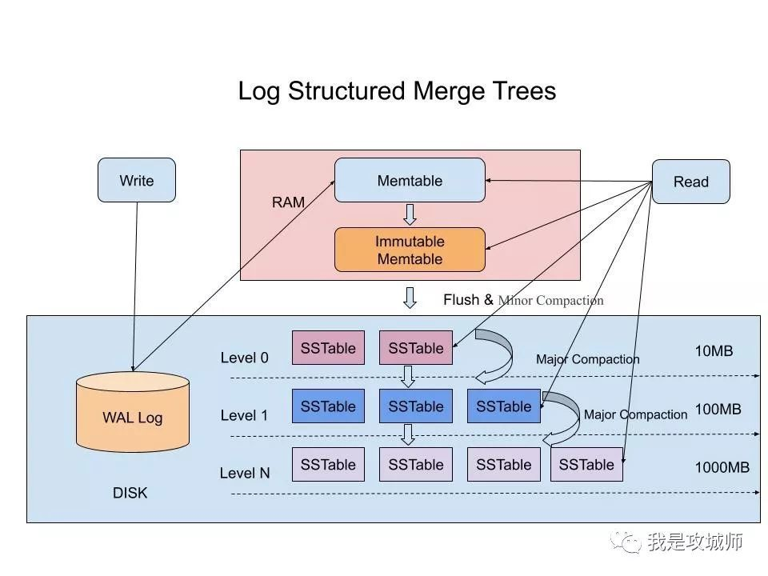
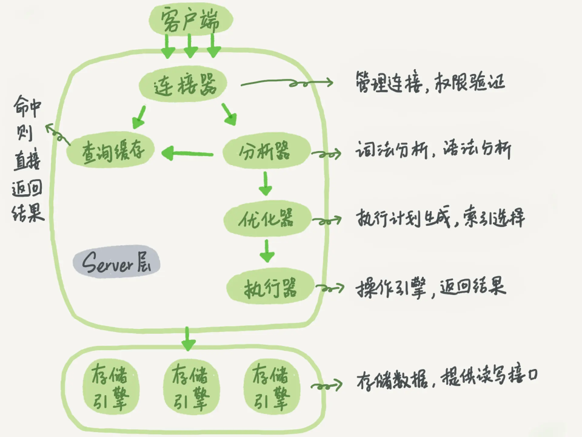
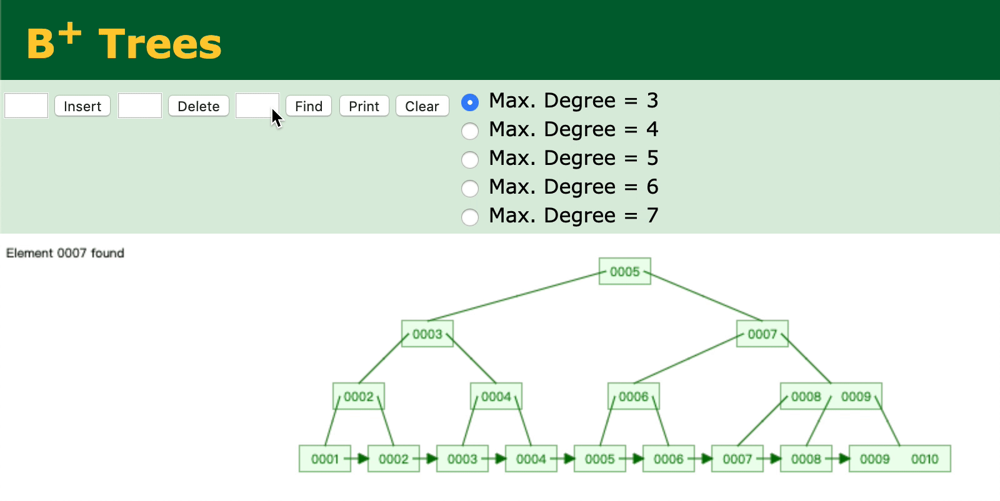
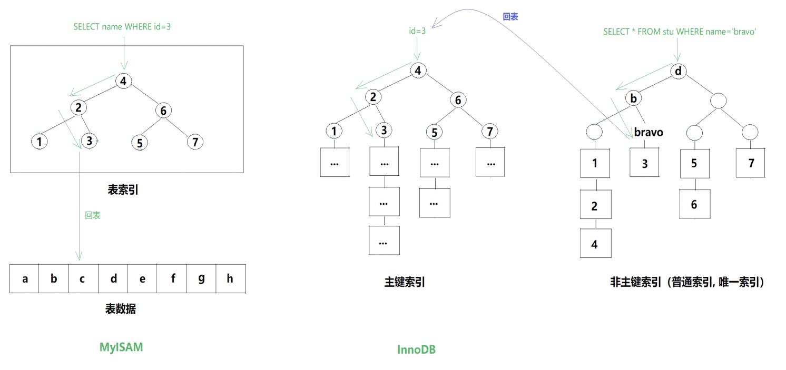

# Log Structured Merge Tree

阅读：[Log Structured Merge Trees(LSM) 原理](https://www.open-open.com/lib/view/open1424916275249.html)、[深入理解什么是LSM-Tree](https://cloud.tencent.com/developer/article/1441835)。

最优秀的写数据方式只有顺序写（`O(1)`），但这种方式下的读性能将会非常糟糕，因为需要遍历（`O(N)`）。

对上边第一句话的理解：

> 如果我们对写操作的吞吐量敏感，我们最好怎么做？一个好的办法是简单的将数据添加到文件。这**个策略经常被使用在日志或者堆文件，因为他们是完全顺序的**，所以可以提供非常好的写操作性能，大约等于磁盘的理论速度，也就是200~300 MB/s。

看看加粗的地方，这也是为啥LSM中有”Log“这个词。

如果为了提高读的性能，那必然需要对数据进行组织，比如B+树，hash等等数据结构，而为了维护这些数据结构不得不损失一些写性能。

SSTable中的key的有序的，所以根据key的查询速度是很快的，类似二分搜索。

> 文件是不可修改的，他们**永远不会被更新**，新的更新操作只会写到新的文件中。通过周期性的合并这些文件来减少文件个数。

更新的时机，也就是Major Compaction的时机，**这个阶段会真正地清除掉被标记删除掉的数据以及多版本数据的合并**。

为什么说LSM-Tree很适合分布式存储呢？因为支持高性能的写入，而分布式事务在提交时需要尽量快速的完成，以免发生幺蛾子。

# 《能解答一切问题的答案》

## MySQL基本架构

分为service层和存储引擎层，我猜测service层是运行在内存上的，存储引擎因为要存数据，所以应该在磁盘上。因此存储引擎还是会为service层提供API。这有点像C-S架构。

里边讲了查询缓存的工作方式，以及为啥8.0版本之后直接移除了查询缓存，注意看看。

这幅图中，优化器才是重点，前边的连接器和分析器都是预处理，后边的执行器是给它打工的。优化器的作用是：生成执行计划。

> 只需知道优化器的两个作用：
>
> - 表里面有多个索引的时候，决定使用哪个索引
> - 在一个语句有多表关联（join）的时候，决定各个表的连接顺序

## 数据组织形式—线性结构到B+树的演变过程[^1]

文章中讲了线性结构➡二叉搜索树(BST)➡二叉平衡树(AVL)➡B树➡B+树的演变过程，我觉得这么多次的演变都是为了解决一件事情：

==数据都是存储在磁盘中的而非内存。这不是句废话，这涉及到读取数据需要磁盘IO，而磁盘IO是耗时耗资源操作。==

所以这这一串演变过程都是为了减少IO操作。

**线性结构**：这个就不多说了

**二叉搜索树**：这种方式其实已经很大程度上减少了IO，比如文章中提到，查找42亿条数据最多也只需要32次IO，相比线性结构已经很牛逼了，但是还是不够。而且二叉搜索树有一个很致命的问题是，它的**插入节点算法很简单粗暴**，使得它在实际使用过程中**树的层级**很深，极易退化成线性结构。

**二叉平衡树**：就是为了解决上面BST的问题，树的层级之差最多为1。但这个AVL只是解决了BST所带来的问题，可以把BST看作一个有毒性的解方案，而AVL只是为了解毒😂。但是朝着二叉树这个方向优化是没问题的。
AVL树的缺点是，虽然能够保证稳定的二分查询效率（logn），但是为了保证平衡，会进行大量旋转，这就是它的劣势，也是后边的B+树的劣势。

**B树**：开始真正专注于减少磁盘IO了，方法是将二叉平衡树变为Ｎ阶，即Ｎ阶Ｂ树。N代表的是addr数，这样每个节点能够存的数据更多了，为N-1个。

> 这样组织的好处是，**每次加载一个节点时都可以从磁盘带出更多条数据，从而减少磁盘IO的次数。**

这种思路简单粗暴，但很有效。

**B+树**：我觉得上面几种方式（尤其B树）更多是在理论层面考虑数据库数据的组织形式，而B+树则更像是在基于上面的理论，结合MySQL、操作系统等环境，在工程上实现。

- 它加入了页的概念，**MySQL中一页的大小为16kB**，==于是让每个节点就是一页==（妙啊！）。每次读取一个节点。
- 将二叉树划分为**叶子节点**和**非叶子节点**。在非叶子节点，只存一堆`主键-addr`的键值对形式，也就是只有记录数据的主键，而不存数据本身；在叶子节点，则存所有的数据

可以计算一下每一个非叶子节点能够存多少`主键-addr`：主键用bigint类型，8字节，**MySQL的指针占用6字节**，则每一个`主键-addr`占用14字节，则每一个页面最多可以存$$\frac{16 \times 1024 Byte}{(6+8)Byte/个}=1170个$$`主键-addr`。

有了这种数据组织形式，我觉得最大的有点就是细化分工：非叶子节点就只负责索引、搜索，到了叶子节点就返回主键对应的数据，同时还可以来点范围搜索这种骚操作。

> 所谓的B+树，就是把原先B树中分散在各个节点的数据都“赶到”最底层的叶子节点，非叶子节点只存储主键-addr形式的数据

上面的B+图中addr的画法不准确，更准确的应该是这样[^2]：

## 索引 Index[^3]

这篇文章主要讲的是一些基础知识，不需要太多理解力的，就像背单词一样的基本功，所以大部分内容按时复习就没多大问题。这里我强调几点觉得需要特别关注的地方。

**索引类型**：
文中提到了四种基本索引类型，但没有把主键索引归进去，那么主键索引到底是什么国籍呢？文中的解释是，==**主键索引=唯一索引+Not Null**==，这是没问题的，但是我觉得还可以更进一步解释，是因为主键索引太重要，所以才拥有了名字，<u>除此之外的都叫辅助索引</u>。比如全文索引和唯一索引的搭配就没有名字是吧（我甚至不知道有没有这种搭配😒瞎编的）。

其实对辅助索引的准确解释是：它的叶子节点是主键！也就是需要==回表==，再查询一次主键索引，或说聚簇索引。

后边会提到的联合索引也算是辅助索引的一种。

**索引的数据结构**：除了熟悉的BTREE，说一说hash，不是因为它重要，而是因为它在B+树的“光芒”下显得那么不引人注目。我觉得它就像一个专才，快准狠精确定位能力，但为了实现这样一个牛逼的功能，舍弃了模糊搜索、范围查询等能力。

这么多索引类型，如何归类？

其实可以发现，这里有很多很多的索引：聚簇索引、主键索引、辅助索引空间索引等等，不下10种。得给它们归类不是？

[MySQL 索引概览](https://blog.csdn.net/wallace_www/article/details/117264149)这篇文章有比较详尽的分类。

## 存储引擎

所以主键索引才是yyds，它配拥有名字。它牛逼的地方还在于，在InnoDB中采用的是聚簇索引，于是通过主键进行查询不需要**回表**（留意这个概念），因为：

> 对于InnoDB的**主键索引**而言，数据即索引，索引即数据。

而且除了主键索引外的，都叫做辅助索引，还可以称为二级索引，你听听这名字就知道是个打工的。这些辅助索引不管你怎么折腾，叶子节点都是主键，这一点决定了辅助索引们都是以主键索引为准的，而且查询时很大概率需要**回表**，除非实现了索引覆盖。

我觉得我对索引覆盖的理解还是比较到位的：

> 只用在辅助索引上查询就可以得到所需要的所有字段，不需要回表（即不必再查询一次主键索引），即为索引覆盖。

这里提到了回表的概念，我在文中有评论感觉还是把握住了要领，复习的时候去看看。

## 最左匹配原则[^4]

我没有把联合索引啥的作为标题，是因为我觉得还是最左匹配原则重要得多。多看看文中的例子就能理解最左匹配原则了，感觉还是很好理解的。

从文章中我学到了一个有效的sql命令来观察是否走了预期的索引：explain，是MySQL提供的专门用来分析SQL**执行计划**的

文章中也提到了一个很实际的情况：

> 但大家要认识到，实际开发索引覆盖可遇不可求，基本还是回表的情况多一些。

我学习索引覆盖的时候也注意到了这一点，因为我目前见到的开发都是`select * ...`，很少有只取部分字段的。

## 事务 Transaction

难点并不是设个概念本身，而是并发事务带来的问题。这和Java多线程的线程安全问题本质是一样的。为什么这么说？先来看看Java的线程安全问题的原因： 

- [x] 对象位于堆区，类的元数据（Class对象）位于方法区，这两个区域都是**线程共享**的，任何线程都可以随时访问，不用排队。

- [x] 修改一个数据（或说变量）的过程是：线程先拷贝这个数据的副本到线程自己的**工作内存**中，然后**修改**这个拷贝的数据，再**覆盖**原有的数据。这是JDK1.2后的Java内存模型[^5]带来的线程安全问题。

这两点我认为是引发线程安全的关键因素，特别是第二点，看起来很废话，平时也没注意过，但恰恰是因为**==拷贝==**这个操作，使得它是造成丢失修改的根本原因（仅个人观点）。

对于并发事务的线程安全问题其实也一样，大同小异，只不过将操作单位从线程换成了事务。这么说感觉在数据库中事务是进行运算调度的最小单位，和线程在jvm中的地位一样。下面具体说说并发事务的线程安全问题：

并发事务同时访问的不是堆和方法区中的数据，而就只是表（粒度小点为行）。访问数据的过程和上边的也一样：读取➡拷贝➡修改➡覆盖。

**事务的隔离级别**：

❓有一个猜测：为什么MySQL默认的隔离级别是可重复读？可能是因为采用的存储引擎是InnoDB，而InnoDB默认是行锁（包括对行的读锁和写锁），行锁是能够解决脏读、脏写、不可重复读的，因为这些问题都是**行级别**的问题。而幻读明显是**表级别**的问题了，会涉及多行。

我发现四种隔离级别的设计是基于**读锁**和**写锁**的，但是阅读了《[事务隔离级别和MVCC](https://juejin.cn/book/6844733769996304392/section/6844733770071801870)》之后发现文中的理解似乎更加优秀。

脏写和脏读都是事务A操作别人insert了，但还没提交的数据，然后这些还没提交的数据接下来就因为各种原因**消失**了，重点是消失了，而不是被修改了，不管是出于被别的事务rollback了，还是直接delete了。

理解了这个，现在来区别脏读和脏写，

而不可重复读重点是读取别人修改了，但还没提交的数据，数据本身是存在的。这导致虽然不会发生脏读或者脏写，但有可能同一条记录的结果不一样，读取的那一行还在，没有消失，只是不同的数据而已。

# SQL语法学习

###### group by

花了我好长时间来理解，需要比较深入地理解“分组”俩字。我拿牛客上的：[SQL30 计算总和](https://www.nowcoder.com/practice/d8a624021183454586da94d280cc8046?tpId=298&tags=&title=&difficulty=0&judgeStatus=0&rp=0&sourceUrl=%2Fexam%2Foj%2Fta%3FtpId%3D298)为例，以`OrderItems`字段为分类标准，可以分为下边五个分组：

*group 1：*

| a1   | 10   | 105  |
| ---- | ---- | ---- |

*group 2：*

| a2   | 1    | 1100 |
| ---- | ---- | ---- |
| a2   | 1    | 200  |
| a2   | 1    | 19   |

*group 3：*

| a4   | 2    | 1121 |
| ---- | ---- | ---- |

*group 4：*

| a5   | 5    | 10   |
| ---- | ---- | ---- |

*group 5：*

| a7   | 7    | 5    |
| ---- | ---- | ---- |

这样看其实就可以发现`having`和`where`的区别了，根本区别是，`having`是以分组为单位进行筛选的，也就是一筛选就将一个分组**整体**给筛掉。而`where`是按照行来筛选的。这也是为啥`having`要和`group by`联用。

###### partition by

参考：[通俗易懂的学会：SQL窗口函数](https://zhuanlan.zhihu.com/p/92654574)

解释了partition by和group by的区别！非常精辟！

> group by分组汇总后改变了表的行数，**一行只有一个类别**。而partiition by和rank函数**不会减少原表中的行数**。

# Explain—执行计划

>  执行计划的**一条记录**就代表着`MySQL`对==某个表==的执行查询时的==**访问方法**==。

这是回答“什么是执行计划？”目前找到最精辟的答案。里边有三个要点，每一条记录代表着对每个表的访问，这是理解explain记录的每个字段的基础。下边理解每个字段：

|                 |                                                              |
| --------------- | ------------------------------------------------------------ |
| `id`            | 在一个**大的**查询语句中每个`SELECT`关键字都对应一个唯一的`id` |
| `select_type`   | `SELECT`关键字对应的那个查询的类型                           |
| `table`         | 表名，一个查询中涉及多少张表便有多少条explain记录，但注意如果这些表属于一个select语句，它们explain记录的id是相同的 |
| `partitions`    | 匹配的分区信息                                               |
| `type`          | 针对单表的访问方法                                           |
| `possible_keys` | 可能用到的索引                                               |
| `key`           | 实际上使用的索引                                             |
| `key_len`       | 实际使用到的索引长度                                         |
| `ref`           | 当使用索引列等值查询时，与索引列进行等值匹配的对象信息       |
| `rows`          | 预估的需要读取的记录条数                                     |
| `filtered`      | 某个表经过搜索条件过滤后剩余记录条数的百分比                 |
| `Extra`         | 一些额外的信息                                               |

---

[^1]:[SQL优化(2)：B+树与索引 · 语雀 (yuque.com)](https://www.yuque.com/books/share/2b434c74-ed3a-470e-b148-b4c94ba14535/uzty3n#dIGvE)
[^2]:[剖析面试最常见问题之MySQL － 小专栏 (xiaozhuanlan.com)](https://xiaozhuanlan.com/topic/4912306758#section-2)
[^3]: [SQL优化(3)：索引与优化原理(上) · 语雀 (yuque.com)](https://www.yuque.com/books/share/2b434c74-ed3a-470e-b148-b4c94ba14535/pr8k7o)
[^4]: [SQL优化(4)：索引与优化原理(下) · 语雀 (yuque.com)](https://www.yuque.com/books/share/2b434c74-ed3a-470e-b148-b4c94ba14535/zhd3d6#HaJmI)

[^5]:[讲一下 JMM(Java 内存模型)](https://snailclimb.gitee.io/javaguide/#/docs/java/multi-thread/2020最新Java并发进阶常见面试题总结?id=_22-讲一下-jmmjava-内存模型)