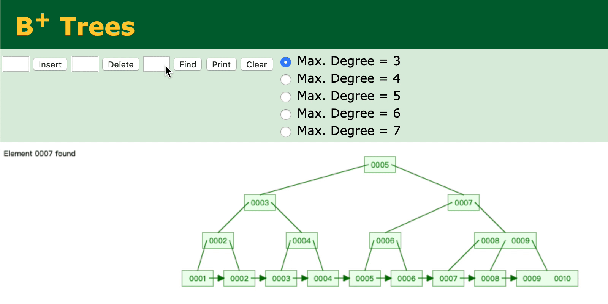
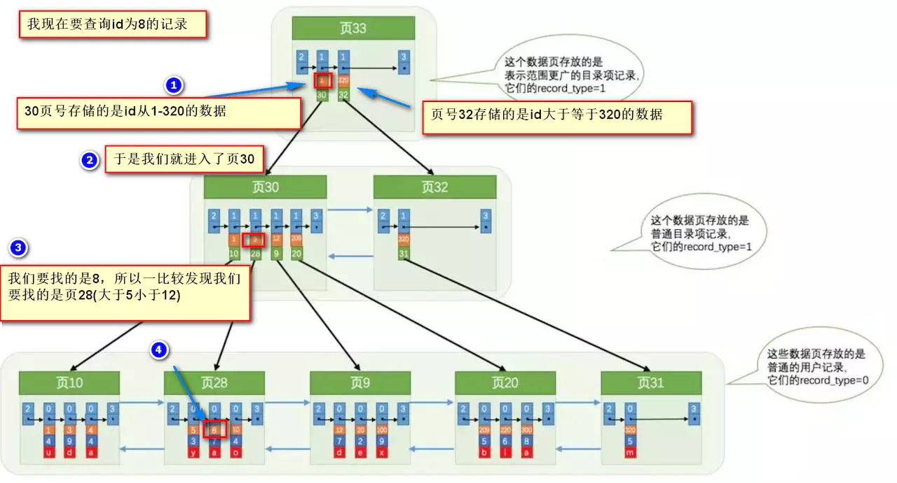
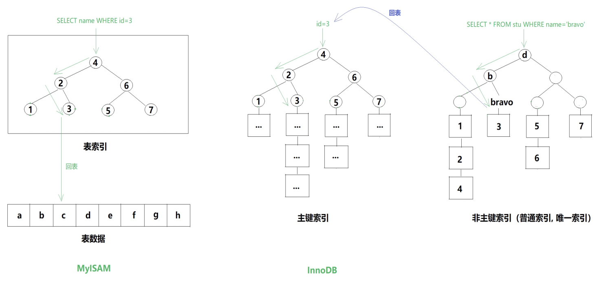

## 数据组织形式—线性结构到B+树的演变过程[^1]

文章中讲了线性结构➡二叉搜索树(BST)➡二叉平衡树(AVL)➡B树➡B+树的演变过程，我觉得这么多次的演变都是为了解决一件事情：

==数据都是存储在磁盘中的而非内存。这不是句废话，这涉及到读取数据需要磁盘IO，而磁盘IO是耗时耗资源操作。==

所以这这一串演变过程都是为了减少IO操作。

**线性结构**：这个就不多说了

**二叉搜索树**：这种方式其实已经很大程度上减少了IO，比如文章中提到，查找42亿条数据最多也只需要32次IO，相比线性结构已经很牛逼了，但是还是不够。而且二叉搜索树有一个很致命的问题是，它的**插入节点算法很简单粗暴**，使得它在实际使用过程中**树的层级**很深，极易退化成线性结构。

**二叉平衡树**：就是为了解决上面BST的问题，树的层级之差最多为1。但这个AVL只是解决了BST所带来的问题，可以把BST看作一个有毒性的解方案，而AVL只是为了解毒😂。但是朝着二叉树这个方向优化是没问题的。

**B树**：开始真正专注于减少磁盘IO了，方法是将二叉平衡树变为Ｎ阶，即Ｎ阶Ｂ树。N代表的是addr数，这样每个节点能够存的数据更多了，为N-1个。

> 这样组织的好处是，**每次加载一个节点时都可以从磁盘带出更多条数据，从而减少磁盘IO的次数。**

这种思路简单粗暴，但很有效。

**B+树**：我觉得上面几种方式最多算是在理论层面考虑数据库数据的组织形式，而B+树则更像是在基于上面的理论，结合MySQL、操作系统等环境，在工程上实现。

- 它加入了页的概念，MySQL中一页的大小为16k字节，于是让每个节点就是一页（挺妙的）
- 将二叉树划分为**叶子节点**和**非叶子节点**。在非叶子节点，每个节点只存一堆`主键-addr`的键值对形式，也就是只有记录数据的主键，而不存数据本身；在叶子节点，则存所有的数据

有了这种数据组织形式，我觉得最大的有点就是细化分工：非叶子节点就只负责索引、搜索，到了叶子节点就返回主键对应的数据，同时还可以来点范围搜索这种骚操作。

> 所谓的B+树，就是把原先B树中分散在各个节点的数据都“赶到”最底层的叶子节点，非叶子节点只存储主键-addr形式的数据

上面的B+图中addr的画法不准确，这种画法其实是B树的，而B+树是`主键-addr`形式。准确的应该是这样[^2]：

## 索引 Index[^3]

这篇文章主要讲的是一些基础知识，不需要太多理解力的，就像背单词一样的基本功，所以大部分内容按时复习就没多大问题。这里我准备强调几点觉得需要特别关注的地方。

**索引类型**：文中提到了四种基本索引类型，但没有把主键索引归进去，那么主键索引到底是什么国籍呢？文中的解释是，主键索引=唯一索引+普通索引，这是没问题的，但是我觉得还可以更进一步解释，是因为主键索引太重要，所以才拥有了名字，除此之外的都叫辅助索引。比如全文索引和唯一索引的搭配就没有名字是吧（我甚至不知道有没有这种搭配😒瞎编的）

**索引的数据结构**：说一说hash，不是因为它重要，而是因为它在B+树的阴影下显得那么不引人注目。我觉得它就像一个专才，快准狠精确定位能力，但为了实现这样一个牛逼的功能，舍弃了模糊搜索、范围查询等能力。

## 存储引擎

所以主键索引才是yyds，它配拥有名字。它牛逼的地方还在于，在InnoDB中采用的是聚簇索引，于是通过主键进行查询不需要**回表**（留意这个概念），因为：

> 对于InnoDB的**主键索引**而言，数据即索引，索引即数据。

而且除了主键索引外的，都叫做辅助索引，还可以成为二级索引，你听听这名字就知道是个打工的。这些辅助索引不管你怎么折腾，叶子节点都是主键，这一点决定了辅助索引们都是以主键索引为准的，而且查询时很大概率需要**回表**，除非实现了索引覆盖。

这里提到了回表的概念，我在文中有评论感觉还是把握住了要领，复习的时候去看看。

## 最左匹配原则[^4]

我没有把联合索引啥的作为标题，是因为我觉得还是最左匹配原则重要得多。多看看文中的例子就能理解最左匹配原则了，感觉还是很好理解的。

从文章中我学到了一个有效的sql命令来观察是否走了预期的索引：explain，是MySQL提供的专门用来分析SQL**执行计划**的

文章中也提到了一个很实际的情况：

> 但大家要认识到，实际开发索引覆盖可遇不可求，基本还是回表的情况多一些。

我学习索引覆盖的时候也注意到了这一点，因为我目前见到的开发都是`select * ...`，很少有只取部分字段的。

## 事务 Transaction

难点并不是设个概念本身，而是并发事务带来的问题。这和Java多线程的线程安全问题本质是一样的。为什么这么说？先来看看Java的线程安全问题的原因： 

- [x] 对象位于堆区，类的元数据（Class对象）位于方法区，这两个区域都是**线程共享**的，任何线程都可以随时访问，不用排队。

- [x] 修改一个数据（或说变量）的过程是：线程先**读取**、**拷贝**这个数据，然后**修改**这个拷贝的数据，再**覆盖**原有的数据。

这两点我认为是引发线程安全的关键因素，特别是第二点，看起来很废话，平时也没注意过，但恰恰是因为**==拷贝==**这个操作，使得它是造成丢失修改的根本原因（仅个人观点）。

对于并发事务的线程安全问题其实也一样，大同小异，只不过将操作单位从线程换成了事务。这么说感觉在数据库中事务是进行运算调度的最小单位，和线程在jvm中的地位一样。下面具体说说并发事务的线程安全问题：

并发事务同时访问的不是堆和方法区中的数据，而就只是表（粒度小点为行）。访问数据的过程和上边的也一样：读取➡拷贝➡修改➡覆盖。

**事务的隔离级别**：

❓有一个猜测：为什么MySQL默认的隔离级别是可重复读？可能是因为采用的存储引擎是InnoDB，而InnoDB默认是行锁，行锁是能够解决脏读、丢失修改、不可重复读的，因为这些问题都是**行级别**的问题。而幻读明显是**表级别**的问题了，会涉及多行。

我发现四种隔离级别的设计是基于**读锁**和**写锁**的：

对于行级：

事务A**写**：没加读锁—>脏读；加了读锁，没加写锁—> 丢失修改

事务A**读**：没加读锁—>不会有任何问题，其他事务也可以随时读；没加写锁—>不可重复读

对于表级：

幻读：应该是表级别事务A读取没加写锁造成的，暂时不详细讨论

[^1]:[SQL优化(2)：B+树与索引 · 语雀 (yuque.com)](https://www.yuque.com/books/share/2b434c74-ed3a-470e-b148-b4c94ba14535/uzty3n#dIGvE)
[^2]:[剖析面试最常见问题之MySQL － 小专栏 (xiaozhuanlan.com)](https://xiaozhuanlan.com/topic/4912306758#section-2)
[^3]: [SQL优化(3)：索引与优化原理(上) · 语雀 (yuque.com)](https://www.yuque.com/books/share/2b434c74-ed3a-470e-b148-b4c94ba14535/pr8k7o)
[^4]: [SQL优化(4)：索引与优化原理(下) · 语雀 (yuque.com)](https://www.yuque.com/books/share/2b434c74-ed3a-470e-b148-b4c94ba14535/zhd3d6#HaJmI)

