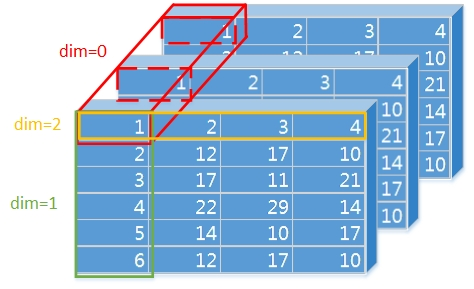

#### [pip国内源](https://blog.csdn.net/qq_30754565/article/details/82777253)

​		阿里云 http://mirrors.aliyun.com/pypi/simple/ 
  中国科技大学 https://pypi.mirrors.ustc.edu.cn/simple/ 
  豆瓣(douban) http://pypi.douban.com/simple/ 
  清华大学 https://pypi.tuna.tsinghua.edu.cn/simple/ 
  中国科学技术大学 http://pypi.mirrors.ustc.edu.cn/simple/

**临时使用：** 
可以在使用pip的时候在后面加上-i参数，指定pip源 
eg: pip install scrapy -i https://pypi.tuna.tsinghua.edu.cn/simple

#### conda和pip


[conda中重要的三个概念：环境、通道和包](https://www.cnblogs.com/dadream/p/10820379.html)

[python包管理工具：Conda和pip比较](https://www.jianshu.com/p/5601dab5c9e5)

[Conda 环境的正确使用姿势](https://blog.csdn.net/sigmarising/article/details/89446397)

> 至于你说的那个env的话，是anaconda的虚拟环境，就是你可以创建多个虚拟环境，各个虚拟环境之间的库是不共用的。anaconda的根目录是有一个Python的，如果你没有创建虚拟环境，就可以把库直接安装在该Python下。

`conda`有一个`base(root)`环境，但是自己创建的环境会在Anaconda/env/下

`conda`就是一个通用的包管理工具，和`pip`、`pip3`作用相似，也和`npm`作用相似，`maven`作用相似

`conda env list` 查看conda环境(*Environments*)列表

（清华源好像不咋滴:laughing:）


#### python学习的一些踩坑记录：

每过一段可能会删除一些，因为很有可能那个时候觉得这个点很简单了。

1. 在Python中，

   ```python
   False,0,'',[],{},()
   ```

   都可以视为假，则比如判断一个列表是否为空，可以

   ```python
   1 list_temp = []
   2 if list_temp:
   3     # 存在值即为真。这句话有点哲学感:joy:
   4 else:
   5     # list_temp是空的
   ```

4. python数据类型转换，感觉比Java中的直观得多：

   ```python
   a=10 str(a)   				int->string
   a='10' int(a) float(a)		string->int or float #好像3.0版本后就没有了long()？
   ```
   
   对比Java
   
   ```java
   int->String		i+""   or     String.ValueOf(i)
String->int		Integer.ParseInt(str)    
   ```

5. java切片

   ```python
   words="adedehny"
   words[0:2] -> ad
   words[3:6] ->deh
   ```
   
   words[m:n]**切片范围为[m,n)**，左闭右开。
   
4. [使用python中的pymysql模块](https://blog.csdn.net/kelanj/article/details/82792254)踩的坑

   ```sql
   sql = 'insert into interest_pic_tag(interest_tag,pic_tag) values ("%s","%s")'%(interest_tag, pic_tag)
   ```

   这里的`("%s","%s")`原来还要双引号，但是目前不知道为啥，:warning:需要过后查一下。

5. python无法导入自己的模块的解决办法

   参考文章：https://www.cnblogs.com/yibeimingyue/p/11367614.html，这个和Java很相似，需要标记**source目录**
   
6. ##### [python buildin 中的一些类或方法的内容都是pass？](https://blog.csdn.net/bocai_xiaodaidai/article/details/111870708)


#### `self`如何理解？

```python
class Test():
    def prt(self,args):
        print(args)
test = Test()  # 创建对象，相当于Java中的new Test();
# 以下两种方式等价
test.prt("hello")  #这种方式隐式传递test对象
Test.prt(test,'helloooo')  #这种方式更加接近本质，显示传递对象
```

- [self可以不写吗？](https://www.zhihu.com/question/39264541/answer/685673258)

  > 在python解释器内部，**当我们调用`t.prt()`时，实际上Python解释成`Test.prt(t)`**，也就是说把self替换成类的实例

- [对象与this](https://www.yuque.com/books/share/2b434c74-ed3a-470e-b148-b4c94ba14535/st08ml)

  这篇文章我觉得甚至有哲学深度！！！多看几遍！！！简单来说`self`在python中其实是**显示**传递的对象参数，而这个对象其实和java的对象一样，在**堆**中。文中也解释了为什么`static`方法不能调用对象方法，当然是因为没有传递`this`(或self)参数呀！


#### set()集合:python3新增数据结构

- https://www.runoob.com/python3/python3-set.html

  > 可以使用大括号 **{ }** 或者 **set()** 函数创建集合，注意：创建一个空集合必须用 **set()** 而不是 **{ }**，因为 **{ }** 是用来创建一个空字典。

可以这么理解，`{}`符号是被集合和字典公用的符号，具体是什么得看里边的内容，如果是元素则为集合，若为键值对则为字典。所以声明空集合的时候不能用`{}`，因为编辑器不知道你到底想申明的是集合还是字典，所以`{}`就用作字空典的申明了，而set()用作空集合的申明。


#### `with`如何理解？

参考：https://www.cnblogs.com/pythonbao/p/11211347.html

其实它的核心就是简化try, except, finally，将它的功能**封装**了一下，这算是一种模块化的思想。比如打开文件的操作`open('1.txt','r)`，是会有异常抛出的，而with...as这种方式将try，catch语句封装到了open语句之中。

具体的做法见链接，简单来说有两个方法，`__enter__()`和`__exit__()`，前一个相当于`try`，后一个如果有异常抛出相当于`except`。

#### 字符串前：r , u , b , f

- **r**    (**raw**)： 表示会去掉字符串中的转义字符"\\"所表示的特殊含义，即以字符串为

  ```
  "I am handsome \n , but you aren't"
  ```

  这里有换行，如果在前面加了r"I am ..."，那么出书就会是

  ```
  "I am handsome \n, but you aren't"
  ```

  也就是把转义字符也给输出了！

  > :star:由于正则表达式和 \ 会有冲突，因此，当一个字符串使用了正则表达式后，最好在前面加上’r’。

- **u** (**unicode**)：表面后面的以Unicode编码，一般用在中文字符前。其实这个真的很有用，一般中文乱码很难解决，主要原因是没有想到这个简单便捷的方式，以为需要做很麻烦的处理。

- **b** (**byte**)：后面的字符串为Byte类型。

  用处：网络编程中，服务器和浏览器只认bytes 类型数据。

  如：*send 函数的参数和 recv 函数的返回值都是 bytes 类型*

- **f** (**format**)：相当于

  ```python
  "hello {} is smart".format("dong")
  ```


#### type hints

参考：[python模块typing的作用](https://www.cnblogs.com/angelyan/p/11121859.html)

该博客说得很清楚了，但是 在阅读[Type Hints笔记](https://zhuanlan.zhihu.com/p/346415599)中我发现type hints其实还涉及了类似Java泛型，比如`List[str]`、`Union[str,int,float]`、`Tuple[int,...]`（注意这里的List等不同于`list`、`tuple`等，都是`typing`包中的，需要引入`typing`包）

#### 魔法方法

暂时不做系统的总结，因为还没有思路。但是不得不说应用场景太多了

#### 张量的`axis`参数🎈



这个图还是那么的经典，我发现只要涉及到张量，说小点矩阵的统计、数据特征，永远离不开`axis`参数。我在这里再次用我自己的话描述一下：以上图为例子，`axis=1`为将这一**列**的数值拿到一起进行运算，不管是`sum(axis=1)`,`mean(axis=1)`，都是将这一列的1,2,3,4,5,6数值作为输入，得到一个结果。


### todo list:

- **python上的正则化要学习，先调研	2021/4/16**

  
