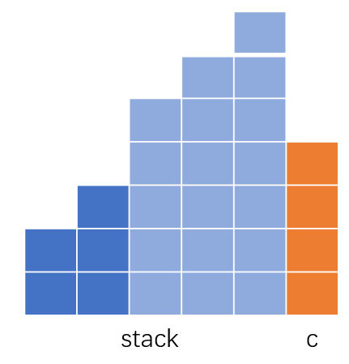

## ACM模式下的TIPS

常用头文件：

```c++
#include<bits/stdc++.h>//包含了几乎所有常用的
```

C++ struct构造器的使用：https://www.cnblogs.com/wlw-x/p/11566191.html

牛客网ACM模式的输入输出格式：https://www.cnblogs.com/Allen-rg/p/13922965.html

字符串的读写：https://www.cnblogs.com/gamesky/archive/2013/01/09/2852356.html

下边是个很常见的实例：

```c++
#include <iostream>
#include <sstream>   
using namespace std;  
int main()  
{  
    istringstream istr;  
    string line,str;  
    while (getline(cin,line))//从终端接收一行字符串，并放入字符串line中。默认是以'\n'分割
    {  
        istr.str(line);//把line中的字符串存入字符串流中
        while(istr >> str)//每次读取一个单词（以空格为界），存入str中   
        {
            cout<<str<<endl;  
        }  
    }  
    system("pause");  
    return 1;  
}
```

##### `getline()`的使用

非常强大的工具，我一般用它来进行字符串的分割，比如[1154. 一年中的第几天](https://leetcode-cn.com/problems/day-of-the-year/)这道题。用了都说好！

```c++
string s="1997-11-10";
istringstream iss(s);
string y,m,d,tmp;
getline(iss,y,'-');//精髓就是第三个参数，可以自定义分隔符
getline(iss,m,'-');
getline(iss,d,'-');
cout<<y<<endl<<m<<endl<<d<<endl;
```

##### 一些数字字母判断内置函数

```
islower(char c) 是否为小写字母
isupper(char c) 是否为大写字母
isdigit(char c) 是否为数字
isalpha(char c) 是否为字母
isalnum(char c) 是否为字母或者数字
toupper(char c) 字母小转大
tolower(char c) 字母大转小
```


## `<algorithm>`头文件

提供了很多很方便的api，怎么现在才知道。

#### `next_permutation()`函数

leetcode有一道实现这个函数的题目：[31. 下一个排列](https://leetcode-cn.com/problems/next-permutation/)。

也可参考文章：[Cpp--next_permutation函数](https://blog.csdn.net/samkieth/article/details/49976637)


#### 对`upper_bound`和`lower_bound`的理解

思考来源：[C++中的std::lower_bound()和std::upper_bound()函数](https://blog.csdn.net/albertsh/article/details/106976688)

看看`upper_bound`的文档

> An iterator pointing to the ==first== element greater than __val, or end() if no elements are greater than __val.

如何理解这个first？我做了个实验：

```cpp
vector<int> score{10,3,8,9,4};
auto lb = upper_bound(score.begin(), score.end(),10);
cout<<*lb<<endl;
```

其实我没看出啥规律，反正这两个函数得用在有序的序列上边。

> 首先说明这两个函数内部使用了二分查找，所以必须用在有序的区间上，满足有序的结构中有两个常见的面孔：std::map 和 std::set，他们本身就是有序的，所以提供了 std::map::lower_bound() 和 std::set::lower_bound() 这种类似的成员函数，但是原理都是一样的，我们可以弄明白一个，另外类似的函数就都清楚了。
>

## `priority_queue`

参考：[C++优先队列(priority_queue)用法详解](https://blog.csdn.net/weixin_36888577/article/details/79937886)

```cpp
priority_queue<Type, Container, Functional>    //定义
//分别表示数据类型、容器、比较方式。当需要用到自定义的Container或者Functional时才需要传入后面这两个参数
```

```cpp
// 大顶堆
priority_queue<int> a;//默认就是大顶堆
priority_queue<int, vector<int>, less<int> > a;//等价
//小顶堆
2) priority_queue<int, vector<int>, greater<int> > c;
```


很有意思的一点是，访问对头是`top`，而不是`front`。

[295. 数据流的中位数](https://leetcode-cn.com/problems/find-median-from-data-stream/)：==（待复习）==很喜欢的一道hard题！

[630. 课程表 III](https://leetcode-cn.com/problems/course-schedule-iii/)：有用到。我的题解：[【优先队列应用】630.课程表III](https://leetcode-cn.com/problems/course-schedule-iii/solution/you-xian-dui-lie-ying-yong-630ke-cheng-b-6g18/)

[1705. 吃苹果的最大数目](https://leetcode-cn.com/problems/maximum-number-of-eaten-apples/)：

[23. 合并K个升序链表](https://leetcode-cn.com/problems/merge-k-sorted-lists/)：==（待复习）==这道题还有一个难点是自定义这个pq的`Functional`参数

## `<numeric>`头文件==（待完善）==

[C++ STL算法系列3---求和：accumulate](https://www.cnblogs.com/heyonggang/p/3241878.html)

## `<string>`头文件==（待完善）==

[686. 重复叠加字符串匹配](https://leetcode-cn.com/problems/repeated-string-match/)：字符串“高级“操作，题目的不难，主要是学到了字符的操作`s.find(...)`的返回值，以及`string::npos`。我的题解：[686. 重复叠加字符串匹配](https://leetcode-cn.com/problems/repeated-string-match/solution/686-zhong-fu-die-jia-zi-fu-chuan-pi-pei-3jr4o/)。

[459. 重复的子字符串](https://leetcode-cn.com/problems/repeated-substring-pattern/)：也有用到`string::npos`。发现string的的find方法返回的并不像vector返回迭代器，而是int类型的下标。此外，这道题的技巧性也很强。

#### 数字⬅➡字符串转换

来自于`<string>`头文件。CPP里边没有`atoi()`方法，这个方法原来是C里边的，我现在才知道。

参考[【整理】C++ string转int，string转double，string转long，int转string，double转string…](https://blog.csdn.net/HiccupHiccup/article/details/62421032)，最常用的应该是`stoi`，相当于C的`atoi()`。


# 🚀🚀🚀🚀🚀🚀🚀🚀🚀🚀🚀🚀🚀

# 今日明星题目：[128. 最长连续序列](https://leetcode-cn.com/problems/longest-consecutive-sequence/)

为啥说这个是明星题目？因为这道题知道两个月过后才知道为啥错了。我获得的经验是，如果要访问你不知道有没有值的map的时候，请不要用`map.count(key)`，而用`map[item]==0`。因为`int x=map[item]`后，将会把本来没有的值变成有的了，即赋值为0。

好大的一个坑！！！

## 基本数据结构实现

[链表实现队列，LintCode 492 队列维护](https://www.lintcode.com/problem/492/solution)：有一个很细节的地方需要注意，解决内存泄漏，见我的题解：[链接](https://www.lintcode.com/problem/492/solution/55004)。


## 技巧性很强的题目

[134. 加油站](https://leetcode-cn.com/problems/gas-station/)

[470. 用 Rand7() 实现 Rand10()](https://leetcode-cn.com/problems/implement-rand10-using-rand7/)：类似的有[384. 打乱数组](https://leetcode-cn.com/problems/shuffle-an-array/)。

[189. 轮转数组](https://leetcode-cn.com/problems/rotate-array/)：需要掌握比较厉害的方法，这个[评论](https://leetcode-cn.com/problems/rotate-array/solution/xuan-zhuan-shu-zu-by-leetcode-solution-nipk/736761)很利于理解！

[709. 转换成小写字母](https://leetcode-cn.com/problems/to-lower-case/)：太巧妙了！参考这个评论和我的笔记：[链接](https://leetcode-cn.com/problems/to-lower-case/solution/gong-shui-san-xie-jian-dan-zi-fu-chuan-m-czpo/1278604)

[238. 除自身以外数组的乘积](https://leetcode-cn.com/problems/product-of-array-except-self/)：拒绝一切花里胡哨，查看题解：[乘积 = 当前数左边的乘积 * 当前数右边的乘积](https://leetcode-cn.com/problems/product-of-array-except-self/solution/cheng-ji-dang-qian-shu-zuo-bian-de-cheng-ji-dang-q/)。我的题解：[238. 除自身以外数组的乘积](https://leetcode-cn.com/problems/product-of-array-except-self/solution/238-chu-zi-shen-yi-wai-shu-zu-de-cheng-j-vwxq/)

[686. 重复叠加字符串匹配](https://leetcode-cn.com/problems/repeated-string-match/)：字符串“高级“操作，题目的不难，主要是学到了字符的操作`s.find(...)`的返回值，以及`string::npos`。我的题解：[686. 重复叠加字符串匹配](https://leetcode-cn.com/problems/repeated-string-match/solution/686-zhong-fu-die-jia-zi-fu-chuan-pi-pei-3jr4o/)

==（待复习）==[16. 最接近的三数之和](https://leetcode-cn.com/problems/3sum-closest/)

[6. Z 字形变换](https://leetcode-cn.com/problems/zigzag-conversion)：

[459. 重复的子字符串](https://leetcode-cn.com/problems/repeated-substring-pattern/)：有用到`string::npos`。发现string的的find方法返回的并不像vector返回迭代器，而是int类型的下标。此外，这道题的技巧性也很强。

## 润！润！润！

赞曰：**四年一润，百年==不==润，四百年再润**

[1154. 一年中的第几天](https://leetcode-cn.com/problems/day-of-the-year/)


## 一些小的算法主题

#### 括号匹配

[20. 有效的括号](https://leetcode-cn.com/problems/valid-parentheses/)：基础

[32. 最长有效括号](https://leetcode-cn.com/problems/longest-valid-parentheses/)：进阶 高难度。我的题解《[32.最长有效括号](https://leetcode-cn.com/problems/longest-valid-parentheses/solution/32zui-chang-you-xiao-gua-hao-by-dong6662-y38v/)》

#### 矩阵模拟

[54. 螺旋矩阵](https://leetcode-cn.com/problems/spiral-matrix/)：

[59. 螺旋矩阵 II](https://leetcode-cn.com/problems/spiral-matrix-ii/)：

==（待复习）==[48. 旋转图像](https://leetcode-cn.com/problems/rotate-image/)：这基本就是考记忆了。让我更好地理解了“镜像”，其实就是沿着垂直中线翻转。

#### 区间类问题（有坑！）

这篇文章有归纳：[秒懂力扣区间题目：重叠区间、合并区间、插入区间](https://mp.weixin.qq.com/s/ioUlNa4ZToCrun3qb4y4Ow)

[56. 合并区间](https://leetcode-cn.com/problems/merge-intervals/)：有坑❗❗❗这道题没有我想象的那么简单，有太多细节。总结一个细节，比如`while`里边要`j++`，那么得保证`j<intervals.size()`。

[220. 存在重复元素 III](https://leetcode-cn.com/problems/contains-duplicate-iii/)：好厉害的一道题，花了我两个小时。我的题解：[220.存在重复元素III【二分+滑动窗口解法】](https://leetcode-cn.com/problems/contains-duplicate-iii/solution/220cun-zai-zhong-fu-yuan-su-iiier-fen-hu-lekj/)


#### 计算器类问题

[150. 逆波兰表达式求值](https://leetcode-cn.com/problems/evaluate-reverse-polish-notation/)：这是比较简单的玩法，比较基础。[题解](https://leetcode-cn.com/problems/evaluate-reverse-polish-notation/solution/150ni-bo-lan-biao-da-shi-by-dong6662-7lz7/)

[227. 基本计算器 II](https://leetcode-cn.com/problems/basic-calculator-ii/)：这也是单调栈的综合应用题，看看[我的评论](https://leetcode-cn.com/problems/basic-calculator-ii/solution/ji-ben-ji-suan-qi-ii-shuang-zhan-chao-xi-s2ha/1320864)，里边有对一个坑非常重要的理解！“保证了同级运算中**从左到右**的顺序”，如何保证？关键在一个地方需要取等。

[224. 基本计算器](https://leetcode-cn.com/problems/basic-calculator/)：

#### 摩尔投票

[169. 多数元素](https://leetcode-cn.com/problems/majority-element/)

#### 🎈前缀和

[560. 和为 K 的子数组](https://leetcode-cn.com/problems/subarray-sum-equals-k/)：我的题解：[【前缀和+哈希】560.和为k的子数组](https://leetcode-cn.com/problems/subarray-sum-equals-k/solution/qian-zhui-he-ha-xi-560he-wei-kde-zi-shu-2av6n/)。

[437. 路径总和 III](https://leetcode-cn.com/problems/path-sum-iii/)：同时归类到下边的“二叉树回溯”专题中。我的题解：[【前缀和+回溯】437.路径总和III](https://leetcode-cn.com/problems/path-sum-iii/solution/qian-zhui-he-hui-su-437lu-jing-zong-he-i-dc4o/)。

[128. 最长连续序列](https://leetcode-cn.com/problems/longest-consecutive-sequence/)：不是存粹的前缀和问题，但是思路有些类似。

有一个问题从来没认真想过：[解释一下关于hash[0]=1,以及为什么ans+=hash[pre-k]不会出现重复加的情况](https://leetcode-cn.com/problems/QTMn0o/solution/jie-shi-yi-xia-guan-yu-hash01yi-ji-wei-s-u5pq/)

#### *Knuth*洗牌算法

==**（待复习）**==[384. 打乱数组](https://leetcode-cn.com/problems/shuffle-an-array/)：就这一个题


## 数字出现次数

#### 重复数字问题三部曲

我的题解：《[重复数字系列问题](https://leetcode-cn.com/problems/find-all-numbers-disappeared-in-an-array/solution/zhong-fu-shu-zi-xi-lie-wen-ti-by-dong666-2j1z/)》，同时牛客的[这道题](https://www.nowcoder.com/test/question/28baab513c8845de95b02e75043c0da9?pid=30545684&tid=49978725)需要总结一下，什么时候取等号。下边三部曲登场：

[287. 寻找重复数](https://leetcode-cn.com/problems/find-the-duplicate-number/)：

[442. 数组中重复的数据](https://leetcode-cn.com/problems/find-all-duplicates-in-an-array/)：

[448. 找到所有数组中消失的数字](https://leetcode-cn.com/problems/find-all-numbers-disappeared-in-an-array/)：

#### 只出现一次的数字三部曲

参考的题解：[【题以类解】位运算，一文带你刷五道「只出现一次的数字」，效果好！！](https://leetcode-cn.com/problems/single-number-ii/solution/ti-yi-lei-jie-wei-yun-suan-yi-wen-dai-ni-50dc/)。这类题非常巧妙，目前觉得不是啥通用方法，需要市场复习。

[136. 只出现一次的数字](https://leetcode-cn.com/problems/single-number/)：

[137. 只出现一次的数字 II](https://leetcode-cn.com/problems/single-number-ii/)：

[260. 只出现一次的数字 III](https://leetcode-cn.com/problems/single-number-iii/)：前两个思路的结合。


## 排序类问题（待归类）
快速排序问题更优解法：https://www.hello-algo.com/chapter_sorting/quick_sort/ 

基本问题：[912. 排序数组](https://leetcode-cn.com/problems/sort-an-array/)，靶场。我的题解：[【快速排序复习】912.排序数组](https://leetcode-cn.com/problems/sort-an-array/solution/kuai-su-pai-xu-fu-xi-912pai-xu-shu-zu-by-s14x/)。

> 1. **终止条件：** 当 l ≥*r* 时，代表子数组长度为 1 ，此时终止划分；

[75. 颜色分类](https://leetcode-cn.com/problems/sort-colors/)：🎈🎈🎈这是一到非常好的快排应用题。理解这道题，才能更好地理解快排！

[剑指 Offer 51. 数组中的逆序对](https://leetcode-cn.com/problems/shu-zu-zhong-de-ni-xu-dui-lcof/)：归并应用题

[148. 排序链表](https://leetcode-cn.com/problems/sort-list/)：用到了归并排序，这是对排序的应用。

[378. 有序矩阵中第 K 小的元素](https://leetcode-cn.com/problems/kth-smallest-element-in-a-sorted-matrix/)：==**（待复习！）**==这是一个比较不错的练习题，我参考的题解中用到了归并排序的思想来写。

| 时间复杂度 | 空间复杂度 |                                             |
| ---------- | ---------- | ------------------------------------------- |
| 归并排序   | O(NlogN)   | O(N)，需要额外O(N)空间的tmp数组             |
| 快速排序   | O(NlogN)   | 最坏O(N)，最优O(logN)，函数递归调用的栈空间 |
| 插入排序   | O(N^2^)    | O(1)                                        |


[220. 存在重复元素 III](https://leetcode-cn.com/problems/contains-duplicate-iii/)：🚀这道题也归纳在区间内问题中。好厉害的一道题，花了我两个小时。我的题解：[220.存在重复元素III【二分+滑动窗口解法】](https://leetcode-cn.com/problems/contains-duplicate-iii/solution/220cun-zai-zhong-fu-yuan-su-iiier-fen-hu-lekj/)

[581. 最短无序连续子数组](https://leetcode-cn.com/problems/shortest-unsorted-continuous-subarray/)：

[414. 第三大的数](https://leetcode-cn.com/problems/third-maximum-number/)：这是一道简单题，但为啥要要列出来，是因为给了我一个很好的思考角度。见我的题解：[414.第三大的数](https://leetcode-cn.com/problems/third-maximum-number/solution/414di-san-da-de-shu-by-dong6662-qrnd/)。

### 多路归并专题

[LintCode：486 · 合并k个排序数组](https://www.lintcode.com/problem/486/)：[题解一](https://www.lintcode.com/problem/486/solution/54641)，标准的多路归并做法；[题解二](https://www.lintcode.com/problem/486/solution/54642)，转换成二路归并，这种效率是最高的。

[23. 合并K个升序链表](https://leetcode-cn.com/problems/merge-k-sorted-lists/)：题解：[【多路归并】23. 合并K个升序链表](https://leetcode-cn.com/problems/merge-k-sorted-lists/solution/duo-lu-gui-bing-by-dong6662-yx8l/)，也可以用堆来写，但有些取巧。

### 桶排序

[线性排序 O(n) 排序优化](https://zdkswd.github.io/2019/05/07/%E7%BA%BF%E6%80%A7%E6%8E%92%E5%BA%8F%20O(n)%20%20%E6%8E%92%E5%BA%8F%E4%BC%98%E5%8C%96/)

本质上是利用桶天然的顺序，但是这个条件太苛刻了，桶的划分很需要智慧，要让元素均匀地分配到各个桶内，这还要求元素的数据范围小，极端一点数据范围是0到`INT_MAX`，就很麻烦。

计数排序其实就是桶排序的特殊情况，数据范围小，如最大值为k，**则直接分为k个桶**！

### 面试经典问题

###### 1. 外部排序

多路归并是个好方法：[一眨眼的功夫了解什么是外部排序算法](http://data.biancheng.net/view/76.html)，题目：[LintCode：486 · 合并k个排序数组](https://www.lintcode.com/problem/486/)

桶排序也可，*理论* 上是最快的（加下边）

###### 2. 稳定的排序

[快速排序（QuickSort）的稳定性分析](https://sites.google.com/site/victorwebcollection/blog/posttitle)

网上看了很多的例子，这个例子最有说服力，因为例子中要有**至少三个相同的数**才能体现快排的不稳定性。得出的结论也很精辟：基准值的选取。


## TopK问题

这是一个面试非常非常爱问的问题，问的点是有多少种解法。原题：[剑指 Offer 40. 最小的k个数](https://leetcode-cn.com/problems/zui-xiao-de-kge-shu-lcof/)

下边是4种解法：

1. 基本的是排序，不管用快排还说堆排都可，时间复杂度都是O(nlogn)。快排的时间复杂度为O(nlogn)到O(n)。
2. 堆。时间复杂度虽然和上边相同，但是空间复杂度只有O(k)了。
3. **[快速选择](http://www.noteanddata.com/classic-algorithm-quick-select.html)**，快排的变体。这是最最高效的，时间复杂度只有O(n)，因为每次partition完毕后，会丢掉另一半，空间复杂度也只有O(1)。
3. 多路归并：也是一种常见的外部排序。lintcode：[486 · 合并k个排序数组](https://www.lintcode.com/problem/486/)


## 并查集

教程：[UnionFind算法详解](https://github.com/labuladong/fucking-algorithm/blob/master/%E7%AE%97%E6%B3%95%E6%80%9D%E7%BB%B4%E7%B3%BB%E5%88%97/UnionFind%E7%AE%97%E6%B3%95%E8%AF%A6%E8%A7%A3.md)。

这篇并查集的题解：[通俗讲解并查集，帮助小白快速理解](https://leetcode-cn.com/problems/redundant-connection/solution/tong-su-jiang-jie-bing-cha-ji-bang-zhu-xiao-bai-ku/)的证明部分，讲到了一个细节，就是这是一个无向图，于是给到的集合里边不会出现[1,2]、[2,1]这样的边。

下边是比较经典的题目：

[547 省份数量](https://leetcode-cn.com/problems/number-of-provinces/)：

[128. 最长连续序列](https://leetcode-cn.com/problems/longest-consecutive-sequence/)：万万没想到！tql！非常好的并查集应用题。

## 数学题

基本思想：（1）快速乘法和快速幂算法，[快速乘法/幂 算法详解](https://blog.csdn.net/maxichu/article/details/45459715)，（2）竖式计算，[【宫水三叶】模拟竖式计算（除法）](https://leetcode-cn.com/problems/fraction-to-recurring-decimal/solution/gong-shui-san-xie-mo-ni-shu-shi-ji-suan-kq8c4/)

SSR题解：[【宫水三叶】二分 + 倍增乘法解法（含模板）](https://leetcode-cn.com/problems/divide-two-integers/solution/shua-chuan-lc-er-fen-bei-zeng-cheng-fa-j-m73b/)。

这类问题的二分法我感觉基本都是用的==**`mid=l+r+1 >> 1`**==，而`mid=l+r >> 1`基本都是错的。

#### 模拟基本运算：

**==（待复习）==**[29. 两数相除](https://leetcode-cn.com/problems/divide-two-integers/)：乘法。非常喜欢的一道题，同时涉及了**快速乘法**和二分

[166. 分数到小数](https://leetcode-cn.com/problems/fraction-to-recurring-decimal/)：🎈除法，模拟**竖式计算**。这道题居然还不是困难，我觉得难得一批。

[69. Sqrt(x)](https://leetcode-cn.com/problems/sqrtx/)：提供了处理溢出的两个技巧

[50. Pow(x, n)](https://leetcode-cn.com/problems/powx-n/)：快速幂

练习题：

[445. 两数相加 II](https://leetcode-cn.com/problems/add-two-numbers-ii/)

#### 竖式计算

[166. 分数到小数](https://leetcode-cn.com/problems/fraction-to-recurring-decimal/)：🎈除法，模拟**竖式计算**。这道题居然还不是困难，我觉得难得一批

[415. 字符串相加](https://leetcode-cn.com/problems/add-strings/)：感觉这就是python进行科学计算的方式

==（还没做）==[43. 字符串相乘](https://leetcode-cn.com/problems/multiply-strings/)：

[67. 二进制求和](https://leetcode-cn.com/problems/add-binary/)：

**练习题：**

[441. 排列硬币](https://leetcode-cn.com/problems/arranging-coins/)：涉及二分

[372. 超级次方](https://leetcode-cn.com/problems/super-pow/)：快速幂+递归，同时也有对溢出的处理

==**（待复习）**==[231. 2 的幂](https://leetcode-cn.com/problems/power-of-two/)：很刁钻的角度！而且还有转换为log的角度，这也是一个比较常见的思路。我似乎之前在哪里见到过。

[43. 字符串相乘](https://leetcode-cn.com/problems/multiply-strings/)

#### 奇怪的知识又增加了

[202. 快乐数](https://leetcode-cn.com/problems/happy-number/)：万万没想到哈，参考：[快乐的知识点增加了](https://leetcode-cn.com/problems/happy-number/solution/kuai-le-de-zhi-shi-dian-zeng-jia-liao-by-sweetiee/)

[剑指 Offer 62. 圆圈中最后剩下的数字](https://leetcode-cn.com/problems/yuan-quan-zhong-zui-hou-sheng-xia-de-shu-zi-lcof/)：约瑟夫环。我的题解《[约瑟夫环【迭代和递归解法】](https://leetcode-cn.com/problems/yuan-quan-zhong-zui-hou-sheng-xia-de-shu-zi-lcof/solution/xie-xing-de-yue-se-fu-huan-by-vector-37/)》


###### 待解决的问题：如何防止溢出？

这类问题，通常测试用例中会有溢出的情况，如何解决这个问题？

首先能够想到的是“暴力”，即变量声明为`long`。这是绝杀方法，解决一切溢出。

其次，题解[69. Sqrt(x)-二分查找（Java）](https://leetcode-cn.com/problems/sqrtx/solution/er-fen-cha-zhao-niu-dun-fa-python-dai-ma-by-liweiw/)涉及的两种处理技巧需要掌握：1. `int mid=l+(r-l+1)/2`，将加法改成减法；2. `mid=x/mid`，将乘法改成除法。


## 位运算

首先要知道，无符号右移和有符号右移，但是在c++里边没有>>>，好气。

[191. 位1的个数](https://leetcode-cn.com/problems/number-of-1-bits/)，官方题解上边有两种方法，都要学会，第一种比较具有普适性，第二种技巧性比较强。

[461. 汉明距离](https://leetcode-cn.com/problems/hamming-distance/)，classical

[36. 有效的数独](https://leetcode-cn.com/problems/valid-sudoku/)：没想到吧，可以用位运算来做

[268. 丢失的数字](https://leetcode-cn.com/problems/missing-number/)：很难想啊！这让我总结除了一个异或运算的思考方向，**凑出一对相同的数字**，这样就可以抵消了。

下面这两道题有一个通用的解法，那就是：log，很骚：

==**（待复习）**==[371. 两整数之和](https://leetcode-cn.com/problems/sum-of-two-integers/)：真tm的有意思，别看这个题目简单，但是还是很有思维难度的。

==**（待复习）**==[231. 2 的幂](https://leetcode-cn.com/problems/power-of-two/)：很刁钻的角度！而且还有转换为log的角度，这也是一个比较常见的思路。我似乎之前在哪里见到过。

==（待复习）==[89. 格雷编码](https://leetcode-cn.com/problems/gray-code/)：关键看懂题解：[Gray Code （镜像反射法，图解）](https://leetcode-cn.com/problems/gray-code/solution/gray-code-jing-xiang-fan-she-fa-by-jyd/)，上边的图画得很直观。

## 单调栈和单调队列

单减/增栈的表达式：`st.top()>c` or `st.top()<c`，到底哪个表示单减，哪个单增？这个问题在编码的时候老是会卡一下，我现在总结了一个结论：**单减栈，pop掉所有小于c的；单增栈，pop掉所有大于c的**。队列也同样适用。

比如，如果下图要构造一个单增栈，那浅蓝色部分就是要pop的部分。



#### 单调栈

这个是目前看到最好的题解：[「手画图解」单调递增栈，为什么？何时用？| 402.移掉K位数字](https://leetcode-cn.com/problems/remove-k-digits/solution/wei-tu-jie-dan-diao-zhan-dai-ma-jing-jian-402-yi-d/)

可能会用到一个数据结构：[C++ STL deque使用详解](https://www.cnblogs.com/linuxAndMcu/p/10260124.html)。这个数据结构非常适合用在这类问题上，优于`stack`，因为方法丰富。

###### 两个BOSS级题目：（都是非常顶的hard）==（待完成）==

[42. 接雨水](https://leetcode-cn.com/problems/trapping-rain-water/)：大boss。我的题解：[【单调栈】42.接雨水](https://leetcode-cn.com/problems/trapping-rain-water/solution/dan-diao-zhan-42jie-yu-shui-by-dong6662-f09x/)

[84. 柱状图中最大的矩形](https://leetcode-cn.com/problems/largest-rectangle-in-histogram/)：==（待复习）==

题目收集

[[编程题]逛街](https://www.nowcoder.com/questionTerminal/35fac8d69f314e958a150c141894ef6a)：腾讯考过，比较巧妙地使用单调栈。注意为啥pop的条件要取等号？和`nums[i]`相等还是会被挡住！看不见的。

[739. 每日温度](https://leetcode-cn.com/problems/daily-temperatures/)：我的启蒙题目，也是非常标准的单调栈题目。我的题解《[【单调栈】739.每日温度](https://leetcode-cn.com/problems/daily-temperatures/solution/dan-diao-zhan-739mei-ri-wen-du-by-dong66-owot/)》。

==待复习==[227. 基本计算器 II](https://leetcode-cn.com/problems/basic-calculator-ii/)：**这是单调栈的综合应用题**，很棒的一道题，做完有一种很畅快的感觉

[402. 移掉 K 位数字](https://leetcode-cn.com/problems/remove-k-digits/)：这是我的题解《[【双顶队列方便些】402.移掉K位数字](https://leetcode-cn.com/problems/remove-k-digits/solution/402yi-diao-kwei-shu-zi-by-dong6662-n95y/)》。

[316. 去除重复字母](https://leetcode-cn.com/problems/remove-duplicate-letters/)：精英怪，华为笔试遇到类似的。我的题解《[316.去除重复字母](https://leetcode-cn.com/problems/remove-duplicate-letters/solution/316qu-chu-zhong-fu-zi-mu-by-dong6662-56oy/)》。


#### 单调队列

[239. 滑动窗口最大值](https://leetcode-cn.com/problems/sliding-window-maximum/)：好家伙，一来就是hard。这是我的题解：[239.滑动窗口最大值](https://leetcode-cn.com/problems/sliding-window-maximum/solution/239hua-dong-chuang-kou-zui-da-zhi-by-don-lome/)。

#### 优先队列==（待总结）==

可以先看看最前边的`priority_queue`

[1705. 吃苹果的最大数目](https://leetcode-cn.com/problems/maximum-number-of-eaten-apples/)==（待复习）==

[630. 课程表 III](https://leetcode-cn.com/problems/course-schedule-iii/)：有用到。我的题解：[【优先队列应用】630.课程表III](https://leetcode-cn.com/problems/course-schedule-iii/solution/you-xian-dui-lie-ying-yong-630ke-cheng-b-6g18/)

## 动态规划

#### 不同路径系列

[62. 不同路径](https://leetcode-cn.com/problems/unique-paths/)

[63. 不同路径 II](https://leetcode-cn.com/problems/unique-paths-ii/)

#### 典型问题

[213. 打家劫舍 II](https://leetcode-cn.com/problems/house-robber-ii)

[322. 零钱兑换](https://leetcode-cn.com/problems/coin-change)（最近踩到一个大坑，注意多踩几次，这样就不会忘了）

[152. 乘积最大子数组](https://leetcode-cn.com/problems/maximum-product-subarray/)和[53. 最大子数组和](https://leetcode-cn.com/problems/maximum-subarray/)：==**（待复习）**==说实话我还不是很理解。


#### 股票买卖三部曲

[121. 买卖股票的最佳时机](https://leetcode-cn.com/problems/best-time-to-buy-and-sell-stock)

[122. 买卖股票的最佳时机 II](https://leetcode-cn.com/problems/best-time-to-buy-and-sell-stock-ii)：[【股票问题三部曲II】122.买卖股票的最佳时机II](https://leetcode-cn.com/problems/best-time-to-buy-and-sell-stock-ii/solution/122mai-mai-gu-piao-de-zui-jia-shi-ji-ii-49mpe/)

[309. 最佳买卖股票时机含**冷冻期**](https://leetcode-cn.com/problems/best-time-to-buy-and-sell-stock-with-cooldown/)：我的题解：[【股票问题三部曲III】309. 最佳买卖股票时机含冷冻期](https://leetcode-cn.com/problems/best-time-to-buy-and-sell-stock-with-cooldown/solution/gu-piao-wen-ti-san-bu-qu-iii-309-zui-jia-gj5u/)


#### 子序列/数组问题

[1143. 最长公共子序列](https://leetcode-cn.com/problems/longest-common-subsequence/)：类似：[97. 交错字符串](https://leetcode-cn.com/problems/interleaving-string/)。注意看我本题的笔记，==找个时间写个题解==。

[72. 编辑距离](https://leetcode-cn.com/problems/edit-distance/)：==（未完成）==

[97. 交错字符串](https://leetcode-cn.com/problems/interleaving-string/)：


[300. 最长递增子序列](https://leetcode-cn.com/problems/longest-increasing-subsequence/)

[516. 最长回文子序列](https://leetcode-cn.com/problems/longest-palindromic-subsequence/)

[53. 最大子数组和](https://leetcode-cn.com/problems/maximum-subarray/)：尝试了一下前缀和，但会超时

[152. 乘积最大子数组](https://leetcode-cn.com/problems/maximum-product-subarray/)：==（待复习）==

#### 练习题

[91. 解码方法](https://leetcode-cn.com/problems/decode-ways/)：好难的一道题，花了很多时间来理解！里边有前导零技巧

[139. 单词拆分](https://leetcode-cn.com/problems/word-break/)：我现在才发现，这道题和零钱兑换、最长递增子序列是tm一样的啊！

[931. 下降路径最小和](https://leetcode-cn.com/problems/minimum-falling-path-sum/)：比较常规的练习题，有初始化、递推表达式分情况。

==**（待复习）**==[238. 除自身以外数组的乘积](https://leetcode-cn.com/problems/product-of-array-except-self/)：

[96. 不同的二叉搜索树](https://leetcode-cn.com/problems/unique-binary-search-trees/)：卡特兰数，主要得理解并记住那个公式。

[487. 最大连续1的个数 II](https://leetcode-cn.com/problems/max-consecutive-ones-ii/)：既可以滑动窗口，也可以动态规划。

[120. 三角形最小路径和](https://leetcode-cn.com/problems/triangle/)：这道题真的很需要逆向思维


## 二叉树和链表

这里有一个重要暴论：三种二叉树的遍历方式，如后续遍历，先递归在处理本节点，那么在处理本节点的时候是在其左右子树都访问过了的情况下，也就是说可以获得其左右子树的信息，体现为递归返回值。而中序遍历只能得到左或有子树的信息（递归返回值），先序遍历都得不到。

### 迭代法遍历二叉树

好的题解：[【金刀】递归+迭代了解惰性思想](https://leetcode-cn.com/problems/binary-search-tree-iterator/solution/jin-dao-di-gui-die-dai-liao-jie-duo-xing-6kp9/)。迭代法遍历二叉树需要学习一下，因为有相关题目。

[173. 二叉搜索树迭代器](https://leetcode-cn.com/problems/binary-search-tree-iterator/)：

==（未完成）==[145. 二叉树的后序遍历](https://leetcode-cn.com/problems/binary-tree-postorder-traversal/)：用迭代法解一下，参考题解：[📖【金刀】二叉树后序遍历: 递归+迭代通用解法](https://leetcode-cn.com/problems/binary-tree-postorder-traversal/solution/jin-dao-er-cha-shu-hou-xu-bian-li-di-gui-2u8q/)。

### 二叉树路径三部曲==（待完成）==

[112. 路径总和](https://leetcode-cn.com/problems/path-sum/)：

[113. 路径总和 II](https://leetcode-cn.com/problems/path-sum-ii/)：

[437. 路径总和 III](https://leetcode-cn.com/problems/path-sum-iii/)：这也是一道前缀和问题，我的题解：《[【前缀和+回溯】437.路径总和III](https://leetcode-cn.com/problems/path-sum-iii/solution/qian-zhui-he-hui-su-437lu-jing-zong-he-i-dc4o/)》

总的题解：[【前缀和+回溯】437.路径总和III](https://leetcode-cn.com/problems/path-sum-iii/solution/qian-zhui-he-hui-su-437lu-jing-zong-he-i-dc4o/)

很好的训练二叉树回溯，首先来道阐述DFS的简单开胃菜：[257. 二叉树的所有路径](https://leetcode-cn.com/problems/binary-tree-paths/)。

一些思路的总结：首先不管是不是用dfs，本质上都是递归遍历二叉树，因此首要的是明确这类问题是用的那一种遍历？很明显，是先序遍历，there is no doubt。于是，递归调用是在最后边，于是方法可以分为三个部分：

```c++
void recur(){
    //返回条件
    //本节点处理
    //递归调用
}
```

任何的递归调用都是这样三个部分，只是“本节点调用”和“递归调用”的处理顺序不同而已！

然后的明确回溯的目标，这个我还没想清楚。


### 重要的二叉树、链表递归问题

[236. 二叉树的最近公共祖先](https://leetcode-cn.com/problems/lowest-common-ancestor-of-a-binary-tree/)：我这道题：[285. 二叉搜索树中的中序后继](https://leetcode-cn.com/problems/inorder-successor-in-bst/)的做法，就参考了这个题的思路！

[285. 二叉搜索树中的中序后继](https://leetcode-cn.com/problems/inorder-successor-in-bst/)：我的题解：[【中序遍历】285.二叉搜索树的中序后继](https://leetcode-cn.com/problems/inorder-successor-in-bst/solution/zhong-xu-bian-li-285er-cha-sou-suo-shu-d-z9y1/)。

[450 删除二叉搜索树中的节点](https://leetcode-cn.com/problems/delete-node-in-a-bst/)：我的题解：《[450.删除二叉搜索树中的节点（踩坑记录）](https://leetcode-cn.com/problems/delete-node-in-a-bst/solution/450shan-chu-er-cha-sou-suo-shu-zhong-de-s2j6h/)》

[206. 反转链表](https://leetcode-cn.com/problems/reverse-linked-list/)

[21. 合并两个有序链表](https://leetcode-cn.com/problems/merge-two-sorted-lists/)：

下边两道题我觉得很像，基本框架是二叉树的后续遍历：

[124. 二叉树中的最大路径和](https://leetcode-cn.com/problems/binary-tree-maximum-path-sum/)，这道题有点难了。我的题解：[【后续遍历】124.二叉树中的最大路径和](https://leetcode-cn.com/problems/binary-tree-maximum-path-sum/solution/hou-xu-bian-li-124er-cha-shu-zhong-de-zu-bteu/)

[543. 二叉树的直径](https://leetcode-cn.com/problems/diameter-of-binary-tree/)：这个要简单些，有个很细节得地方需要注意。

[138. 复制带随机指针的链表](https://leetcode-cn.com/problems/copy-list-with-random-pointer/)：需要一点巧妙的技巧。

### 反转链表三部曲

两个基本问题：`reverse`，反转整个链表，和`reverseN`，反转前n个。在这两个问题的基础上才能开展进阶。

[206. 反转链表](https://leetcode-cn.com/problems/reverse-linked-list)：基础。==这道题是无价的！！！！！！==

==**（待复习）**==[92. 反转链表 II](https://leetcode-cn.com/problems/reverse-linked-list-ii)：进阶

==**（待复习）**==[25. K 个一组翻转链表](https://leetcode-cn.com/problems/reverse-nodes-in-k-group/)：精英怪

### 二叉树遍历经典题目

别小看二叉树的遍历，我从买了《算法小抄》那本书到现在应该有一年了吧，我到现在才有点搞清楚这几种遍历的细节问题。下边是比较有启发性的题目。

自从好好思考了这两道题，我才知道二叉树的遍历这么强大。

[114. 二叉树展开为链表](https://leetcode-cn.com/problems/flatten-binary-tree-to-linked-list/)

好有收获的一道题，至少让我搞明白了后序遍历，如我的代码里边写的，先遍历右子树，再遍历左子树，最后轮到节点自己。

[538. 把二叉搜索树转换为累加树](https://leetcode-cn.com/problems/convert-bst-to-greater-tree/)

这是一道中序遍历题，这也是为什么二叉搜索树按照中序遍历能够得到顺序的排列。如同我的代码，先遍历右子树，再自己，最后左子树。

看这两道题我在这里的遍历描述，我觉得可以作为这类问题的思考范式。想要怎么遍历时，就像上面一样想一下，大概就知道做法了。

类似的题目有:[285. 二叉搜索树中的中序后继](https://leetcode-cn.com/problems/inorder-successor-in-bst/)，我的题解：[【中序遍历】285.二叉搜索树的中序后继](https://leetcode-cn.com/problems/inorder-successor-in-bst/solution/zhong-xu-bian-li-285er-cha-sou-suo-shu-d-z9y1/)。这个解法我比较满意。


### 构造二叉树==（待复习）==

###### 数组/链表转换为二叉树

这两道题的确有点思维上的要求，同时我觉得学会数组转换为链表，另一方面是笔试ACM模式下可能会有自己构造链表的情况，所以需要学会下边的题目。

[108 将**有序**数组转换为二叉搜索树](https://leetcode-cn.com/problems/convert-sorted-array-to-binary-search-tree/)

[109 **有序**链表转换二叉搜索树](https://leetcode-cn.com/problems/convert-sorted-list-to-binary-search-tree/)

[剑指 Offer 33. 二叉搜索树的后序遍历序列](https://leetcode-cn.com/problems/er-cha-sou-suo-shu-de-hou-xu-bian-li-xu-lie-lcof/)：非常考察思维的一道题！好题！

###### 前中后序遍历构造二叉树

[105. 从前序与中序遍历序列构造二叉树](https://leetcode-cn.com/problems/construct-binary-tree-from-preorder-and-inorder-traversal/)

==（未完成）==[106. 从中序与后序遍历序列构造二叉树](https://leetcode-cn.com/problems/construct-binary-tree-from-inorder-and-postorder-traversal)

###### 序列化与反序列化

[297. 二叉树的序列化与反序列化](https://leetcode-cn.com/problems/serialize-and-deserialize-binary-tree/)：用c++写，但是测试用例49/52，超时了

==（未完成）==[428. 序列化和反序列化 N 叉树](https://leetcode-cn.com/problems/serialize-and-deserialize-n-ary-tree/)：微软考了两次


### 练习题目

[328. 奇偶链表](https://leetcode-cn.com/problems/odd-even-linked-list/)：我觉得我的这个版本好理解些。

==（待复习）==[98. 验证二叉搜索树](https://leetcode-cn.com/problems/validate-binary-search-tree/)：复习了一下，有了新的理解，很有意思！我的题解：[【先序遍历】98.验证二叉搜索树](https://leetcode-cn.com/problems/validate-binary-search-tree/solution/xian-xu-bian-li-98yan-zheng-er-cha-sou-s-s7uq/)

[JZ8 二叉树的下一个结点](https://www.nowcoder.com/practice/9023a0c988684a53960365b889ceaf5e)

[285. 二叉搜索树中的中序后继](https://leetcode-cn.com/problems/inorder-successor-in-bst/)：优雅的解法


## 滑动窗口

这类题不是我想象的那么简单，细节问题太多了，我才10天没做又不知怎么写了。

什么时候收缩窗口？

基础三连：[3. 无重复字符的最长子串](https://leetcode-cn.com/problems/longest-substring-without-repeating-characters/)、[567. 字符串的排列](https://leetcode-cn.com/problems/permutation-in-string/)、[438. 找到字符串中所有字母异位词](https://leetcode-cn.com/problems/find-all-anagrams-in-a-string/)

进阶纯享：[76. 最小覆盖子串](https://leetcode-cn.com/problems/minimum-window-substring/)

隐藏大佬：[239. 滑动窗口最大值](https://leetcode-cn.com/problems/sliding-window-maximum/)。其实是道滑动窗口题。看起来挺简单的，也挺坑的。我的题解：[239.滑动窗口最大值](https://leetcode-cn.com/problems/sliding-window-maximum/solution/239hua-dong-chuang-kou-zui-da-zhi-by-don-lome/)

[209. 长度最小的子数组](https://leetcode-cn.com/problems/minimum-size-subarray-sum/)：这道题让我注意到了一个细节，当返回值初始化为`INT_MAX`或`INT_MIN`时，返回的时候大多需要这样：

```c++
return res==INT_MAX ? 0:res;
```

练习题：

[487. 最大连续1的个数 II](https://leetcode-cn.com/problems/max-consecutive-ones-ii/)：既可以滑动窗口，也可以动态规划。

[487. 最大连续1的个数 II](https://leetcode-cn.com/problems/max-consecutive-ones-ii/)：既可以滑动窗口，也可以动态规划。


## 回文问题

需要注意的三点：初始化，同时初始化len=1和2；遍历方式：外层应该用len。这是由回文问题的状态转移方程所决定的。


## 二分搜索问题
我的题解：[二分搜索 基础问题题解](https://leetcode.cn/problems/find-first-and-last-position-of-element-in-sorted-array/solutions/3034084/er-fen-sou-suo-ji-chu-wen-ti-ti-jie-by-d-vp2z)

🥇基础问题讲解 参考：[二分查找 红蓝染色法 - 灵茶山艾府](https://www.bilibili.com/video/BV1AP41137w7/?vd_source=f5ed211b29648c8b4da66912ed65d9df)


archived 此题解可能不再适用于理解此类题目：[图解二分 | 最清晰易懂的讲解 | 一次性帮你解决二分边界问题【c++/java版本】](https://leetcode-cn.com/problems/find-first-and-last-position-of-element-in-sorted-array/solution/tu-jie-er-fen-zui-qing-xi-yi-dong-de-jia-ddvc/)

[34. 在排序数组中查找元素的第一个和最后一个位置](https://leetcode-cn.com/problems/find-first-and-last-position-of-element-in-sorted-array/)：最综合的问题。同时用到了找上界和找下界。

[35. 搜索插入位置](https://leetcode-cn.com/problems/search-insert-position/)：一行就能解决

[162. 寻找峰值](https://leetcode-cn.com/problems/find-peak-element/)：很难想到可以用二分，参考题解[【宫水三叶の相信科学系列】关于能够「二分」的两点证明](https://leetcode-cn.com/problems/find-peak-element/solution/gong-shui-san-xie-noxiang-xin-ke-xue-xi-qva7v/)。

[911. 在线选举](https://leetcode-cn.com/problems/online-election/)：我的题解：[【复习二分】911.在线选举](https://leetcode-cn.com/problems/online-election/solution/fu-xi-er-fen-911zai-xian-xuan-ju-by-dong-8w3k/)。


#### 未总结的一类题：

[33. 搜索旋转排序数组](https://leetcode-cn.com/problems/search-in-rotated-sorted-array/)：==（待复习）==

[面试题 10.03. 搜索旋转数组](https://leetcode-cn.com/problems/search-rotate-array-lcci/)：==（未完成）==


#### ==待解决的问题==：`mid`位置的区别？

我知道mid有两个位置`(l+r)/2`或`(l+r+1)/2`，但是好像用在**数组搜索**上都是用的第一种，而在[29. 两数相除](https://leetcode-cn.com/problems/divide-two-integers/)或者[69. Sqrt(x)](https://leetcode-cn.com/problems/sqrtx/)，即**数值二分**上用的都是第二种。这只是我发现的一个表面规律，它们到底区别在哪。

在我的[【复习二分】911.在线选举](https://leetcode-cn.com/problems/online-election/solution/fu-xi-er-fen-911zai-xian-xuan-ju-by-dong-8w3k/)题解里边，提到了：

> 用`mid = l+r+1 >> 1`得到的`r`是右边界；用`mid = l+r >>1`得到的`r`是左侧边界。

以Sqrt问题为例，[第 5 节 死循环（什么时候取 mid + 1）](https://suanfa8.com/binary-search/05/)文章里边“ **对代码编写逻辑的解释** ”下边的分析：

> 猜的数是 `mid` ，根据上面的分析，如果 `mid` 的平方 严格大于 `x`，`mid` 肯定不是解，比 `mid` 大的整数也肯定不是解，**因此问题的答案只可能存在区间 `[left..mid - 1]`**，此时设置 `right = mid - 1`；

上上个引用其实没说清除，首先得直到解是在哪个区间，如果是在左区间，那就得用`mid=l+r+1`，这样才能更新r到mid-1，让r作为右边界，因为`l=mid`这种并不是更新区间，要+1或者-1才是。


## 深度优先搜索

#### 矩阵的DFS

==（待复习）==🎈[79. 单词搜索](https://leetcode-cn.com/problems/word-search/)：

#### 组合总和，和一个精辟的评论

[39. 组合总和](https://leetcode-cn.com/problems/combination-sum/)：这是比较常规的

[40. 组合总和 II](https://leetcode-cn.com/problems/combination-sum-ii/)：主要是如何去重，这是一个非常非常常用的处理手段。参考：[回溯算法 + 剪枝（Java、Python）](https://leetcode-cn.com/problems/combination-sum-ii/solution/hui-su-suan-fa-jian-zhi-python-dai-ma-java-dai-m-3/225211/)。更精辟的是[置顶评论](https://leetcode-cn.com/problems/combination-sum-ii/solution/hui-su-suan-fa-jian-zhi-python-dai-ma-java-dai-m-3/225211)，学到了**避免重复的思想**。


#### 子集组合排列

这类问题递归的本质是对临时变量`vector<int> track`的递归。

子集：[78. 子集](https://leetcode-cn.com/problems/subsets)、[90. 子集 II ](https://leetcode-cn.com/problems/subsets-ii)

组合：[77. 组合](https://leetcode-cn.com/problems/combinations)

排列：[46. 全排列](https://leetcode-cn.com/problems/permutations)、全排列II

练习题：

[17. 电话号码的字母组合](https://leetcode-cn.com/problems/letter-combinations-of-a-phone-number/)：

[93. 复原 IP 地址](https://leetcode-cn.com/problems/restore-ip-addresses/)：

#### 括号匹配问题

[22. 括号生成](https://leetcode-cn.com/problems/generate-parentheses/)

#### 二叉树回溯

[112. 路径总和](https://leetcode-cn.com/problems/path-sum/)

[113. 路径总和 II](https://leetcode-cn.com/problems/path-sum-ii/)：比较典型的问题，体现了二叉树的回溯和普通回溯区别。注意我2022/1/08的提交，记录了错误做法，很有启发。

[437. 路径总和 III](https://leetcode-cn.com/problems/path-sum-iii/)：这也是一道典型的前缀和的题目。我的题解：[【前缀和+回溯】437.路径总和III](https://leetcode-cn.com/problems/path-sum-iii/solution/qian-zhui-he-hui-su-437lu-jing-zong-he-i-dc4o/)。

#### 练习

[375. 猜数字大小 II](https://leetcode-cn.com/problems/guess-number-higher-or-lower-ii/)：


## 广度优先搜索==（待复习和总结）==

一般求解步骤类问题就是用它！

和dfs很相似的点，都需要进行“回溯”一下

原型：[102. 二叉树的层序遍历](https://leetcode-cn.com/problems/binary-tree-level-order-traversal/)。

[127. 单词接龙](https://leetcode-cn.com/problems/word-ladder/)：基本掌握了朴素的BFS解法，正在学习双向BFS。

[752. 打开转盘锁](https://leetcode-cn.com/problems/open-the-lock/)：


###### ==（待总结）==根据层序遍历构造二叉树：https://zhuanlan.zhihu.com/p/325764810。这和堆异曲同工，总结一下


## 堆

参考：https://www.cnblogs.com/hello-shf/p/11393655.html

[剑指 Offer 40. 最小的k个数](https://leetcode-cn.com/problems/zui-xiao-de-kge-shu-lcof/)：这个题目我的实现用到了小顶堆

总的来说，3+1个核心变量：`l`、`r`、`parent`+`minIdx`，`shiftUp`和`shiftDown`都是找到`arr[l]`、`arr[r]`、`arr[parent]`三者的最小值，将索引赋值给`minIdx`。然后，由于`shiftUp`是要子节点和更节点交换，所以每次循环完毕都是`idx=parent`，而`shiftDown`是根节点和两个子节点中**最小**的交换，所以每次循环完都是`idx=minIdx`。


## 图的相关题目

labuladong的[图论算法](https://mp.weixin.qq.com/mp/appmsgalbum?__biz=MzAxODQxMDM0Mw==&action=getalbum&album_id=2122000448684457990&scene=173&from_msgid=2247492167&from_itemidx=1&count=3&nolastread=1#wechat_redirect)专题可以好好看一下。

#### 拓扑排序

[207. 课程表](https://leetcode-cn.com/problems/course-schedule/)：基础问题，邻接表。注意里边一个坑，我已经踩了两次了。

[210. 课程表 II](https://leetcode-cn.com/problems/course-schedule-ii/)：类似，没啥本质区别

[630. 课程表 III](https://leetcode-cn.com/problems/course-schedule-iii/)：这道题并不涉及拓扑排序，而涉及的是`priority_queue`。我的题解：[【优先队列应用】630.课程表III](https://leetcode-cn.com/problems/course-schedule-iii/solution/you-xian-dui-lie-ying-yong-630ke-cheng-b-6g18/)。参考题解：[【宫水三叶の相信科学系列】经典贪心运用题](https://leetcode-cn.com/problems/course-schedule-iii/solution/gong-shui-san-xie-jing-dian-tan-xin-yun-ghii2/)

==（待复习）==[851. 喧闹和富有](https://leetcode-cn.com/problems/loud-and-rich/)：这是一道练习题


[797. 所有可能的路径](https://leetcode-cn.com/problems/all-paths-from-source-to-target/)：典型的对图的DFS。参考[宫水三叶的题解](https://leetcode-cn.com/problems/all-paths-from-source-to-target/solution/gong-shui-san-xie-yun-yong-dfs-bao-sou-s-xlz9/)，可以发现，和上边三道经典回溯问题有些区别，而且是很细微的区别。为啥会有这段：`path.push_back(0);`，也即对path的操作会在主方法中进行一次初始化，而那三道回溯问题对path的操作都是在dfs方法中？可以看看那三道问题在dfs中的for循环：`for(int i=start;...)`，看到没有！它们能够直接从start开始遍历，不会丢掉start的值。而图的回溯确运气没有那么好，得专门处理开始节点。

[997. 找到小镇的法官](https://leetcode-cn.com/problems/find-the-town-judge/)：超级简单的应用题，但是你能想到吗？！

#### 最小生成树

[1584. 连接所有点的最小费用](https://leetcode-cn.com/problems/min-cost-to-connect-all-points/)：

## 前缀树

参考：[labuladong-前缀树算法模板](https://labuladong.gitee.io/algo/2/20/46/)

[208. 实现 Trie (前缀树)](https://leetcode-cn.com/problems/implement-trie-prefix-tree/)：

[440. 字典序的第K小数字](https://leetcode-cn.com/problems/k-th-smallest-in-lexicographical-order/)：==未完成==

# 待复习的题目：

[146. LRU 缓存机制](https://leetcode-cn.com/problems/lru-cache/)

[207. 课程表](https://leetcode-cn.com/problems/course-schedule/)

# 提交未通过的题目：

[378. 有序矩阵中第 K 小的元素](https://leetcode-cn.com/problems/kth-smallest-element-in-a-sorted-matrix/)：太淦了，看了好久的题解都没看懂

[869. 重新排序得到 2 的幂](https://leetcode-cn.com/problems/reordered-power-of-2/)

[8. 字符串转换整数 (atoi)](https://leetcode-cn.com/problems/string-to-integer-atoi/)：看看官方题解的状态机
