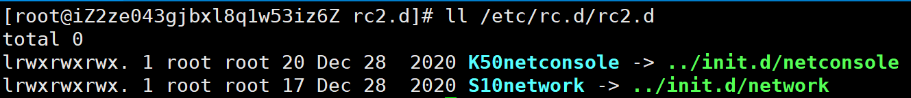
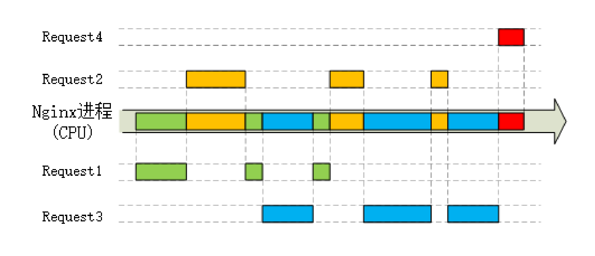
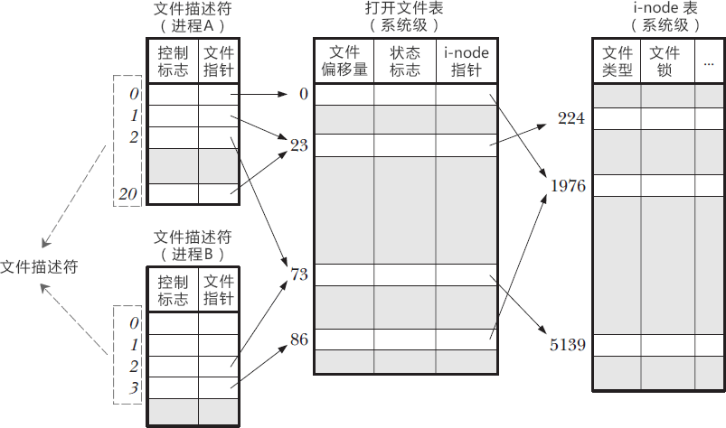
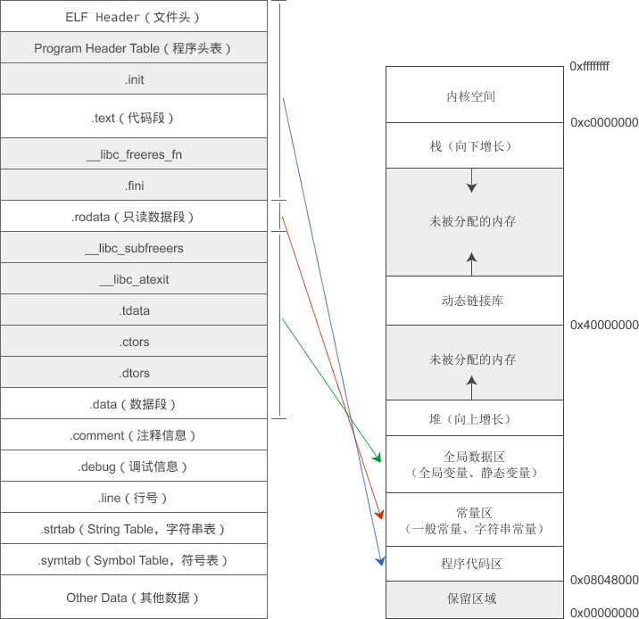

# ✨✨✨✨✨✨✨✨✨

# ==操作系统==

> 一般来说，每个线程分配一个stack，每个进程分配一个heap，也就是说，stack是线程独占的，heap是线程共用的。


# 用户页表和内核页表（待总结）

参考：https://blog.csdn.net/DKH63671763/article/details/104996395


## 单核CPU仍然存在线程安全问题


## CFS—完全公平调度

参考：https://www.jianshu.com/p/673c9e4817a8

vruntime： visual runtime。记住下边的公式
$$
vruntime=\frac{实际运行时间 \times 1024}{进程权重}
$$
进程权重是如何得到的呢？这里就涉及一个概念非常重要：nice值。nice值范围为-20~19。我觉得这个数组的`index-20`就是nice值，对应的值就是权重。

```cpp
nice值共有40个，与权重之间，每一个nice值相差10%左右。
static const int prio_to_weight[40] = {
    /* -20 */ 88761, 71755, 56483, 46273, 36291,
    /* -15 */ 29154, 23254, 18705, 14949, 11916,
    /* -10 */ 9548, 7620, 6100, 4904, 3906,
    /* -5 */ 3121, 2501, 1991, 1586, 1277,
    /* 0 */ 1024, 820, 655, 526, 423,
    /* 5 */ 335, 272, 215, 172, 137,
    /* 10 */ 110, 87, 70, 56, 45,
    /* 15 */ 36, 29, 23, 18, 15,
};
```

那么采用的数据结构？红黑树，节点的值为每个进程的vruntime值。利用红黑树的特点是弱平衡。

[Linux nice和renice命令：改变进程优先级](http://c.biancheng.net/view/1074.html)，这篇文章讲解了如何通过命令改变进程的优先级。

##  操作系统的启动流程

https://www.ruanyifeng.com/blog/2013/08/linux_boot_process.html

有趣的是，MBR的第511和512字节很有意思，分别是01010101（0x55）、10101010（0xAA）

需要记忆一下MBR的内容：

```c
　　（1） 第1-446字节：调用操作系统的机器码。//相当于汇编程序吧

　　（2） 第447-510字节：分区表（Partition table）。//64字节

　　（3） 第511-512字节：主引导记录签名（0x55和0xAA）。//上边有讲到
```


## Linux开机发生了啥？


1️⃣ /boot：读取这些目录下的文件，加载到内存。这些文件也叫做**内核文件**，所以这个步骤也可以称为加载内核文件。为啥要用boot代表启动时要加载的内核文件呢？在阮一峰的[计算机是如何启动的？](https://www.ruanyifeng.com/blog/2013/02/booting.html)开头提到了一个很有趣谚语：

```cpp
"pull oneself up by one's bootstraps"
```

2️⃣ init进程：虽然现在已经被 *systemd* 给取代了。这个进程是所有的进程的父进程，所以我也称之为根进程。

3️⃣ **运行级别和`init.d`目录**🎈🎈🎈：

涉及到两个重要目录，且他们都在`/etc/rc.d`下：==`init.d`目录==和==`rc{N}.d`目录==。（**r**un **c**ommand）

这两个是重点！首先，每一个运行级别对应的目录是`/etc/rc.d/rc{N}.d`，其中N为0到6。这些目录下的文件是该运行级别下开机启动时需要执行的程序。**而这些文件却都是链接文件**！
所链接的地方是`/etc/rc.d/init.d/`下的文件。也就是说，`init.d`目录下才是**大本营**。



🆗 最后补充一点，怎么确定当前系统是哪个运行级别呢？在配置文件`/etc/inittab`下，读取可以看到：

```
id:2:initdefault:
```

这时的启动级别为2。

## 前台任务和后台任务

### 命令

学习阮一峰的：[Linux 守护进程的启动方法](https://www.ruanyifeng.com/blog/2016/02/linux-daemon.html)

本质上，两种任务都是session进程的子进程，只不过是两种状态。如何将一个任务放在后台执行？提供两种方式：

1. 在用命令启动任务的时候，在命令后边加上**`&`**。如`node server.js &`。

2. 如果任务正在执行，那么先按`Ctrl+Z`，相当于对任务发出**SIGSTOP**信号灯，让进程暂停。然后，执行==**bg**==命令，back go！让他在后台继续运行。

但请看下边这个现象：


也就是说，我把top命令放在后台执行，但是它居然自己stopped了？这是要造反吗？

这个问题其实很好理解，你想想top命令是干啥的？是需要和终端用户**交互**的！也就是说，这个命令是要给终端用户输出信息的。那么把这个命令放在后台执行又有什么价值呢？你说是吧。还不如默认stopped。

加下来，后台命令⬅➡前台命令？一个是`fg`（foreground），另一个是`bg`（background）。

### 两大区别🧨🧨🧨

有两个角度：

**第一个：**

> 1. 继承当前 session （对话）的标准输出（stdout）和标准错误（stderr）。因此，**后台任务的所有输出依然会同步地在命令行下显示**。
> 2. **不再继承当前 session 的标准输入（stdin）**。你无法向这个任务输入指令了。如果它试图读取标准输入，就会暂停执行（halt）。

==可以看到，"后台任务"与"前台任务"的本质区别只有一个：**是否继承标准输入**。所以，执行后台任务的同时，用户还可以输入其他命令。==

这一点我是体验过的：在我的阿里云服务器上用`mvn clean`的时候，觉得耗时太长，于是`ctrl+Z`，然后输入`bg`，让它在后台运行。这时会在控制台随时输出一些maven运行的信息。

**第二个，也是最关键的一个：**

> Linux系统是这样设计的：
>
> 1. 用户准备退出 session
> 2. 系统向该 session 发出`SIGHUP`信号（signal hang up）
> 3. session 将`SIGHUP`信号发给**所有子进程**
> 4. 子进程收到`SIGHUP`信号后，自动退出

但是这里有个问题，虽然前台任务随着session的退出而退出，但**后台进程**呢？一个重要参数：**`huponexit`参数**。这个参数的默认值是`off`，==也就是后台任务不会随着session一起退出==。这是第二个区别。

这就有个问题，万一有些系统`huponexit=on`呢？所以，这里的后台进程算不上真正意义上的后台进程，因为它的生命周期是随着session进程的。或者说，不管怎么改进，它终究是session进程的子进程。

于是出现了守护进程，相当于Windows上的服务。

还有一个问题，session进程退出之后，后台任务不会停止，这个时候就成了孤儿进程！

更过关于僵尸进程和孤儿进程，阅读：[Zombie and Orphan Processes in C](https://www.geeksforgeeks.org/zombie-and-orphan-processes-in-c/)。

### 补充：nohup命令

文中有描述。这个命令不止一次见到，所以补充到这里。

这里强调两个点：

1️⃣这个命令会把后台命令的`stdout`和`stderr`重定向到nohup.out文件中，而不再继承前台任务的stdout和err；
2️⃣`nohup`命令不会自动把进程变为"后台任务"，所以必须加上`&`符号。


## 协程

目前参考[imageslr的协程](https://imageslr.com/2020/07/08/tech-interview.html#%E5%8D%8F%E7%A8%8B)，应该需要深入理解。

重点：用户在**堆**上模拟出协程的栈空间。

用[实现协程的理论依据](https://zhuanlan.zhihu.com/p/94018082)，稍微看看源码：

最关键的是，线程上下文切换的一大特点是，虚拟地址空间保持不变，更加根本地说，==**不会切换页表**==！但是仍然会进行系统调用，于是有了协程，甚至不会进行系统调用。

也就是说，多个线程的栈空间是在同一个地址空间上分配的！这一点面试的时候必答的点。

而协程的好处则是，虽然还在1️⃣一个页表下（**继承了多线程了优点**），但是2️⃣协程之间的切换不必进行内核态和用户态的切换，进一步地高效了！

实现重点：

> 1. **在堆上模拟栈**（`struct coroutine **co`），从而实现一个用户态的线程（其实就是一个结构体，来表示一个栈对象，对象当然是存在堆上的喽）
> 2. **调度器**（`struct schedule`），负责协程的调度与上下文切换

下边是调度器结构体，最关键的成员是共享栈。让我很惊奇的是这个stack变量就用的`char`类型！太绝妙了，这可不是拿来存ASCII码的，只是利用了`char`类型刚好是一个字节而已！

```c
struct schedule {
    char stack[STACK_SIZE]; // 运行时栈，此栈即是共享栈
    ucontext_t main; // 主协程的上下文
    int nco;        // 当前存活的协程个数
    int running;    // 正在运行的协程ID
    int cap;        // 协程管理器的当前最大容量，即可以同时支持多少个协程。如果不够了，则进行2倍扩容
    struct coroutine **co; // 一个一维数组，用于存放所有协程。其长度等于cap
};
```


> 调度器中包含协程运行时的共享栈stack，共享栈可以认为所有的协程在运行时用的都是同一块栈，当调用协程的时候，将自己的栈拷贝到**共享栈**即可。当协程切出时，将栈空间再复制出来。

所以实现方式比较明朗了，协程是在堆空间的一个结构体，`struct coroutine **co`，运行协程就将该结构体中的stack拷贝到共享栈上（也就是`char stack[STACK_SIZE]`）。而主协程的作用其实就是管理这个协调器，每次协程的上下文切换都会先切换到主协程上（即`main`）。


## Reactor模式

目前没有看到十分权威的对这部分的讲解，目前找到的利于理解的是这幅图。

循环调用select，监听到有时间后调用dispatch，分发给handler进行处理。每个handler注册的感兴趣的事件不同。

Acceptor处理连接事件，然后创建并注册一个Handler。


## malloc()、free()实现原理

这两篇文章结合起来学习：[【操作系统】malloc、free 实现原理](https://imageslr.com/2020/malloc.html#%E5%8A%A8%E6%80%81%E5%86%85%E5%AD%98%E5%88%86%E9%85%8D%E7%9A%84%E7%B3%BB%E7%BB%9F%E8%B0%83%E7%94%A8brk--sbrk)、[malloc函数背后的实现原理——内存池](http://c.biancheng.net/view/vip_2106.html)

一个重要的数据结构：*memory control block*。

文章解决了我之前一直没想明白的地方，那就是为啥要用链表来管理堆？直接像栈一样用一个指针来指向顶部不就行了吗？

文章的第一句话就解决了我这个疑问，果然是我理解不够深刻：

> 相对于栈而言，堆这片内存面临着一个稍微复杂的行为模式：在任意时刻，程序可能发出请求，要么申请一段内存，要么释放一段已经申请过的内存，而且申请的大小从几个字节到几个GB都有可能，我们不能假设程序一次申请多少堆空间，因此，堆的管理显得较为复杂。

也就是说，<u>经过一系列的释放和申请，堆空间会变得非常”**零碎**“</u>，不像栈一样连续的空间。就像下边这样：


总的来说，堆空间的申请和管理是分开来办的，申请是通过函数`sbrk()`，批量申请，然后`malloc()`/`free()`进行管理。

虽然确实有表示堆顶的指针：brk，但是用法不是我想的那样。

我觉得brk这是表示当前进程从内核申请到的总空间，申请空间用的是`sbrk()`函数，这是批量申请哈！！！很关键！也就是申请的空间是大于当前真正需要的。然后，这部分空间的管理是交给传说中的`malloc()`和`free`。这是一种池化的思想。

有三种分配算法，不用背概念其实不难。


## 一道大端小端的面试题

[问题地址](https://imageslr.com/2019/11/30/csapp-2.html#judge-big-end)

有点意思，我现在发现如C语言的数据类型是啥用了，比如int，就规定每次访问四个字节，char，每次访问1个字节。仅此而已。


## Linux I/O模式

[Linux IO模式及 select、poll、epoll详解](https://segmentfault.com/a/1190000003063859)

这段话给我提供了理解一种I/O模式的接近本质的思路：

> 刚才说了，对于一次IO访问（以read举例），数据会先被拷贝到操作系统内核的==缓冲区==中，然后才会从操作系统内核的缓冲区拷贝到应用程序的==地址空间==。所以说，当一个read操作发生时，它会经历两个阶段：
>
> 1. 等待数据准备 (Waiting for the data to be ready)
> 2. 将数据从内核拷贝到进程中 (Copying the data from the kernel to the process)

[I/O模型](https://imageslr.com/2020/07/08/tech-interview.html#io-%E6%A8%A1%E5%9E%8B)

这篇又作了进一步解释，区别了阻塞/非阻塞、同步/异步。

阻塞/非阻塞出现在第一阶段，也就是用户进程等待内核返回数据的时候，是用阻塞还是不阻塞。非阻塞的下会不断检查内核缓冲区，看看是否有数据到达。

同步/异步是内核通知用户进程数据到达以后，有内核缓冲区向进程私有空间的过程，这和过程如果是进程来自己去拷贝，就是同步，如果是内核来亲自拷贝，那就是异步。


## EPOLL

[彻底搞懂epoll高效运行的原理](https://www.jianshu.com/p/31cdfd6f5a48)

关注epoll的两个数据结构，数据结构在内存中的位置，注册的感兴趣的文件描述符在用户态⬅➡内核态传递的过程。关键在于epoll为fd注册的回调。印象当中是每一种能够注册事件的fd**类型**都有得实现poll()方法。

一个很有意思的点，**在调用epoll_wait的时候，进程会进入阻塞状态**。意识到没有，这是一个明显而容易忽视的点。

> 当进程请求某一**资源**（如外设）的使用和分配或等待某一**事件**的发生（如I/O操作的完成）时，它就从运行状态转换为阻塞状态。

我试着总结一下epoll的特点，这个总结得适合面试回答：

1. 红黑树和链表。在内核缓冲区创建了一个红黑树（`epoll_create()`）。通过`epoll_ctl()`将文件描述符添加到红黑树上。就绪链表通过调用`epoll_wait()`获得ready list以及数量。
2. 回调。`epoll_ctl()`中`op=EPOLL_CTL_ADD`时，不仅会注册一个fd到红黑树，还会为这个fd注册一个回调函数。当fd的事件（读/写）触发后，callback会将这个fd放在就绪链表中。
3. 共享内存。`epoll_wait()`阻塞，直到就绪链表中有数据。就绪链表不需要从内核空间拷贝到进程空间，因为用到了共享内存。这一点和select、poll模型有比较大的区别。
4. 边缘触发和水平触发。见下边

### 边缘触发和水平触发

[epoll LT/ET 深入剖析](https://segmentfault.com/a/1190000004597522)这篇文章总结的得很好。我再总结一下，LT监听的是状态（符合思维习惯），而ET监听的是状态**变化**。

文章的描述还是比较清晰的，主要因为引入了socket的接收和发送缓冲区来解释，这样就更加具体。

✨✨✨:

> 从ET的处理过程中可以看到，ET的要求是需要一直读写，直到返回**EAGAIN**，否则就会遗漏事件。而LT的处理过程中，直到返回EAGAIN不是硬性要求，但通常的处理过程都会读写直到返回EAGAIN，但LT比ET多了一个开关EPOLLOUT事件的步骤

我觉得LT的核心就在这个**EPOLLOUT**事件上，相当于给一个缓冲区打上标记，表示这个缓冲区中的数据还没有处理完，等下次继续。而ET的核心在于**EAGAIN**。（加粗的是助记，面试回答的时候要有这两个关键词）

补充一下EAGAIN。下边是[StackOverflow](https://stackoverflow.com/questions/4058368/what-does-eagain-mean)上的回答：

> [EAGAIN](https://web.archive.org/web/20130508062559/http://www.wlug.org.nz/EAGAIN) is often raised when performing [**non-blocking I/O**](http://www.kegel.com/dkftpbench/nonblocking.html). It means *"there is no data available right now, try again later"*.


### 一些思考

我在阅读“ [34 Nginx：高性能的Web服务器](http://learn.lianglianglee.com/%E4%B8%93%E6%A0%8F/%E9%80%8F%E8%A7%86HTTP%E5%8D%8F%E8%AE%AE/34%20%20Nginx%EF%BC%9A%E9%AB%98%E6%80%A7%E8%83%BD%E7%9A%84Web%E6%9C%8D%E5%8A%A1%E5%99%A8.md) ”这篇文章的时候，有了一些思考。

首先，什么时候才会触发事件？比如说读事件，什么时候才触发读呢？当然是数据准备好的时候。但是这篇文章当中给了我一个比较底层的理解角度：

> Nginx 里使用的 epoll，就好像是 HTTP/2 里的“**多路复用**”技术，它把多个 HTTP 请求处理打散成碎片，都“复用”到一个单线程里，不按照先来后到的顺序处理，而是只当连接上真正可读、可写的时候才处理，如果可能发生阻塞就立刻切换出去，处理其他的请求。

加上下边这幅图应该就好理解了，可以看到，这里共有4个request，那么内核就会为每个request创建缓冲区。比如，当request 2的数据准备完成后，才触发EPOLLIN事件。



那为什么说Nginx是轻量级的呢？为什么Nginx用到了epoll就是轻量级的呢？下边这段话极品精辟：

> Web 服务器从根本上来说是==“I/O 密集型”==而不是“CPU 密集型”，处理能力的关键在于网络收发而不是 CPU 计算（这里暂时不考虑 HTTPS 的加解密），而网络 I/O 会因为各式各样的原因不得不等待，比如数据还没到达、对端没有响应、缓冲区满发不出去等等。

再来理解什么是“重量级”

> “重量级”占用很多资源，当处理 HTTP 请求时会消耗大量的 CPU 和内存

但是重量级的服务器也是可以有很好的性能的，比如大量的并发，简单来说就是财大气粗，疯狂怼物料。而大量的并发带来的就是内存中要维护大量的线程数据结构，以及CPU频繁地上下文切换，这些消耗的内存资源，以及CPU资源，是的“重量级”非常的“重“。

### 面试可能会问到的

**Q：epoll和HTTP/2多路复用虽然都有多路复用，但是复用的玩意儿是不一样的，你知道答案吗？**

HTTP/2复用的是单个TCP连接，而epoll复用的是单个线程。


## 三种和调度相关的算法

只有这三个，而且有递进关系，分别

#### 进程调度策略

批处理系统、分时系统、实时系统的调度算法


#### 页面置换算法

参考的是[虚拟内存管理](https://imageslr.com/2020/07/08/tech-interview.html#virtual-memory)部分。有大概八种，我觉得最会考的是：

1. FIFO

2. 第二次机会置换算法（SCR）：

   这是对FIFO的改进，维护了一个队列

3. 时钟算法（Clock）：

   这是对SCR的改进，将队列变成了一个循环队列，每次只用改变对头即可

4. LRU

5. LFU


## 零拷贝

参考：https://zhuanlan.zhihu.com/p/258513662

文章讲得非常好，我都不敢随意描述了。

注意，从磁盘拷贝页面到缓冲区的过程中，磁盘自己也拥有缓冲区，在本文中叫做：磁盘控制控制器缓冲区：

> 磁盘控制器收到指令后，于是就开始准备数据，会把数据放入到**磁盘控制器的内部缓冲区**中，然后产生一个**中断**；


#### DMA

理解为一个中间件

#### 零拷贝

（1）**实现方法一，两个系统调用：`mmap`和`write`**。

还是采用到了共享内存技术`mmap`。重点是砍掉了内核缓冲区将数据拷贝到用户进程空间中的过程，而是：

> `mmap()` 系统调用函数会直接把内核缓冲区里的数据「**映射**」到用户空间，这样，操作系统内核与用户空间就不需要再进行任何的数据拷贝操作。


（2）**实现方法二，只需要一个系统调用：`sendfile`**

这种方式直接把socket缓冲区拷贝都给省略了！

> 这就是所谓的零拷贝（*Zero-copy*）技术，**因为我们没有在内存层面去拷贝数据**，也就是说全程没有通过 CPU 来搬运数据，所有的数据都是通过 DMA 来进行传输的。

加粗的字是关键！这才是零拷贝的奥义，没有在**内存**中对数据的拷贝。这相当于给予socket缓冲区一个**凭证**，也就是这里的fd和数据长度，然后SG–DMA根据这个凭证去内核缓冲区取数据。


## inode

索引节点（Index Node），阮一峰的[理解inode](https://www.ruanyifeng.com/blog/2011/12/inode.html)更易于理解

#### 扇区、块和页

扇区（sector）：文件存储的最小单位，512Byte；块（block）：文件**读写**的基本单位，4KB。

这是我读这篇文章收获最大的。在磁盘中，文件**读写**的基本单位是块4kB，一般由**连续的**8个扇区组成，一个扇区512字节。注意块是对磁盘中文件读写的基本单位，而不是磁盘中文件**存储**的基本单位。再来看看页，这是内存中读写的基本单位，一般也是4kB。

inode其实和下边的PCB相似，都是记录元信息。

一般一个inode大小为128或256字节。

inode号码

> 这里值得重复一遍，Unix/Linux系统内部不是使用文件名，**而使用inode号码来识别文件**。对于系统来说，文件名只是inode号码便于识别的别称或者**绰号**。

#### inode table

为什么要把这个table单独列出来？因为这和后面的文件描述符相关

> inode也会消耗硬盘空间，所以硬盘格式化的时候，操作系统自动将硬盘分成两个区域。一个是数据区，存放文件数据；**另一个是inode区（inode table）**，存放inode所包含的信息。

#### 硬链接和软链接的区别

> 但是，Unix/Linux系统允许，**多个**文件名指向同一个inode号码。

> 这是软链接与硬链接最大的不同：文件A指向文件B的文件名，而不是文件B的inode号码，文件B的inode"**链接数**"不会因此发生变化。

## copy-on-write  写时复制

参考：[【操作系统】写时复制 Copy-on-write](https://imageslr.com/2020/copy-on-write.html)

*WHY？*➡fork时全部复制会很浪费

*HOW？*➡结合一下我之前学到关于[页面的知识](http://c.biancheng.net/view/vip_2095.html)：


一个进程的页表的元素由两部分组成：其中20位是物理页面的编号，**12位是这个物理页面的访问权限**。

当fork了一个子进程的时候：

> `fork()` 之后，内核会把父进程的所有内存页都标记为**只读**。一旦其中一个进程尝试写入某个内存页，就会触发一个保护故障（**page fault**），此时会陷入内核。
>
> 内核将拦截写入，并为尝试写入的进程创建这个页面的一个**新副本**，恢复这个页面的**可写权限**，然后重新执行这个写操作，这时就可以正常执行了。

我的理解是，子进程fork了父进程的页表后，子进程拷贝了父进程的页表，同时父、子进程页表中的物理地址访问权限（页表项12位）都会标记为只读.

> 内核会保留每个内存页面的引用数。每次复制某个页面后，该页面的引用数减少一；如果该页面只有一个引用，就可以跳过分配，直接修改。

## 文件描述符（fd）

[文件描述符](http://c.biancheng.net/view/3066.html)记录**当前**进程所打开的文件。

记录在上边PCB中的”资源分配清单—文件描述符“中，我觉得它是一个结构体数组，fd就是一个数组下标，int类型。

文件描述符并不能单独行动，它还要配合其他两个表才能有用，如下。一个是打开文件表，一个是inode table。



## 进程 Part1

#### `task_struct`和进程控制块（PCB）

总的介绍看[labuladong的文章](https://github.com/labuladong/fucking-algorithm/blob/master/%E6%8A%80%E6%9C%AF/linux%E8%BF%9B%E7%A8%8B.md)，写得是真的好！下边是文章中列出的task_struct这个数据结构中比较重要的元素：

```c
struct task_struct {
	pid_t pid; //进程号
	long state; //进程状态
    
	struct task_struct __rcu *parent;// 指向父进程的指针
	struct list_head children;// 子进程列表
	
	struct fs_struct *fs;// 存放文件系统信息的指针
	struct files_struct	*files;// ✨一个数组，包含该进程打开的文件指针。这个数组的下标就是文件描述符
	struct mm_struct  *mm;// ✨虚拟内存结构体，mm（memory management）
};
```

**文件描述符**：特别关注`files_struct`和`mm_struct`数据结构，其中`files[0]`、`files[1]`、`files[2]`就是一个进程默认打开的文件，分别是stdin、stdout、stderr。

**创建进程和线程**：创建线程调用`pthread()`，其中的p是[POSIX](https://www.cnblogs.com/gabriel-sun/p/12369613.html)；创建子进程调用`fork()`，联想到GitHub复制别人的仓库到本地仓库，也是点击的fork。

然后就是父进程—线程、父进程—子进程关系。简单归纳一下：

**父进程—线程：引用；父进程—子进程：拷贝。**

注意到没有，通过父进程创建

##### task_struck是Linux中PCB的具体实现

参考C语言中文网的：[进程控制块](http://c.biancheng.net/cpp/html/2591.html)和[Linux下的进程控制块(PCB)](https://www.cnblogs.com/yungyu16/p/13024626.html)

进程的**METADATA**。这是一个非常重要的数据结构，进程实体由三个部分组成：程序段、相关数据段、PCB（这个是核心）

> 进程是进程实体的运行过程，是系统进行资源分配和调度的一个独立单位。


我觉得“处理机相关信息”很重要，这和进程切换息息相关

> 当进程被切换时，处理机状态信息 都必须保存在相应的PCB中，以便在该进程重新执行时，能再从断点继续执行。


#### 就绪状态和阻塞状态


注意了啊，进程可以从运行态直接转换到就绪态的！这不能忘啊。

就绪状态和阻塞（等待）状态之间的联系，[这篇文章](http://c.biancheng.net/cpp/html/2589.html)作了解释：

> 注意区别就绪状态和等待状态：就绪状态是指进程仅缺少处理机，只要获得处理机资源就立即执行；而等待状态是指进程需要其他资源（除了处理机）或等待某一事件。之所以把处理机和其他资源划分开，是因为在分时系统的时间片轮转机制中，每个进程分到的时间片是若干毫秒。也就是说，**进程得到处理机的时间很短且非常频繁，进程在运行过程中实际上是频繁地转换到就绪状态的**；而其他资源（如外设）的使用和分配或者某一事件的发生（如I/O操作的完成）对应的时间相对来说很长，**进程转换到阻塞状态的次数也相对较少**。这样来看，就绪状态和等待状态是进程生命周期中两个完全不同的状态，很显然需要加以区分。

#### 上下文切换

http://c.biancheng.net/cpp/html/2590.html

重点是处理机上下文和PCB中信息的变换，就是下图“处理机相关信息”这一列，重点的是PC指针，也就是程序计数器，指向的是正文段。用我的话来理解上下文切换过程：

1. 处理机上下文，更新至PCB中
2. PCB加入队列，阻塞队列或就绪队列，等待调度
3. 从就绪队列中选择另一个进程的PCB，更新至PCB


## 进程 Part2

都来自于[【操作系统】进程的调度、僵尸进程/孤儿进程/守护进程](https://imageslr.com/2020/07/07/process-schedule.html#%E5%9F%BA%E6%9C%AC%E7%8A%B6%E6%80%81)

#### 僵尸进程和孤儿进程

原来回收一个线程是调用`wait()`和`waitpid()`？[这篇文章](https://www.cnblogs.com/yusenwu/p/4655286.html)作了稍微详细的解释。


#### 什么是挂起状态？

这算是一个稍微有些特殊的状态，这个状态下的进程是被切换到外存中的。


#### 什么是睡眠状态

睡眠状态是对阻塞状态的细分，也就是说，阻塞状态又可以细分为：深睡眠、浅睡眠、暂停。转到就绪状态有三种方式：资源到位/收到信号。


#### 原语

一个很重要的概念，几乎需要记住它的定义。用途之一是进程控制，进程的创建、终止、阻塞、切换，都是用相应的原语来控制的。


## 中断 | 异常（故障）| 陷入 | 信号✨

总的概念：异常控制流（Exception Control **Flow**）。我觉得不应该翻译成异常，用“例外”更好。


有一句话非常关键，看了有种恍然大悟的感觉：

> 上文的陷阱、中断和异常都是低层异常（exception）机制，由内核的异常处理程序进行处理，==正常情况下对用户进程是不可见的==。信号提供了一种机制，**通知用户进程发生了这些异常**。

要理解这几种异常控制机制，关键是知道下面的两个表格。

一个是30种信号类型（但我的Ubuntu上有64种），一个是中断向量号（共256总）

信号（灯）类型，用`kill -l`可以查看。中断向量表，X86处理器中叫做中断描述符表（IDT），只是称呼不同而已。

<center>
    
    
</center>


### “伟大的”结论：

再结合这句话：

> 前 32 个是预留的、由**处理器产生**的异常，包括被零除、缺页、内存访问违例、断点以及算数运算溢出等，这些号码。其他号码是由**操作系统内核**定义的，包括系统调用（软中断）和来自外部设备的中断信号（硬中断）。

就可以得出下面的”伟大“结论：

1️⃣中断向量表

陷入（trap）、中断、异常（error/fault）其实都是一个货色，它们都是处理器级别的，它们都是在中断向量表里边的。它们的区别只是：

（1）陷入对应的中断向量号（INT_NUM）是**0x80**，对应的中断处理程序是*ia32_syscall*。此外，它是同步的；

（2）异常对应的是**前**32个中断向量号（0x00~0x1F），由**处理器**产生的异常。此外，它是异步的；

（3）中断对应的是**其他**的INT_NUM，由系统内核自己定义。此外，它是异步的。

这些中断向量号代表的中断处理程序，都在PIC当中，与用户无关。

[C 访问空指针会不会陷入内核态](https://imageslr.com/2020/07/07/user-mode-kernel-mode.html#c-%E8%AE%BF%E9%97%AE%E7%A9%BA%E6%8C%87%E9%92%88%E4%BC%9A%E4%B8%8D%E4%BC%9A%E9%99%B7%E5%85%A5%E5%86%85%E6%A0%B8%E6%80%81)是一个很好的例子：

> 内核会在**中断描述符表**（IDT）中，找到处理 page fault 的**中断向量**，执行相应的 **handler**。一般情况下，OS 会抛出一个 `SIGSEGV` 信号给进程，中止进程，打印出 debug 信息。

中断向量表中指针指向的函数地址应该是在**8259A PIC**（Programmable Interrupt Controller）中，所以CPU应该是读取并执行PIC当中的程序。关于PIC，看[这篇文章](https://mp.weixin.qq.com/s/Xf3sbkJFWDQ7bzhKFEmkzA)。简单来说，PIC（可编程中断控制器）是一个独立的芯片，内核中的中断向量表其实就是PIC的“用户手册”。

2️⃣信号

它是用户进程级别的，它的”号码“就不是刚才说的中断向量号了，而是有自己**独家**的信号类型。用户进程可以为这些信号类型自定义一些处理程序，这就是信号”高级“所在。

为上面的”伟大结论“找到了佐证，来自[什么时候会陷入内核态](https://imageslr.com/2020/07/07/user-mode-kernel-mode.html#%E4%BB%80%E4%B9%88%E6%97%B6%E5%80%99%E4%BC%9A%E9%99%B7%E5%85%A5%E5%86%85%E6%A0%B8%E6%80%81)：


> ==陷阱的主要作用是实现**系统调用**==

这句话的涵义非常多。首先，一个INT_NUM为0x80的中断向量号，注册了一个名为**ia32_syscall**的中断处理程序，这是所有系统调用的入口。


### PIC—Programmable Interrupt Controller

CPU明明8个核，网卡为啥拼命折腾一号核？ - 轩辕之风的文章 - 知乎 https://zhuanlan.zhihu.com/p/272140911

绝好神文！


### ARTICLE：[中断的本质是什么？](https://www.zhihu.com/question/21440586/answer/991259675)

> 一个没有中断的计算机体系是决定论的：得知某个时刻CPU和内存的全部数据状态，就可以推衍出未来的全部过程。这样的计算机**无法交互**，只是个**加速器**。

也就是说，有了中断，计算机的**实时交互**成为可能。比如网络请求的随时可能到来，已经鼠标点击、键盘输入。

#### 硬中断和软中断

ksoftirqd这是一个内核知名线程，内核线程kthread，k指kernel。中断信号：interrupt request。则全称为：

**k**ernel **soft** **i**nte**r**rupt re**q**uest threa**d**。每个核心都会有，如ksoftirqd/0，表示0号cpu的

> 内核和网络设备驱动是通过中断的方式来处理的。当设备上有数据到达的时候，会给CPU的**相关引脚上触发一个电压变化**，以通知CPU来处理数据。对于网络模块来说，由于处理过程比较复杂和耗时，如果在中断函数中完成所有的处理，将会导致中断处理函数（优先级过高）将过度占据CPU，将导致CPU无法响应其它设备，例如鼠标和键盘的消息。因此Linux中断处理函数是分==**上半部和下半部**==的。上半部是只进行最简单的工作，快速处理然后释放CPU，接着CPU就可以允许其它中断进来。剩下将绝大部分的工作都放到下半部中，可以慢慢从容处理。2.4以后的内核版本采用的下半部实现方式是软中断，由**ksoftirqd内核线程**全权处理。和硬中断不同的是，硬中断是通过给CPU物理引脚施加电压变化，**而软中断是通过给内存中的一个变量的二进制值以通知软中断处理程序**。[来源](https://mp.weixin.qq.com/s/GoYDsfy9m0wRoXi_NCfCmg)


扩展阅读：[LINUX内核网络中的软中断KSOFTIRQD](http://kerneltravel.net/blog/2020/ksoftirqd_ljr/)，这篇文章更加明显得区别了硬中断和软中断，区别就是阻塞和非阻塞。硬件重点

> 由于**硬中断处理程序执行的过程中不能被中断，所以如果它执行时间过长**，会导致CPU没法响应其它硬件的中断，于是内核引入软中断，这样可以将硬中断处理函数中耗时的部分移到软中断处理函数里面来慢慢处理。内核中的ksoftirqd进程专门负责软中断的处理，当它收到软中断后，就会调用相应软中断所对应的处理函数，网卡驱动模块抛出的软中断，ksoftirqd会调用网络模块的`net_rx_action`函数。


🚀🚀🚀🚀🚀🚀🚀🚀🚀🚀🚀🚀🚀🚀🚀🚀🚀🚀

## IPC—进程间通信方式

看[这个系列：进程间通信](https://www.cnblogs.com/linuxbug/tag/%E8%BF%9B%E7%A8%8B%E9%97%B4%E9%80%9A%E4%BF%A1/)，需要仔细读，基本解决了我的疑惑：

这个系列的优点在于，每种通信方式他都有c语言代码实现，这让这部分知识显得不那么抽象了。

### 类别一

#### 匿名管道&命名管道（FIFO==文件==）

自己总结了两点：

1. 也是最重要的一点，在别的文章中找到了比较精辟的回答：

   > ==**有名管道的名字存在于文件系统中，内容存放在内存中。**==

   另外一个很重要的区别，在[这里](https://www.cnblogs.com/linuxbug/p/4863724.html#:~:text=%E5%8F%AF%E4%BB%A5%E7%9C%8B%E5%87%BA%EF%BC%8C%E5%91%BD%E5%90%8D%E7%AE%A1%E9%81%93%E6%98%AF%E4%B8%80%E7%A7%8D%E7%89%B9%E6%AE%8A%E7%9A%84%E6%96%87%E4%BB%B6%EF%BC%8C%E5%8F%AF%E4%BB%A5%E6%8C%89%E7%85%A7%E6%96%87%E4%BB%B6%E7%9A%84%E8%AF%BB%E5%86%99%E6%96%B9%E5%BC%8F%E5%8E%BB%E6%93%8D%E4%BD%9C)有非常棒的例子！

   ```bash
   [root@rocket tmp]# file my_fifo
   my_fifo: fifo (named pipe)
   ```

   看到没有，命名管道直接就是文件了！直接可以通过`open()`、`write()`系统调用来读写！

   我觉得这才是两种管道的本质区别，匿名管道因为只有文件描述符，所以只能在父子进程，和线程之间通信，毕竟不论`fork()`还是`pthread()`，都是会复制父进程的文件描述符表的。

   而fifo就不一样了，拥有了姓名，“我叫你名字，你敢答应吗？”

2. 一个小点。[这篇文章](https://www.jianshu.com/p/c1015f5ffa74)的总结也很好，大致重点是，读的一方一定要**先于**写的一方监听管道，否则写的操作会阻塞。

<center>
    
    
</center>


#### 消息队列

[这篇文章](https://www.cnblogs.com/linuxbug/p/4872496.html)是比较专业的总结，总结了两点与管道不同之处：

1. 同步与异步（这是稍微明显的区别）

   对于管道，先得开始写才能开始读，这是典型的同步。而消息队列就是典型的异步。

   > 进程向其中写消息时，管道和FIFO必须已经打开来读，否则写进程就会阻塞（默认情况下）。对于消息队列，没有这个限制。

2. 持续性

   消息队列随内存的持续性；管道随进程的持续性。

   > 当管道或FIFO最后一次关闭发生时，仍在管道和FIFO中的数据会被**丢弃**。

```c++
#include<bits/mqueue.h> //头文件
typedef int mqd_t; //就是mq的文件描述符，这里有点意思，为啥不直接是int类型呢，要转换为mqd_t？可能是语义上好理解吧。
```

### 类别二

#### 信号（灯）

在Linux上可以直接等同于`kill`命令，可以通过`kill -l`查看信号类型。

这是一种比较高级的进程间通信方式。进程收到信号后的三种处理方式（SIG_IGN、SIG_DFL、自定义函数地址）

信号有[两大来源](https://imageslr.com/2020/02/26/ipc.html#%E4%BF%A1%E5%8F%B7-signal)：

硬件：如按下 CTRL+C、除 0、非法内存访问等等；

软件：如 Kill 命令、Alarm Clock 超时、当 Reader 中止之后又向管道写数据，等等。

#### semaphore—信号==量==

也就是这个系列文章中的信号灯。这个称呼不是很普遍。一般称为**信号量**，也就是有semaphore和PV原语的那个。

这个机制里面有三样东西：一个变量：信号量S（semaphore）；两个原语：P（荷兰语 测试）、V（荷兰语 增加）

可以用信号量实现同步和互斥，文章中有代码，我觉得同步和互斥实现的表象区别在于semaphore的初值的不同。

我们可以看看[这篇文章](http://c.biancheng.net/cpp/html/2598.html)中的代码，下边是记录型信号量的伪代码，主要看V操作：

```c
void signal (semaphore S) {  //V操作，相当于释放资源
    S.value++;
    if(S.value<=0){
        remove a process P from S.L;
        wakeup(P);//关键，唤醒队列中被阻塞的线程
    }
}
```

看到没有，关键在`wakeup(P)`，这就是同步非常重要的特点，互相唤醒，让进程有序执行。虽然它的实现可能和互斥很像，但醉翁之意不在酒。

```cpp
#include<semaphore.h> //头文件
typedef void *sem_t;//结构体，个人感觉这里的void* 类似Java的Object类型，或者说没有定死类型。
sem_t *sem_open(const char *name, int oflag, mode_t mode, unsigned int value);
```


### 类别三

#### 共享内存

https://www.jianshu.com/p/c1015f5ffa74

关键词：映射

有三种实现方式，最重要的，同时是我觉得很有趣的，是mmap（memory map），这种方式的好处在于：

> mmap()系统调用使得进程之间通过映射同一个普通文件实现共享内存。普通文件被映射到进程地址空间后，**进程可以像访问普通内存一样对文件进行访问**，不必再调用read()，write（）等操作。

`mmap()`方法的参数讲解中再一次提到了匿名映射，这个匿名管道很相似，**”匿名“**就表明了只有有亲缘关系的进程间才能使用的通信方式。

共享内存的优势？

看[这篇文章](https://www.cnblogs.com/linuxbug/p/4882776.html)：

> 对于像管道和消息队列等通信方式，则需要在内核和用户空间进行**四次的数据拷贝**，而共享内存则只拷贝两次数据

但里面的图画得有点问题，说白了共享内存的最大特点就是会映射到进程的私有地址空间中，**不用进行系统调用**，读取内核上的数据了。

```cpp
#include <sys/mman.h>
void *mmap(void *addr, size_t length, int prot, int flags, int fd, off_t offset);//申明。这里的返回值为void*，相当于是任意类型，本质上来说，返回任意字节长度，只要用占用同样长度的类型来接收就行。但问了是A和B类型都是8字节，但是字节的布局不同解析出的含义也是不同的。
```

#### mmap与动态链接

我发现这玩意儿其实我已经见过了，看看[动态内存分配的系统调用：brk / sbrk](https://imageslr.com/2020/malloc.html#%E5%8A%A8%E6%80%81%E5%86%85%E5%AD%98%E5%88%86%E9%85%8D%E7%9A%84%E7%B3%BB%E7%BB%9F%E8%B0%83%E7%94%A8brk--sbrk)的图：


发现重点没有：**共享库的内存映射区域**！内存映射！！！那不就是用mmap实现的共享内存吗！！！

我也不是乱说的，[Linux进程分配内存的两种方式--brk() 和mmap()](https://www.cnblogs.com/diegodu/p/9230280.html)这篇文章有一段话：

> mmap是在进程的虚拟地址空间中（堆和栈中间，称为文件映射区域的地方）**找一块空闲的虚拟内存**。

这篇文章还将到了一点，我觉得非常非常关键：

> 你可能会问：只要把_edata+30K就完成内存分配了？
>
> 事实是这样的，_edata+30K**只是完成虚拟地址的分配**，A这块内存现在还是没有物理页与之对应的，等到进程第一次读写A这块内存的时候，发生缺页中断，==这个时候，内核才分配A这块内存对应的物理页==。也就是说，如果用malloc分配了A这块内容，然后从来不访问它，那么，A对应的物理页是不会被分配的。

这么说，分配一个地址居然这么简单：移动指针_edata即可，我靠。剩下的事情，比如分配物理地址，都交给内核完成。秀啊。 


### 类别四

#### Socket—Unix Domain Socket

> 可以这样理解：socket 是进程间通信规则的高层抽象，而 fd 提供的是底层的具体实现。socket 与 fd 是一一对应的。通过 socket 通信，实际上就是通过文件描述符 `fd` 读写文件。这也符合 Unix“一切皆文件”的哲学。

Socket就主要两种，最常用的Internet套接字，然后就是进程间通信—Unix Domain Socket。[这篇文章](https://www.cnblogs.com/sparkdev/p/8359028.html)讲到了和Internet套接字的区别，也就是客户端在调用connect之前会调用一次bind：

> 与网络 socket 编程不同的是，UNIX domain socket 客户端一般要**显式调用 bind 函数**，而不依赖系统自动分配的地址。客户端 bind 一个自己指定的 **socket 文件名**的好处是，该文件名可以包含客户端的 pid 等信息以便服务器**区分**不同的客户端。

这里的“ socket文件名 ”其实没讲清楚，本质上来说就是一个文件描述符。

🚀🚀🚀🚀🚀🚀🚀🚀🚀🚀🚀🚀🚀🚀🚀🚀🚀🚀


## Linux内核同步机制🎈🎈🎈（待复习）

参考：[Linux内核的同步机制](https://e-mailky.github.io/2016-10-13-linux_kernel_sync)

#### 原子操作

面试的时候可以扯一下硬件层面的实现：总线锁（LOCK信号）和缓存锁（LOCK前缀的指令）。

再来补充一下对`volatile`关键字的理解，下边这段话比较精辟：

> volatile修饰字段告诉gcc不要对该类型的数据做优化处理，对它的访问都是对**内存的访问**，而不是对寄存器的访问。

源码如下，这和Java的`AtomicInteger`几乎一样，但是原子操作的实现是**汇编**，这让我相当了Java的native：Java的native编程时调用C/C++，而如果C/C++有native编程这个概念的话可能就是调用汇编了。

```cpp
typedef struct { volatile int counter; } atomic_t;//个人认为_t是“type”之意
```

#### semaphore和rw_semaphore

这个在进程间上边的IPC中也讲到过，也就是说，semaphore这个概念同时存在于IPC和内核同步机制上，有啥区别呢？文中第一句话就讲到了，加粗部分就是要点：

> Linux内核的信号量在**概念**和**原理**上与用户态的System V的IPC机制信号量是一样的，==**但是它绝不可能在内核之外使用**==，因此它与System V的IPC机制信号量毫不相干。

用我的话说，IPC中的是系统调用，即给用户态提供的，而内核同步机制的semaphore仅给内核使用。

如何理解mutex？最直观的理解就是初始化信号量的值为1，这样就使得共享资源是互斥的。换句话说，mutex是特殊的信号量，同时信号量绝大多数情况下都用做mutex。更多的理解请看下边的⬇：*<u>专题—如何区别 semaphore和 mutex？</u>*。

最后说说rw_semaphore，其实就是对读和写进行了细分。

#### spinlock和rwlock

提到一点很关键，那就是对monitor保持比较久的业务场景下不适合spinlock，如果monitor保持比较短，则用spinlock。

> 由于自旋锁使用者一般保持锁时间非常短，因此选择自旋而不是**睡眠**是非常必要的，自旋锁的效率远高于互斥锁。

这是回答自旋锁和互斥锁比较好的角度，即需不需要睡眠—进入等待队列—不参与调度。


#### 专题—如何区别semaphore和mutex？

参考：[semaphore和mutex的区别？ - 二律背反的回答](https://www.zhihu.com/question/47704079/answer/135859188)

里边的精髓并不是讲了两者在原理或者底层实现上的相同，而是两者在功能上的区别，前者用于调度，也就是进程之间的同步，而后者是保护共享资源。例子很好：如何调度`c=a+b`？所谓调度（或同步），就是规定进程的先后执行顺序，比如这里的例子，a和b可以并行执行，然后再c，这就是调度（同步）。

这个问题还可以这么问：同步和互斥有啥区别？

同步我觉得就是*前驱和后继的关系*，==资源的**有序**访问==，而互斥不是这种关系，两个进程没有先后顺序，谁能抢到临界资源就是谁的。更进一步说，同步首先就得保证互斥，是在互斥基础上实现的前驱和后继的关系。

> 为禁止两个进程同时进入临界区，同步机制应遵循以下准则：
>
> - 空闲让进。临界区空闲时，可以允许一个请求进入临界区的进程立即进入临界区。
> - 忙则等待。当已有进程进入临界区时，其他试图进入临界区的进程必须等待。
> - 有限等待。对请求访问的进程，应保证能在有限时间内进入临界区。
> - 让权等待。当进程不能进入临界区时，应立即释放处理器，防止进程忙等待。

[文中](http://c.biancheng.net/cpp/html/2598.html)用信号量实现同步和互斥，注意两者在**semaphore初始值**上的区别，这个是最为关键的点。同步的时候，semaphore初值为0，表明资源被占用，甚于0；互斥的时候，初值为1，表明资源尚未被占用，剩余1。


## 虚拟地址空间分布

主要看这张图，这是4G虚拟地址空间布局。请记住每一个细节！



如，内核空间，每一个虚拟地址空间的高1GB都有，剩下的3G才是进程自己的。

左边是ELF格式的可执行文件（.out），分为很多个段（segment），这个可执行文件加载到内存后就是右边的情况。

注意上边的动态链接库，在[这篇文章](https://www.daimajiaoliu.com/daima/479c163169003fe)中的图中，明确指出了这是一个mmap区域。

也要注意，object文件中的section是如何合并的，这些问题主要看[这篇文章](http://c.biancheng.net/view/vip_2112.html)，绝世好文。

我需要特别提一下保留区，这是在虚拟地址空间中最低的**128MB**，下面的解释让我眼前一亮，加粗的是关键点。重点就是NULL指向的0x0是保留区，没有访问权限。

> 保留区128M，我们通常将申请的临时指针变量初始化时置为NULL，可以防止后续无意使用这个指针出错，因为**NULL == 0x0**，将其指针指向0x0这个地址时，因为0x0这个地址属于保留区，**没有访问权限的**。


#### 空间布局的合理性思考

仔细观察虚拟内存的布局，可以发现全局数据区、常量区、代码区（.txt等）都是放在一起的，为什么这么做？我觉得关键原因是他们不会再产生新的空间，是静态的，而stack和heap占用的空间随时会变化。所以，设计者就需要考虑一个问题，怎么样才能空出一片连续的空间，来满足stack和heap的动态要求？于是设计出了现在这种布局。

当然，我觉得也可以将常量区和全局数据区放到高地址？可能有啥更深层的因素没被我考虑到。


#### 常量区和全局数据区有啥区别？

其实关注本质即可，这些分区其实是为操作系统准备的，操作系统只关心这些区域的权限，所以会将不同权限的segment放在一起，这样才不会让内核感到混乱。所以，常量区就read only权限，全局数据区则有read和write权限。


## 死锁的必要条件

下面这四种必要条件需要牢记，太重要了。为什么是必要条件？因为破坏其中一种就能打破死锁，这是数学定理了。

互斥

不可剥夺

请求与保持

循环等待


## TLB

这是一个小知识点

Translation Lookaside Buffer，转译后备缓冲区。

我猜测是MMU上的页表的缓存。我的猜测是正确的


## 页表

[分页机制究竟是如何实现的？](http://c.biancheng.net/view/vip_2095.html)

我觉得核心原理是，为啥页表机制能够剩下很多空间，物理地址和虚拟地址都是32位，没有变化，关键是页表只用2^20^=1M个元素，很神奇，虚拟地址➡物理地址是一一映射的，但是页表确不用消耗同等多的空间？

这是因为页表只用记录页面编号，本质上来说，页表并不是实现虚拟地址➡物理地址的映射，而是**虚拟页面➡物理页面**的映射！所以每个地址节约出了12位。

注意一个很重要的细节，页表的下标是虚拟页面，值为物理页面！高20位位物理页面，低12位为该页面信息，如权限，在内存中还是磁盘。可以看出，页面为cpu访问的基本单位。


## 线程上下文切换

[这篇文章](https://mp.weixin.qq.com/s/uq5s5vwk5vtPOZ30sfNsOg)主要看开销分析。

5. 页表

   注意一个细节，**每次申请一个页表，都得申请4M**，因为对于每个进程，对它来说，它能够用到整个4GB的内存，所以每一个页表要保证能够映射整个内存的所有地址。

6. 局部性原理

   其实还是好理解来自[这篇文章](https://snailclimb.gitee.io/javaguide/#/docs/cs-basics/operating-system/basis?id=_42-%e5%b1%80%e9%83%a8%e6%80%a7%e5%8e%9f%e7%90%86)，记忆重点应该是：

   时间局部性：循环；空间局部性：数组，表等占用连续空间的<u>数据</u>结构，以及<u>指令</u>通常是顺序执行的。


## 内存泄漏和内存溢出

知乎上有这两个区别的回答，我觉得需要多多理解的应该是内存泄露。（C++）为一个对象在堆中开辟了一段空间，并用变量引用它，但是使用完后却没有释放掉（delete）这段空间，导致以后也无法再次分配这段空间了，这段空间就不再为我所用。所以我觉得泄露应该是对这种情况的一种比喻，比如机密泄露。

##### （待完成）内存泄漏如何解决

[这里](https://www.jianshu.com/p/90caf813682d)有一些方法，比如弱引用

回答这个问题时，我觉得最好举例的就是`Threadlocal`，看[这里](https://www.yuque.com/books/share/2b434c74-ed3a-470e-b148-b4c94ba14535/izbsgk#iHKdT)。


## Linux IO同步函数:sync、fsync、fdatasync

参考：[Linux IO同步函数:sync、fsync、fdatasync](http://byteliu.com/2019/03/09/Linux-IO%E5%90%8C%E6%AD%A5%E5%87%BD%E6%95%B0-sync%E3%80%81fsync%E3%80%81fdatasync/)


# Linux命令专题

[linux面试常考命令](https://www.cnblogs.com/hi3254014978/p/14156898.html)、[C语言中文网Linux系列教程](http://c.biancheng.net/view/726.html)

#### 权限管理

实际上`ls -al`只能看到所有者（u）、所属组（g）和其他人（o）的信息，下边的图多了一个a，也就是包含u、g、o的全部身份。说白了，a就是批量修改，提供一种方便的修改方式，不用u、g、o一个一个改。


小知识，ll是ls -l的alias，但是Ubuntu可能默认不支持这个alias，每个Linux发行版对这个alias的支持不一样。


#### 文本处理命令

**grep**

参考：Linux grep命令详解：[查找文件内容](http://c.biancheng.net/view/4017.html)


**touch**

用这个词很形象！反正碰了一下文件，就改变了它

参考：[Linux touch命令：创建文件及修改文件时间戳](http://c.biancheng.net/view/726.html)

这个命令有两个作用，注意是两个，如果问到，两个都要回答才完整。如`touch file1`：

1.如果file1文件不存在，那就创建这个文件。2.如果files文件存在，则修改文件的**访问**时间（access time）。

文中提到文件有三种时间：access time、modify time、change time（简记：acm），分别代表被写、读、权限（元信息）被修改的时间（详细描述见文章）。

区别mkdir，也就是说，文件和目录的创建方式是不同的。


**cat命令和输入输出重定向**

其实cat命令不是关键，关键在于对输入输出重定向的理解，这个部分没有我想象的简单。

首先需要理解`task_struct`中的`files_struct`指针：

```c
// 存放文件系统信息的指针
struct fs_struct *fs;
```

在Labuladong的[Linux的进程、线程、文件描述符是什么](https://github.com/labuladong/fucking-algorithm/blob/master/%E6%8A%80%E6%9C%AF/linux%E8%BF%9B%E7%A8%8B.md#%E4%BA%8C%E6%96%87%E4%BB%B6%E6%8F%8F%E8%BF%B0%E7%AC%A6%E6%98%AF%E4%BB%80%E4%B9%88)对文件描述符的解释，有这样一幅图：


可以看到，`fs[0]`、`fs[1]`、`fs[2]`是每一个进程默认打开的文件，分别是键盘和显示器，同时进程默认的输入输出就是这两个文件（键盘和显示器）。

有了对这幅图的理解，再来看看《[Linux重定向（输入输出重定向）详解](http://c.biancheng.net/view/vip_7660.html)》中对重定向符号的解释。原来我之前的理解是错的，我一直以为`>`和`<`都是箭头的意思，比如`file1 < file2`就是把file2的文件输到file1中（当然这是错误的），虽然`cat file1 > file2`确实这么理解也能解释得通，但这只是歪打正着！

输入重定向和输出重定向分别是这么表示的：`command < file`，或`command > file`，也就是说，总是==**`<`/`>`+文件**==的组合。大于小于符号在前，文件在后。

于是命令`cat file1 > file2`，应该这么理解：以`file1`作为输入，并将输出重定向到`file2`。

有了这个理解，就可以理解稍微复杂点的命令了：`cat < file1 > file2`，即，将file1作为输入的重定向，将file2作为输出的重定向。或者`cat fiel1 > file2`效果也一样，因为`cat`命令就是将文件输出，默认是显示器，但是后边的`> file2`将输出流重定向到了`file2`。

这里还有`>>`和`<<`命令，注意怎么使用的。


**vim**

参考《C语言编程网》的[vim](http://c.biancheng.net/view/804.html)相关内容，我觉得面试的话主要是考察三种模式：命令、编辑、输入。我感觉命令模式也是一种只读模式，只能上下左右。


#### 网络相关

**netstat**

属于网络报告

> netstat命令用于显示与**IP、TCP、UDP和ICMP**协议相关的统计数据，一般用于检验本机各端口的网络连接情况。netstat是在内核中访问网络及相关信息的程序，它能提供TCP连接，TCP和UDP监听，进程内存管理的**相关报告**。[参考](https://www.cnblogs.com/peida/archive/2013/03/08/2949194.html)

**lsof（list open files）**

用途很广泛，看名字就知道了。感觉是查看内核里边的打开文件表中的内容。

**dig**

Domain Information Groper

用法参考阮一峰的[DNS原理入门](https://www.ruanyifeng.com/blog/2016/06/dns.html)。相关的还有`whois`、`nslookup`，都比较常用

**ping和telnet**

packet Internet groper，因特网包探索器。telnet更多的是探测端口，比如`telnet dong6662.xyz 80`。


#### 系统管理命令

**kill系列**

这个命令居然就是信号（灯）

这个命令的名称感觉很具有误导性，其实它只是给进程发送信号灯的意思，并不止它的字面意思。

kill命令默认是-15（0b1111），让进程正常停止。注意区别9（0b1001），如果-15没法停止，那就得使用这个命令强制进程终止了。


结合nice命令，我发现包含**数字**作为参数的命令，都需要用“-”开头，可能是因为本身参数设计都是字符串，数字可能不好识别。

另外两个：**killall**和**pkill**。

pkill，更加重要的是按照终端号码剔除用户：`pkill -9 -t pts/0`

killall与kill的区别是，它是按照**进程名称**来kill的，因为一个进程名称可以有多个进程。我是这么理解这个现象的，同一个进程名称的应该是同一个程序，而一个程序确实是可以创建多个进程的。


**top和ps**

虽然都是查看当前所有进程的信息的，但是区别在于，`ps`显式的是进程的状态，比如阻塞、运行、挂起，而且是静态的。而top展示的是动态，且展示进程的**资源**占用。

**free**

查看内存占用情况，包括swap区域。也就是说，这里将swap区域也看作内存的一部分，而不是磁盘的一部分。


**vmstat**

参考：[Linux vmstat命令详解：监控系统资源](http://c.biancheng.net/view/1081.html)

其实top命令的前边5行也有消息，所以top命令更加强大。


**lsof**

参考：[Linux lsof命令：列出进程w调用或打开的文件信息](http://c.biancheng.net/view/1088.html)

目前用到了-i，也就是ipv4/6，用于查看某个端口被那个进程占用。这个命令还是很强大的，可以端口和进程互查。


**w or who**


**find**❗—比ls更加强大

这是一个我忽略了很久的重要命令，这个命令的重要之处在于，可以**递归**地查询。所以，他的用处不仅是“查询”功能，还有着比ls没法做到的：**递归列出给定目录**。

全局查找文件：`find / -iname "*.txt"`。-iname：ignore name


#### 系统资源管理

vmstat

df—磁盘

free—内存


## 比较常见面试问题

通过这些面试题，其实可以发现`netstat -nap`和`ps -ef`几乎算是固定模式了，也就是说，不仅要记住命令netstat，还需要记住它的这几个参数。

##### Q：如何查看某一个进程的端口占用情况？

参考[linux下通过进程名查看其占用端口](https://www.cnblogs.com/macolee/p/5664306.html)

首先用`ps -ef`命令，`-e`和`-A`一个意思，都是“All process”。`-f`表示“full format, including commad lines”，但这和`-F`（extral full）有区别，这才是全部的（我对比过）。也就是-f会比-F少一些表项。

然后，要用到grep命令，比如我的目标进程是docker，那么grep命令的正则表达式就应该是“docker”：`grep docker 文件`。

加下来要用到管道，将grep命令中“文件”部分给填上。完整命令：`ps -ef | grep docker`，得到的结果如下：


到现在已经查到了docker的pid是啥1117。

netstat命令可以查看当前网络情况，`netstat -nap`中，-n表示numeric数字ip形式，如果不使用-n，则默认ip和端口会显示为域名，比如ms003:mysql。-a是all的意思。-p表示programs显示正在使用Socket的程序PID和程序名称。

这个-p很重要，会在输出的结果里边多一行：


完整命令：`netstat -nap | grep 1117`


##### Q：如何通过端口查看进程？

[参考](https://www.cnblogs.com/hi3254014978/p/14156898.html)，里面提到了两种方式

方式一：`netstat -nap | grep 22`

方式二：`lsof -i :8080`


##### Q：打印占用内存前十的进程

```bash
ps aux|head -1;ps aux|grep -v PID|sort -rn -k +4|head
```

`ps aux`相比于`ps -ef`，多打印%CPU、%MEM等信息。`sort -rn -k +4`这个需要学到，r代表翻转排序内容，k表示以第几列为标准。%MEM在第4列。

```bash
ps aux | awk '{print $4 "    " $2}' | sort -rn | head
```

这也可以，但是只能打印PID和%MEM列

#### find命令练习

##### Q：搜索文件系统中所有以包含 `std`字符串且以`.h`扩展名结尾的文件。

```bash
find / -iname "*std*.h"
```

##### Q：列出当前目录下包含“Spring”但不包含“MyBaties”的文件名

```bash
find ./ | grep Spring | grep -v MyBaties
```

进阶：在`/usr/include`下搜索文件名中包含“std”，且后缀为`.h`，且文件名中不包含“c++”的所有文件。

我的写法是这样的：

```bash
find /usr/include -iname "*std*.h" | grep -v c++
```

##### Q：打印出`/usr/local/`下每个Java文件的行数🎈

```bash
find /usr/local -iname "*.java" | xargs wc -l
```

##### Q：为当前目录下的所有`.txt`结尾的文件加上前缀“prefix_”🎈

```
ls | grep .txt | xargs -I GG mv GG prefix_GG
```

# 
