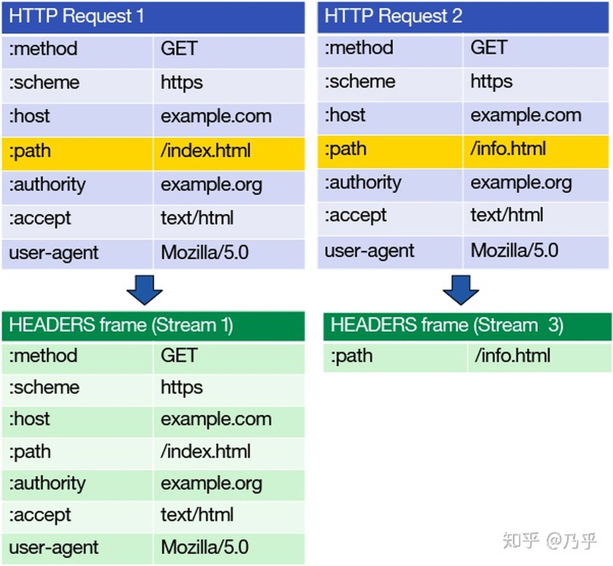
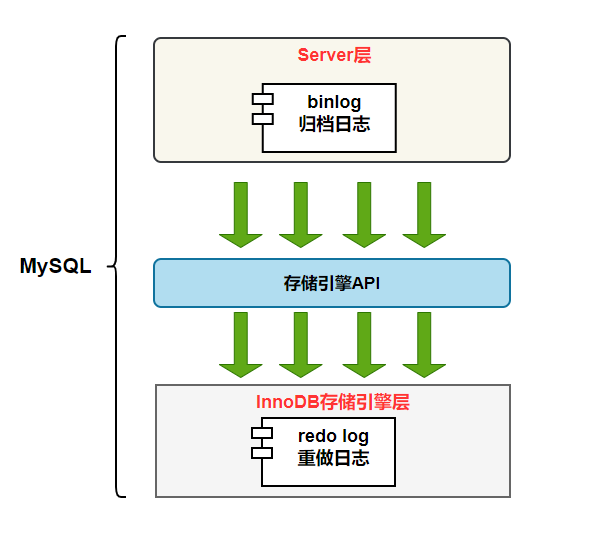

# 分布式锁（==待整理==）

## 分布式事务理解的偏差

> MySQL的“事务”往往是**不带业务逻辑**的，只是一系列的update；而一个业务事务是包含一系列业务逻辑的。（知乎的一个评论）

分布式锁其实是分布式服务器环境下的并发控制。先来理解一下单机的并发控制：VOA特性，如MySQL下的2PL，都涉及到了锁这玩意儿。

[GFS—3.2 错误的设计（Bad Design）](https://mit-public-courses-cn-translatio.gitbook.io/mit6-824/lecture-03-gfs/3.2-qiang-yi-zhi-xing-strong-consistency)中的例子很好地反应了我们讨论的情形。也就是要在分布式环境下进行并发控制，以保证一致性，或者说有序性（Order）。注意一个细节，为啥例子中是两个数据库S（S1 S2）呢？因为在单数据库的情景下是不存在并发安全的问题，因为所有的请求都会落在这一个数据库上，数据库有自己的并发控制解决方案。

为啥这种场景下不需要像事务一样保证原子性呢？使用如2PC这样的原子提交协议？很简单呀！因为这不是事务！**只需要进行并发控制**即可。换句话说，我们说的分布式事务的两个子问题：并发控制和原子提交，这只是分布式事务的两个子问题


## 加锁解锁原子性保证

[细说Redis分布式锁🔒](https://juejin.cn/post/6844904082860146695)

自从看了这篇文章，我发觉我之间的方向偏了，这里讨论的分布式和分布式事务一毛钱关系都没有，分布式锁的场景并不局限于数据库、持久化、分布式事务之类的，甚至说，讨论分布式锁并不是为了讨论分布式数据库那一套，而更多的聚焦于**分布式环境的并发上**（区别于单机并发）！和单机并发几乎唯一的、“致命的”区别是：

> 对于分布式项目，==有多少台服务器就有多少片JVM内存==，即使每片内存中各设置一把“独一无二”的锁，从整体来看项目中的锁就不是唯一的。
>
> 此时，**如何保证每一个JVM上的线程共用一把锁呢？**==答案是：把锁抽取出来，让线程们在**同一片内存**相遇。==（参考：[浅谈分布式锁 上](https://www.yuque.com/books/share/2b434c74-ed3a-470e-b148-b4c94ba14535/qzxaot#765715859acef5a14a1d7e8c95d6d33a)）

用我的话总结：==分布式并发单机化==。（即将分布式的并发转换为单机并发）

用redis作为分布式锁固然好，但是需要解决两个问题：加锁原子性和解锁原子性。

1️⃣加锁原子性，在2.6.12之前加锁是这么写的：

```bash
setnx Test uuid
expire Test 30 #设置k-v和过期时间必须分开,不保证原子性
```

也就是说，这是两条命令，无法保证原子性。出现这中情况的原因是2.6.12版本之前`setnx`是个单独的命令，而`set`命令没有`NX`参数。在此版本之后就解决了加锁原子性问题：

```bash
set {KEY} {VALUE} NX PX 3000 # 这是一条命令,能够保证原子性
```

所以一般说的*setnx*指的是set命令带上NX参数，保证了原子性。

2️⃣解锁原子性，本身这不是啥问题，直接`del {KEY}`，但是为了保证删除的这个锁是自己加的，需要验证VALUE（get命令）。于是现在的问题是需要保证*get—del*命令的原子性。解决的方案是，**采用lua脚本**，因为：

> 就算你在**lua**里写出花，执行也是**一条命令**(eval/evalsha)去执行的，一条命令没执行完，其他客户端是看不到的。（原子性保证）

```lua
-- lua删除锁：
-- KEYS和ARGV分别是以集合方式传入的参数，对应上文的Test和uuid。
-- 如果对应的value等于传入的uuid。
if redis.call('get', KEYS[1]) == ARGV[1] 
    then 
	-- 执行删除操作
        return redis.call('del', KEYS[1]) 
    else 
	-- 不成功，返回0
        return 0 
end
```

接下来不得不提到Redission，其实它就是提供了一整套完整的API，很多都是用lua脚本写的，保证了原子性。


# ✨✨✨✨✨✨✨✨✨

# 计算机原理和数学知识

### 密码学—哈希加密

参考：[加盐密码哈希：如何正确使用](https://www.tomczhen.com/2016/10/10/hashing-security/)

### 哈希碰撞的数学原理

参考阮一峰的文章：[哈希碰撞与生日攻击](https://www.ruanyifeng.com/blog/2018/09/hash-collision-and-birthday-attack.html)

要熟悉下边的公式，d表示取值空间，n表示在空间中生成多少个数。

$$p(n, d) \approx 1-e^{\frac{-n(n-1)}{2 d}}$$


### 原码、反码、补码

难点在负数上，**负数在计算机中是以它的补码形式存储的**。为啥？因为==A-B=A+**B的补码**==，所以负数直接存补码，很方便计算。

如何得到-6的补码？首先-6的源码是：**1**000 0000 0000 0000 0000 0000 0000 0110（注意首位是1），**然后对除了首位以外的取反**：

1111 1111 1111 1111 1111 1111 1111 1001，这就是-6的反码，然后，补码=反码+1：

1111 1111 1111 1111 1111 1111 1111 1010，ok，这就是-6的补码了

（一）练习（-5+3）：

-5：1101➡1010➡1011（分别是 原码➡反码➡补码）

3：0011

相加：1110，因为首位为1，所以结果一定一个负数，于是保留首位1进行下边的操作

减一：1101，

取反：1010，十进制-2的原码，首位是用来表示其符号的。

（二）练习（5-3）：

5：0101

-3：1011➡1100➡1101

相加：10010。因为溢出来一位，直接给忽视掉，相加的结果为：0010

首位为0，表明是正数，直接得到结果为2。

（三）练习（12-6）

通过前面两道题可以发现，符号位的处理也是很关键的。请回答这个问题：如何用最小的比特位表示(12)~10~？第一反应肯定是1101，但是，符号位呢？？？这里第一位是1，难道表示的是负数？所以，正确的表示方式应该是01101，比较简单的处理方式，添加一个0作为符号位即可。

12：01100

-6：10110➡11001➡11010

相加：100111，忽视溢出的首位：00110，即(6)~10~

（四）练习（8+8）

8：01000

8+8：10000，溢出了

为什么要举这个例子？是因为得考虑溢出的情况，要给足够的位数来表示数字。


### 有符号和无符号右移

见下边HashMap章节

### 由`unsigned int`引发的思考

思考的由来是看到了这个问题：[C中unsigned int和int有什么区别？](https://segmentfault.com/q/1010000009639067)，里边最高赞的回答让我很受用。

> 类型，决定了编译器如何解释一段内存的内容，比如`-2` 和 `4294967294` 其实在内存类保存的都是`0xFFFFFFFE`。当解释为`signed` 之后，就是前者，`unsigned`就是后者,甚至可以解释为是`float`。
> 而整型（包括char）间的类型其实只是改变解释方式，而不改变内存状态，所以`unsigned int a=-2`和`a=0xFFFFFFE`没有区别。
>
> `printf`的第二个以及之后的可以是任意类型的，所以，其实是`printf`这个函数让解释器是按照那些`%d`之类的东西确定为，比如`%d`是`signed` `%u`是 `unsigned`。
>
> 记住一件事情，**类型仅仅是为了防止我们这群菜鸟犯错**，<u>**编译后的代码是没有类型这么一说的**</u>。所以，在编译器保证没错的情况下，可以自动类型转换。在你很确定你没错的情况下，可以进行强制类型转换。
> 在java里面要求`if`后面必须是`Boolean`为了防止`==`写成`=`,比如`if(a==1)`（所以C里面一般到过来写`if(1==a)`）。这么做有好也有不好，好的是防止你犯错，坏的是没有那么灵活了万一你真想写`if(a=1)`呢，就要多加几个符号进行强制类型转换了。
>
> ```c
> #include<stdio.h>
> 
> int main(){
>     int a=0xFFFFFFFE;
>     float f,*p;
>     f=a;// signed整形转为float，这个类型转换会改变内存的状态
>     printf("%f",f); // -2.0000...
>     f=(unsigned int) a;  // 整型间的类型其实只是改变解释方式，而不改变内存状态。
>     printf("%f",f); // 4294967294.000...
>     p = (float *)&a;
>     printf("%d %u %f",a,a,*p); // -2 4294967294 -nan
>     return 0;
> }
> ```
>
> 至于为什么最后一个是`NaN`(Not A Number)，请看[`IEEE754`标准](https://baike.baidu.com/item/IEEE%20754/3869922?fr=aladdin&fromid=10427270&fromtitle=IEEE754%E6%A0%87%E5%87%86)

### IEEE 754 双精度浮点数内部表示法

参考：[IEEE 754 双精度浮点数内部表示法](https://devtool.tech/double-type)

非常常见的一个面试题：

```javascript
0.1 + 0.2 == 0.30000000000000004
```

这个现象在JavaScript、python这类语言中很常见，python不用说了，JavaScript对数字只有Number类型，于是不管整数还是浮点数，**都是用双精度浮点数表示的**，由此带来了精度问题。

双精度（`double`类型）共64位（8字节），2x4=8字节，单精度四字节（`float`类型，此类型是4字节哦！），所以叫双精度。科学计数法来表示的，一位符号位，11位指数位（确实不需要太多符号位），剩下的52位（6.5字节）都是小数位。

剩下最后一个问题，为啥指数部分有偏移量这个东西？看这个回答：[IEEE 754浮点数标准中64位浮点数为什么指数偏移量是1023？](https://segmentfault.com/q/1010000016401244)。

让人满意的回答，让我想起了之前学机器学习时的一个思想：标准化，让所有数据都以0左右基准点。这里的做法是，所有数字加上`0b1111111111`，也就是127，这样就能保证负数的值小于127，正数大于。这是为了避免一个弊端：如果用最高位作为符号位，那么负数在机器码的**表示上**会大于正数。

### 同步异步阻塞非阻塞：我终于找到让我满意的回答了

[怎样理解阻塞非阻塞与同步异步的区别？ - 萧萧的回答 - 知乎](https://www.zhihu.com/question/19732473/answer/241673170)，下边是文中的图片，也是《操作系统概念（第九版）》中的内容，关键的内容翻译一下就是：

> 进程间的通信是通过 send() 和 receive() 两种基本操作完成的。具体如何实现这两种基础操作，存在着不同的设计。 消息的传递有可能是**阻塞的**或**非阻塞的** – ==也被称为==**同步**或**异步**的：


# ✨✨✨✨✨✨✨✨✨

# ==数据结构==

## 跳表

参考：[skiplist跳表](https://github.com/Imatvoid/RedisGuide/blob/master/%E5%9F%BA%E7%A1%80%E6%95%B0%E6%8D%AE%E7%BB%93%E6%9E%84/skiplist%E8%B7%B3%E8%A1%A8.md)

最初的设计是，<u>上一层链表的个数，是下一层链表个数的一半</u>。但是这对插入和删除很不友好，复杂度退化到O(n)。

> 新插入一个节点之后，就会打乱上下相邻两层链表上节点个数严格的2 : 1的对应关系。如果要维持这种对应关系，**就必须把新插入的节点后面的所有节点（也包括新插入的节点）重新进行调整**。

如何解决？引入了**随机层数**的概念。

> skiplist为了避免这一问题，它不要求上下相邻两层链表之间的节点个数有严格的对应关系，==而是为每个节点**随机**出一个层数==(level)。

文中说这个插入的节点随机层数的特性好像很优越，性能上甚至优于B+树！

如何实现这个随机？

文中有对下边的伪代码进行了描述，两个参数是最为关键的：产生i+1层的概率p，和最大层数MaxLevel。

```c
randomLevel()
    level := 1 //每一个新插入的节点都有level 1
    // random()返回一个[0...1)的随机数
    while random() < p and level < MaxLevel do
        level := level + 1
    return level
```

Redis中p=$$\frac{1}{4}$$，而MaxLevel=2^5^。

然后文章中计算出平均每个节点包含的level数为$$\frac{1}{1-p}$$，这也是期望。所以当p为1/4时，期望大概是1.33。而BST每个节点固定包含2个指针，在内存层面有了一些优势。

红黑树和跳表的查询效率都是O(logn)，和二分查找一样（推导请[参考](https://www.jianshu.com/p/4fe210d7acdf)或[这个](https://itimetraveler.github.io/2016/04/06/%E2%80%9D%E4%BA%8C%E5%88%86%E6%9F%A5%E6%89%BE%E2%80%9C%E7%AE%97%E6%B3%95%E7%9A%84%E6%97%B6%E9%97%B4%E5%A4%8D%E6%9D%82%E5%BA%A6/)）。


## 哈夫曼编码==（待完成）==


## 专题：乐观锁和CAS，以及ABA问题

这玩意儿不只见到一次两次了！总结一下。参考：[面试：为了进阿里，又把并发CAS（Compare and Swap）实现重新精读一遍](https://segmentfault.com/a/1190000023839912)

为什么说乐观锁是一种无锁机制？文中说到：

> 总是假设不会产生并发问题，每次读取数据的时候都认为其他线程不会修改数据，所以不上锁，但是在更新的时候会判断一下在此期间别的线程有没有修改过数据，…

所以CAS总是和自旋锁之类的结合起来说，因为其实两者说的是一件事—乐观锁！所以，以后什么CAS、自旋锁乐观锁说得其实是一件事情。

同时可以发现，比如synchronized的锁升级机制让乐观锁和悲观锁联系更加紧密：

无锁—偏向锁—自旋锁—重量级锁（也就是悲观锁）。

文中还提到了ABA，要知道它是啥，以及它的解决方法。

**说一说悲观锁**

如果面试问到悲观锁的劣势，我觉得答案中必须回答park或挂起，直到占用资源的线程将其唤醒（notify），这也是锁的本质。同时也是悲观锁的缺点，挂起之后会有上下文切换，cpu的占用权会让给其他线程，所以缺点主要在上下文切换上。

> 如果一个线程持有锁，其他的线程就都会挂起，等待持有锁的线程释放锁。（来自上边的链接）


## 红黑树

这个看我chrome上收藏的那个b站视频

5. 二叉树

   今天学到了一个很重要的新知识，一个节点的前驱节点和后继节点。没看错，二叉树也是有前驱和后继的。一个节点的前驱和后继就是它先序遍历的前后两个节点。这两个概念用在删除节点的时候，非常重要。

   前驱节点：小于当前节点的最大值，也就是左子树最右边的叶子节点；后继节点：大于当前节点的最小值，也就是右子树最左边的子节点。

   删除了一个节点，就得用它的前驱或者后继来“顶替”它。比如这里50的前驱和后继节点分别是25和66。学习的是[这个视频](https://www.bilibili.com/video/BV135411h7wJ?p=1&share_medium=android&share_source=qq&bbid=XY501AC5563BA17870CDC80BBB41497E2200B&ts=1621949551677)

   

   下面这段实现代码我看了好久，目前总算看懂了，希望能对递归有更加深刻的认识。

   ```java
   // 删除以 root 为根的 BST 中的最大值的节点，利用 BST 的特性
   private TreeNode removeMax(TreeNode root) {
       // base case，为true就是找到了root节点的前驱节点了，就应该删除，做法很巧妙，直接返回左孩子节点，这样就把自己给删除了
       if (root.right == null) {
           //这个地方想了好久！比如上边的图如果没有80这个节点，那么75就是前驱了，那么删除75就是把它的left 66返回给50即可。太妙了！！！
           //反正都是root右子树，都比root大！
           return root.left;
       }
       //对于这种要拿递归函数值“搞事”的情况，最为复杂。它能得到的返回值只可能有两种，也就是return root.left或root，或说只用考虑return中的值作为返回值
       //此外，请注意这个root到底是谁？！就是参数中的那个root，root.right!=null的那个root，是**当前**的那个root
       root.right = removeMax(root.right);
       return root;//我觉得这才是这段代码的精髓，返回当前节点，有了这段代码，这个递归函数就可以分为两个部分了，一个是直接返回root.left，一个是拿到递归返回值，一顿操作后，在这里返回自己
   }
   ```

6. AVL树

   如何旋转一个AVL？我觉得最关键的三个节点：

   **当前需要旋转的节点➡node**；node的父节点➡parent；node的左子节点➡child。则旋转的方式是：

   ```c++
   node->left = child->right;//子节点的右子树接到node的左子树上，这算是准备工作
   child->right = node;//...
   parent->left = child;//...
   ```

   总的思路我倒是开明白了，几个节点值的大小关系是：`child`<`child->right`<`node`，比较关键的是`child->right`，是`child`的前驱。这么看来，旋转的逻辑就很简单了：在不改变大小关系的前提下，将`child`作为`parent`的左子节点，这样便完成了旋转操作，核心是将`child->right`移动到`node->left`。

   

   视频中的例子可以看出，虽然AVL树的查询速度是很快的，但是构造一个节点值为1~10的AVL树，竟然需要旋转6次，也就是说，AVL树虽然能够保证很快的查询，但是新增和删除节点却很麻烦。有没有折中的方案呢？红黑树出场。

7. 2-3-4树

   这也是一种B树吧

   生长方式很特别，**从下往上的**，也就是说，它总是平衡的。

   - 2-3-4树和红黑树的等价关系，这非常关键！

     2-3-4树中有两种数据结构（树和链表），所以不是很方便操作

8. 红黑树

   所到之处，必有一黑

   首先，2-3-4树是一个满树（感觉也可以叫完全二叉树），于是转换成红黑树，原2-3-4树的每个节点由一个黑节点作**代表**，于是有多少层就是有多少个黑节点。

   2节点中只有一个节点，当然是黑色的；3节点那一个作自己节点的”代表“，于是有了”上黑下红“；4节点同样，”中间给黑，两边红“。


# ✨✨✨✨✨✨✨✨✨

# ==计网==

## 幂等性==（待完成）==


## 说一下从url输入到返回请求的过程

背一下这个回答吧：[链接](https://www.mianshiya.com/qd/54ad1eea61c724d0008d2c0778ba5380)


## encodeURI和encodeURIComponent区别

[参考](cnblogs.com/shuiyi/p/5277233.html)

根本原因是，“RFC3986文档规定，Url中只允许包含英文字母（a-zA-Z）、数字（0-9）、-_.~4个特殊字符以及所有保留字符”


## https的流程

### 数字证书

非对称加密：看[阮一峰](https://www.ruanyifeng.com/blog/2011/08/what_is_a_digital_signature.html)的回答。

有一点不是很理解，里面讲到了数字签名的比对，首先是Bob用自己的私钥加密了digest，生成signature。**然后Susan用Bob的公钥解密这个signature得到digest**，不是很理解，难道用私钥加密的可以用公钥解密？？？


下面这幅图也需要注意，一个报文有三样信息，记住这张图就行。也就是说，Bob的公钥都是状态数字证书里面，给Susan的。而且Susan的浏览器里面不会保存任何一个人的数字证书，只保存CA机构的公钥。而且这个CA公钥只为某个网站授信。

换句话说，Susan只信任CA机构。拿到的数字证书得是可信任的CA机构颁发的。


有点意思，浏览器的证书管理器中的证书是颁发给网站的。或者说，数字证书是和网站绑定的。

> 此网站出具的安全证书是为其他网站颁发的。


### SSL/TLS协议运行机制的概述

还是阮一峰的文章：[SSL/TLS协议运行机制的概述](SSL/TLS协议运行机制的概述)

TLS（transport layer security）、SSL（Secure Sockets Layer）

四次握手过程好TMD复杂。我觉得可以分为两个阶段：第一、二次；第三、四次。

前两次都是**Hello**（clientHello、serverHello）；

后两次分别是client和server的**握手结束通知**。四次握手最终的结果是，双方都得到了三个随机数，通过这三个随机数生成**会话密钥**。这三个随机数才是整个四次握手过程的关键。

为什么要有三个随机数呢？文中有解答。

为什么第三步client就结束握手了？因为它已经获得了三个随机数，因为第三个随机数（pre master key）就是client自己发送的。那么第四步，server接收到了这个pre master key后，它也得到了三个随机数，也能够生成解密算法了。

也就是说，整个TSL协商过程是为了双方协商确定三件事（第三件事是核心）：

1. **非对称加密算法**。这是在握手过程中采用的非对称加密算法，而不是对话密钥。如RSA 公钥加密。
2. **协议版本**。如TLS 1.0；我觉得协议版本中应该包含了所采用的对称加密算法，用来确定**会话密钥**的算法
3. ==**三个随机数**==，这个最为重要。其实四次握手的前两步就可以完成协议版本和加密算法的协商，而后面两步其实就是为了完成三个随机数的协商。

### 访问的站点是如何自动跳转到HTTPS的

看[这篇文章](https://www.sohu.com/a/136637876_487516)

总结一下重点：服务端相应header中的HSTS信息


## TCP全家桶

接着上边的https四次握手协商流程，我觉得TCP的三报文握手和上边的https三次随机数的协商异曲同工。

具体说，https需要获取三个随机数，所以进行了4次握手，而tcp连接的三次握手，需要协商双方的synchronized sequence number，也就是两个数字，所以进行了三次握手。

实际上，双方要协商n个数字，进行n次通信就够了，那为啥会进行n+1次通信呢？主要是第n个数组发送后，得确认对方收到没有，才多的这一次通信。中间数字的协商，比如第i个数字发送后，对方发来的i+1个数字中就带了这第i个数字的确认。

### 请回答：

问题来源：[计算机网络太难？了解这一篇就够了](https://juejin.cn/post/6844903951335178248#heading-14)

#### 1.保活计时器的作用？

参考：[17、保活计时器的作用？](https://juejin.cn/post/6844903951335178248#heading-16)

Keep Alive Timer。关键点是，连接是客户端主动建立的，那么理应客户端主动断开连接。于是出现了这样的情况：客户端中途宕机了！于是这个连接就永远无法被断开了。

为了解决这个问题，就出现了Keep Alive Timer。

#### 2.为什么 TIME-WAIT 状态必须等待 2MSL 的时间呢？

参考：[链接](https://juejin.cn/post/6844903951335178248#heading-14)。MSL，Max Segment Lifetime，报文最长生存时间。等待计时器的值就是2MSL

下边的图来自字节的imageslr的[TCP的三次握手和四次挥手](https://imageslr.com/2020/07/07/tcp-shake-wave.html#%E5%9B%9B%E6%AC%A1%E6%8C%A5%E6%89%8B)。强调几个细节

首先，CLOSE_WAIT状态时服务器的，这个时候服务器只需要传输完毕剩余的报文，就可以进行LAST_ACK 了。这里主要强调一下CLOSE_WAIT状态所在的位置，面试的时候也有考到和TIME_WAIT状态的区别。

如何理解CLOSE_WAIT状态呢？服务器等待自己剩下的消息发送完才进行关闭，所以他也在等待。

其次，TIME_WAIT状态由最开始主动关闭方保持，也就是这里的客户端。这是为了保证服务端的==**超时重传**==能够到达。

最重要的是文章中提到的这个问题的两点原因的第二点，这一点太细节了，如果面试的时候能够回答上，就很加分了

> (2) 防止已失效的连接请求报文段出现在之后的连接中。
>
> **TCP 要求在 2MSL 内不使用相同的序列号**。客户端在发送完最后一个 ACK 报文段后，再经过时间 2MSL，就可以保证本连接持续的时间内产生的所有报文段都从网络中消失。这样就可以使下一个连接中不会出现这种旧的连接请求报文段。**或者即使收到这些过时的报文，也可以不处理它**。


#### 3. TIME_WAIT状态的缺陷？

> `TIME_WAIT` 需要等待 2MSL，在大量短连接的情况下，`TIME_WAIT` 会太多，这也会消耗很多系统资源。对于服务器来说，在 HTTP 协议里指定 KeepAlive（浏览器重用一个 TCP 连接来处理多个 HTTP 请求），**由浏览器来主动断开连接**，可以一定程度上减少服务器的这个问题。

这让我注意到了，TIME_WAIT状态不论如何都要进行的。


### TFO（TCP Fast Open）

这是一个很隐蔽的知识点，打的就是猝不及防。[参考](https://blog.csdn.net/Free_time_/article/details/107443654)

我觉得核心是，C向S发送SYN请求后，S会确认一个SYN+ACK的，这是毫无疑问的。但是有了TFO这个机制，有了cookie，如果cookie校验合法，那么在SYN、SYN+ACK的同时，会进行HTTP的请求和相应！

其次，看到上边的HTTP没有？我觉得应该是只有在进行HTTP这个应用层协议的时候才会有这个优化，其他应用层协议是不会的．

优势：

> `TFO`的优势并不在首轮的`3`次握手，而在于后面的握手，在S拿到C的`Cookie`并验证通过后，**便可以直接返回`HTTP响应`**，充分利用了`1`个`RTT(Round Trip Time)`的时间提前进行数据传输。虽然一个来回没有什么太大的提升，但是如果数据发送的越多，这优势也就越大了。


## Cookie、Web Storage、Local Storage

[详说 Cookie, LocalStorage 与 SessionStorage](https://jerryzou.com/posts/cookie-and-web-storage/)参考这篇文章，这篇主要是讲解了三者的一些去区别。

要想比较好的理解web storage，那就得阅读Mozilla的文档：[Web Storage API](https://developer.mozilla.org/en-US/docs/Web/API/Web_Storage_API)。为啥我看到的国外的文档都写得这么好，有那么一点点崇拜。

我认为有两点区别比较关键：

一、生命周期

cookie的生命周期受参数MaxAge和ExpireDate控制

SessionStorage的生命周期

> Stores data only for a session, meaning that the data is stored until the browser (or tab) is closed.

即当前页面会话

LocalStorage的生命周期

> Stores data with no expiration date, and gets cleared only through JavaScript, or clearing the Browser cache / Locally Stored Data.

没有失效时间，除非手动清除

二、与服务器通信

WebStorage不参与服务器通信，仅保存在客户端。Cookie参与，这导致了如果Cookie过多，所有的Cookie都会在与服务器通信时携带上，造成性能问题。


## Cookie 被禁用怎么办?

参考：[链接](https://javaguide.cn/cs-basics/network/%E8%AE%A1%E7%AE%97%E6%9C%BA%E7%BD%91%E7%BB%9C%E5%B8%B8%E8%A7%81%E9%9D%A2%E8%AF%95%E9%A2%98/#%E4%B9%9D-http-%E6%98%AF%E4%B8%8D%E4%BF%9D%E5%AD%98%E7%8A%B6%E6%80%81%E7%9A%84%E5%8D%8F%E8%AE%AE-%E5%A6%82%E4%BD%95%E4%BF%9D%E5%AD%98%E7%94%A8%E6%88%B7%E7%8A%B6%E6%80%81)

> 最常用的就是利用 URL 重写把 Session ID 直接附加在 URL 路径的后面。

还是比较简单粗暴的，但是里边有一个比较重要的知识点：session也是基于cookie的，每次浏览器访问服务器带上cookie中的Session ID。


## （待完成）cookie和session存储在client哪个位置


## http/1.0 | http/1.1 |（SPDY）| http/2

重点阅读阮一峰的[HTTP 协议入门](https://www.ruanyifeng.com/blog/2016/08/http.html)，里面的内容对于面试来说几乎完美。

一个小问题：[【HTTP】GET传参最大长度的理解误区](https://www.jianshu.com/p/512389822f8b)	

### http/1.1

**持久连接和管道机制**

先有了持久连接，才会有在此基础上的管道机制。（这是1.1下的唯一重点）

持久连接体现在Header上就是：`Connection:keep-alive`。这样做是因为，建立一个新的TCP连接成本很高的，而且还有**慢启动**问题。

所以有了持久连接，让多个请求共用一个TCP连接。但是这里又出现了问题：虽然复用一个TCP连接，但多个请求还是得**排队**，有HOL问题，于是出现了管道机制（虽然还是无法解决HOL😂）。

管道化连接，也就是客户端多个请求发送的时候可以连续发送，**不用等待之前的接收，但接收的时候得依次接收**，==相当于造成HOL从client转移到了server而已==。

> HTTP 管道允许客户端在同一个 TCP 通道内连续发起多个请求，而不必等待响应，消除了往返延迟时间差。但现实情况由于 HTTP/1.x 协议的限制，不允许数据在一个链路上交错到达（IO 多路复用）。[参考](https://juejin.cn/post/6844903670979493901)

以下是持久连接和管道机制（[来源](https://juejin.cn/post/6844903670979493901)）：

这是*持久连接*，同一个TCP连接下的多个请求。按序发送，按序接收。


这是*管道机制*：**连续发送，（但）按序接收**。


**如何解决粘包问题的？**

首先要知道为啥会出现这样的问题，这是因为上边的持久连接和管道机制，一个TCP连接可以进行多个请求，==**而TCP将body视为无序的字节流，没有边界可言**==，于是需要HTTP，作为应用层协议，自己标识出每个请求的界限。

解决方法还是比较简单的：如HTTP协议的HEADER上的`Content-Length`。

思考一下HTTP/1.0为啥没粘包问题？

### SPDY

是谷歌发明的，被当作HTTP/2的基础，主要特性都在HTTP/2里面得到了继承。所以这个部分可以和HTTP/2合在一起。

但SDPY和HTTP/2有两点区别：

（1）相比于SPDY，支持明文传输，不强制用https加密

（2）header压缩算法和SPDY不同

> HTTP2.0 消息头的压缩算法采用 **HPACK** ，而非 SPDY 采用的 **DEFLATE**


### HTTP/2

四大特点：二进制协议、数据流、头部压缩、服务端推送。

#### 头部压缩

解决header冗余：每个HTTP请求的都要带上header，里边的数据经常会冗余。

> 假定一个页面有100个资源需要加载（这个数量对于今天的Web而言还是挺保守的）, 而每一次请求都有1kb的消息头（这同样也并不少见，因为Cookie和引用等东西的存在）, 则至少需要多消耗100kb来获取这些消息头。**HTTP2.0可以维护一个字典，==差量更新==HTTP头部**，大大降低因头部传输产生的流量。

这个字典中每一项都有一个索引号

<center>
    
    
</center>

#### 二进制协议

相比http/1.1基于文本，HTTP/2基于二进制。为什么基于文本比较低效？比如http的body里边是一段json数据：

```
{
    "uname":"liuhaodong"
}
```

从TCP中得到的这个数据是一堆二进制（01101001010…），首先要将它转换为字符串，然后再对这个字符串进行正则表达式匹配，或者状态机，得到 json 里边的键值对。从描述可以看出，我们的最终目标是得到键值对，但是中间需要一个转换成文本的过程。于是，HTTP/2直接省略掉这个中间过程，而且我觉得实现也很简单，类似TCP的头部，规定哪几个字节是seq，哪几个是ack，或者window。

可以看到下图的binary framing（二进制分帧）


#### 流（stream）✨✨✨

面试回答的时候必不可少的概念。**这是为了彻底解决HOL问题**！

因为一个TCP长连接中肯定有多个请求（1.0下一个TCP连接一个请求），为了解决之前的管道机制和长连接下的HOL问题，就引入了流这个概念，每一个TCP数据帧上都打上**stream identifier**。

> 在一个 TCP 连接上，我们可以向对方不断发送帧，每帧的 stream identifier 的标明这一帧属于哪个流，然后在对方接收时，根据 stream identifier 拼接每个流的所有帧组成一整块数据。
>
> 把 HTTP/1.1 每个请求都当作一个流，那么多个请求变成多个流，请求响应数据分成多个帧，不同流中的帧交错地发送给对方，这就是 HTTP/2 中的多路复用。

**一个思考**

在看看这篇文章：“ [31 时代之风（下）：HTTP2内核剖析](http://learn.lianglianglee.com/%E4%B8%93%E6%A0%8F/%E9%80%8F%E8%A7%86HTTP%E5%8D%8F%E8%AE%AE/31%20%20%E6%97%B6%E4%BB%A3%E4%B9%8B%E9%A3%8E%EF%BC%88%E4%B8%8B%EF%BC%89%EF%BC%9AHTTP2%E5%86%85%E6%A0%B8%E5%89%96%E6%9E%90.md) ”，我有了一个自己的理解：

在HTTP/1.x系列中，<u>所有的HTTP请求是建立在**真实的**TCP之上的</u>，怎么理解这句话呢？一个HTTP报文是直接发送到它的下一层即TCP中的，HTTP报文和TCP直接交互。

但是HTTP/2就不一样了，我认为这里有**虚拟化**的思想，也就是说，<u>**请求是建立在*stream*上的**</u>。每一个请求是一个流，每一个请求可以认为自己独享一个TCP连接。

#### 服务端推送（server push）

可以阅读：[HTTP/2 服务器推送（Server Push）教程](https://www.ruanyifeng.com/blog/2018/03/http2_server_push.html)


## DNS过程

**文章一：阮一峰—[DNS原理入门](https://www.ruanyifeng.com/blog/2016/06/dns.html)**

几种记录类型：A、AAAA、NS、CNAME、MX、PTR


**文章二：[全面理解DNS及HTTPDNS](https://juejin.cn/post/6844903987796246542#heading-8)**

递归DNS和转发DNS

递归DNS也叫Local DNS。稍微牛逼些，但也只是代理用户的DNS解析过程。DNS解析中最复杂的部分就是递归DNS完成的。

转发DNS就只是将用户的DNS请求转发给Local DNS，**比如家用路由器**。

共同点是，它们都有缓存。


阅读这篇文章，需要关注的重点是，Local DNS对根域名服务器、二级域名服务器等的请求，是通过访问它们的IP地址，然后这些域名服务器返回的也是一些IP地址！比如通过根域名服务器的IP地址访问一个根域名服务器，这个服务器返回的比如.com对应的顶级域名服务器，比如`.com: 23.34.35 23.45.12 78.45.321.75`，也就是一堆能够解析`.com`的顶级域名服务器的IP地址。

访问这些域名服务器，请求内容都是`www.baidu.com`，但是每个域名服务器的“能力”有限，比如根域名服务器只能解析`.com`，那么他就只返回`.com`的顶级域名服务器，Local DNS请求`.com`的服务器，仍然请求内容是`www.baidu.com`，得到的返回是`baidu.com`。


这篇文章中提到了两个问题，要知道它们的答案。

- 主机是如何知道DNS服务器地的IP地址的？

- 为什么DNS采用UDP协议 ？


另外，[这篇文章](https://www.cnblogs.com/linuxbug/p/4995326.html)的流畅算是非常全面的了。内容太多，自己去看。


## 停止—等待协议和ARQ协议（未完成）

停止-等待协议

自动重传请求ARQ，连续ARQ协议


## 滑动窗口和拥塞控制

### 拥塞控制

其实从图上可以发现，动态变化的值就只有一个：==slow start threshold==（慢启动阈值）。慢启动、拥塞避免、快重传快恢复都是固定的流程，受到改变的就只有ssthresh。


RTT，round-trip time，客户端到服务器往返所花时间

如何回答这个问题呢？有没有直接可以背的？🎯🎯🎯

> 先是慢启动阶段指数增长，到达了设置的阈值之后缓慢的线性增长；如果收到了3次重复ACK，说明网络中可能发生了数据包的丢失，**但还没有坏透因为至少还能收到ACK，此时就把阈值设为当前窗口的一半，同时从这个新的阈值线性增长（即快速恢复）**；如果触发了超时，说明网络确实拥塞了，窗口直接打回1，再接着慢启动，重复上面的过程。我觉得只要理解了，根本不用刻意去背。

### 滑动窗口

滑动窗口是接收端维护的变量，而拥塞窗口是发送端维护的变量。这是我总结的一个小结论。

不管怎样，还是得记住这张图，可能会问TCP的首部字段、一共多少字节。注意TCP的首部是没有包含IP信息的，只有源端口和目的端口。


##### 零窗口

这个TM绝对是个很细节的问题，面试官就喜欢搞这种突击。参考：[零窗口](https://imageslr.com/2020/tcp-flow-control-congestion.html#%E9%9B%B6%E7%AA%97%E5%8F%A3)

> TCP 使用来 ZWP（Zero Window Probe，**零窗口探针**）技术。具体是在发送端引入一个**计时器**，每当收到一个零窗口的应答后就启动该计时器。每间隔一段时间就主动发送报文，由接收端来 ACK 窗口大小。若接收者持续返回零窗口（**一般是 3 次**），则有的 TCP 实现会发送 **RST** 断开连接。

关键词：零窗口探针技术、计时器、三次、RST

好有意思，女朋友生气，哄三次。三次还生气，直接换（RST）


## TCP网络传输粘包

[怎么解决TCP网络传输「粘包」问题？ - 李晓峰的回答](https://www.zhihu.com/question/20210025/answer/1096399109)这篇回答比较浅显，”我客户端调用了两次send，怎么服务器端一个recv就都读出来了？！“

> ==我会把你的数据变成字节流发到对面去，而且保证顺序不会乱，但是你要自己搞定字节流解析。==

发送方粘包：主要原因是Nagle算法，将来自应用层较小的字节流进行合并发送。

接收方粘包：主要原因是接收方TCP缓存。结合一下Linux就知道了，一切皆文件，TCP接收到的在内核缓存中，通过调用recv从内核缓存中拷贝到进程私有空间中。所以，如何把这些数据分开，那就是应用层的事情了。

如何解决？其实粘包不是一个问题，或者说这不是TCP的问题，而是应用层协议的一些缺陷。TCP本身是基于字节流的，不会在意负载中的边界。

讲讲粘包的主要原因：[Nagle算法](https://imageslr.com/2020/tcp-flow-control-congestion.html#nagle-%E7%AE%97%E6%B3%95)

HTTP/1.0就已经解决了粘包的问题，在HEADER下有一个字段：`Content-Length:3495`（单位 字节）。所以，自己设计应用层协议，不用HTTP的话，也要自行解决粘包问题。


## Socket

### Socket位于TCP/IP的哪个层面？

将Socket描述成外观模式（[来源](https://juejin.cn/post/6844904125692379143#heading-33)），是很准确的，也就是传输层向应用层提供的一组接口。所以Socket能够支持的应用层协议千千万万。

> Socket是应用层与TCP/IP协议族通信的**中间软件抽象层**，**它是一组接口**。在设计模式中，Socket其实就是一个[外观模式](https://link.juejin.cn?target=https%3A%2F%2Fblog.csdn.net%2Fweixin_43122090%2Farticle%2Fdetails%2F104904625)，它把复杂的TCP/IP协议族隐藏在Socket接口后面，对用户来说，一组简单的接口就是全部，让Socket去组织数据，以符合指定的协议。

### TCP 和 UDP 可以同时监听同一个端口吗？

回答来自：[Socket 通信](https://imageslr.com/2020/07/08/tech-interview.html#socket)，好精辟！很本质

> TCP 和 UDP 可以同时监听同一个端口，操作系统根据五元组 **`{传输协议，源IP，目的IP，源端口，目的端口}`** 判断数据的接收者。

”传输协议“指的是TCP或者UDP，所以一个端口不仅可以同时支持TCP和UDP，还可以支持连接很多个客户端！都是一对多的关系。

### Socket编程总结

腾讯的一次面试问到了这方面的，学习一下。主要参考：[C语言中文网—socket](http://c.biancheng.net/view/2131.html)

```c
int socket(int af, int type, int protocol);//返回一个fd
```

```c
int bind(int sock, struct sockaddr *, socklen_t addrlen);//服务端，绑定IP:PORT。
int connect(int sock, struct sockaddr *serv_addr, socklen_t addrlen);//✨客户端，进行三次握手的地方
```

```c
//以下两个都是服务端的函数
int listen(int sock, int backlog);//服务端进入监听状态
int accept(int sock, struct sockaddr *addr, socklen_t *addrlen);
//listen() 只是让套接字进入监听状态，并没有真正接收客户端请求，listen() 后面的代码会继续执行，直到遇到 accept()。accept() 会阻塞程序执行（后面代码不能被执行），直到有新的请求到来。
//将listen和accept区分开来我觉得是个比较巧妙的设计，能够在开发者觉得合适的时间进行accept数据
```

```c
ssize_t write(int fd, const void *buf, size_t nbytes);
ssize_t read(int fd, void *buf, size_t nbytes);
```

```c
void close(int sock);//✨确切地说，close() / closesocket() 用来关闭套接字，将套接字描述符（或句柄）从内存释放，之后再也不能使用该套接字，与C语言中的 fclose() 类似。应用程序关闭套接字后，与该套接字相关的连接和缓存也失去了意义，TCP协议会**自动**触发关闭连接的操作。
int shutdown(int sock, int howto);//更加优雅的断开。可以只关闭输入流或输出流
//面试的时候如果能同时提到这两个API并且说出两者的区别应该是很加分的
```


有一个记忆的技巧：不管是TCP还是UDP，在开始收发数据之前，服务端调用的方法都是客户端的两倍。


## Session的实现

参考[labuladong的文章](https://github.com/labuladong/fucking-algorithm/blob/master/%E6%8A%80%E6%9C%AF/session%E5%92%8Ccookie.md#%E4%BA%8Csession-%E7%9A%84%E5%AE%9E%E7%8E%B0)

有点SPI的意思了，看下图就知道了。

可以将Provider理解为供应商、承包商（有点想电影里边的美国国防部的军火承包商），manager就像政府。这是一种解耦的设计。Session和Provider都是接口，只是实现不同。具体看看文章。


#### 如何回答Session的流程和实现原理？

[如何自己实现session功能](https://segmentfault.com/a/1190000015606464)里边说的流程非常适合作为面试回答：

> session本身的实现原理其实很简单，几句话就可以说完：
>
> - 用户**首次**访问时生成唯一ID(其实就是PHP中的`session_id`)
> - 根据session_id作为唯一标示，生成session_id为名称的文件(**储存session内容，当然也可以存到redis或者mysql中**)
> - 通过cookie下发`session_id`到客户端
> - 用户再次访问时会通过cookie将`session_id`带上
> - 服务端通过`session_id`获取对应的session内容(文件、Cache、数据库)

重点是，SessionId还是要依赖cookie存在客户端，sessionid在服务器端映射session数据结构，但这个数据结构的实例怎么存没有具体规定，可以存在MySQL、redis等。所以关键还是这个sessionid，怎么存数据是可以自定义的。

这个问题我在腾讯的那场面试被问到过，我应该回答我实现过类似session的provider，也就是存储session，然后给他讲jap那个项目如何实现缓存的。


## 四种常见的 POST 提交数据方式

看文章：[四种常见的 POST 提交数据方式](https://imququ.com/post/four-ways-to-post-data-in-http.html)

本质上，四种类型的content-type，都是POST请求的body的编码方式，告诉接收端你应该如何解码我的body。

按时复习即可。需要重点掌握的是multipart/form-data的方式，里面的格式稍微复杂一些，主要是多了一个==**boundary**==参数。


这里注意一个POST请求的特殊点：

> HTTP1.1 支持**只发送 header 而不发送 body**。原因是先用 header 判断能否成功，再发数据，节约带宽，事实上，post 请求默认就是这样做的。

下边是常考问题：


## POST和GET的区别？

参考：[面试官：说一下 GET 和 POST 的区别？](https://github.com/febobo/web-interview/issues/145)

本质上是没有区别的，只是使用上的一些**约定**。

1. **幂等性约定**：GET方法约定只是获取服务器资源，而POST约定用于提交资源，改变**服务器状态**，因此对服务器具有副作用，需要保证幂等性；
2. **参数约定**：约定GET的**请求参数**放在url中，POST请求参数放在body中。当然GET也可以有request body，但不能保证会被服务端正常解析，应该大部分服务端都不会解析GET请求的body吧😂；
3. **参数长度**：不同浏览器对GET的**参数长度**有限制，比如IE浏览器长度限制大约2KB，或没有限制；
4. **请求次数约定**：大多数浏览器，POST会产生两个TCP**数据包**（header➡100 continue + body➡200 ok），而GET只会发一次。特例是Firefox，均只会有一次数据包。


## Nginx，读作engine X

#### 零碎知识

正向代理和反向代理是基础知识，[这篇文章](https://juejin.cn/post/7005354276755095560#heading-2)讲了。

> 正向代理即是**客户端代理**，代理客户端，服务端不知道实际发起请求的客户端。
>
> 反向代理即是**服务端代理**，代理服务端，客户端不知道实际提供服务的服务端。

nginx的ip_hash很有意思：

> iphash对客户端请求的ip进行hash操作，然后根据hash结果将同一个客户端ip的请求分发给同一台服务器进行处理，**可以解决session不共享的问题**。

主要记住nginx的三个特点，面试的时候应该会问细节。

反向代理

负载均衡

动静分离

### 进程池+单线程

参考“ [34 Nginx：高性能的Web服务器](http://learn.lianglianglee.com/%E4%B8%93%E6%A0%8F/%E9%80%8F%E8%A7%86HTTP%E5%8D%8F%E8%AE%AE/34%20%20Nginx%EF%BC%9A%E9%AB%98%E6%80%A7%E8%83%BD%E7%9A%84Web%E6%9C%8D%E5%8A%A1%E5%99%A8.md) ”

下面这段话把我想说的一点不剩的都说了，让我哑口无言。

> Nginx 在启动的时候会预先创建好固定数量的 worker 进程，在之后的运行过程中不会再 fork 出新进程，这就是进程池，而且可以自动把进程“绑定”到独立的 CPU 上，这样就完全消除了进程创建和切换的成本，并且能够充分利用多核 CPU 的计算能力。

但是我还是得说明一下，什么叫进程池+单线程。多个进程怎么可能是单线程呢？一个进程至少会有一个线程呀。就是这个意思！也就是说，一个进程就永远只有一个线程，不会再`pthread`多个线程。

关于多路复用的知识，请看一看后边**EPOLL.一些思考**中的文字。


# ✨✨✨✨✨✨✨✨✨

# ==Mysql==

## 并发控制

我缺乏对这个部分体系的认识，目前来看有三种并发控制：悲观并发控制、乐观并发控制、MVCC。

悲观锁中，包含读写锁，还有锁的粒度，比如行锁、表锁等，以及显式/隐式锁，意向锁

乐观锁，也是基于时间戳的协议。内容有点类似CAS，也即是会先拷贝所有的修改到本地，然后根据时间戳看看能不能提交，若可以提交，就将副本修改到数据库，否则回滚所有修改。

## 三大范式

知乎上这篇回答不错：[如何理解关系型数据库的常见设计范式？](https://www.zhihu.com/question/24696366/answer/29049568)


## MySQL架构

按照stateful和stateless区分：无状态的Server层，和有状态的存储引擎层。

Server层除了查询缓存都比较关键，要知道它们的功能，面试的时候可能会考。特别注意以下优化器，执行计划生成之处。

引擎层是插件式的


### InnoDB

我觉得比较关键的是它的redo log模块，这是InnoDB独有的模块。注意哈，redo log是存储引擎的模块，而不是server层的模块。


## redo log、bin log和undo log

参考文章：✨[必须了解的mysql三大日志-binlog、redo log和undo log](https://segmentfault.com/a/1190000023827696)、和JavaGuide的[《MySQL三大日志》](https://snailclimb.gitee.io/javaguide/#/docs/database/mysql/MySQL%E4%B8%89%E5%A4%A7%E6%97%A5%E5%BF%97?id=%e5%89%8d%e8%a8%80)

先看看bin log和redo log在MySQL架构中的位置：



首先得复习一下：**buffer pool**。它是对磁盘中的数据页面的缓存，对数据的修改（删除插入更新）是不会立马落盘的，而是先在buffer pool中修改，这是为了减少IO开销。虽然减少了IO开销，但是持久性还得保证，如何保证？


### *redo log*

**InnoDB存储引擎**上对持久性的保证通过*redo log* 实现。

redo log也有自己的buffer（好无语，怎么啥都有buffer😂）：

> …会把“在某个数据页上做了什么修改”记录到重做日志缓存（`redo log buffer`）里，接着刷盘到 `redo log` 文件里。

再来看一下redo log的每条记录的组成：

> 每条 redo 记录由“***表空间号+数据页号+偏移量+修改数据长度+具体修改的数据*** ”组成

于是，可以得出一个”伟大“的结论：==redo log记录的是**数据页**的变更==（更加底层）！正因如此，它才被称作是数据库的物理日志。

这也是为啥说MyISAM存储引擎没有崩溃恢复能力（或说不支持持久性）的原因了，因为它没有实现类似redo log的玩意儿。

### 为什么需要redo log？

总的来说，redo log也是一种[Write Ahead Log](https://blog.csdn.net/Androidlushangderen/article/details/91061456)：

1. 数据库的基本单位是页，为16kB，如果：

   > **只要每次把修改后的数据页直接刷盘不就好了，还有 `redo log` 什么事？**

   那么，即使只修改几字节的数据，比如将年龄从16改成17，那也会进行16kB的刷盘，太浪费资源！

2. 采用redo log的好处是，只记录事务对数据页做了哪些修改（类似replicated state machine），一行redo log记录只有几十字节（包含表空间号、数据页号、磁盘文件偏移量、更新值），且**顺序写入日志文件组**，所以刷盘速度很快。

#### redo log记录的方式

核心问题在于，redo log是不必像bin log一样永久保存的！也就是说，相关记录真正写入磁盘后，相应的redo log记录就可以丢弃。

下图是redo log，采用的是循环数组的方式。

**write pos**在前，**checkpoints**在后。


### *bin log*

对于bin log，文中的理解是

> `redo log` 它是**物理日志**，记录内容是“在某个数据页上做了什么修改”，**属于 `InnoDB` 存储引擎**。
>
> 而 `binlog` 是**逻辑日志**，记录内容是语句的**原始逻辑**，类似于“给 ID=2 这一行的 c 字段加 1”，**属于`MySQL Server` 层**。
>
> ==不管用什么存储引擎，只要发生了表数据更新，都会产生 `binlog` 日志。==

上边写的”原始逻辑“，可以简单理解为SQL语句。

bin log有两个作用：

1️⃣ 数据恢复：（基本）通过**mysqlbinlog**工具恢复数据。这也是MySQL的server层对持久性的实现。

2️⃣ 主从复制：（进阶）复制的内容就是master中的bin log。下边会有主从复制的总结。

总的来说，两个日志都是记录的操作，但他们记录的内容是不同的。下边这段话更能够体现他们之间的区别：

> `redo log`（重做日志）让`InnoDB`存储引擎拥有了崩溃恢复能力。
>
> `binlog`（归档日志）保证了`MySQL`**集群**架构的数据一致性。
>
> 虽然它们都属于持久化的保证，但是侧重点不同。

也就是说，redo log主要是用来保证本地的一致性的，而binlog是**集群**的。

#### bin log的日志格式

[文中](https://segmentfault.com/a/1190000023827696#item-1-3)说到的三种，区分一下statement和row。理解它们的优缺点就知道它们其实是互补关系。

1️⃣ statement格式：基于SQL的复制。最大优点是记录操作，而非数据，所以大大节约了日志量。但是比如记录的`time()`、`sysdate()`函数却会导致主从的不一致。于是有了row格式。

2️⃣ row格式：基于行（记录）的复制。简单粗暴，直接记录哪条数据被修改成啥样。这种方式正好能够解决statement的格式的问题，但是又带来了一个问题，那就是产生大量的日志，主从复制会有大量的IO。于是有了MIXED格式。

3️⃣ MIXED：简单来说，**尽量用statement，它解决不了的用row**。

> 一般的复制使用 `STATEMENT `模式保存 `binlog `，对于 `STATEMENT `模式无法复制的操作使用 `ROW `模式保存 `binlog`

#### 主从复制

参考：[MySQL 主从复制原理不再难](https://www.cnblogs.com/rickiyang/p/13856388.html)

三个线程：master的log dump thread；slave的IO thread和SQL thread；

两个日志：master的bin log；slave的relay log。

下边这张图记住就行。

同时强调一下，bin log里的内容是字节码，不是文本，所以才适合通过TCP传输，因为不需要进行转换，类似HTTP/2。

再解释两个单词。dump，本意是垃圾场和丢弃，但是从字典发现这个单词在*计算机技术* 里边有专门的含义：转**储**、转**存**；relay，转发。（直接看英语释义即可）


### 如何保证redo log和undo log的一致性？---2PC

参考：[JavaGuide-两阶段提交](https://javaguide.cn/database/mysql/mysql-logs/#%E4%B8%A4%E9%98%B6%E6%AE%B5%E6%8F%90%E4%BA%A4)

这和XA架构中的2PC用的都是一样的基本思想，在prepare阶段所有数据都已经落盘，除了最后一行—**COMMIT RECORD**。

文中有一个问题需要注意，如果redo log的prepare阶段和binlog都落盘成功了，但是commit阶段失败了，这个时候需要回滚不呢？

答案是不需要！

> 并不会回滚事务，它会执行上图框住的逻辑，虽然`redo log`是处于`prepare`阶段，**但是能通过事务`id`找到对应的`binlog`日志**，所以`MySQL`认为是完整的，就会提交事务恢复数据。


### *undo log*

简单提一下，每一条记录（row）有两个隐藏信息，一个是trx_id，表示修改这条记录的事务id；另一个是roll_pointer，指向undo log的地址。

注意下边这幅图，这是各个buffer之间的关系。

> 在计算机操作系统中，用户空间( `user space `)下的缓冲区数据一般情况下是无法直接写入磁盘的，中间必须经过操作系统内核空间(`kernel space `)缓冲区( `OS Buffer `)。因此， `redo log buffer `写入 `redo log file `实际上是先写入 `OS Buffer `，然后再通过系统调用 `fsync() `将其刷到 `redo log file `中，过程如下

这里算是Linux的基础知识，在前边操作系统的零拷贝也有提到这种用户空间的缓存和内核缓存之间的拷贝。


## 为什么使用B+树而不使用红黑树？

参考：[链接](https://blog.csdn.net/Fly_as_tadpole/article/details/88169841)

> B树是多路树，红黑树是二叉树！红黑树一个节点只能存储一个值，B树一个节点可以存储多个值，红黑树的深度会更大，**定位时红黑树的查找次数会大一些**。

重点在加粗的地方，B树设计的目的就是在于减少磁盘IO的，一个节点就是一个页（16kB），可以存储一万多个索引节点。下边这句话也引发了我的思考：

> **AVL 数和红黑树基本都是存储在==内存==中才会使用的数据结构**

此外还有跳表，因为内存中的数据结构不必考虑磁盘IO这件事，于是适用于redis这种内存数据库。


# 

# ✨✨✨✨✨✨✨✨✨

# Redis

主要参考：[《我们一起进大厂》系列-Redis哨兵、持久化、主从、手撕LRU](https://juejin.cn/post/6844903989184577550#heading-7)

## 高可用如何保证

### 1. 哨兵机制


一般都是三个节点。

### 2. 主从同步

redis的分布式架构类似于zookeeper，master负责写请求，slave负责读请求。这样能够保证高可用，但是牺牲了一致性。

如何保证主从同步的呢？它的方式不是zookeeper的了，我觉得非常秒：在初始化slave的时候，用到的是state transfer（RDB），而slave工作的时候采用的是replicate state machine（AOF）。

## 布隆过滤器

阅读这篇文章：[Redis-避免缓存穿透的利器之BloomFilter](https://juejin.cn/post/6844903982209449991#heading-4)

需要注意上边对布隆过滤器缺点的描述


## 缓存穿透和缓存雪崩

总的参考文章，[来自JavaGuide](https://snailclimb.gitee.io/javaguide/#/docs/database/Redis/redis-all?id=%e7%bc%93%e5%ad%98%e7%a9%bf%e9%80%8f)

#### 内存穿透解决—布隆过滤器

这是比较缓存穿透的比较好的解决方案，看[这篇文章](https://github.com/Snailclimb/JavaGuide/blob/master/docs/cs-basics/data-structure/bloom-filter.md)

看这张图就明白了


#### 缓存雪崩

记住下面这句话就行了。

> **缓存在同一时间大面积的失效，后面的请求都直接落到了数据库上，造成数据库短时间内承受大量请求。** 这就好比雪崩一样，摧枯拉朽之势，数据库的压力可想而知，可能直接就被这么多请求弄宕机了。

失效的原因大概两种，第一种缓存直接宕机了，解决方法是集群，避免单点故障，或者限流；第二种是热点数据大面积失效

> **有一些被大量访问数据（热点缓存）在某一时刻大面积失效，导致对应的请求直接落到了数据库上**

解决方案文中给了两点：

> 1. **为缓存数据设置随机的过期时间，避免恰好在同一时间都失效。**（这一点比较重要）
> 2. 缓存永不失效。


## Redis的底层数据结构

### 前言：理解跳表

这个是Redis面试的常考题目。在[Redis 为什么用跳表而不用平衡树？](https://juejin.cn/post/6844903446475177998#heading-2)中回答了一个非常常考的问题：

##### ✨面试：为啥 redis 使用跳表(skiplist)而不是使用 red-black？

问的是“不适用B+树”的回答也一样。文中对比了一下，我总结起来有这么几点，可以用作面试的回答：

1. 内存占用。二叉树每个节点有2个指针，而跳表每个节点包含的指针数目**平均**为$$\frac{1}{1-p}$$，一般p取1/4，所以为1.33，小于二叉树的2。
2. 算法实现。跳表比平衡树简单得多。
3. 插入删除。主要体现在，平衡树插入和删除是需要**旋转**（左旋右旋，见前边AVL），即**re-balance**，以保持平衡，这会影响到二叉树的其他部分。而跳表“只需要修改相邻节点的指针，操作简单又快速”，这是一个更加局部的操作。（[这里](https://juejin.cn/post/6893072817206591496#heading-22)的回答更好）。
4. 查询效率，平衡树和跳表都是O(logN)，水平相当。

##### Redis中跳表的实现


### 底层数据结构和它们的实现

参考：[Redis数据结构底层实现](https://segmentfault.com/a/1190000040206818)、[Redis 常见数据结构以及使用场景分析](https://javaguide.cn/database/redis/redis-questions-01/#redis-%E5%B8%B8%E8%A7%81%E6%95%B0%E6%8D%AE%E7%BB%93%E6%9E%84%E4%BB%A5%E5%8F%8A%E4%BD%BF%E7%94%A8%E5%9C%BA%E6%99%AF%E5%88%86%E6%9E%90)

总的来说一下，我改变了对redis的认识，一个重大改变：我之前都看作是键值对，就像`set myKey 123`，但是myKey其实不要理解为键，而是**对象**！这样理解，才能比较好的理解后边的set、hash等等。所有的数据操作指令的第一个参数都是对象，比如`rpush myList value2 value3`，第一个参数就是对象。

###### sorted set➡ziplist、skiplist   🧨

> 跳跃表是sorted set的底层实现**之一**， **除此之外它在 Redis 中没有其他应用**。

> 有序集合保存的元素数量小于 128 个并且保存的所有元素成员的长度都小于 64 字节。使用 ziplist 编码；否则使用skiplist；

```c
if(元素数量<128 && 所有元素成员**长度**<64Byte) ziplist;
else skiplist;
```

**常用命令：** `zadd,zcard,zscore,zrange,zrevrange,zrem`


###### set➡类似HashSet

> 集合对象保存的所有元素都是整数值并且保存的元素数量不超过 512 个，使用intset 编码；否则使用hashtable；

**常用命令：** `sadd,spop,smembers,sismember,scard,sinterstore,sunion` 等


###### hash➡数组+链表（jdk1.8之前的HashMap）

**常用命令：** `hset,hmset,hexists,hget,hgetall,hkeys,hvals` 等

特别适合存储entity，看就知道了：`hmset userInfoKey name "guide" description "dev" age "24"`


###### list➡双向链表

这是一个**双向链表**，而且还是redis自己实现了，因为C不像Java，已经内置了一些常用了数据结构（如`LinkedList`）。

常用命令：`rpush,lpop,lpush,rpop,lrange,llen` 等。里边的r-right，代表头部；l-left，代表尾部。


###### string➡SDS

常用命令：`set,get,strlen,exists,decr,incr,setex`

原来之前用的redis都是这个最简单的数据结构，前边高端的数据结构一个都没接触过，连命令都不知道…

底层数据结构并没有用C提供的string，准确来说C是没有string类型的，而是`char*`类型，而是自己构建了SDS（Simple Dynamic String，简单动态字符串）。

> 相比于 C 的原生字符串，Redis 的 SDS 不光可以保存文本数据还可以保存二进制数据，并且获取字符串长度复杂度为 O(1)（C 字符串为 O(N)）,除此之外，Redis 的 SDS API 是安全的，不会造成缓冲区溢出。

## 持久化方案---RDB和AOF

参考：[Redis专题：万字长文详解持久化原理](https://segmentfault.com/a/1190000039208726)、[Redis持久化](https://segmentfault.com/a/1190000002906345)

RDB的持久化方式之一让我眼前一亮：**`fork()`**。

> 操作系统提供的fork()函数创建的子进程可获得与父进程一致的内存数据，相当于获取了内存数据副本

本质上是操作系统的写时复制（copy-on-write），子进程和父进程的虚拟地址空间相同，只有在进行写页面的时候操作系统才会为其开辟新的物理页面。


AOF解决的问题是实时的持久化，只记录对KV的修改操作，类似复制状态机，文章用用了个很屌的术语：**命令重放**。

需要注意的是，这种方式有一个很致命的缺陷：频繁的IO。有类似于MySQL的解决方案，buffer pool，所有的刷盘操作都是先进入缓冲区，有操作系统等控制真正刷盘的时机。所以AOF允许制定不同的`fsync()`策略，比如每秒进行一次`fsync()`：

> - always：每次都调用`fsync()`，是安全性最高、性能最差的一种策略。
> - no：不会调用`fsync()`。性能最好，安全性最差。
> - everysec：仅在满足同步条件时调用`fsync()`。这是官方建议的同步策略，也是默认配置，做到兼顾性能和数据安全性，理论上只有在系统突然宕机的情况下丢失1秒的数据。

AOF的问题同样也很明显：文件太大，这是因为记录的都是STATEMENT，而不是像RDB那种ROW。


# ✨✨✨✨✨✨✨✨✨

# RocketMQ—消息队列

参考JavaGuide的[RocketMQ入门总结](https://javaguide.cn/high-performance/message-queue/rocketmq-intro/)

## 主题模型—Queue

这是出现的第一个重要概念。这只是一种标准（接口），每一种消息队列的**实现**是不同的。
如Kafka：分区；RabbitMQ：exchange；RocketMQ：队列。


对于一个消费者组，消费一个Topic中的一个队列，只需要派出一个消费者就行了，分工明确。生产者也类似（只是类似），同一个消息只需要发布到Topic中的一个队列就可以了。即消费者和Topic下的queue一一对应。

###### offset—消费位移

兼顾了两件事：

1. **幂等**，被消费过的消息不会再次被消费；
2. 实际情况下会有**多个**消费者组，每个消费者组的**消费速度**是不同的。

因此，每个消费者组都会在Topic的每个队列上维护一个offset（消费位移）。

## 技术架构—broker、NameServer、P&C

Broker可以直接理解为一个MQ**实例**！见下图

这里需要学会一个帅气的名词：==**Topic分片**==。这让我有一种感觉，Topic实际上是一个==**逻辑上**==的概念。

broker一般情况下会做集群，而且是主从架构的。每一个broker都会有所有Topic的分片，但是不一定有所有的Queue，这个特点在下图的Topic C比较明显。


NameServer是注册中心，通常是集群，且是**去中心化**的！主要的目的是保证Broker的**高可用**（High Available）。

如何实现？好好理解下边的话就行了

> 为了保证 `HA` ，我们的 `NameServer` 也做了集群部署，但是请注意它是 **去中心化** 的。也就意味着它没有主节点，你可以很明显地看出 `NameServer` 的所有节点是没有进行 `Info Replicate` 的，在 `RocketMQ` 中是通过**单个Broker和所有NameServer保持长连接** ，并且在每隔30秒 `Broker` 会向所有 `Nameserver` 发送==**心跳**==，**心跳包含了自身的 `Topic` 配置信息**，这个步骤就对应这上面的 `Routing Info` 。


## 持久化机制—commitLog和consumeQue文件

**commitLog**

物理层面上的，所有的消息本质上都是存储在这里。和InnoDB的redo log有一个很相似的地方，那就是**文件组**，每个文件1G大小，写满一个写下一个文件，且**消息顺序写入**commitLog。

这也是为啥需要consumeQue了，这是因为commitLog存储的是消息本身，于是内容**不定长**，很难索引到，于是需要在consumeQue中记录`offset-size-hash(tag)`。

**consumeQue**

可以理解为<u>commitLog的==**索引**==</u>，也可以直接理解为queue，记录了消息在commitLog中的：`offset-size-hash(tag)`，分别指物理偏移量（8 Byte）、消息的大小（4 Byte）、tag的哈希值（8 Byte）。

存储路径为：`$HOME/store/consumequeue/{topic}/{queueId}/{fileName}`。`fileName`里边存储基本单位为**条目**，单个文件（`{fileName}`）可以存储30个w的条目。而里边的每个条目固定长度，20字节，也就是上边说到的`offset-size-hash(tag)`。

每个条目固定长度有个绝佳的好处，那就是查询每一个条目时间复杂度是O(1)！和数组一样！


## 为什么使用消息队列？

可以看这篇文章（写得很不错）：[01 为什么需要消息队列？](http://learn.lianglianglee.com/专栏/消息队列高手课/01  为什么需要消息队列？.md)
里边说了三点：1. 异步处理；2. 流量控制；3. 服务解耦

总的来说，后台服务器本质上是**I/O密集型的**，所以性能瓶颈不在CPU，而在I/O上。在并发很高的情况下，服务器将会消耗相当的资源建立请求。

> 秒杀开始后，当短时间内大量的秒杀请求到达网关时，不会直接冲击到后端的秒杀服务，而是先**堆积**在消息队列中，后端服务按照自己的**最大处理能力**，从消息队列中消费请求进行处理。

#### 流量控制

采用了mq的好处是，服务器能够按自己的最大处理能力接收请求，而超量的请求将会被堆积在mq中，而不会对服务器造成冲击。（流量控制）

#### 服务解耦

慕导给了一个很好的例子来理解服务解耦，非常值得学习🎈：[重学 Java 设计模式：实战观察者模式](https://github.com/fuzhengwei/CodeGuide/blob/master/docs/md/develop/design-pattern/2020-06-30-重学 Java 设计模式《实战观察者模式》.md)。里边主要用到了观察者模式和模板模式。简单来说，是把消息分发这件事情交给了队列，即该任务从后台业务本身中给剥离了。

#### 异步处理

应该是流量控制类似，不知道大家有更好的理解没❓❓❓


## 如何保证消息不丢失？-P&C、mq、集群 四方面

准确说如何保证消息能够被正确持久化，因为保证消息不丢失太简单了，毕竟有TCP。但是不能保证消息在P、Q、MQ**进程中流转**的过程中在没有持久化，或者没有处理完之前进程宕机了，所以有了下边一系列的解决方案。

参考：[恕我直言，90% 的程序员都扛不住这波 MQ 的面试四连炮！](https://gitbook.cn/books/5d65124b2b27dd24ed390665/index.html)

**生产者：**—异步与同步，异步回调

两种方式：事务消息和confirm。区别是同步和异步：

> 事务机制和 confirm 机制最大的不同在于事务机制是**同步**的，提交一个事务之后会阻塞在那儿，但是 confirm 机制是异步的，发送一个消息之后就可以发送下一个消息，然后那个消息 rabbitmq 接收了之后会**异步回调你一个接口通知你这个消息接收到了**。

回答的时候一定要答道异步回调！通过这个异步回调，可以让消息在mq上完全处理完毕后（发送给持久化、发送给消费者）在回调通知生产者，这样也不会阻塞生产者这边的流程。

**消息队列：**—WAL

前边讲的commitLog和consumeQueue。但是还需要考虑在没有持久化之前，也就是消息还在内存中的时候如何保证消息不丢失？因为mq是没有像InnoDB、LSM这些存储引擎的WAL（Write-Ahead-Log），**没有奔溃恢复的能力**（关键❗❗❗），所以一般会采用==**镜像集群**==的方式，本质上就是将消息复制到多个mq实例（broker）上。这里便会涉及分布式共识算法了（raft、paxos等）。

文中提到的普通集群模式，在RocketMQ中其实就是topic分片，每个分片并不保证拥有该topic下的所有queue。

**消费者：**—手动ACK

> 所以针对这个问题的解决方案就是：关闭消费者的自动提交 ACK，在消费者处理完这条消息之后再**手动提交** ACK。

因为消费者默认自动回复ack。


# ✨✨✨✨✨✨✨✨✨

# 杂七杂八

## 大数据面试题—如何在大量数据中判断一个数是否存在

位图（bitmap）：参考：[链接](https://blog.csdn.net/kingyuan666/article/details/84583980)。其中的方法二，天呐感觉好简单粗暴，2^32^，也就是申请那么大的内存。

布隆过滤器：参考：[链接](https://juejin.cn/post/6844903725253787655#heading-5)。

## 分布式ID

参考JavaGuide：[分布式ID-算法](https://javaguide.cn/distributed-system/distributed-id/#%E7%AE%97%E6%B3%95)

### UUID

有4个version了现在，这里以version 1为例，由32个16进制数构成。一个16进制数机器中站4位，所以32x4=128位=**16字节**。mysql的主键为bigint，8字节，所以用UUID做主键还是缺陷挺大，即空间占用大（1️⃣）。更重要的是！它是无序的！！！很难维护主键索引（2️⃣）！

无序性主要的问题应该在MAC地址上，timestamp是有序的。

（注意以上两点分析。回答的时候都要答上）


### snowflake

主要来探讨一下为啥这个算法能够保证有序的，首先41位的timestamp是自增的，datacenter_id（集群id）和worker_id（节点id）是固定的，最后的12位也是自增的！

此外，该id一共64位=8字节，刚好是bigint的长度！

> 也就是说单台机器**每毫秒**最多可以生成 4096 个 唯一 ID


## cache和buffer的区别

[Cache 和 Buffer 都是缓存，主要区别是什么？ - Towser的回答](https://www.zhihu.com/question/26190832/answer/32387918)

以下是关键的观点：

> cache 是为了弥补高速设备和低速设备的**鸿沟**而引入的**中间层**，最终起到**加快访问速度**的作用。
> 而 buffer 的主要目的进行==流量整形==，把
>
> **突发的	大数量	较小规模	 I/O** 
>
> 整理成
>
> **平稳的	小数量	较大规模	 I/O**，
>
> 以减少响应次数
>
> （下载电影的例子）

里边还提到一个让我眼前一亮的观点：TLB，也就是MMU的转移后备缓冲，它不是一个buffer，而是一个cache，所以，名字取错了！😂


## ANSI

“ANSI”系统就只存在于Windows系统。参考的是[这篇文章](https://blog.csdn.net/imxiangzi/article/details/77370160)

> 其实ANSI并不是某一种特定的字符编码，而是在不同的系统中，ANSI表示不同的编码。你的美国同事Bob的系统中ANSI编码其实是ASCII编码（ASCII编码不能表示汉字，所以汉字为乱码），而你的系统中（“汉字”正常显示）ANSI编码其实是GBK编码，而韩文系统中（“한국어”正常显示）ANSI编码其实是EUC-KR编码。


## [Linux中常用的命令都是哪些单词的缩写 - 知乎]( https://www.zhihu.com/question/49073893/answer/114438355)


## snowflake和幂等性保证

幂等性资料：[如何保证接口的幂等性](https://segmentfault.com/a/1190000020172463)

snowflake算法：[分布式唯一id：snowflake算法思考](https://juejin.cn/post/6844903562007314440)


## systemd专题

参考的是阮一峰的系列文章：[Systemd 入门教程：命令篇](https://www.ruanyifeng.com/blog/2016/03/systemd-tutorial-commands.html)

> 使用了 Systemd，就不需要再用`init`了。Systemd 取代了`initd`，**成为系统的第一个进程（PID 等于 1）**，其他进程都是它的子进程。

systemd是一种新的启动模式，代替了initd。

豁然开朗，结合上边的后台进程的缺陷：session结束后后台进程也很容易hang up，毕竟它始终都是session进程的子进程。systemd的解决方案也不难理解，直接让systemd作为系统第一个进程！那么，所有的进程都是它的子进程了，反正这个pid=1的进程结束后肯定所有的进程都得结束是吧，毕竟系统都结束了。

#### 12种UNIT

这是systemd的基本单位，命令`systemd list-unit-files`可以查看。最需要提及的是**target UNIT**，我感觉这是一个比较特殊的UNIT，它的功能是管理一堆UNIT，下边是最常见的一个target：multi-user.target下的所有unit。

每一种UNIT的配置文件的区分是它的后缀，service是一种UNIT，而target也是一种UNIT，那么它的后缀就是.target。比如default.target（本质上就是multi-user.target）。


#### [install]区块

一个这个区块是非常重要的，参考：[七、[Install] 区块](https://www.ruanyifeng.com/blog/2016/03/systemd-tutorial-part-two.html#:~:text=%E7%AD%89%E5%BE%8542%E7%A7%92%E3%80%82-,%E4%B8%83%E3%80%81%5BInstall%5D%20%E5%8C%BA%E5%9D%97,-Install)。

表明这个UNIT属于哪个target。

# ✨✨✨✨✨✨✨✨✨
