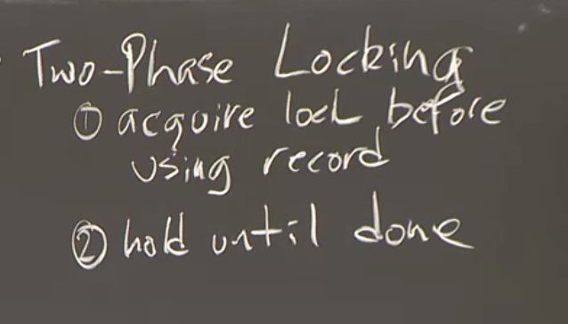

## 写在前边：分布式事务和分布式共识算法

> 之所以提及分布式事务，是因为对于拥有大量数据的人来说，他们通常会将数据进行**分割或者分片到许多不同的服务器上**。假设你运行了一个银行，你一半用户的账户在一个服务器，另一半用户的账户在另一个服务器，这样的话可以同时满足负载分担和存储空间的要求。对于其他的场景也有类似的分片，比如说对网站上文章的投票，或许有上亿篇文章，那么可以在一个服务器上对一半的文章进行投票，在另一个服务器对另一半进行投票。

这样一看就立马懂了，也就是说，分布式事务解决的业务场景是，多台服务器之间的关系是纵向的，没有冗余，存的数据都不一样，每一台服务器根据coordinator的分配，执行的事务是不同的。没有什么CAP理论，要说有的，绝对地保证原子性、隔离性、持久性、一致性，和本地事务的要求一摸一样。

但分布式共识算法实现的是**replication**，服务器之间的关系是stateful，且横向的，多台服务器为一台的备份、冗余。或者说，每一台服务器将要执行相同的指令（replicated state machine）。

这也是为什么我将这个讨论放在最开头，因为我发现这个课程—分布式系统，总的来说分为三个大类：

分布式计算（Lecture 01）：

分布式存储（Lecture 03 — Lecture 11）：

分布式事务（Lecture 12）：


## Distributed Computing

### MapReduce

MapReduce–>hadoop->spark，是这样的吗？他们都是分布式计算框架？

> hadoop:
>
> 它是一个**分布式计算+分布式文件系统**，前者其实就是 **MapReduce**，后者是 **HDFS** 。后者可以独立运行，前者可以选择性使用，也可以不使用
>
> 来源：https://juejin.cn/post/6844903734699376648


> MapReduce的思想是，应用程序设计人员和分布式运算的使用者，只需要写简单的Map函数和Reduce函数，而不需要知道任何有关分布式的事情，MapReduce框架会处理剩下的事情。

> 所以Reduce函数也是使用一个key和一个value作为参数，其中**value是一个数组**，里面每一个元素是Map函数输出的key的一个实例的value。对于单词计数器来说，key就是单词，value就是由字符串“1”组成的数组


## Distributed Transaction

首先，我尝试用ACID来描述一下为什么分布式事务会划分为**两个子问题**。

1️⃣ **Isolated**：与本地事务稍微有一些区别，本地事务中只会在操作记录的时候持有记录的锁一段时间（短时间持有），但是在分布式事务下会持有锁直到commit或abort（S2PL，长时间持有锁）。对应concurrency control子问题。

2️⃣ **Atomic**：在分布式事务中比较特殊，原因是分布式事务中涉及多个事务，协调者处理一个总的事务，有多少个参与者就得有多少个子事务。所以分布式事物的原子性得确保**所有事务**的原子性，而不是像本地事务一样，只用回滚或者提交一个事务即可。对应Atomic Commit子问题。

3️⃣ Duration：和本地事务没啥区别，一旦参与者的事务提交，还是用redo log来保证持久性。

4️⃣ Consistency：这是上面三种特性的结果。在分布式事务中，保证的是强一致性。具体是原子提交保证的。原子提交要求所有节点都能够commit后才能够持久化。

看了一位清华大佬的[分布式事务简介](http://tanxinyu.work/distributed-transactions/)博客，发现一个很重要的信息：

> 对于分布式事务，可以将其细化为**并发控制**和**原子提交**两个子问题。

我学习课程不是很认真呀，没注意到lecture 12的开头也提到了这两个子问题。根据这个思路，我对分布式事务进行了总结。

> **所以并发控制就是可序列化的别名**

lecture 12.1虽然将ACID都解释了一遍，但是重点还是落到了Isolated上，因为这和并发控制有关。课程中将isolated等价于可串行化（有点不准确），如何定义serializable呢？可串行化用数学的方式定义最好：

多个事务并行执行的结果，**存在**一种串行执行的结果与之相同，则表明这些事务是可串行化的，满足Isolated。

> 有些事情你需要记住，在一个完整的系统中，或许会有很多不同的并发运行事务，也会有许**多个事务协调者**在执行它们各自的事务。

多个事务协调者！这是我之前没想到的，视野局限在了全局事务（单服务器多数据源）。

#### Concurrency Control

*用于确保 Isolated*

比较经典的是悲观并发控制，在[分布式事务简介](http://tanxinyu.work/distributed-transactions/)中提到称为**Two Phase Lock**。既然是并发控制，那必然会涉及锁，这几乎是不可避免采用的手段，不论是并发事务，还是Java的多线程，都会涉及的重要概念。

> 对于两阶段锁来说，当事务需要使用一些数据记录时，例如前面例子中的X，Y，对于事务的规则：
>
> 第一个规则是，在使用任何数据之前，或者说在执行任何数据的读写之前，**先获取锁**。
> 第二个规则是，事务必须持有任何已经获得的锁，直到事务Commit或者Abort，==你不允许在事务的中间过程释放锁==。你必须要持有所有的锁，并不断的**累积**你持有的锁，直到你的事务完成了。所以，这里的规则是，**持有锁直到事务结束**。

考察参与者收到commit和abort指令。commit：将事务提交，磁盘中该事务的redo log生效，表明该事务已经持久化。abort：此时事务**并没有提交！**undo log有效，事务根据undo log回滚。



##### 质疑和驳斥：

❓❓❓**对下面的言论持疑：**

严格来说，课程中提到的two phase locking应该指的是S2PL（strict two phase locking）。因为2PL并非直到commit或abort时才集中释放锁，而是**只要事务在此之后==不再==使用到某记录即可释放该锁**。那么，可以这么描述2PL：将事务对==某个记录==加、解锁分为两个阶段：第一个阶段只能对该记录进行加锁，第二个阶段事务只能对该记录进行解锁。强调”某个记录“，也就是不能出现下面这样的情况：

```mysql
BEGIN T1
X-LOCK(A)
R(A)
W(A)
UNLOCK(A)
#....其他的一些事务操作
S-LOCK(A) # 在对A记录释放锁后又加锁，此时事务并没有结束，这样很可能出现脏读和脏写
R(A)
UNLOCK(A)
COMMIT
```

这段代码中，记录A被加了两次锁，这在2PL下是不正确的。也就是说，==对在一次事务中，**对一条记录**，只会有一次加锁和解锁==。再看看下面的例子：

```mysql
BEGIN T2
X-LOCK(A)
R(A)
A=A-50
W(A)
R(A)
X-LOCK(B) #在释放A的锁之前对B加锁了
UNLOCK(A) #对A解锁了，在此之后事务T2不会对A有任何操作。这种情况下还是会引发脏写。
R(B)
B=B+50
W(B)
UNLOCK(B)
COMMIT
```

这也是为什么我反复强调2PL是针对一条记录的，因为会看到对于不同的记录，会出现上面的加锁解锁交替的情况出现。

上面的代码和内容参考了[数据库隔离级别与2PL](https://niceaz.com/2019/03/24/isolation-2pl-mvcc/#%E6%95%B0%E6%8D%AE%E5%BA%93%E9%9A%94%E7%A6%BB%E7%BA%A7%E5%88%AB)这篇文章。

**🎈🎈🎈对上边内容的驳斥：**

我才发现，其实这和单机上的事务并发控制没有区别！你想想怎么可能有所谓的在事务中途释放锁的情况？？？这不是妥妥的脏写吗，还有[数据库隔离级别与2PL](https://niceaz.com/2019/03/24/isolation-2pl-mvcc/#%E6%95%B0%E6%8D%AE%E5%BA%93%E9%9A%94%E7%A6%BB%E7%BA%A7%E5%88%AB)中提到的所谓的**级联终止**，我举个例子就可以反驳：


也就是T2早早地就提交了，undo log都已经失效了。所以，所谓的2PL表述的其实是事务最基本的要求，不可能中途释放锁，**所有的lock操作都在unlock操作之前**。

##### 总结

参考文章：[详解MySQL两阶段加锁协议](https://segmentfault.com/a/1190000038163191)

里边将2PL和2PC进行了非常精辟的区别！2PL仅仅是本地的并发事务控制。然后将S2PL和2PL做了目前为止我觉得最有说服力的解释：加锁阶段没有区别，只有解锁又区别，S2PL对此做了更具体的规定：在commit或rollback==**后**==才解锁。

扩展阅读：[Transaction management：两阶段锁（two-phase locking）by Zixu Wang](https://hw311.me/zh/study-notes/database/2019/03/17/transaction-consistency-2PL/)


#### Atomic Commit

*用于确保 Atomic*

> **在分布式事务中，参与事务的所有节点必须全部执行 Commit 操作或全部执行 Abort 操作，即他们需要在”执行 Commit 还是 Abort”这一点上达成一致**。理论上有许多原子提交协议：2PC和3PC等等。

下面这两段话我觉得很重要：

> 有些事情你需要记住，在一个完整的系统中，或许会有很多不同的**并发运行事务**，也会有许**多个**事务协调者（TC）在执行它们各自的事务。在这个架构里的各个组成部分，都需要知道消息对应的是哪个事务。它们都会记录状态。==每个持有数据的服务器（参与者）会维护一个**锁的表单**，用来记录锁被哪个事务所持有==。所以对于事务，需要有*事务ID*（Transaction ID），简称为TID。

> 实际上，为了遵循两阶段锁规则，每个事务参与者在参与事务时，==会对任何涉及到的数据加锁==。所以我们可以想象，在每个参与者中都会有个表单，表单会记录一个数据当前是为哪个事务加的锁。当收到Commit或者Abort消息时，事务参与者会对数据解锁，之后其他的事务才可以使用相应的数据。这里的解锁操作会解除对于其他事务的阻塞。这实际上是可序列化机制的一部分。

我的理解是，事务中涉及的数据，在准备阶段会全部加锁（具体粒度要看数据库是表锁还是行锁），一旦**存在**参与者不能做到，即回复Transaction Coordinator: No，则这个全局事务就是失败的。

”对涉及数据加锁“，让我想到了TCC事务，感觉思想都是一样的➡预留资源，只是预留资源的方式可能不同。

在[分布式事务简介](http://tanxinyu.work/distributed-transactions/)中区别了原子提交和共识协议，我觉得对两者的区别解释得很好，特别是对共识的解释也很符合常识，共识确实不用所有人都同意，大多数就行。

> 范围不同：前者要求**所有节点**达成共识，后者要求**大多数**未故障的节点达成共识。


## Distributed Storage🧨

### 状态转移和复制状态机

这是两种基本的实现replication的方式，结合我的小文章《Why Hard—分布式存储系统的难点》，replication是fault tolerance的一种方式。

**state transfer：**

> **状态转移**（state transfer）背后的思想是，Primary将自己完整状态，比如说**内存**中的内容，**拷贝**并发送给Backup。
>
> 虽然VMware FT没有采用这种复制的方法（state transfer），但是假设采用了的话，那么转移的状态就是Primary**内存**里面的内容。

在《凤凰架构》的“分布式共识算法”章节下的评论对state transfer有着更详尽的解释：

> State Tranfer的核心思想是“当状态发生变化后，应在主、从状态==同步一致==之后再接受新的外部输入”，这个思想就是文中例子“手工复制文件到几块备份硬盘”背后的逻辑。

注意这里的核心：**同步一致**之后再接收新输入。根据我写的小文章：《Why Hard—……》，很明显，这是为了保证**强**一致性，不可避免会牺牲高性能。

**(replicated) state machine:**

在《凤凰架构》提到的分布式共识算法中，为了保证最终一致性，有两个条件：

1️⃣初始状态一样；2️⃣接受到的操作指令**序列**一致。

条件1️⃣指的是程序运行之前，载入内存的都是同一个程序，比如Java程序都是同样的jar包，里面包含的字节码文件及内容都一样。而条件2️⃣表示运行中的程序接受完全一致的输入，最终要保证的还是primary和backup程序的内存是完全一致的。而复制方法—state transfer，就显得比较“简单粗暴且直接”了，跳过了“接受到的操作指令序列一致”，直接拷贝内存达到目的。

对了，这里说的服务器我更觉得是数据库这种提供持久化的服务器，而不是web服务器。因为web服务器我认为更提倡无状态的，即使session这样的缓存其实都是允许丢失的，所以web服务器并不提供持久化。

> 所以，**复制状态机**不会在不同的副本之间发送状态，相应的，它只会从**Primary**将这些外部事件，例如外部的输入，发送给Backup。通常来说，如果有两台计算机，如果它们从相同的状态开始，并且它们以相同的顺序，**在相同的时间**，看到了相同的输入，那么它们会一直互为副本，并且一直保持一致。

”在相同的时间“这个条件容易忽视哦，毕竟时间其实也算是一个输入。

同样在《凤凰架构》章节下的评论，对replication state machine的解释：

> （State Machine Replication）的核心思想是“基于状态机初始状态一致、接受到的指令序列一致，就会得到一致结果的特性，只需保证各直接点接收的操作指令的内容及顺序一致，即可保证子节点最终状态的一致，==此时并不妨碍主节点继续接受外部输入==”。

“此时并不妨碍主节点继续接受外部输入”，也就是不必像state transfer一样保证同步，即不要求强一致性。


### 有关redis的一个猜想

我突然觉得redis的分布式和大程度上运用了这些分布式一致性原理！而且AOF相当于这里的replicated state machine，而RDB相当于state transfer。

我觉得redis似乎算是当代分布式设计集大成者？不止我一个人有这样的想法，在[4.2 状态转移和复制状态机](https://zhuanlan.zhihu.com/p/188723479)有这样的评论：

> 这里的状态转移就类似与redis中RDB（快照，全称可能是redis database），复制状态转移就类似与redis中的AOF（append only file），越看越觉得redis真的后端的大成者，里面好多值得学习的东西

正在看raft机制，确实是Paxos的退化版本啊，而且我觉得其日志的提交很像XA机制的2PC。


### Raft

> 最后，以上这种把共识问题分解为“Leader Election”、“Entity Replication”和“Safety”三个问题来思考、解决的解题思路，即“Raft 算法”，…[^1] （注，在MIT6.824的课程中第二个问题叫做Entry（条目，或log） Replication，个人更认可这个称呼）

分布式的CAP或者BASE特性中都有一致性（BASE中为Eventually Consistency），而Raft就是用来解决分布式存储中的一致性问题，是Paxos的退化版本。其实，所有的分布式共识算法，或说consensus algorithm其实都是Paxos的退化版本。

论文翻译：https://blog.csdn.net/liangjiubujiu/article/details/80949765

我感觉selection的过程太复杂了吧，为啥每个leader不直接指定一个接班人呢？这个问题论文中确实有讲到，且证明了这不是一个合适的方式。

随机超时时间我认为是选举机制的精髓，可以看看[raft官网](https://raft.github.io/)上的动画


### Zookeeper

为了使得增加服务器，性能增加一倍，**允许直接让follower响应读请求**。

> 所以，Zookeeper这里声明，自己最开始就不支持线性一致性，来解决这里的技术问题。如果不提供这个能力，那么（为读请求返回旧数据）就不是一个bug。这实际上是一种经典的解决性能和强一致之间矛盾的方法，也就是不提供强一致。

哈哈哈，深刻又幽默！“我玩完不给钱，就不算嫖了”😂。

sync操作：

如何保证读的线性一致呢？课程中提出了一个弥补方法，那就是sync操作。

思路比较好理解，在读请求之前，发送sync请求。这个请求和写请求是一个类型的，也就是会经过leader而非直接到达follower。这里的关键是，**在发送sync请求后才发送读请求**：

> 接下来，在发送读请求时，我（客户端）告诉副本，在看到我上一次sync请求之前，不要返回我的读请求。

具体是怎么实现的呢？下面是我的猜测。首先，对于写请求，每个log entry都会被leader打上全局性的zxid，那么sync请求也会这样。这不是很确定！但这是一个很重要的前提，下面的讨论都是基于这个zxid的。sync操作的本质，就是从leader那里搞到一个zxid，这个zxid代表的就是整个Zookeeper分布式存储系统的最新状态。

> 任何时候一个副本回复一个客户端的读请求，首先这个读请求是在Log的某个特定点执行的，其次**回复里面会带上zxid**，对应的就是Log中执行点的前一条Log条目号。客户端会记住最高的zxid，当客户端发出一个请求到一个相同或者**不同的副本**时，它会在它的请求中带上这个最高的zxid。这样，其他的副本就知道，应该至少在Log中这个点或者之后执行这个读请求。

我认为zxid真正的作用体现在第二个加粗部分，因为客户端的FIFO请求队列不一定会到达同一个副本，比如第一个写请求是到达的A副本，第二个请求到达了B副本，而这个B副本的log entries可能会“落后”，即不存在客户端带上的那个zxid。如果真的落后了，这个B副本会在获取到对应这个位置的Log之前，不响应客户端请求。


> **这里工作的原理是，每个Log条目都会被Leader打上zxid的标签，这些标签就是Log对应的条目号。**

> 所以，副本必然有一些有意思的行为来暂缓客户端，比如当客户端发送一个读请求说，我**上一次发送给Leader的写请求**对应了zxid是多少，这个副本必须等到自己看到对应zxid的写请求再执行读请求。

意思是客户端的读请求是不必产生zxid的吗？我觉得答案是肯定的，毕竟不请求不会有状态的改变。

我觉得得考察 *FIFO客户端序列*：

> 这是FIFO客户端请求序列的必然结果，（**对于某个特定的客户端**）读写请求是线性一致的。

这是一句非常好的总结！是的，对于单个客户端，因为它的请求序列是FIFO的，所以对它**自己发出的**读写请求而言是能够保证线性一致的。但是这句话又是那么的无用，因为实际情况下客户端不止一个，总体来讲并不能保证读写的线性一致。

> Zookeeper的另一个保证是，任何一个客户端的请求，都**会按照客户端指定的顺序来执行**，论文里称之为FIFO（First In First Out）客户端序列。

加粗部分所谓的 “指定的顺序” 应该指的是相对顺序，进入服务端后虽然两个请求不相邻，但是能够保证A在B前执行。

> 但是可以假设，为了让Leader可以实际的按照客户端确定的顺序执行写请求，我设想，客户端实际上会对它的写请求打上序号，表明它先执行这个，再执行这个，第三个是这个，而Zookeeper Leader节点会遵从这个顺序。这里由于有这些异步的写请求变得非常有意思。

这是文中的话印证了我的猜测，但是这里的序号并不是zxid，zxid是**leader**为每个log entry打上的标签，具有全局性唯一，而这里“客户端实际上会对它的写请求打上序号”中的“序号”，只是一个局部的序号，只是为了保证写请求的相对顺序不变。


Zookeeper和Raft之对比：

Zookeeper是运行在ZAB（类似Raft）上的**服务**。

> 相比Raft来说，Raft实际上就是一个库。你可以在一些更大的多副本系统中使用Raft库。但是Raft不是一个你可以直接交互的独立的服务，你必须要设计你自己的应用程序来与Raft库交互。

有意思，之前没有想到这一层啊，确实Raft只是一个库，而Zookeeper是对基于ZAB（类似Raft）的服务，服务确实比库好用啊。

> Zookeeper的 ZAB 算法与 Raft 的思路也非常类似，这些算法都被认为是 Multi Paxos 的等价派生实现。[^1]

其实两者并非只是类库和服务之间的区别，看了《凤凰架构》中有一章的名称就叫“从类库到服务”，发现确实水很深，请把握住。


对Stack Overflow的一篇文章的翻译：https://stackoverflow.com/questions/35387774/is-zookeeper-always-consistent-in-terms-of-cap-theorem/44845275#44845275

> ZooKeeper不满足A，而且不能放弃P（任何分布式系统都不能放弃），所以很明显它是CP系统。在CAP理论中，C实际上指的是线性一致性。
>
> > 线性：如果操作B在操作A成功完成后开始，那么操作B必须能看见系统同样的状态，因为它（操作B）是在操作A完成之后，或者更新的状态。（这应该讲得就是可见性，操作A的改变系统后的状态要对B可见）
>
> 但是ZooKeeper具有顺序一致性—来自客户端的更新操作（write）会以它们发送到服务器的顺序被应用。
>
> 然而，在客户端的视角看来，Zookeeper并不能实时地保证一致。
>
> > ZooKeeper不能保证每一个实例即时的同步，两个客户端看Zookeeper中的数据的的 “视角” 是不一样的。因为有网络延迟等因素，一个客户端可能在其他的客户端得到该更改通知前就更新该记录。	


### Aurora

一个很有意思的特点：应用定制存储（application-specified），而不是通用存储（general-purpose）。有点显卡和CPU的区别了，岂不是以后应用定制存储也要涨价？

关于Aurora历史，有些疑问：

> 不幸的是，对于数据库来说，EC2就不像对于Web服务那样完美了，最直接的原因就是存储。对于运行了数据库的EC2实例，获取存储的最简单方法就是使用EC2实例所在服务器的本地硬盘。如果服务器宕机了，那么它本地硬盘也会无法访问。当Web服务所在的服务器宕机了，是完全没有问题的，**因为Web服务本身没有状态**，你只需要在一个新的EC2实例上启动一个新的Web服务就行。但是如果数据库所在的服务器宕机了，并且数据存储在服务器的本地硬盘中，那么就会有大问题，因为数据丢失了。

真的服务器是无状态的？只是我觉得无状态的服务器是追求的理想吧。

哦，我看明白了，前面有提到

> EC2对于无状态的Web服务器来说是完美的。

这里的前提就是服务器都是无状态的🤣，用了一种理想的情况进行讨论，因为本章的重点也不在服务器，而是在数据库。

日，有点看不懂了，缓一缓再看看……


### GFS（Google File System）

> 我们知道 HDFS 最早是根据 GFS（Google File System）的论文概念模型来设计实现的。 


比较一下分布式存储和分布式数据库：

我倒是搞明白分布式存储和分布式数据库的一些区别了，这应该是两个不同的研究方向。分布式存储的持久化目标是文件，比如word文档，img格式的图片等等，都属于文件，我觉得阿里云的OSS静态资源存储服务可能就会用到GFS，或者HDFS啥的。而分布式数据库的目标是结构化的数据，与操作系统无关的数据，比如MySQL、redis。总之两种分布式的持久化目标是不一样的，没有谁比谁好，比如word文件，img文件就不适合存储在数据库中是吧，于是才会有阿里OSS等云存储服务出现。


**Bad Design:**

该小节提到了一个非常经典的糟糕设计，一种多副本的设计，为了实现fault tolerance的一种尝试。我觉得非常值得探讨，是因为之前在实验室的项目中有涉及，对redis和MySQL协同时的数据不一致性的讨论。导致该问题的根本原因是并发，但是解决方案已经有很多，原理是采用一个中间层，比如用redis实现分布式锁，访问某一个数据的时候要先到redis中拿到对应的锁。中间层思维在软件工程上非常重要，几乎是工程问题的灵丹妙药。

[redis的三种读写缓存模式](https://snailclimb.gitee.io/javaguide/#/docs/database/Redis/3%E7%A7%8D%E5%B8%B8%E7%94%A8%E7%9A%84%E7%BC%93%E5%AD%98%E8%AF%BB%E5%86%99%E7%AD%96%E7%95%A5)提到的三种方式都需要同步更像redis和关系型数据库（如MySQL）。然而，如bad design这章中提到的，在并发的情况下没有办法保证Redis和MySQL的数据是一致的。

出现这种问题的原因其实早在[浅谈分布式锁（上）](https://www.yuque.com/books/share/2b434c74-ed3a-470e-b148-b4c94ba14535/qzxaot#765715859acef5a14a1d7e8c95d6d33a)就有提到：

> **而上面介绍了，要想实现线程互斥，必须保证所有访问的线程使用的是同一把锁（JVM锁此时就无法保证互斥）**

而锁似乎是终极解决方案，如XA中的2PL。不论怎么样，最终都要保证一件事：

==同一个线程共享资源在同一时刻只能有一个线程在访问。==这是我自己的总结，好精辟。

那么，对于事务来说，对资源就可以可序列化访问了，在Distributed Transaction章节中就是concurrency control！！！大一统了！！！

我发现redis锁，和XA采用的并发控制方式应该是两种思路。XA的2PL并没有一个全局锁，而采用的是“累计锁”的方式。


# ARTICLES🚀🚀🚀


## 📃 Why Hard—分布式存储系统的难点

这应该是分布式存储系统设计的综述。总的来说，分布式存储系统的设计有两大目标：***high performance*** & ***fault tolerance***。

🎈**目标一：** ***high performance***

这也是最初的目标：如何用这些成百上千台计算机达到数倍于单机的性能。

> 人们设计大型分布式系统或大型存储系统出发点通常是，他们想获取巨大的性能加成，进而利用数百台计算机的资源来同时完成大量工作。因此，性能问题就成为了最初的诉求。

​		➡sharding：为了达到上述目标，一种解决方案是将占用超大空间的文件（如GB级别的，一个文件的大小甚至可能超过单个硬盘的容量）进行分片(sharding)，这样便能实现并发读取，使得读写速度超快。

> 为了获得大容量和高速的特性，每个包含了数据的文件会被GFS自动的分割并存放在多个服务器之上，这样读写操作自然就会变得很快，因为可以从多个服务器上**同时**读取同一个文件，进而获得更高的聚合吞吐量。**将文件分割存储还可以在存储系统中保存比单个磁盘还要大的文件**。

🎈**目标二：** ***fault tolerance***

分布式存储目标之二。某种意义上来讲，这也是为了保证high performance。如果一个相关节点宕机，对client的请求响应便会无限推迟，直到节点恢复。因为有成百上千台服务器，宕机数台服务器难以避免。所以，设计分布式存储系统就不能将服务器节点的宕机看作是故障，而视作一种常态，**即使出现宕机，或者说网络分区，系统仍能够提供服务**。不能因为某个节点的异常使得整个服务不可用。如何做到这一点？

​		➡replication：建立冗余，这是很自然的想法。replication是实现fault tolerance的一种解决方案。在VMware FT论文中有提到两种实现replication的思路：`state transfer`和`replicated state machine`。

我老是将replication和分布式事务搞混，但应该关系不大吧，也许分布式事务可以用来实现replication。

​		➡inconsistency：这是采用replication作为fault tolerance的解决方案不得不考虑的问题。一定会有数据副本，随之而来的问题便是一致性（定义：数据不同副本之间的差异）。而为了保证不同副本之间数据的一致，便有人提出了Paxos，以及它的退化版Raft等分布式共识算法

不得不提到的是，如果要满足一致性，那么就得**付出时间**等待副本之间数据同步，消除差异，但这样却会伤害分布式存储系统的设计目标：高性能，即导致low performance。这里便有取舍：（强）一致性还是高性能，这是个问题。“ *通常，人们很少会乐意为好的一致性付出相应的性能代价*  ”，除了一些特殊的业务场景，如金融、银行。所以便有BASE理论的提出，满足最终一致性即可，容忍系统内部一段时间的不一致性且对外不可见。或者，如Zookeeper一样，干脆不提供强一致性，或者说只对写提供强一致性，对读不保证返回的数据是最新的，只提供高可用性。


🚀🚀🚀🚀🚀🚀🚀🚀🚀🚀🚀🚀🚀🚀🚀🚀🚀🚀


# TIPS


阅读GFS论文原文的一些想法（[翻译版](https://juejin.cn/post/6844903858460721159#heading-25)）：

> 连接到每个应用程序的GFS客户端代码实现了文件系统API，并代替应用程序与master和块服务器进行通信，从而完成数据的读取和写入。客户端通过与master交互可以进行**元数据**的操作，但是所有承载数据的通信都必须直接进入块服务器，我们不提供POSIX API，因此也不需要挂载到Linux的vnode层

这句话信息量很大，第一，所谓GFS客户端，我觉得应该是任何一个客户端，只要有访问GFS服务的需求。这样的客户端毫无疑问有调用GFS服务的API，我猜有用RPC啥的，也可能是分层架构，就像访问MySQL数据库时的dao层，然后有像jpa、mybatis这类的ORM。第二，master只提供元数据，“元数据”很精辟了（类似于一个索引），无需多言，同时，chunk服务器才是具体记录数据本身的。

所以从上面来看，感觉GFS的架构思路有来源于DNS呀。

关于缓存：client端和chunk server都不会对文件数据进行缓存，但client会缓存元数据。这种规定的目的还是在于简化设计，可以避免考虑缓存一致性的问题。另外一个原因暂时不是很理解：

> 客户端和块服务器都不缓存文件数据。客户端的缓存没有意义，**因为大多数的应用程序使用大型文件流工作，或是工作集过大导致难以缓存**。


##### 句柄handle

里面提到了句柄（handle），太特么晦涩了，太特么抽象了。知乎上的回答：[句柄是什么？](https://www.zhihu.com/question/27656256/answer/943130123)解释得很好

> 作为一个名词时，是指某个中间媒介，通过这个中间媒介可控制、操作某样东西，而这个中介并不是东西本身，如门把手并不是们本身，但是可以通过它开关门。
>
> 具体到代码实现，handle 通常是某个数字标记，通过标记操作资源。这个标记在不同的场合有不同的叫法，有时叫 ID，有时叫描述符(descriptor)。在 Windows 平台，就叫各种 handle 了。

在数据库中handle应该可以理解为主键吧，文中也提到指针也是种handle（绝佳的例子），因为它也不是指向的内存本身，但可以通过它来操纵所指向的那片区域。


