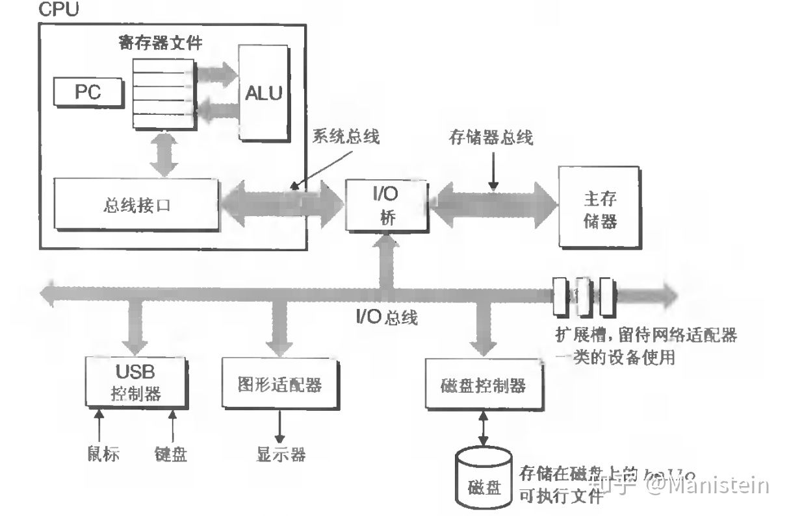
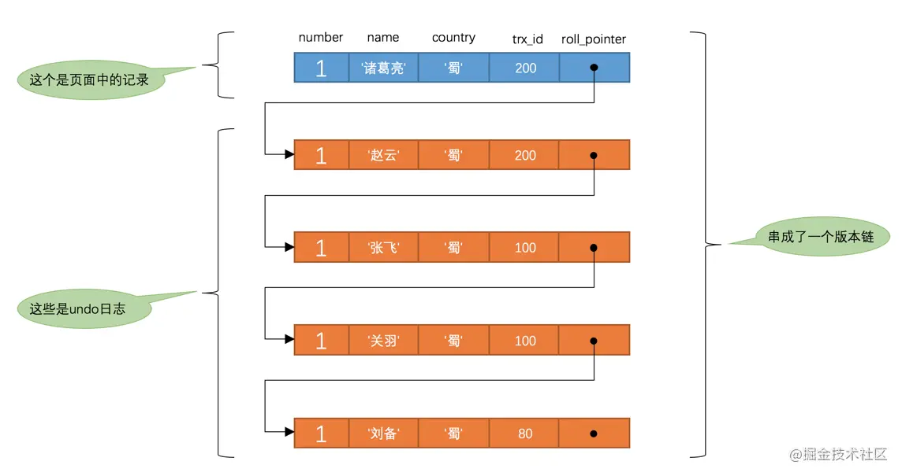

快速进入战场：《[MySQL是怎样运行的](https://juejin.cn/book/6844733769996304392/section/6844733770063609869)》

需要明白的一些基本参数：MySQL的基本单位是**页**（熟悉的朋友是吧），**16KB**；主键为BIGINT类型，8字节；指针6字节，则寻址范围：

2^48^=2^10^x2^10^x2^10^x2^10^x2^8^=2^8^TB=256TB，也就是能够寻址磁盘中256TB的数据。

但是指针的大小应该和I/O总线有关吧？

来自[谁能给我解释一下什么叫计算机【总线】？ - Manistein的回答 - 知乎](https://www.zhihu.com/question/29723949/answer/55376798)

## 字符集

懂了，常见的**字符集**就三种：ASCII、GBK、Unicode，而utf8、utf16、utf32只是Unicode字符集的**编码方案**而已，比如01001100在utf三种编码方案中代表的意思都是‘L’，但是在utf16中可能编码成00000000 01001100（用两个字节表示），在utf32中可能表示成00000000 00000000 …… 01001100（用四个字节表示）。这么看来，Unicode的三种编码方案唯一的区别就是能够收纳的字符容量不同，utf32收纳的最多。

> ==**大部分字符集都只对应一种字符编码**==，例如：ASCII、IOS-8859-1、GB2312、GBK，都是既表示了字符集又表示了对应的字符编码。所以一般情况下，可以将两者视为同义词。==**Unicode 字符集除外，Unicode 有三种编码方案**==，即 UTF-8、UTF-16 和 UTF-32。最为常用的是 UTF-8 编码。

阮一峰老师也对这个知识做了讲解：[字符编码笔记：ASCII，Unicode 和 UTF-8](https://www.ruanyifeng.com/blog/2007/10/ascii_unicode_and_utf-8.html)：

UTF-8是Unicode的一种实现方式之一。为什么Unicode有那么多种实现方式呢？根本在于Unicode的一个缺陷：

> 它只规定了符号的二进制**代码**，却没有规定这个二进制代码应该如何存储（**编码**）。

换句话说，比如”严“这个字Unicode编码为0x4E25，二进制为100 1110 0010 0101（15位），那么它存储在机器里边占多少位呢？直接15位还是凑够2个字节 16位呢？如果统一两个字节，那么编码为4ECF2F的字符怎么办？人家得用三个字节？

所以，UTF-8给了一套编码方案，具体见文章。

为什么其他字符集没有这种问题？比如ASCII，它直接规定了每个字符都占一个字节，或者GBK，一个字符占两个字节。它们干这么干我觉得主要原语就是它们每个字符占据的空间本来就小，可以直接规定死。而Unicode不一样了，字符集可能占据1-4字节，如果也学习前辈每个字符统一占据4字节，那空间耗费太太太太太大！

## MVCC

复习了一下，忽视了版本链这个概念，每一个undo log中的每一条记录的两个隐藏字段：`trx_id`和`roll_pointer`，`roll_pointer`用来串成了版本链，而`trx_id`用在read view上。

原来读未提交和读已提交的实现不是基于读写锁的。

对于使用`READ COMMITTED`和`REPEATABLE READ`隔离级别的事务来说，**都必须保证读到已经提交了的事务修改过的记录**，也就是说假如另一个事务已经修改了记录但是尚未提交，是不能直接读取最新版本的记录的，核心问题就是：需要判断版本链中的哪个版本是当前事务可见的。

我觉得这里对ReadView的解释有一个地方不是很清楚，`READ COMMITTED`和`REPEATABLE READ`生成ReadView的范围都是在一个事务中，也就是每个事务的ReadView是不同的，**每个事务会为自己的select操作创建一个ReadView**。只不过两种隔离级别在生成ReadView的时机不同而已。

在读已提交隔离级别下，ReadView在事务每次select之前都会更新一下，而在可重复读隔离级别下，ReadView只在事务第一次执行select操作时生成，且再也不会改变。MySQL默认的隔离级别就是RR。

我觉得ReadView的关键核心思想是：记录到现在为止正在活跃的事务，准确说应该是到当前事务创建自己的ReadView为止尚未提交的事务。有了这个意识就好理解了。

文中好像没有提及怎么读未提交怎么解决脏写问题的，但根据这篇文章的下一篇《锁》，我猜测是用锁来实现的，也就是有写的操作会直接上锁。

我之前以为只要是修改操作，包括插入和更新，都是用锁实现的，但是通过阅读这篇文章，我发现如果我这样设计的话，`READ COMMITTED`和`REPEATABLE READ`这两个隔离级别下就没法访问正在被修改的数据了，毕竟已经被锁了。但是通过MVCC这一系列复杂的设计，就可以实现在读-写情况下没有锁的存在，大大提高系统性能：

> 这样子可以使不同事务的`读-写`、`写-读`操作并发执行，从而提升系统性能。

完了，又被颠覆了，在《锁》这章中提到，其实MVCC只是解决`脏读`、`不可重复读`、`幻读`的方案之一，为了性能考虑，能够读取**旧数据**，牺牲了一致性，但有些场合必须保证永远读取的是新数据，比如银行账户，于是只能对读写操作都加锁，也就是可串行化隔离级别，这种情况下使用的就是共享锁和排他锁了。

### 总结

我觉得这里应该可以写一个专题来总结一下，将并发事务问题分为三类：读—读，写—写，读—写。

读—读：没啥好讨论的，没啥问题；

写—写：可能引发脏写，这是最严重的问题❗  所有隔离级别都不得不解决的基本问题，只能通过锁来解决；

读—写：情况比较复杂，可能引发脏读、不可重复读、幻读，解决方案也比较丰富：性能最好的MVCC，属于**一致性读**，没有锁；**锁定读**，共享/排他锁。

其中脏读和脏写操作的都是其他事务尚未提交的数据，不可重复读读取的是其他事务已经提交了的数据。

学到现在，我发现“读已提交”和“可重复读”都是简称，这很让人恼火。其实“读已提交”全称应该是事务只能读修改已经提交的记录，也就是说修改这条记录的事务执行了最后的COMMIT语句，即事务结束了，而“可重复读”全称应该是事务可以重复同一条记录，**且**每次读取的结果能够保证是一样的。

再来理解“读未提交”隔离级别，就不难了，也就是读取未提交的数据，毫无疑问存在脏读的情况。虽然这是最低的隔离级别，但还是能够保证不会出现脏写！

> 小贴士： 我们之前说执行DELETE语句或者更新主键的UPDATE语句并不会立即把对应的记录完全从页面中删除，而是执行一个所谓的delete mark操作，相当于只是对记录打上了一个删除标志位，**这主要就是为MVCC服务的**，大家可以对比上边举的例子自己试想一下怎么使用。 另外，所谓的MVCC只是在我们进行普通的SELECT查询时才生效，截止到目前我们所见的所有SELECT语句都算是普通的查询，至于啥是个不普通的查询，我们稍后再说哈～

> 小贴士： 实际上insert undo只在事务回滚时起作用，**当事务提交后，该类型的undo日志就没用了**，它占用的Undo Log Segment也会被系统回收（也就是该undo日志占用的Undo页面链表要么被重用，要么被释放）。虽然真正的insert undo日志占用的存储空间被释放了，但是roll_pointer的值并不会被清除，roll_pointer属性占用7个字节，第一个比特位就标记着它指向的undo日志的类型，如果该比特位的值为1时，就代表着它指向的undo日志类型为insert undo。所以我们之后在画图时都会把insert undo给去掉，大家留意一下就好了。

这两句话的意思，我认为是为了实现MVCC才会有版本链，也就是不让已经提交的事务对某条记录的修改失效。即保留了update、delete操作的undo log。

## undo log和redo log

它们都是在write-ahead logging下的两种日志。

**undo log**

粗略认为两者的区别，redo log能够保证**持久性**，而undo log能够保证**原子性**，因为undo log实现了rollback。最关键的是，undo log的作用范围在事务还未提交的时候，也就是事务执行到一半的情况（事物的状态为活动的或一般提交的），用于保证原子性，实现回滚，即事务不能有中间状态。应对的场景和redo log是一样的：系统故障时。系统故障时，由于事务还没有结束，当系统恢复后根据undo log回退到事务没有开始的样子。
在事务提交后，undo log就没有什么卵用了，起作用的是redo log，用于保证持久性 。

**redo log**

我觉得关键在于如何定义事务提交，具体来说，什么状态可以被确认为事务提交？工程师们的想法经历了三个阶段：

1. 将其定义为：在**buffer pool**[^6]中修改了需要提交的数据之后。这种方式显然不能保证持久性，如果这就算事务提交，搞不好接下来突然断电，但对于内存，断电了一切抹平，岂不是白提交了。

   补充一下buffer pool，我觉得可以理解成MySQL的缓存模型，对应Java的内存模型中线程的本地内存，即对内存中的共享数据的拷贝（副本）。buffer pool与线程的本地内存的区别为：buffer pool是内存中的区域，而Java线程工作区域应该是CPU的三级cache。您细品其中的深刻区别：**cache—内存，内存—硬盘**，Java中将内存中数据的状态视为稳定的，而数据库将硬盘中的数据视为稳定的。

2. 将其定义为将buffer pool中该事务修改的页面缓存刷入磁盘之后。这是一个自然而然的想法，但是问题也很明显，毕竟简单粗暴。存在的两点问题文中有写。

3. 这种方式我觉得类似status machine，也就是持久化**操作**而非数据。而前一种（2.）类似status transfer。

   > 所以我们其实没有必要在每次事务提交时就把该事务在内存中修改过的全部页面刷新到磁盘，只需要把修改了哪些东西记录一下就好……
   >
   > 与在事务提交时将所有修改过的内存中的页面刷新到磁盘中相比，**只将该事务执行过程中产生的`redo`日志刷新到磁盘**的好处如下：……
   >
   > redo日志会把事务在执行过程中对数据库所做的所有修改都记录下来，在之后系统崩溃重启后可以把事务所做的任何修改都恢复出来。

我居然没有想明白一个简单的道理，持久性到底是事务的特性还是数据的特性？当然是事务的啊！也就是说持久化的目标是事务😂，而不是数据！

---

[^1]: [SQL优化(2)：B+树与索引 · 语雀 (yuque.com)](https://www.yuque.com/books/share/2b434c74-ed3a-470e-b148-b4c94ba14535/uzty3n#dIGvE)
[^2]: [剖析面试最常见问题之MySQL － 小专栏 (xiaozhuanlan.com)](https://xiaozhuanlan.com/topic/4912306758#section-2)
[^3]: [SQL优化(3)：索引与优化原理(上) · 语雀 (yuque.com)](https://www.yuque.com/books/share/2b434c74-ed3a-470e-b148-b4c94ba14535/pr8k7o)
[^4]: [SQL优化(4)：索引与优化原理(下) · 语雀 (yuque.com)](https://www.yuque.com/books/share/2b434c74-ed3a-470e-b148-b4c94ba14535/zhd3d6#HaJmI)

[^5]: [讲一下 JMM(Java 内存模型)](https://snailclimb.gitee.io/javaguide/#/docs/java/multi-thread/2020最新Java并发进阶常见面试题总结?id=_22-讲一下-jmmjava-内存模型)
[^6]: 这是文中提到的在内存中的区域，是MySQL磁盘页面向内存的映射，你也可以理解为磁盘页面缓存。在操作数据之前，要将目标数据所在页面缓存到内存中的buffer pool这个区域后才能操作，而持久化操作简单粗暴的方法就是将buffer pool中页面缓存刷入磁盘，当然这种方式没人在用，而是用的redo log的方式，用我自己的话归纳起来：持久化操作而非数据。