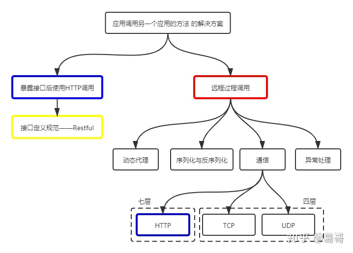
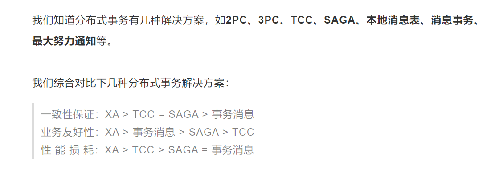

## 访问远程服务

#### [远程服务调用](https://icyfenix.cn/architect-perspective/general-architecture/api-style/rpc.html)

这就是传说中的RPC，这章节焦点在于是否将RPC看作IPC（Inter-Progress Communication，进程间通信）的一个特例，以及这个过程中的一些历史沿革。

> 从应用层面上看来可以做到远程调用与本地的进程间通信在编码上完全一致。
>
> 本地调用与远程调用当做一样处理。

上面这段话是早期对RPC的认识，但是后来对此思想提出了“八宗罪”。

> 至此，RPC 应该是一种高层次的或者说语言层次的特征，而不是像 IPC 那样，是低层次的或者说系统层次的特征（这个观点）成为工业界、学术界的主流观点。

将RPC当作IPC的一种特例我认为在理论层面是没任何问题的，因为在理论层面不用考虑文中提到的“八宗罪”，而这些正是将理论工程化的难点，因为工程面向的是复杂的现实环境。

> 面向资源和面向过程的远程调用方式

RPC协议解决的三个基本问题：

- 如何表示数据：

  应该就指IDL(Interface Description Language)，比如gRPC的protocol buffer。

- 如何传递数据：

  > 这里“交换数据”通常指的是**应用层协议**，实际传输一般是基于标准的 TCP、UDP 等标准的传输层协议来完成的。

  这也就是为什么RPC可以用netty来实现了，我觉得这也是RPC的关键部分，

  这么说来，岂不是json+http，也就是spring写后台那一套都算一个RPC协议了？数据表示用json，数据传输用http，毕竟http也是应用层协议，方法定义http本身就带有POST、GET加上URL。但是这个猜测不合理的地方在于，这里提到的json+http其实是restful风格，面向资源的远程调用，和比如gRPC这样的，其实是面向过程的远程调用。

- 如何定义方法

  还没怎么读懂…

#### RPC和Restful的区别？

关于这一点我查阅了很多资料，这里做一个不成体系的临时归纳

> RPC通常特指在一个应用中调用另一个应用的**接口**而实现的远程调用，即红色框所指的范围。这样，RPC是不包含Restful的。

这个接口其实是很具体的，不是那种API接口，就是比如Java里面的`Interface`。在写Spring项目的时候通常service层的类都会先写一个接口，在用类来实现它，说的就是这个接口。

具体的做法是：

> 通常，RPC要求在调用方中**放置被调用的方法的接口**。调用方只要调用了这些接口，就相当于调用了被调用方的实际方法，十分易用。

加粗部分的实际做法我还没有看过具体的例子，我猜想可以将服务方暴露的接口类做成jar包，调用方将其加入到External Libraries中，或者直接拷贝源码及其目录结构到调用方的src目录下。来源：https://www.zhihu.com/question/41609070/answer/1030913797

我还看了一篇文章：https://www.zhihu.com/question/28570307/answer/47876255

里面有一句话很“露骨“

> restful的信徒，他们会说可以根据这个那个规范，把login / password等也纳入为某种资源，然后进行增删改查。这在我看来，纯粹是在解决一些原本不存在，根本不需要解决的问题，纯浪费。
>
> 所有的接口，服务器端原本就存在有相应的函数，它们本来就有自身的命名空间，接受的参数、返回值、异常等等。

文中提到了json-rpc，这我得了解一下，因为看起来几乎可以替代restful了。

还有一点我是知道的，RPC的通信协议不一定是HTTP，还可以是自定义的，如http2啥的，还可以自定义tcp报文，比如duboo。

接下来看到了这篇文章：[既然有 HTTP 请求，为什么还要用 RPC 调用？ - 手不要乱摸的回答](https://www.zhihu.com/question/41609070/answer/191965937)

我感觉这篇文章将视野放在了更广阔的地方，这是我纠结于与两者的区别很难看到的，其实也是忽视了这张图

里面除了RPC、HTTP还有很多内容，于是这篇文章中就提到了duboo的服务治理等等。

> 简单来说成熟的rpc库相对http容器，更多的是封装了“服务发现”，"负载均衡"，“熔断降级”一类面向服务的高级特性。可以这么理解，rpc框架是面向服务的更高级的封装。如果把一个http servlet容器上封装一层服务发现和函数代理调用，那它就已经可以做一个rpc框架了。
>
> 
>
> 作者：手不要乱摸
> 链接：https://www.zhihu.com/question/41609070/answer/191965937
> 来源：知乎
> 著作权归作者所有。商业转载请联系作者获得授权，非商业转载请注明出处。

## 事务处理

### 本地事务

- Commit Logging

  > 只有在日志记录全部都安全落盘，数据库在日志中看到代表==事务==（注意这是主语）成功提交的“**提交记录**”（Commit Record）后，才会根据日志上的信息对真正的数据进行修改，修改完成后，再在日志中加入一条“结束记录”（End Record）表示事务已完成持久化，这种事务实现方法被称为“Commit Logging”（提交日志）。

  这种日志方式比较简单，只用一个事务日志同时保证原子性和持久性。其中原子性的保证非常之巧妙，对所有事务操作都不直接修改数据，这样如果事务**提交过程中**存在错误，可以直接丢弃日志，便确保了数据库中数据没有中间状态的存在，原子性得到了保证。事务持久性保证比较常规了，用到了commit record，用于保证事务的持久化。注意，end record记录的是数据的持久化，当end record写下后，事务日志此时也没用了，因为该事务涉及的数据也已经持久化了。当然这不是重点，这里讨论的重点是事务。

  目前知道OceanBase数据库采用的是这种日志方式。

❓：发现一个问题，正因为日志数据全部落盘并没有修改真正的数据，所以待真正执行事务中的指令的时候可能会引发错误，那么这时应该怎么办呢？

其实应该有很多的解决方案，比如在写记录的时候检测这个事务中的操作是否合法，比如记录要求扣取张三账户中1000元，则此时读取张三账户上的记录判断这个操作是否合法，如果账户上只有100块，那就会直接回滚。

- Write-Ahead Logging

  > 也允许 STEAL，它给出的解决办法是增加了另一种被称为 Undo Log 的日志类型，当变动数据写入磁盘前，必须先记录 Undo Log，注明修改了哪个位置的数据、从什么值改成什么值，等等。以便在事务回滚或者崩溃恢复时根据 Undo Log 对**提前写入**的数据变动进行擦除。Undo Log 现在一般被翻译为“回滚日志”，而此前记录的用于崩溃恢复时重演数据变动的日志就相应被命名为 Redo Log，一般翻译为“重做日志”。

  与commit logging的区别是，对原子性和持久性的实现分离了：用undo log实现原子性，用redo log保证持久性。这种事务日志方案被MySQL采用。导致这种区别的是关键是“提前写入”。

  这种事务解决方案的**奔溃恢复**步骤需要好好理解一下。Write-Ahead Logging的一大特点是有对STEAL的支持，所以奔溃恢复时需要回滚已经**提前**持久化的数据。这一点其实难度挺大，不像commit-logging一样，直接删掉事务日志就行，反正没有影响真正的数据。但是STEAL情况下，如果遇到崩溃，提前持久化的数据都会成为错误，于是有了undo log。这也就是write-ahead logging的崩溃恢复包含了三个部分，其中重做阶段和回滚阶段本质上是分别根据redo log和undo log恢复数据库状态。

  > 此时剩下的都是需要回滚的事务，它们被称为 Loser。根据 Undo Log 中的信息，将已经提前写入磁盘的信息**重新改写回去**，以达到回滚这些 Loser 事务的目的。

  还是那句话，undo log保证原子性，事务不能存在中间状态。

### [全局事务](https://icyfenix.cn/architect-perspective/general-architecture/transaction/global.html)

> 但本节所讨论的内容是一种在分布式环境中**仍追求强一致性**的事务处理方案
>
> 在本节里，全局事务被限定为一种适用于**单个服务**使用**多个数据源**场景的事务解决方案

上面这段话太重要了，这章讨论的全局事务还是要保证强一致性，和真正的分布式事务有所区别。有意思的是，本地事务、共享事务、分布式事物的场景结合起来看，发现三者其实就是（单/多）服务和（单/多）数据源之间的组合，如本地事务：

> 本地事务是最基础的一种事务解决方案，只适用于**单个服务**使用**单个数据源**的场景

### **XA**事务处理架构

分布式事务的处理架构的分类我感觉很混乱，查阅了很多资料，在这里进行一下总结。

XA（e**X**tended Architecture）是一种规范，这一点需要明确。在《[我还不懂什么是分布式事务](https://mp.weixin.qq.com/s/MbPRpBudXtdfl8o4hlqNlQ)》这篇文章中提到XA的两个重要思想：

> XA 规范提供了一种重要思想:
>
> 1. 引入全局事务的控制节点，事务的协调者
>
> 2. 多个本地事务划分多阶段提交（也就是下面讲的 2PC，3PC）

然后文中又说道2PC、3PC、TCC、SAGA等都是基于XA规范的分布式事务协议，额…这大概率是有问题的，感觉只有2PC和3PC与XA规范相关。在[维基百科](https://en.wikipedia.org/wiki/X/Open_XA)对XA的解释里有这么一句话：

> **The goal of XA is to guarantee [atomicity](https://en.wikipedia.org/wiki/Atomicity_(database_systems))**  in "global [transactions](https://en.wikipedia.org/wiki/Database_transaction)" that are executed across heterogeneous components.
>
> ……（省略一些不是很关键的信息）…… To guarantee integrity, XA **uses** a [two-phase commit](https://en.wikipedia.org/wiki/Two-phase_commit) (2PC) to ensure that all of a transaction's changes either take effect (*commit*) or do not (*roll back*), i.e., *atomically*.
>
> 为了保证完整性， XA规范采用了2PC来确保所有事务带来的改变要么生效（commit），要么没有（rollback），换句话说，原子性地。

再看看[two-phase commit](https://en.wikipedia.org/wiki/Two-phase_commit)：

> In [transaction processing](https://en.wikipedia.org/wiki/Transaction_processing), [databases](https://en.wikipedia.org/wiki/Database), and [computer networking](https://en.wikipedia.org/wiki/Computer_networking), the **two-phase commit protocol** (**2PC**) is a type of [atomic commitment protocol](https://en.wikipedia.org/wiki/Atomic_commit) (ACP). It is a [distributed algorithm](https://en.wikipedia.org/wiki/Distributed_algorithm) that coordinates all the processes that participate in a [distributed atomic transaction](https://en.wikipedia.org/wiki/Distributed_transaction) on whether to [commit](https://en.wikipedia.org/wiki/Commit_(data_management)) or abort (roll back) the transaction (it is a specialized type of [consensus](https://en.wikipedia.org/wiki/Consensus_(computer_science)) protocol).
>
> 总结起来，2PC是一种原子提交协议。

所以，我觉得XA是与TCC、SAGA等并列的一种分布式事务解决方案，**2PC只不过是XA用到的一种方案而已，并非XA独有**。这观点在这个广告里边有佐证：[面试必问：分布式事务最终一致性5种解决方案](https://mp.weixin.qq.com/s/jsx-g6L_2waRlaj8hEjXvg)。

而XA又不等同于2PC，它真正做地事是：

> Specifically, XA describes the **interface** between a global [transaction manager](https://en.wikipedia.org/wiki/Transaction_manager) and a specific application.

#### 2PC—two phase commit

- **准备阶段**

  >  对于数据库来说，准备操作是在重做日志（redo log）中记录全部事务提交操作所要做的内容，==它与本地事务中真正提交的区别只是暂不写入最后一条 Commit Record 而已==，
  >
  >  这意味着在做完数据持久化后并==**不立即释放隔离性**==，即仍继续持有**锁**，维持数据对其他非事务内观察者的隔离状态。

  很厉害的想法！这样做的目的是，只要还没写Commit Record，那这个事务就算没有提交。这个准备阶段协调者和参与者可以安心的持久化事务，如果这个阶段任何参与者出错了（Non-Prepared或超时未回复），小问题，协调者发送Abort指令给所有参与者，这样让参与者回滚。回滚的方式根据本地事务的日志形式而不同，在commit-logging下直接删掉没有commit record的日志即可，在write-ahead logging下根据undo log对提前写入的数据进行擦除。

- **提交阶段**

  > 对于数据库来说，这个阶段的提交操作应是很轻量的，==仅仅是持久化一条 Commit Record 而已==，通常能够快速完成。

  是的，这部分重点就是这句话，能够进入提交阶段意味着协调者和参与者都持久化了事务的所有操作，**只是除了Commit Record！**那这个阶段就很好办了呀，协调者先以身作则，先持久化自己的事务（容易忽视，写入commit record），然后向其他参与者发送commit指令，让它们写Commit Record即可。

这个部分其实没有MIT6.824课程中解释得好，第一没有好好地解释协调者，第二没有好好地聊准备阶段的锁。因为这里没有明确的解释2PC其实是分布式事务的原子提交阶段，在此之前还有并发控制阶段提及。

#### 3PC

简单来说，将准备阶段拆分了一下：

> 三段式提交把原本的两段式提交的准备阶段再细分为两个阶段，分别称为 CanCommit、PreCommit，把提交阶段改称为 DoCommit 阶段。其中，新增的 CanCommit 是一个**询问阶段**，协调者让每个参与的数据库根据自身状态，**评估该事务是否有可能顺利完成**。

本质上，3PC只是优化了**回滚**时的效率，因为有询问阶段。但是这两者的致命问题还是没有得到任何改善：**协调者宕机**，甚至3PC还恶化了，因为在2PC下只有“参与者部分提交”一致性问题，而3PC多了一个：参与者没有收到协调者的abort指令。

## [分布式2事务](https://icyfenix.cn/architect-perspective/general-architecture/transaction/)

**ACID、CAP、BASE**（草稿）

CAP 理论常被解释为一种“三选二”定律，这是否是一种误解？ - 欧长坤的回答 - 知乎
https://www.zhihu.com/question/64778723/answer/224132958

在JavaGuide中的[BASE理论](https://snailclimb.gitee.io/javaguide/#/docs/system-design/distributed-system/BASE%E7%90%86%E8%AE%BA)中给的介绍比较好理解，是对CAP的AP方案的延申

AID是手段，C是目的

> 以上四种属性即事务的“ACID”特性，但笔者对这种说法其实不是太认同，因为这四种特性并不正交，**A、I、D 是手段，C 是目的**，前者是因，后者是果，弄到一块去完全是为了拼凑个单词缩写。

> 选择放弃一致性的 AP 系统目前是设计分布式系统的主流选择。（保留最终一致性即可）。这句话的意思是允许数据在中间过程出错（不一致），但应该在**输出**时被修正过来。本章讨论的话题“事务”原本的目的就是获得“一致性”，而在分布式环境中，“一致性”却不得不成为通常被牺牲、被放弃的那一项属性。

**幂等性是什么?**

常常提到**幂等性**，下面是对其进行的定义。但是这是如何实现的呢❓❓❓

> 幂等性是分布式环境下常见的问题；幂等性指的是多次操作，结果是一致的。（多次操作数据库数据是一致的）

## 三种分布式事务机制

- 可靠事件队列

  > 在系统中建立一个**消息服务**，定时轮询消息表，将状态是“进行中”的消息同时发送到库存和商家服务节点中去。

  > 此可见，可靠事件队列只要第一步业务完成了，后续就没有失败回滚的概念，只许成功，不许失败。

- TCC事务（Try-Confirm-Cancel）

  > TCC 较为烦琐，它是一种**业务侵入式较强**的事务方案，要求业务处理过程必须拆分为“**预留业务资源**”和“**确认/释放消费资源**”两个子过程。

  思维说起来也很简单，正如文中说的，Try是一个子过程；Confirm**或**Cancel为Try后的子过程。不管后面是Confirm还是Cancel，整个分布式事务首先都要全部完成Try阶段，如果能够完成Try，表明整个分布式事务的所有资源都能够预留，同时也已经完成了预留，这个时候才能整体进入confirm阶段。

  > 4. 第 3 步如果全部完成（表明所有服务都Try成功了），事务宣告正常结束，如果第 3 步中任何一方出现（任何）异常，不论是业务异常或者网络异常，都将根据活动日志中的记录，**重复**执行该服务的 Confirm 操作，即进行**最大努力交付**。

  这是我没想到的地方，文中的第3步和第5步分别是confirm阶段和cancel阶段，而这个第4步其实是第3步的衍生，此时已经完成了Try阶段，即所有的资源已经成功预留，既然资源全部已经预留了，那么只要你想，且不计时间等成本，一定是可以执行成功的。所以才有这个第4步的底气——尽最大努力交付。

  > 6. 第 5 步如果全部完成，事务宣告以失败回滚结束，如果第 5 步中任何一方出现异常，不论是业务异常或者网络异常，都将根据活动日志中的记录，**重复**执行该服务的 Cancel 操作，即进行**最大努力交付**。

  这么说来，其实第6步也是第5步的衍生，是Cancel阶段的兜底，即绝对确保Cancel能完成。

  回到对TCC事务的描述，我知道为什么说这是一种“业务入侵较强”的事务解决方案了，毕竟人家银行凭啥允许你冻结客户的存款？人家又没犯法。于是，这种事务方案我觉得更适合所有分布式服务都是自有的，或者服务操作权限很高的分布式系统中。

- SAGA事务

  最精彩的地方在于提供了两种崩溃恢复策略：正向恢复和反向恢复。正向恢复我的理解是，如果淘宝给别人扣款了（T~i-1~），那么就必须给人家发货（T~i~），如果T~i~有误，就得一直重复直到成功，然后继续执行T~i+1~（比如通知快递公司）；反向恢复我的理解是，T~i~失败了，进行其补偿C~i~，即淘宝向用户退款，然后进行C~i-1~，商家库存+1。也就是说，正向恢复就是遇到困难迎难而上，反向恢复时遇到困难打退堂鼓撤退。

  **感觉这有点像本地事务的Write-Ahead Logging中的undo log啊！**

## 一个疑问：幂等性是如何实现的呢？

在分布式事务中提到了幂等性的定义

> 幂等性是分布式环境下常见的问题；幂等性指的是多次操作，结果是一致的。（多次操作数据库数据是一致的）

在这里我想单独探讨这是如何实现的。

## 分布式共识算法

个人觉得这个部分没有说清楚提出的Paxos等等到底是个啥？分布式共识算法？我觉得还是不够细致，应该是解决分布式**一致性**的算法。很无语，为啥还要引入共识这个概念，直接分布式一致性算法不香吗。

额……我这个理解是有偏差的，文中其实提及了共识（consensus）和一致性的区别的：

> 最后，笔者还要提醒你共识（Consensus）与一致性（Consistency）的区别：一致性是指**数据不同副本之间的差异**，==而共识是指达成一致性的方法与过程==。由于翻译的关系，很多中文资料把 Consensus 同样翻译为一致性，导致网络上大量的“二手中文资料”将这两个概念混淆起来，如果你在网上看到“分布式一致性算法”，应明白其指的其实是“Distributed Consensus Algorithm”。

看半天书了啊，在这里先整理一下线索吧

> 我们想要改变数据的状态，除了直接将目标状态赋予它之外（status transfer），还有另一种常用的方法是通过某种操作，**令源状态转换为目标状态**。能够使用确定的操作，促使状态间产生确定的转移结果的计算模型，在计算机科学中被称为**状态机**（State **Machine**）。

这特么什么意思，太抽象了吧。有一些思路了，关键在于如何保证**最终一致性**，发现有两个关键点文中一直在重复：1️⃣初始状态一样；2️⃣接受到的操作指令**序列**一致。同时：

> 广播指令与指令执行期间，允许系统内部状态存在不一致的情况，即并不要求所有节点的每一条指令都是同时开始、同步完成的，只要求在此期间的内部状态**不能被外部观察到**，且当操作指令序列执行完毕时，==所有节点的最终的状态是一致的==，这种模型就被称为**状态机复制**（State Machine Replication，和MIT6.824中讲到的Replicated State Machine不谋而合）。

也就是家丑不外扬嘛，让外面的人看起来整个系统都是团结一致的。

有一个疑问：

1. 状态机（分布式系统参与者）的初始状态一样应该很容易做到，但是如何保证每一个节点的接受的操作序列能够一致呢？…

   > ……，都可以理解为要将一连串的操作日志正确地广播给各个分布式节点

   什么才叫正确的？比如A、B节点都各自广播一个操作，但是C、D节点接收这两个操作的顺序难以保证是相同的，造成了两个不同的操作指令序列，这咋办？

   好吧，paxos有讲到，用到了全局唯一的数字ID，这是基于状态机初始状态一样。

下面是一些重要线索，帮助理解什么是操作转移。

> 请注意，Paxos 是典型的基于操作转移模型而非状态转移模型来设计的算法，这里的“设置值”不要类比成程序中变量赋值操作，应该类比成日志记录操作，在后面介绍的 Raft 算法中就直接把“提案”叫作“日志”了。

> 以同步为代表的数据复制方法，被称为**状态转移**（State Transfer），这类方法是较符合人类思维的可靠性保障手段，但通常要以牺牲可用性为代价。
>
> 可靠性与可用性的矛盾造成了增加机器数量反而带来可用性的降低，为缓解这个矛盾，在分布式系统里主流的数据复制方法是以**操作转移**（Operation Transfer）为基础的。

## 服务架构演进史

我把这部分当作小说一样看

#### SOA时代

总的来说，SOA架构就是为了将单体系统拆分成多个相对独立的子系统，达到解耦的目的。让我印象深刻的有微内核架构和事件驱动架构

**微内核架构**

我感觉就是模仿操作系统，但没有操作系统那么庞大复杂，所以才叫**微**内核架构。思想还是很好理解，一切服务皆为插件，core system功能和操作系统大同小异，管理并调度资源。缺点也很明显，电脑中的各种软件之间是几乎没有啥交互的，按照操作系统思想来设计的微内核架构于是有一个指明的缺陷：

> 它假设系统中各个插件模块之间是**互不认识**，不可预知系统将安装哪些模块，因此这些插件可以访问内核中一些公共的资源，但不会直接交互。

也就是插件之间是没有直接交互的，这怎么能够接受。

**事件驱动架构**

这算是我最熟悉的了，实习的时候公司就是采用的这种架构，什么OMS、TMS都是服务，高度独立解耦的子系统，通过RocketMQ作为消息队列实现子系统之间的通信。

## 从类库到服务

> 但在真实的系统里，注册中心的地位是特殊的，**不能为完全视其为一个普通的服务**。注册中心不依赖其他服务，但被所有其他服务共同依赖，是系统中最基础的服务。几乎没有可能在业务层面进行容错。**这意味着服务注册中心一旦崩溃，整个系统都不再可用**，因此，必须尽最大努力保证服务发现的可用性。

这也能解释为什么注册中心能用到raft之类的算法，raft算法更多是解决分布式存储的问题，主要实现fault tolerance和一致性，而这正式注册中心所需要的能力。从另一个角度来说，注册中心不能完全视为一个普通服务的原因是，它是有状态的，而不像其他的微服务一样，能够做成无状态的。所以，我认为注册中心的定位其实是很尴尬的，技术上我觉得它应该归类为分布式存储，但是功能上却又被归类为微服务。

加下来，文中又提到了三类实现注册中心的方式，第一种是值得单独谈谈的：

> - 在分布式 K/V 存储框架上自己开发的服务发现，这类的代表是 ZooKeeper、Doozerd、Etcd。
>
>   这些 K/V 框架（如Raft、EAB等）的一个共同特点是在整体较高复杂度的架构和算法的外部，维持着极为简单的应用接口，只有基本的 CRUD 和 Watch 等少量 API，所以要在上面完成功能齐全的服务发现，很多基础的能力，譬如服务如何注册、如何做健康检查，等等都必须自己去实现，如今一般也只有“大厂”才会直接基于这些框架去做服务发现了。

以采用ZAB算法的Zookeeper为例。K/V框架其实只是一个分布式存储的框架，可用来构建多副本的分布式系统，同时这些框架都只是类库，而非服务。而ZooKeeper是用这种K/V框架（类库），实现服务发现**服务**的，这也呼应了本章节标题：从类库到服务。

后面提到了另外两种服务发现的实现方式：以基础设施（主要是指 DNS 服务器）来实现服务发现、专门用于服务发现的框架和工具，相比于第一种可能更加“高级”些，比如第二种方式，它本来就是一种服务，比如DNS服务器，SkyDNS就是基于这类服务的服务发现；比如第三种，既不基于Raft这样的类库，也不基于DNS这样的服务。

# 🚀🚀🚀🚀🚀🚀🚀🚀🚀🚀🚀🚀🚀🚀🚀

# 📃ARTICLE：我对CAP理论的理解

首先可以阅读一下[分布式系统的CAP理论](https://www.hollischuang.com/archives/666)，学习CAP的基础知识。

通过查阅一些资料，发现以前对CAP的理解比较粗犷，现在对很多细节作了强迫症理解。总的来说，首先需要在理解网络分区的基础上，认真考察*partition tolerance*，这是讨论CAP的基石，然后是保证P的前提下对C和A的取舍。最后，对这个理论的理解得到了升华，并没有绝对意义的网络分区，用**程度**来度量CAP好过 *yes or no*。这让我之前幼稚的非黑即白的世界观大受震撼。

推荐这篇文章：[CAP 理论十二年回顾："规则"变了](https://www.infoq.cn/article/cap-twelve-years-later-how-the-rules-have-changed/)，它大大拓宽了我的思路。

**什么是网路分区？**

区别于如MySQL这样的单机，分布式存储系统中的每一台计算机其实都是通过网络连在一起的，通过网络，在逻辑上是一个整体。但是由于某种原因，比如某个机房突然断电，或者网线被猫叼走了，使得数台机器与大的网络脱钩，看起来就像是网络在逻辑上分为了多个区域，这就叫网络分区。

因此这里有个重要的事实：**在分布式环境下，网络分区是一个自然的事实**。

但是，对“发生网络分区”这个状态用true or false来描述真的准确吗？在理论上应该是没问题的，因为此时不必考虑[通信成本](https://icyfenix.cn/architect-perspective/general-architecture/api-style/rpc.html#%E9%80%9A%E4%BF%A1%E7%9A%84%E6%88%90%E6%9C%AC)。若将通信成本因素加以考虑，true or false的描述方式还合理吗？暂且按下不表。

**“3选2”公式是误导**

> **分区容忍性**（**P**artition Tolerance）：代表分布式环境中部分节点因网络原因而彼此失联后，即与其他节点形成“网络分区”时，系统**仍**能正确地提供服务的**能力**。

在MIT6.824课程中，提到了分布式系统的两个设计目标 *high performance* **&** *fault tolerance*（Lecture 3.1），其中 *fault tolerance*，字面意思理解即可。**这里的 *fault* 我觉得就是指的网络分区**，因为即使将fault理解为服务器宕机，最终结果也是形成网络分区。所以为什么说“3选2”公式是误导？因为**fault tolerance是分布式系统必须达到的设计目标！**也就是fault tolerance是必须满足的能力，不然就不是分布式系统了。

因此，**CAP要解释成，当网络分区发生的时候（P），A和C只能二选一**。

换句话说，P是分布式系统不可能舍弃的，必须要保证的特性。当P得到保证时，C和A就都能够得到保证，不必舍弃谁。但是P得不到保证，即产生网络分区时，就不得不在C和A之间取舍。

接下来再理解[下面这段话](https://snailclimb.gitee.io/javaguide/#/docs/system-design/distributed-system/CAP%E7%90%86%E8%AE%BA)：

> 如果网络分区正常的话（系统在绝大部分时候所处的状态），也就说不需要保证 P 的时候，C 和 A 能够同时保证。

真的是这样吗？结合“什么是网络分区”小节中留下的思考，考虑通信成本，其实发现并没有绝对意义上的网络分区。比如，一个分布式系统中的两台服务器在地理上相隔千里，维持它们通信的网络环境复杂，若在某个时段它们的通信的**网络延迟**非常之高。那么，此时怎么描述它们网络分区状态？仍然用简单的true or false？显然是不合理的。

**非黑即白？NO！**

通过前面的分析，可以发现考虑到通信成本，我们需要引入：**程度**，来更加准确地描述网络分区情况，对网络分区的描述并非非黑即白。下面这段话来自[CAP 理论十二年回顾："规则"变了](https://www.infoq.cn/article/cap-twelve-years-later-how-the-rules-have-changed/)：（这段话如果我记性好的话真想全文背诵）

> “三选二”的观点在几个方面起了误导作用，详见下文“CAP 之惑”小节的解释。首先，由于分区很少发生，那么在系统不存在分区的情况下没什么理由牺牲 C 或 A。其次，C 与 A 之间的取舍可以在同一系统内以非常细小的粒度反复发生，而每一次的决策可能因为具体的操作，乃至因为牵涉到特定的数据或用户而有所不同。最后，**这三种性质都可以在==程度上==衡量**，并不是非黑即白的有或无。可用性显然是在 0% 到 100% 之间连续变化的，一致性分很多级别，连分区也可以细分为不同含义，如系统内的不同部分对于是否存在分区可以有不一样的认知。

最后，有了“程度”的认知后，我们来推翻这句话：

CAP要解释成，当网络分区发生的时候（P），A和C只能二选一。

以及这句话：如果网络分区正常的话（系统在绝大部分时候所处的状态），也就说不需要保证 P 的时候，C 和 A 能够同时保证。

真的只能二选一吗？真的能够同时保证吗？我们还是将通信成本、网络延迟考虑进来，根据网络分区的程度不同，我们可以根据具体情况让C和A占用不同的权重，采用相互妥协式的设计。这让我想到了[Zookeeper的设计](https://mit-public-courses-cn-translatio.gitbook.io/mit6-824/lecture-08-zookeeper/8.4-zookeeper)，不论网络分区什么情况，它对write都能保证强一致性，对read能保证高可用性。这是一种很有趣的设计，很薛定谔，C和A既同时保证了，又没同时保证🤣。

BASE理论作为对CAP的延申，我觉得也是基于程度来考量的。

# 🚀🚀🚀🚀🚀🚀🚀🚀🚀🚀🚀🚀🚀🚀🚀
