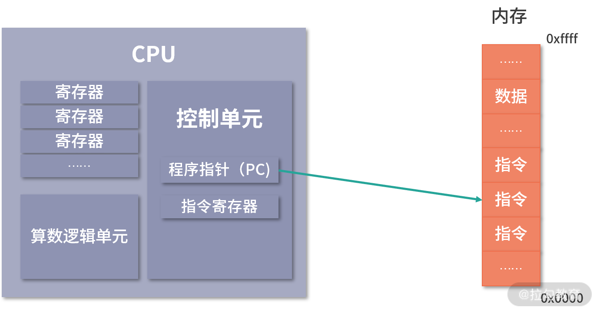

# CAP 理论十二年回顾："规则"变了

论文翻译：https://www.infoq.cn/article/cap-twelve-years-later-how-the-rules-have-changed/

这篇文章是CAP的“始祖”在2012年重写的相关论文

 


# NewSQL大神黄东旭：从0到1，如何设计一个分布式数据库

这是油管视频：https://www.youtube.com/watch?v=xAiuLJtCZOg&t=1028s

对于整个分布式存储和数据库领域有一个全面的了解


我有种感觉，搞后端搞到一定水平是不是都得搞数据库，或说存储方向了？因为感觉服务器端其实远没有数据库考虑的问题多，比较服务器端完全可以做成无状态的，scale out难度较小。

有点意思，一个细节是，视频中将Redis成为分布式缓存，也就是并没有把它纳入数据库的讨论范畴？我觉得原因应该是，对持久化到磁盘的数据库而言（如mysql、Aurora等），Redis的数据存储在内存中，对于磁盘来说内存就是缓存的存在吧，所以Redis在文中并不是数据库club里的成员。

OLTP（On-Line Transaction Processing，联机事务处理）；OLAP（On-Line Analytical Processing，联机分析处理）。
从功能角度来看，OLTP负责基本业务的正常运转，而业务数据积累时所产生的价值信息则被OLAP不断呈现，企业高层通过参考这些信息会不断调整经营方针，也会促进基础业务的不断优化，这是OLTP与OLAP最根本的区别

spark可能成为OLAP的事实标准，Hadoop可能会死掉。

hive on spark大体与SparkSQL结构类似，只是SQL引擎不同，但是计算引擎都是spark！敲黑板！这才是重点！


spanner/Fz1和Amazon的Aurora采用了两种不同的设计理念


# 重学操作系统

白嫖的：http://learn.lianglianglee.com/%E4%B8%93%E6%A0%8F/%E9%87%8D%E5%AD%A6%E6%93%8D%E4%BD%9C%E7%B3%BB%E7%BB%9F-%E5%AE%8C


## 关于时钟频率的“冷知识”

（10进制下，1K=10^3^一千；1m=10^6^一百万；1G=10^9^十亿。）

我看到现在的i7芯片的时钟频率达到了5GHz，这是什么概念呢。以文中的例子来说，假设CPU的时钟频率为1GHz，说的其实是1秒钟能够进行1G=10^9^，也就是**10亿次时钟周期**，也就是电平从1➡0，或者0➡1的变换。这是什么概念呢？光速大致是3x10^8^米/秒，一个时钟周期是$$\frac{1}{{10}\times{10^{8}}}$$秒。

最终计算下来，光能够在一个时钟周期内传播0.3米=30cm。到了现在的i7处理器，这个数值就会变得更小。

为什么要讲这个“冷知识”？这是因为，我们知道字节的存储的基本单位，那么时间的基本单位是什么呢？时钟频率，或说时钟周期。在后面的学习中进场会看到时钟周期，这是最常用的执行速度的考量单位。


## 图灵机

计算机能力的边界，公理化体系和不完备性定理➡可计算理论


学到了一个词：状态。在02节中出现了这个词，我发现这个词应该是对内存最早的称呼。这也是为啥replicate state machine、state transfer这两个词，明明是复制内存的数据，不用memory而用的state。

> 接下来，图灵机通过读写头读入 11 到它的存储设备中（这个存储设备也叫作图灵机的**状态**）。

我觉得下边这段话阐明了内存和磁盘非常非常关键的区别：

> 我们通常说的内存都是随机存取器，**也就是读取任何一个地址数据的速度是一样的**，写入任何一个地址数据的速度也是一样的。

随机存取和顺序存取的关系。


64位和32位，其实有至少三层含义：CPU、操作系统、软件。

我不是很熟悉的是CPU的位数，32位的CPU下一次能够表达的数据范围是0~2^32^-1。也就是说，这种情况下，即使数据总线很高，比如80位，这高48位也没法用。

但是地址总线不会像数据总线一样受到CPU位数的限制，理论上是多多益善，毕竟能够寻址的范围更大。或者说，地址总线和数据总线是没有必然联系的，但是一般情况下还是数据总线要比地址总线大。参考：[【补充内容】1 位的 CPU 能操作多大的内存空间？](http://learn.lianglianglee.com/%E4%B8%93%E6%A0%8F/%E9%87%8D%E5%AD%A6%E6%93%8D%E4%BD%9C%E7%B3%BB%E7%BB%9F-%E5%AE%8C/05%20(1)%20%E5%8A%A0%E9%A4%90%20%20%E7%BB%83%E4%B9%A0%E9%A2%98%E8%AF%A6%E8%A7%A3%EF%BC%88%E4%B8%80%EF%BC%89.md#:~:text=%E3%80%90%E8%A1%A5%E5%85%85%E5%86%85%E5%AE%B9%E3%80%911%20%E4%BD%8D%E7%9A%84%20CPU%20%E8%83%BD%E6%93%8D%E4%BD%9C%E5%A4%9A%E5%A4%A7%E7%9A%84%E5%86%85%E5%AD%98%E7%A9%BA%E9%97%B4%EF%BC%9F)。


## 指令

在03节中对程序执行的过程描述非常优秀，让我很好地学习了数据总线和地址总线是如何协同的。

PC指针也叫做程序计数器，非常重要！我目前认为这是指向代码段（.txt）的指针，也是指向下一条指令的指针。

这个指针非常非常重要，和SP指针结合起来就很好理解了。PC指针用来指向操作，而SP指针用在栈上，存放临时的数据！



**Q：请用自己的语言描述一下上图的过程：**


---


上图就是一条指令的构成，==刚好是4个字节==，也就是通常说的PC指针其实是以一条指令的长度为单位的（[参考](https://www.zhihu.com/question/22609253/answer/21965180)）。

100011是一个操作码，表示load指令。观察，一共6位，那么理论上一共有2^6^=64种操作码。比如add一共可以表示成000010。

内存地址只有22位，也就是说，一个条指令的寻址范围只有2^22^，也就是4MB？

我发现，其实上边的过程和函数调用有很相似的地方：操作码相当于函数名，表示调用哪个函数，后边的寄存器和内存地址都是参数。参数可以有一下三种类型：

> 1. 寄存器；
> 2. 内存地址；
> 3. 数值（一般是整数和浮点）。

###### 一些汇编指令

**load和store**

相反功能的两个指令，前者是从内存加载数据到寄存器，后者是将寄存器中的数值写入内存。注意我这里用的是“ 数据 ”，不管是内存地址，还是数值，都是用二进制（01010…）表示的，所以我统称它们为地址。


###### load命令的三种寻址模式

仅限于load命令。该命令有两个参数，第一个参数一定是一个寄存器，但第三个参数有三种参数，就是上边的那三种！

1. 内存地址，那就是直接寻址；
2. 数值，那就是寄存器寻址；
3. 寄存器，那就是间接寻址。


## 函数🎈🎈🎈

用自己的话来描述一下函数调用的过程：

1. PC指针从内存中读取函数调用的指令，如`call func;`。具体是从正文段（`.txt`）中；

2. 存下当前PC指针的值，这是函数调用后的返回地址；

3. PC指针指向`func`函数的地址；

4. 压栈操作：首先压栈该函数的返回值，其次返回地址，最后参数列表；

5. 持续执行PC指针指向的指令，将中间执行结果压栈，比如hunc函数为`func(int a,int b){int c=a+b;return c}`，传参`func(11,15)`，则栈会长这个样子：

   注意一个细节，PC指针每次自增都是4字节，刚好是一个int的大小，这是因为每一个指令是都是四个字节的：


从上边的过程来看，我觉得重点还是两个指针，PC和SP，简直是神仙搭配，一个管指令，一个管数据，绝配！


## 存储器分级

来了，时钟周期，这个衡量单位。

前置知识：==一般CPU执行一条汇编指令耗时2~4个时钟周期==。

| 存储介质  | 读写速度（单位：时钟周期）                                   | 说明                                                         |
| :-------- | ------------------------------------------------------------ | ------------------------------------------------------------ |
| 寄存器    | **要求**半个                                                 | 比如一条要在 4 个周期内完成的指令，除了读写寄存器，还需要解码指令、控制指令执行和计算。 |
| L1-Cache  | 2~4                                                          | 唯一能够跟上CPU节奏的缓存                                    |
| L2-Cache  | 10~20                                                        |                                                              |
| L3-Cache  | 20~60                                                        |                                                              |
| 内存      | 200~300                                                      | 可以看到，内存的读写速度相比于CPU还是太慢了，没有想象力。    |
| SSD或硬盘 | “内存的读写速度比 SSD 大概快 10~1000 倍”、“硬盘的速度比内存慢 100W 倍左右” | 我觉得这还不是内存和外存较为本质的区别，见我前边的总结。<br />但是硬盘有点拉啊，慢100w倍左右，还玩个毛线。 |


## 新的视角理解进程

> 我们知道，应用的可执行文件是放在文件系统里，把可执行文件启动，就会在操作系统里（具体来说是内存中）形成一个应用的**副本**，这个副本就是进程。

所以，以后回答类似什么是进程这样的问题的时候，除了回答老套的操作系统分配资源的基本单位以外，还可以回答上边的内容。


## 收集一些Linux指令

###### ps

这个命令的正确缩写我至今才知道：process snapshot，确实非常准确！尤其是snapshot，区别了top命令，实时的数据。

什么是tty？目前我将它理解为一个终端，也可以称为一个终端session。这么叫是有历史原因的。（tty: 电传打字机）

###### touch

首先得知道一个文件的三个时间：access time、modify time、change time，对应着对任何一个文件的三种基本操作：读、写、权限修改。我觉得权限修改虽然和写一样都是修改，但是区别是：权限修改是针对的文件的元信息（metadata）。

#### 两个远程操作指令

###### ssh与权限最小原则

哎呀终于见到它了，很久之前就知道这个命令。用法很简单：`ssh {USER}@{IP|domain}`，比如要用我的本地shell连接我的阿里云主机：`ssh root@dong6662.xyz`。但是这样是非常不推荐的！要遵循权限最小原则，其中之一就是尽量不适用root。

这个命令我甚至在git bash上尝试了一下，也是可以的！

###### scp

我觉得全称应该是secure copy，类似上边的secure shell。

我测试了一下，将我本机的简历my-resume.htm拷贝到了远程服务器root用户的home目录下：

```bash
scp ./myresume.html root@dong6662.xyz:~/
```

###### top AND ==htop==

`htop`应该是更加强大的，更高级的，看界面就知道了


而且开可以交互，庇护比如按下“k”，就可以选择并向一个进程发送信号。


## （待完善8）Linux的环境变量

挖坑


## 内核的另一个角度

> 内核提供操作硬件、磁盘、内存分页、进程等最核心的能力，并拥有直接操作全部内存的权限，因此内核不能把自己的全部能力都提供给用户，而且也不能允许用户通过`shell`指令进行系统调用。**Linux 下内核把部分进程需要的系统调用以 C 语言 API 的形式提供出来**。部分系统调用会有权限检查，比如说设置系统时间的系统调用。

看到加粗部分，我可以这么理解吗？除了C元的其他语言，比如Java、python等，要进行系统调用（比如打开文件），底层都需要调用C语言的代码？


## Linux权限划分原则？

记住这个概念：**权限最小原则**，包含四个角度：

（1）用户、组：掌握的权限应该足够小；

（2）应用程序：应该尽量少的使用权限；

（3）root：尽可能不适用root

（4）分级保护：四层ring，驱动在中间两层，内核在最内层，应用程序在最外层。


## 编译安装和包管理器安装

现在我知道了这两种安装方式的区别了，编译安装相当于给的是源码，不同的平台 or CPU的编译方式不一样，下载下来源码以后，在当前Linux环境下解压、配置和依赖解决、编译、安装。对应的命令如下（假设安装的是nginx-1.19.2.tar.gz）：

```bash
wget http://nginx.org/download/nginx-1.19.2.tar.gz    #这个命令有点强大啊
tar -xzvf nginx-1.19.2.tar.gz    #extract gzip verbose file
./configure    #nginx下的一个可执行文件
make && make install    #先编译，后安装。🎈编译完成后，能够形成和当前操作系统以及 CPU 指令集兼容的二进制可执行文件。
```


> 原来使用 C/C++ 写的程序存在一个交叉编译的问题。就是写一次程序，在很多个平台执行。而不同指令集的 CPU 指令，还有操作系统的可执行文件格式是不同的。因此，这里有非常多的现实问题需要解决。一般是由操作系统的提供方，比如 RedHat 来牵头解决这些问题。你可以用`apt`等工具提供给用户**已经编译好的包**。`apt`会自动根据用户的平台类型选择不同的包。
>
> 但如果某个包没有在平台侧注册，也没有提供某个 Linux 平台的软件包，我们就需要回退到编译安装，通过源代码直接在某个平台安装。


